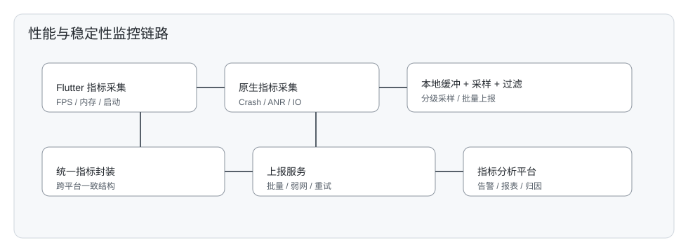
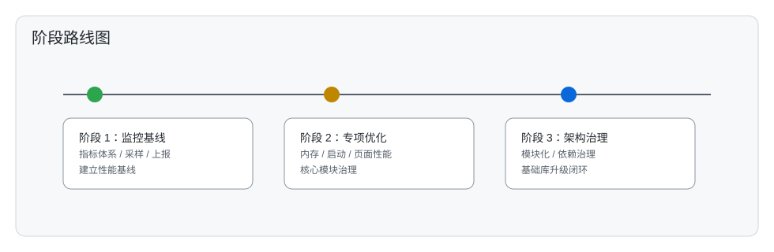

# OneApp 性能与架构优化方案（2026）

## 1. 背景与范围

当前 OneApp 已经具备初步的性能与稳定性监控能力，但要达到“性能非常优异的 APP”仍存在明显差距。本方案聚焦以下范围：

- 性能与稳定性提升：监控基建完善、历史遗留问题清理、内存与资源使用优化
- 架构改造：在不“彻底动架构”的前提下，进一步强化模块化与解耦
- 基础库升级：Flutter/Android/iOS 三端基础库升级与治理

## 2. 现状与依赖基础

### 2.1 架构与模块化现状

当前项目采用分层架构与模块化体系，主结构已在架构文档中明确：[OneApp架构设计文档.md](../OneApp架构设计文档.md)。

关键现状：
- Flutter 业务模块与基础模块大量并行开发
- 模块化已经形成，但边界与依赖治理不足

### 2.2 监控与调试基础

现有监控/调试基础包括：
- 监控插件：`kit_app_monitor` [kit_app_monitor.md](../basic_utils/kit_app_monitor.md)
- 调试工具集：[debug_tools.md](../debug_tools.md)
- 业务侧的基础打点能力（如通用埋点管理）

这为性能监控基建升级提供了可复用的基础能力，但缺少统一指标体系、采样策略与跨平台一致性。

## 3. 总体目标与原则

### 3.1 目标

- 性能与稳定性体系化建设，形成可持续的“指标—监控—分析—治理”闭环
- 内存占用显著下降（基线先建立，按阶段目标下降）
- 模块化进一步强化，高内聚低耦合，支持独立演进与风险隔离
- 三端基础库升级并形成稳定的升级节奏

### 3.2 原则

- 保持当前架构主干稳定，不进行彻底重构
- 优先完善监控与治理基建，再做深度优化
- 以数据驱动优化，优先解决影响面最大的问题
- 形成可复制、可持续的治理流程

## 4. 监控与性能基建方案

### 4.1 监控指标体系

核心指标分层：
- 启动性能：冷启动、温启动、首帧、首交互
- 渲染性能：FPS、卡顿率、长帧占比、掉帧场景
- 内存：PSS、Dart Heap、Native Heap、峰值与稳定值
- 稳定性：Crash、ANR、卡死/黑屏、页面白屏
- 网络：请求耗时、失败率、弱网体验
- 资源：图片缓存命中率、磁盘占用、缓存淘汰

### 4.2 监控数据链路

采集与上报建议：
- 统一采样策略，避免过度采集影响性能
- 关键指标提供高频采样，非关键采用抽样
- 本地缓存与批量上报，降低网络开销

### 4.3 监控模块改造建议

基于 `kit_app_monitor` 能力进行扩展：
- 新增统一的指标定义与版本管理
- 引入跨平台一致的指标采集接口
- 为 Flutter 与原生提供统一的数据封装结构

## 5. 性能与稳定性治理策略

### 5.1 性能治理闭环

闭环流程：
1. 建立基线与指标阈值  
2. 监控收集与告警  
3. 问题定位与归因  
4. 优化与验证  
5. 回归监控与持续治理

### 5.2 重点治理方向

#### 5.2.1 内存优化

- 分模块基线统计：首屏、核心业务、长时运行
- 梳理大对象与泄漏风险：图像、列表、缓存、全局单例
- Dart/Native 双向跟踪，统一内存报警阈值

#### 5.2.2 图片缓存与资源治理

- 统一图片加载策略与缓存策略
- 高分辨率资源按需加载
- 关键页面图片预加载控制

#### 5.2.3 存储与缓存治理

- 缓存分层：内存、磁盘、远程
- 统一缓存淘汰策略与容量上限
- 热点数据与历史数据分层管理

#### 5.2.4 稳定性与异常治理

- Crash/ANR 建立统一分类与标签体系
- 高频问题建立专项治理清单
- 回归版本进行监控对比

## 6. 代码层面优化方向

### 6.1 Flutter 性能优化

- 减少无效 rebuild 与 state 更新范围
- 列表与复杂布局进行分片渲染
- 重度计算迁移到 Isolate
- 避免不必要的同步阻塞与大对象拷贝

### 6.2 原生侧优化

- Android：减少主线程阻塞，降低过度日志与 I/O
- iOS：优化对象生命周期与图像解码策略

## 7. 架构与模块化优化

### 7.1 模块边界与依赖治理

- 明确模块职责与可见边界
- 禁止跨层依赖与非必要双向依赖
- 建立模块依赖审计机制

### 7.2 模块自闭环策略

- 模块内部完成“接口-实现-测试”闭环
- 公共能力进入 `basic_*` 或 `kit_*` 模块

### 7.3 重点模块改造顺序

建议按业务影响与性能收益排序：
1. 核心启动链路
2. 高频访问模块（首页、车控、个人中心）
3. 资源密集模块（地图、图片、媒体）

## 8. 基础库升级策略

### 8.1 升级节奏

- 每季度做一次三端基础库统一升级
- 每次升级设置可回滚策略

### 8.2 升级优先级

- Flutter SDK 与关键依赖（状态管理、路由、网络）
- Android/iOS 原生 SDK 与重要三方库

## 9. 里程碑与交付物

### 9.1 阶段目标

- 阶段 1：完成指标基线与监控链路统一  
- 阶段 2：完成核心模块性能专项优化  
- 阶段 3：完成模块化治理与基础库升级闭环  

### 9.2 交付物

- 性能指标基线报告  
- 性能与稳定性监控平台规范  
- 优化专项清单与治理结果  
- 模块化治理与依赖关系报告  

## 10. 适配与扩展

在 Android 与 iOS 基础上，新增鸿蒙平台接入时：
- 复用监控指标体系
- 接入统一的监控链路与数据规范
- 与原有平台保持指标可对齐

## 11. 关联文档

- [OneApp架构设计文档.md](../OneApp架构设计文档.md)
- [kit_app_monitor.md](../basic_utils/kit_app_monitor.md)
- [debug_tools.md](../debug_tools.md)
