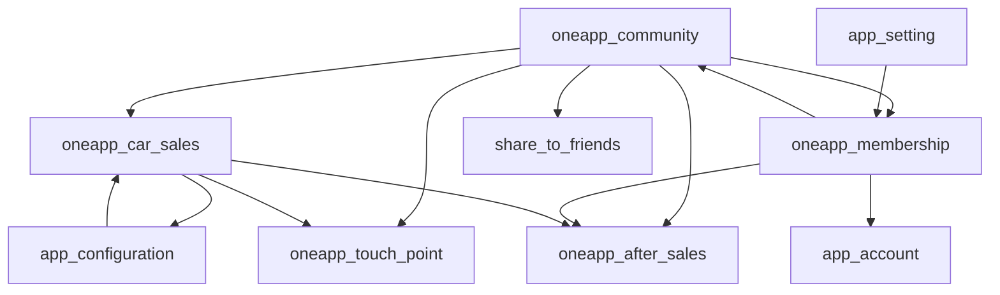
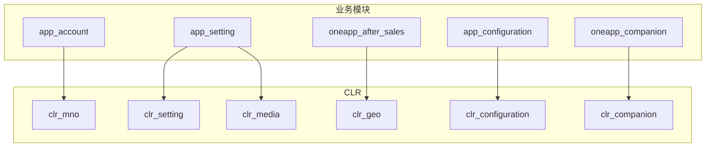
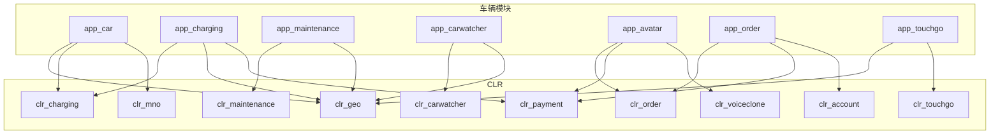
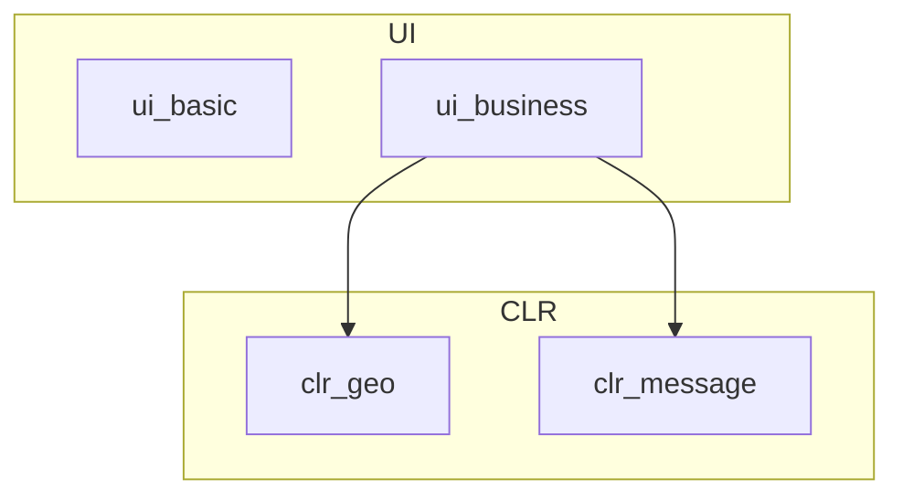

# OneApp 性能与架构优化方案（内存与模块化）

本方案包含三部分：性能与内存优化理论、架构改造（模块化完善）与内存优化实战，并补充性能监控方案、成本与风险评估。

## 理论基础：内存模型、排查方法与治理策略

### 1) 内存构成（跨端共识）

- Flutter/Dart：Dart Heap、Native Heap、GPU 纹理、ImageCache、Skia 资源
- Android：Java Heap、Native Heap、Graphics/GL、Ashmem/匿名共享、文件映射
- iOS：Heap、VM、Metal/纹理、ImageIO 解码缓存

### 2) 常见内存问题类型

- 泄漏：对象生命周期失控，无法被 GC/ARC 回收
- 峰值过高：大图、视频、批量解析造成瞬时激增
- 缓存失控：图片/列表/业务缓存无上限或无 TTL
- 碎片与抖动：高频创建大对象导致频繁 GC/ARC

### 3) 使用 DevTools 排查内存问题（流程化）

- 基线建立：进入核心场景（首页、车控、地图/媒体、个人中心）分别记录内存曲线与峰值
- 事件复现：复现场景触发后，观察内存是否回落到基线附近
- 快照对比：多次快照对比，锁定增长中的对象类型与数量
- 引用链分析：定位“谁在持有对象”，找出未释放的根因
- GC 验证：触发 GC 后仍不回落，优先排查泄漏与缓存失控
- 输出结论：标注对象类型、持有链路、场景、复现步骤与修复建议

### 3.1) 内存自动化回归（AirtestIDE）

- 目标
  - 替代人工点击，稳定复现核心场景并采集内存曲线
  - 形成可重复的回归路径与对比基线
- 脚本覆盖
  - 首页 → 车控 → 地图/媒体 → 个人中心 → 返回首页
  - 前后台切换、列表滚动、资源密集操作路径
- 采集策略
  - 启动前清理缓存，保证基线一致
  - 场景进入与退出分别记录峰值与回落
  - 与内存告警联动，定位异常场景
- 产出物
  - Airtest 脚本与用例集
  - 自动化内存基线报告与回归对比报告

### 4) 僵尸对象与内存不释放的判断方法

- 僵尸对象特征：页面退出后对象仍在内存中、数量持续上升、被全局单例或静态集合持有
- 常见来源：未取消订阅、缓存未清理、生命周期未对齐、异步任务回调未释放
- 判断方式：同场景多次进入退出，观察对象数量是否线性增长
- 处理策略：明确生命周期边界、集中释放入口、限制缓存上限、引入弱引用或定时清理

### 5) 解决思路的优先级

- 限制缓存上限与生命周期（优先）
- 下采样与降规格加载（优先）
- 资源释放与生命周期治理（优先）
- 计算迁移与异步分批处理（中）
- 架构层优化与模块拆分（长期）

### 6) 性能监控方案（内存与卡顿）

- 指标体系
  - 内存：PSS、Dart Heap、Native Heap、峰值与稳定值、低内存告警次数
  - 卡顿：FPS、Jank 帧占比、平均/90 分位帧耗时、UI/渲染线程耗时、GC 频次
  - 体验：页面首帧时间、路由切换耗时、列表滑动掉帧率
  - 稳定性：OOM、Crash、页面白屏/卡死
- 采集策略
  - 核心场景高频采样，非核心场景抽样采集
  - 前后台切换、页面进出、资源密集操作、帧耗时异常触发关键事件
- 上报链路
  - 本地缓存 + 批量上报 + 失败重试
  - 与现有内存告警联动，形成“告警—定位—修复—验证”闭环
- 产出物
  - 基线报告、卡顿场景榜单、专项优化清单、回归对比报告

### 7) 代码层面的漏洞与泄漏高发点（排查清单）

- 生命周期与订阅
  - StreamSubscription/RxDart/EventBus 未取消订阅
  - Timer/Isolate/Compute 任务未停止或回收
  - MethodChannel/EventChannel 监听未释放
- 控制器与资源
  - AnimationController/ScrollController/TextEditingController/FocusNode 未 dispose
  - 视频/地图/纹理资源未 stop/destroy
- 缓存与引用
  - 单例/静态集合持有 BuildContext/Widget/State
  - 图片/业务缓存无上限或无 TTL，列表 keepAlive 过度使用
- 主线程阻塞
  - 大 JSON 解析/排序/解码在主线程执行
  - 同步磁盘 IO 或大量 setState/重建导致帧耗时激增

排查要点
- 同场景多次进入退出，对象数量应稳定或回落
- 退出页面后仍增长的对象，优先回溯持有链与订阅源
- 发生卡顿时定位长帧对应的函数与调用链，先移出主线程

### 8) 常见内存问题与解决方案（摘要）

- 图片与纹理占用过大 → 统一下采样、限制缓存上限、资源按需加载
- 列表长期驻留 → 分页与复用、减少 keepAlive、页面退出清理
- 业务缓存失控 → TTL 与容量上限、冷热分层、统一清理入口
- 异步任务未释放 → 统一取消订阅与回调清理
- 资源引擎未释放 → 提供 destroy/stop 入口并强制调用

### 9) 验收标准（以基线报告为准）

- 内存指标
  - 核心场景峰值下降、退场后回落至基线区间
  - 低内存告警次数显著下降
- 卡顿指标
  - 核心场景 Jank 帧占比下降、长帧数量显著降低
  - 滑动与路由切换场景的帧耗时回落至基线区间
- 稳定性指标
  - OOM 与相关 Crash 明显下降
- 过程指标
  - 形成可复用的排查流程与问题归因闭环
  - 代码层泄漏清单闭环，关键模块释放入口覆盖率提升

## 架构改造：模块化完善（高内聚低耦合）

### 1) 模块分层与依赖方向

- basic_*：基础设施层，只依赖基础能力，不依赖业务
- kit_*：通用工具与能力，允许被 app_*/clr_* 依赖
- ui_*：UI 组件层，不依赖 app_*，仅依赖 basic_*/kit_*
- clr_*：服务 SDK 层，对外暴露 Facade，内部可依赖 basic_*/kit_*
- app_*：业务模块层，只依赖 basic_*/kit_*/ui_*/clr_*，禁止互相强依赖

现有模块依赖关系图（基于 pubspec.yaml 扫描）

应用入口与本地模块归属

```mermaid
graph TB
    subgraph 应用入口层
        MAIN[oneapp_main]
    end

    subgraph 业务模块
        ACC[app_account]
        SET[app_setting]
        COM[oneapp_community]
        MEM[oneapp_membership]
        AFTER[oneapp_after_sales]
        CAR_SALES[oneapp_car_sales]
        TP[oneapp_touch_point]
    end

    subgraph 服务组件
        CONF[app_configuration]
        COMP[oneapp_companion]
        POPUP[oneapp_popup]
        SHARE[share_to_friends]
    end

    subgraph 车辆相关
        CAR[app_car]
        CHARGE[app_charging]
        WALLBOX[app_wallbox]
        WATCH[app_carwatcher]
        AVATAR[app_avatar]
        ORDER[app_order]
        TOUCHGO[app_touchgo]
        VUR[app_vur]
        MAINT[app_maintenance]
        RPA[app_rpa]
        COMPOSER[app_composer]
    end

    MAIN --> ACC
    MAIN --> SET
    MAIN --> COM
    MAIN --> MEM
    MAIN --> AFTER
    MAIN --> CAR_SALES
    MAIN --> TP
    MAIN --> CONF
    MAIN --> COMP
    MAIN --> POPUP
    MAIN --> SHARE
    MAIN --> CAR
    MAIN --> CHARGE
    MAIN --> WALLBOX
    MAIN --> WATCH
    MAIN --> AVATAR
    MAIN --> ORDER
    MAIN --> TOUCHGO
    MAIN --> VUR
    MAIN --> MAINT
    MAIN --> RPA
    MAIN --> COMPOSER
```



业务模块内部依赖



业务模块与 CLR 依赖



车辆模块与 CLR 依赖



UI 模块与 CLR 依赖



### 2) 当前存在的问题

- 版本治理
  - 大量使用 dependency_overrides，反映依赖版本冲突与治理缺失
  - 本地路径依赖多，模块版本同步与冲突解决成本高
- 构建效率
  - 模块数量多且粒度偏小，构建时间长，增量构建收益不足
- 依赖关系
  - 部分模块间存在潜在循环依赖风险
  - 业务模块彼此直接引用内部实现，边界不清晰

### 3) 改善目标

- 版本治理统一化：逐步消灭 dependency_overrides，统一基础依赖版本
- 边界与解耦强化：业务模块只经由 Facade/Service 接口交互，禁止跨层直接依赖
- 模块粒度优化：合并过小、强相关模块，提升构建与维护效率
- 构建效率提升：缩短全量构建时间，引入更明确的增量构建策略
- 依赖安全：杜绝循环依赖，建立依赖白名单/黑名单与审计机制

### 4) 模块边界与接口约束

- 每个模块必须提供唯一对外入口（如 `lib/<module>.dart`）
- 模块内部代码禁止被外部直接 import（通过导出文件统一暴露）
- 业务模块之间通过接口或事件解耦，禁止直接访问彼此内部实现

### 5) 模块自闭环能力要求

- 模块内部完成“接口 + 实现 + 测试”闭环
- 公共能力上收至 basic_*/kit_*，避免横向复制
- 业务模块内禁止重复定义通用模型与工具类

### 6) 依赖治理与版本策略

- 统一基础依赖版本，逐步减少 `dependency_overrides`
- 建立模块依赖白名单与黑名单规则
- 每个模块提供版本变更说明与兼容策略

### 7) 模块化完善具体方案（落地步骤）

1. 依赖梳理：输出模块依赖关系图与循环依赖清单  
2. 依赖拆解：识别横向耦合点，抽取到 basic_*/kit_*  
3. 接口对齐：模块外只通过 Facade/Service 访问  
4. 路由收敛：模块内自注册路由，外部只调用入口  
5. 回归验证：每次迁移只影响单模块，确保低风险落地  

### 8) 模块化完善的验收清单

- app_* 之间无直接依赖
- ui_* 不依赖任何业务模块
- clr_* 仅暴露 Facade API
- basic_*/kit_* 不依赖业务模块
- 模块版本与依赖版本统一可追溯
- 构建指标达标：全量构建时间下降、增量构建命中率提升
- 依赖指标达标：dependency_overrides 清零或极少量、循环依赖为零

## 1. 内存优化（基于现有代码）

- 入口内存告警联动（应用主入口使用 MemoryWatcher）
  - 代码位置：[app_widget.dart:L312-L337]

```dart
Widget _createApp() => MemoryWatcher(
  memoryWarningLine: minWarningFreeMemory,
  onMemoryWarning: () {
    pushFacade.postEvent(topic: memoryPressureTopic);
    OneAppConfigHandler.instance.clearMemory();
  },
  child: MaterialApp.router(
    builder: FlutterSmartDialog.init(),
    key: ContextProvider.globalKey,
    onGenerateTitle: (context) => AppIntlDelegate.of(context).appTitle,
    title: 'ID. UX',
    theme: themeFacade.theme.ofStandard().themeData,
    routeInformationParser: Modular.routeInformationParser,
    routerDelegate: Modular.routerDelegate,
    scrollBehavior: _NoGlowingBehavior(),
  ).routerIntlConfig(
    _supportLocale,
    _localizationsDelegates,
  ),
);
```

- 系统内存压力回调与全局缓存清理
  - 代码位置：[app_config_handler.dart:L57-L78]

```dart
@override
void didHaveMemoryPressure() {
  Logger.w("app_config: didHaveMemoryPressure", LogTag_App);
  if (currentAppState != AppLifecycleState.resumed) {
    Logger.d("app_config: in background, not clear");
    return;
  }
  if (!OneDeviceInfoUtil.isLowMemoryIOSDevice()) {
    Logger.d("app_config: not need clear");
    return;
  }
  clearMemory();
  super.didHaveMemoryPressure();
}

void clearMemory() {
  PaintingBinding.instance.imageCache.clear();
  DefaultCacheManager manager = DefaultCacheManager();
  manager.store.emptyMemoryCache(); //clears all data in cache.
}
```

- 设置模块缓存清理
  - 代码位置：[clear_cache_util.dart]

```dart
static Future<bool> clear() async {
  final Directory tempDir = await getTemporaryDirectory();
  await _delete(tempDir);
  String locale = Intl.getCurrentLocale();
  String environment = AppEnvironmentConfig.getCurEnvironment().toString().split('.').last;
  String componetJsonCacheKey1 = 'Component_${ComponentPageCode.DISCOVER}_${locale}_${environment}';
  String componetJsonCacheKey2 = 'Component_${ComponentPageCode.COMMUNITY}_${locale}_${environment}';
  await clearSpCahceByKeys([componetJsonCacheKey1, componetJsonCacheKey2]);
  return true;
}
```

- 账号模块内存缓存清理
  - 代码位置：[garage_facade_impl.dart:L395-L401]

```dart
@override
Future<void> clearCache() async {
  Logger.i('$_tagPrefix#clearCache: calling', clrAccountTag);
  await encryptedModuleBox.delete(vehicleCacheKey);
  _memoryCache.clear();
  _defaultVehicle = null;
}
```

- 原生资源释放（AvatarX 模块）
  - 代码位置：[AvatarxManager.swift:L685-L696]

```swift
func destroy() {
    FUAvatarHelper.destroy()
    FURenderKit.destroy()
    FUAIKit.destroy()
    FUAIKit.unloadAllAIMode()
    removeDisplayView()
    initResource = false
    isLoadDefaultBundle = false
}
```

### 1.1 现状缺口（基于仓库检索）

- 未找到全局 ImageCache 上限的真实配置代码
- 未找到统一的图片下采样封装入口
- 未找到 Isolate 大计算通用封装入口
- Android/iOS 侧缺少统一的缓存限额策略代码

### 1.2 直接可做的补齐任务（基于现有框架）

1. 在应用入口补齐 ImageCache 上限配置，挂载在已有 MemoryWatcher 初始化流程中  
2. 基于现有 DefaultCacheManager 清理逻辑，补齐业务级缓存 TTL 与最大内存占用  
3. 增加图片加载统一封装（业务模块只用封装入口，不直接 Image.network）  
4. 对耗时解析/批量处理提供统一异步处理入口  
## 2. Android 内存优化（现状与补齐）

### 2.1 现状

当前仓库中未检索到 Android 侧的 onTrimMemory/onLowMemory、Bitmap 下采样、LruCache 等内存治理实现代码。现阶段内存清理主要集中在 Flutter 层与业务缓存逻辑。

### 2.2 补齐方向（基于现有架构可落地）

- 在 Android Application 级别接入内存回调并驱动缓存清理
- 为高频图片/视频模块补齐下采样与缓存限额策略
- 统一原生缓存上限与回收入口，供 Flutter 侧触发

## 3. iOS 内存优化（现状与补齐）

### 3.1 现状

- iOS 低内存设备识别已在基础能力中实现，用于清理策略判断  
  - 代码位置：[one_device_info_util.dart:L27-L49]

```dart
static bool isLowMemoryIOSDevice() {
  switch (oneDeviceType) {
    case OneDeviceType.iPhone_7:
    case OneDeviceType.iPhone_7_Plus:
    case OneDeviceType.iPhone_8:
    case OneDeviceType.iPhone_8_Plus:
    case OneDeviceType.iPhone_X:
    case OneDeviceType.iPhone_XS:
    case OneDeviceType.iPhone_XS_MAX:
    case OneDeviceType.iPhone_XR:
    case OneDeviceType.iPhone_11:
    case OneDeviceType.iPhone_11_Pro:
    case OneDeviceType.iPhone_11_Pro_Max:
    case OneDeviceType.iPhone_SE_2:
    case OneDeviceType.iPhone_12_mini:
    case OneDeviceType.iPhone_12:
    case OneDeviceType.iPhone_13_mini:
    case OneDeviceType.iPhone_13:
    case OneDeviceType.iPhone_SE_3:
      return true;
    default:
      return false;
  }
}
```

### 3.2 补齐方向

- 统一 iOS 侧图片/模型资源下采样入口
- 统一 NSCache/LRU 上限并与 Flutter 清理逻辑联动

## 4. 统一缓存治理（跨端，基于现状的改造点）

- 现状清理入口：OneAppConfigHandler.clearMemory() 已在内存告警触发时执行  
  - 代码位置：[app_config_handler.dart:L73-L77]
- 业务缓存清理入口：设置模块提供清理临时目录与组件缓存逻辑  
  - 代码位置：[clear_cache_util.dart]

## 5. 落地改造优先级（基于现有代码的下一步）

1. 在应用入口补齐 ImageCache 上限配置，接入现有 MemoryWatcher  
2. 业务缓存统一 TTL 与内存上限，复用 DefaultCacheManager 清理入口  
3. 引入统一图片加载封装，替换业务模块直接 Image.network 使用  
4. 对批量解析/重计算提供统一异步处理入口  
5. Android/iOS 侧补齐统一的内存回调与缓存上限策略  

## 6. 成本与风险评估（结合当前项目）

- 低成本/低风险
  - 缓存清理入口统一、内存告警联动优化、生命周期释放规范化
- 中成本/中风险
  - 图片加载统一封装、缓存策略统一、模块依赖治理
- 高成本/高风险
  - 核心业务模块重构、原生侧深度改造、三端基础库大版本升级

## 7. 结合当前项目的建议行动

- 先做基线：以核心场景建立内存基线与峰值对照表
- 先修高收益：围绕内存告警链路与缓存清理入口做闭环
- 再做结构性优化：模块边界治理、依赖统一、缓存策略统一
