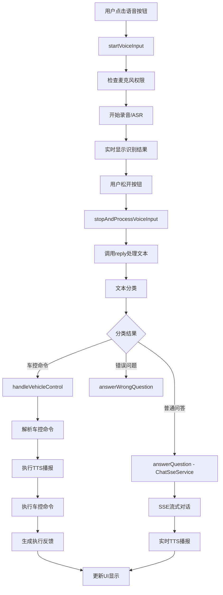

# AI Chat Assistant Flutter Plugin - 详细代码逻辑文档

## 📋 项目概述

这是一个专为车载系统设计的AI聊天助手Flutter插件，采用插件化架构设计，支持语音识别、AI对话、车控命令执行等功能。项目从原有的App结构重构为Plugin结构，便于集成到其他Flutter应用中。

## 🏗️ 核心架构分析

### 1. 架构模式

- **插件化架构**: 采用Flutter Plugin架构，便于第三方应用集成
- **单例模式**: 核心服务类(MessageService)采用单例模式确保全局状态一致
- **观察者模式**: 基于Provider的状态管理，实现响应式UI更新
- **回调机制**: 通过CommandCallback实现车控命令的解耦处理

### 2. 目录结构与职责

```
lib/
├── app.dart                     # 插件主入口，提供初始化接口
├── enums/                       # 枚举定义层
├── models/                      # 数据模型层
├── services/                    # 业务逻辑服务层
├── screens/                     # UI界面层
├── widgets/                     # UI组件层
├── utils/                       # 工具类层
└── themes/                      # 主题样式层
```

## 🔧 核心枚举定义 (Enums)

### MessageServiceState
```dart
enum MessageServiceState {
  idle,        // 空闲状态
  recording,   // 录音中
  recognizing, // 识别中
  replying,    // 回复中
}
```

### MessageStatus
```dart
enum MessageStatus {
  normal,      // 普通消息
  listening,   // 聆听中
  recognizing, // 识别中
  thinking,    // 思考中
  completed,   // 完成回答
  executing,   // 执行中
  success,     // 执行成功
  failure,     // 执行失败
  aborted,     // 已中止
}
```

### VehicleCommandType
支持22种车控命令类型：
- 车门控制：lock, unlock
- 车窗控制：openWindow, closeWindow
- 空调控制：openAC, closeAC, changeACTemp, coolSharply
- 特殊功能：prepareCar, meltSnow, honk, locateCar
- 加热功能：座椅加热、方向盘加热等

## 📊 数据模型层 (Models)

### ChatMessage
```dart
class ChatMessage {
  final String id;           // 消息唯一标识
  final String text;         // 消息内容
  final bool isUser;         // 是否为用户消息
  final DateTime timestamp;  // 时间戳
  MessageStatus status;      // 消息状态
}
```

### VehicleCommand
```dart
class VehicleCommand {
  final VehicleCommandType type;        // 命令类型
  final Map<String, dynamic>? params;   // 命令参数
  final String error;                   // 错误信息
}
```

## 🔄 核心服务层 (Services) - 完整解析

### 1. MessageService - 核心消息管理服务

**设计模式**: 单例模式 + 观察者模式

**主要职责**:
- 统一管理聊天消息
- 协调语音识别、AI对话、车控命令执行流程
- 维护应用状态机
- 通过Method Channel与原生ASR服务通信

**核心方法分析**:

#### 语音输入流程
```dart
// 开始语音输入
Future<void> startVoiceInput() async {
  // 1. 权限检查 - 使用permission_handler检查麦克风权限
  // 2. 状态验证 - 确保当前状态为idle
  // 3. 初始化录音 - 创建用户消息占位符
  // 4. 调用原生ASR服务 - 通过Method Channel启动阿里云ASR
}

// 停止并处理语音输入
Future<void> stopAndProcessVoiceInput() async {
  // 1. 停止录音 - 调用原生ASR停止接口
  // 2. 等待ASR结果 - 使用Completer等待异步结果
  // 3. 调用reply()处理识别结果
}
```

#### 智能回复流程
```dart
Future<void> reply(String text) async {
  // 1. 文本分类(TextClassificationService)
  // 2. 根据分类结果路由到不同处理逻辑:
  //    - 车控命令 (category=2) -> handleVehicleControl()
  //    - 普通问答 (default) -> answerQuestion()
  //    - 错误问题 (category=4) -> answerWrongQuestion()
  //    - 系统错误 (category=-1) -> occurError()
}
```

#### 车控命令处理
```dart
Future<void> handleVehicleControl(String text, bool isChinese) async {
  // 1. 调用VehicleCommandService解析命令
  // 2. 执行TTS播报
  // 3. 逐个执行车控命令
  // 4. 处理命令执行结果
  // 5. 生成执行反馈
}
```

**状态管理机制**:
- 使用`ChangeNotifier`实现响应式状态更新
- 通过`_state`维护服务状态机
- 使用`_isReplyAborted`实现流程中断控制

### 2. ChatSseService - SSE流式通信服务

**设计模式**: 单例服务 + 流式处理

**核心功能**:
- 基于SSE的实时AI对话
- 流式文本处理和TTS播报
- 会话状态管理
- 智能分句和语音合成

**关键实现**:

#### SSE连接管理
```dart
void request({
  required String messageId,
  required String text,
  required bool isChinese,
  required Function(String, String, bool) onStreamResponse,
}) async {
  // 1. 初始化用户ID和会话ID
  // 2. 建立HTTP SSE连接
  // 3. 处理流式响应数据
  // 4. 实时文本清理和分句
  // 5. 协调TTS播报
}
```

#### 智能分句算法
```dart
// 支持中英文分句符识别
final enEnders = RegExp(r'[.!?]');
final zhEnders = RegExp(r'[。！？]');

// Markdown内容清理
// 1. 清理图片语法 ![...]
// 2. 移除列表序号
// 3. 处理不完整语法
```

### 3. AudioRecorderService - 音频录制服务

**核心功能**:
- 基于record插件的音频录制
- OPUS格式音频编码
- 权限管理
- 临时文件管理

**实现细节**:
```dart
class AudioRecorderService {
  final AudioRecorder _recorder = AudioRecorder();
  bool _isRecording = false;
  String? _tempFilePath;

  Future<void> startRecording() async {
    // 1. 生成临时文件路径
    // 2. 配置OPUS编码格式
    // 3. 启动录音
  }

  Future<List<int>?> stopRecording() async {
    // 1. 停止录音
    // 2. 读取音频文件
    // 3. 返回字节数组
  }
}
```

### 4. VoiceRecognitionService - 语音识别服务

**功能**:
- HTTP多媒体文件上传
- 音频格式转换
- 中英文语言识别

**核心逻辑**:
```dart
Future<String?> recognizeSpeech(List<int> audioBytes, {String lang = 'cn'}) async {
  // 1. 构建MultipartRequest
  // 2. 上传音频文件到识别服务
  // 3. 解析JSON响应获取文本
  // 4. 错误处理和日志记录
}
```

### 5. LocalTtsService - 语音合成服务

**设计亮点**: 流式TTS处理 + 有序播放队列

**核心特性**:
- 基于flutter_tts的跨平台TTS
- 流式文本分句播报
- 有序任务队列管理
- 中英文语言自动切换

**关键数据结构**:
```dart
class TtsTask {
  final int index;           // 任务索引
  final String text;         // 播报文本
  TtsTaskStatus status;      // 任务状态(ready/completed)
}

enum TtsTaskStatus {
  ready,      // 准备播放
  completed,  // 播放完成
}
```

**流式播放流程**:
```dart
void pushTextForStreamTTS(String text) {
  // 1. 创建有序任务
  // 2. 添加到任务队列
  // 3. 触发下一个任务处理
}

void _processNextReadyTask() {
  // 1. 检查播放状态
  // 2. 按序查找就绪任务
  // 3. 执行TTS播放
  // 4. 等待播放完成回调
}
```

### 6. TextClassificationService - 文本分类服务

**功能**: NLP文本意图分类

**分类结果**:
- `-1`: 系统错误
- `2`: 车控命令
- `4`: 无效问题
- 其他: 普通问答

```dart
Future<int> classifyText(String text) async {
  // HTTP POST到分类服务
  // 返回分类category整数
}
```

### 7. VehicleCommandService - 车控命令解析服务

**职责**: 
- 自然语言转车控命令
- 命令参数解析
- 执行结果反馈生成

**核心方法**:
```dart
Future<VehicleCommandResponse?> getCommandFromText(String text) async {
  // 1. 发送文本到NLP解析服务
  // 2. 解析返回的命令列表
  // 3. 构建VehicleCommandResponse对象
}

Future<String> getControlResponse(List<String> successCommandList) async {
  // 根据成功命令列表生成友好反馈文本
}
```

### 8. CommandService - 车控命令执行服务

**设计模式**: 静态方法 + 回调机制

**解耦设计**:
```dart
typedef CommandCallback = Future<(bool, Map<String, dynamic>? params)> Function(
    VehicleCommandType type, Map<String, dynamic>? params);

static Future<(bool, Map<String, dynamic>? params)> executeCommand(
    VehicleCommandType type, {Map<String, dynamic>? params}) async {
  // 调用主应用注册的回调函数
  // 返回执行结果元组(成功状态, 返回参数)
}
```

### 9. RedisService - 缓存服务

**功能**: 基于HTTP的Redis缓存操作

```dart
class RedisService {
  Future<void> setKeyValue(String key, Object value) async {
    // HTTP POST设置键值对
  }
  
  Future<String?> getValue(String key) async {
    // HTTP GET获取值
  }
}
```

### 10. LocationService - 位置服务

用于车辆定位相关功能（具体实现需查看完整代码）

### 11. VehicleStateService - 车辆状态服务

**注释代码分析**: 
- 原设计基于InGeek MDK车载SDK
- 支持车辆状态实时监听
- 与Redis服务配合缓存状态数据
- 当前版本已注释，可能在插件化过程中移除

## 🎨 UI层架构分析

### 1. 主界面 (MainScreen)

**设计**: 采用Stack布局，背景图片 + 浮动图标

```dart
Widget build(BuildContext context) {
  return Scaffold(
    body: Stack(
      children: [
        // 背景图片
        Container(decoration: BoxDecoration(
          image: DecorationImage(
            image: AssetImage('assets/images/bg.jpg', package: 'ai_chat_assistant'),
          ),
        )),
        // 浮动AI助手图标
        FloatingIcon(),
      ],
    ),
  );
}
```

### 2. 浮动图标 (FloatingIcon)

**功能特性**:
- 可拖拽定位
- 状态指示(通过不同图标)
- 点击展开聊天界面
- 动画效果支持

**交互流程**:
1. 长按拖拽调整位置
2. 点击展开部分屏幕聊天界面
3. 根据MessageService状态切换图标

### 3. 聊天界面架构

**部分屏模式** (PartScreen):
- 简化的聊天界面
- 支持语音输入和文本显示
- 可展开到全屏模式

**全屏模式** (FullScreen):
- 完整的聊天功能
- 历史消息展示
- 更多操作按钮

## 🔌 原生平台集成

### Android ASR集成

**Method Channel通信**:
```dart
static const MethodChannel _asrChannel = 
    MethodChannel('com.example.ai_chat_assistant/ali_sdk');
```

**ASR事件处理**:
```dart
_asrChannel.setMethodCallHandler((call) async {
  switch (call.method) {
    case "onAsrResult":
      // 实时更新识别结果
      replaceMessage(id: _latestUserMessageId!, text: call.arguments);
      break;
    case "onAsrStop":
      // 识别结束，触发后续处理
      if (_asrCompleter != null && !_asrCompleter!.isCompleted) {
        _asrCompleter!.complete(messages.last.text);
      }
      break;
  }
});
```

## 🛠️ 工具类分析

### CommonUtil
**主要功能**:
- 中文检测: `containChinese(String text)`
- Markdown清理: `cleanText(String text, bool forTts)`
- 公共颜色常量定义

**Markdown清理逻辑**:
```dart
static String cleanText(String text, bool forTts) {
  // 1. 清理粗体/斜体标记 **text** *text*
  // 2. 处理代码块 ```code```
  // 3. 清理表格格式 |---|---|
  // 4. 处理链接和图片 [text](url) 
  // 5. 清理列表和引用 1. - * >
  // 6. 规范化空白字符
}
```

## 🔄 数据流分析

### 完整对话流程



### 服务间协作关系

```
MessageService (核心协调器)
├── ChatSseService (AI对话)
│   └── LocalTtsService (流式TTS)
├── AudioRecorderService (音频录制)
├── VoiceRecognitionService (语音识别)
├── TextClassificationService (文本分类)
├── VehicleCommandService (车控解析)
│   └── CommandService (命令执行)
└── RedisService (状态缓存)
```

### 状态管理流程

**MessageService状态变化**:
```
idle -> recording -> recognizing -> replying -> idle
```

**消息状态变化**:
```
listening -> normal -> thinking -> executing -> success/failure
```

**TTS任务状态**:
```
ready -> playing -> completed
```

## 🔧 配置与扩展

### 1. 插件初始化

```dart
// 在主应用中初始化插件
ChatAssistantApp.initialize(
  commandCallback: (VehicleCommandType type, Map<String, dynamic>? params) async {
    // 实现具体的车控逻辑
    return (true, {'message': '命令执行成功'});
  },
);
```

### 2. 服务端接口配置

**当前硬编码的服务端地址**:
- 文本分类: `http://143.64.185.20:18606/classify`
- 车控解析: `http://143.64.185.20:18606/control`
- 控制反馈: `http://143.64.185.20:18606/control_resp`
- SSE对话: `http://143.64.185.20:18606/chat`
- 语音识别: `http://143.64.185.20:18606/voice`
- Redis缓存: `http://143.64.185.20:18606/redis/*`

**建议改进**: 将服务端地址配置化，支持动态配置

### 3. 资源文件引用

**图片资源**:
- 使用`package: 'ai_chat_assistant'`前缀
- 路径: `assets/images/`

**字体资源**:
- VWHead_Bold.otf
- VWHead_Regular.otf

## 🐛 已知问题与注意事项

### 1. 资源路径问题
当前资源文件引用可能存在路径问题，需要确保在example项目中正确配置package前缀。

### 2. 硬编码服务地址
服务端API地址硬编码，不利于部署和环境切换。

### 3. 错误处理
部分网络请求缺少完善的错误处理和重试机制。

### 4. 内存管理
长时间运行可能存在内存泄漏风险，需要关注：
- Completer的正确释放
- HTTP连接的及时关闭
- TTS任务队列的清理

### 5. 并发控制
- SSE连接的并发控制
- TTS播放队列的线程安全
- 语音识别状态的同步

## 🚀 扩展建议

### 1. 配置化改进
- 服务端地址配置化
- 支持多语言配置
- 主题自定义配置
- TTS引擎选择配置

### 2. 功能增强
- 添加离线语音识别支持
- 实现消息历史持久化
- 添加更多车控命令类型
- 支持自定义唤醒词

### 3. 性能优化
- 实现网络请求缓存
- 优化UI渲染性能
- 添加资源预加载
- TTS队列优化

### 4. 测试完善
- 添加单元测试覆盖所有服务
- 集成测试覆盖完整流程
- 性能测试工具
- 错误场景测试

### 5. 架构优化
- 依赖注入容器
- 事件总线机制
- 插件热重载支持
- 模块化拆分

## 📝 开发流程建议

### 1. 添加新功能
1. 在相应的枚举中定义新类型
2. 在models中添加数据模型
3. 在services中实现业务逻辑
4. 在widgets中创建UI组件
5. 更新主流程集成新功能

### 2. 调试技巧
- 使用`debugPrint`添加关键节点日志
- 通过Provider DevTools监控状态变化
- 使用Flutter Inspector检查UI结构
- 监控Method Channel通信日志

### 3. 集成测试
- 在example项目中测试完整流程
- 验证车控命令回调机制
- 测试不同场景下的错误处理
- 验证资源文件引用

## 💡 技术亮点总结

### 1. 流式处理架构
- SSE实时对话流
- TTS流式播报
- 有序任务队列管理

### 2. 智能语音处理
- 实时语音识别显示
- 中英文自动检测
- 智能分句算法

### 3. 解耦设计
- 插件与主应用解耦
- 服务间松耦合
- 回调机制灵活扩展

### 4. 状态管理
- 响应式UI更新
- 多层状态协调
- 异步状态同步

---
