# OneApp 架构设计文档

## App 知识

### 1. APK 解压内容分析

APK (Android Package) 是 Android 应用的安装包格式，本质上是一个压缩文件。通过解压 APK 可以了解应用的构成和结构。

#### APK 文件结构

|  |  |
| :------------------------------: | :------------------------------: |
|            apk 文件1             |            apk 文件2             |

```
app-debug.apk (解压后)
├── AndroidManifest.xml          # 应用清单文件 (二进制格式)
├── classes.dex                  # Dalvik字节码文件
├── classes2.dex                 # 额外的dex文件 (多dex应用)
├── resources.arsc               # 编译后的资源文件
├── assets/                      # 静态资源目录
│   ├── flutter_assets/          # Flutter资源文件
│   │   ├── kernel_blob.bin      # Dart代码编译产物 (Debug模式)
│   │   ├── isolate_snapshot_*   # Dart代码快照 (Release模式)
│   │   ├── vm_snapshot_*        # Dart VM快照 (Release模式)
│   │   ├── AssetManifest.json   # 资源清单
│   │   └── packages/            # 第三方包资源
│   └── build.properties         # 构建属性文件
├── res/                         # Android资源目录
│   ├── drawable/                # 图片资源
│   ├── layout/                  # 布局文件 (二进制格式)
│   ├── values/                  # 字符串、颜色等资源
│   └── ...
├── lib/                         # 本地库文件
│   ├── arm64-v8a/              # 64位ARM架构库
│   │   └── libflutter.so       # Flutter引擎
│   ├── armeabi-v7a/            # 32位ARM架构库
│   └── x86_64/                 # x86_64架构库
├── META-INF/                    # 签名和清单信息
│   ├── MANIFEST.MF             # 清单文件
│   ├── CERT.SF                 # 签名文件
│   └── CERT.RSA                # 证书文件
└── kotlin/                      # Kotlin元数据
```

#### 关键文件说明

- **classes.dex 文件**

    classes.dex 文件是 Dalvik Executable (DEX) 格式的文件，它包含了应用的 Java 或 Kotlin 代码，经过编译后用于 Android 虚拟机（Dalvik 或 ART）执行。

    在 Android 应用中，所有的 Java 或 Kotlin 类都会被编译成 .dex 文件，这些文件在应用运行时被加载并执行。你看到的多个 classes.dex 文件（如 classes2.dex, classes3.dex）表示这应用程序被分成了多个 DEX 文件（通常是因为 APK 文件的大小超过了单个 DEX 文件的限制，使用多重 DEX 来进行分割）。

- **assets/ 文件夹**
  
    这个文件夹包含了 APK 内的 静态资源文件。这些资源不参与编译，可以直接在应用运行时被访问和加载。常见的文件包括图像、字体、JSON 文件等。

    例如，assets 中的资源可以在应用中通过 AssetManager 被访问。

- **lib/ 文件夹**

    这个文件夹包含了应用的 原生代码库，即用 C 或 C++ 等编写的本地代码（通常是 .so 文件）。这些库通常用于实现一些高性能的功能或者和硬件交互等。

    例如，lib/ 文件夹中可能会包含适用于不同平台（如 x86、ARM 等架构）的 .so 文件。

- **META-INF/ 文件夹**

    这个文件夹包含了 APK 的元数据，通常用于签名验证和应用的完整性验证。

    里面的 MANIFEST.MF、CERT.RSA、CERT.SF 等文件用于存储签名证书以及验证应用完整性所需的数据，确保 APK 文件没有被篡改。

- **res/ 文件夹**
    这个文件夹包含了应用的 资源文件，这些资源是应用 UI、布局、图像、字符串等的一部分。

    res/ 文件夹通常包含子文件夹，如 drawable/（图片资源）、layout/（布局文件）、values/（定义字符串、尺寸等的 XML 文件）等。

- **AndroidManifest.xml**

    这个文件是 Android 应用的 清单文件，用于声明应用的基本信息，如包名、权限、组件（如 Activity、Service、BroadcastReceiver）等。

    AndroidManifest.xml 还包括了其他配置信息，如应用的主题、启动模式等。

- **.properties 文件**

    .properties 文件通常用于存储应用的配置信息，如库的版本、路径配置等。

    例如，HMSCore-base.properties、play-services-location.properties 等文件是与特定 SDK 或服务（如 HMS 或 Google Play 服务）相关的配置文件，通常在编译时用来设置 SDK 的特性、版本号等。

- **resources.arsc**

    这个文件是 资源表文件，用于存储应用中所有的 静态资源（如字符串、颜色、尺寸等）。

    它是二进制格式，用于加速资源加载。Android 系统通过 resources.arsc 来索引和加载资源，而不需要直接读取 XML 文件。


**核心执行文件**
- `classes.dex`: 编译后的Java/Kotlin字节码，运行在Dalvik/ART虚拟机上
- `AndroidManifest.xml`: 应用配置清单，定义组件、权限、版本等信息
- `resources.arsc`: 编译后的XML资源和字符串资源

**Flutter相关文件**
- `flutter_assets/kernel_blob.bin`: Debug模式下的Dart代码内核表示
- `flutter_assets/isolate_snapshot_*`: Release模式下的AOT编译快照
- `lib/*/libflutter.so`: Flutter引擎的原生库

**资源文件**
- `assets/`: 原始资源文件，运行时可直接访问
- `res/`: Android标准资源，会被编译和优化

**安全验证**
- `META-INF/`: APK签名相关文件，确保应用完整性和来源可信

#### OneApp项目中的体现

在OneApp的构建产物中，我们可以发现：

```properties
# build.properties 示例
iid=6363
sid=3138351
bid=982334
version=12.10.0.10010731
time=2024-05-08 19:02:58
FEATURE_LOCATION=1
FEATURE_ROUTE_OVERLAY=1
FEATURE_MVT=1
FEATURE_3DTiles=1
FEATURE_GLTF=1
```

这个文件记录了构建信息和功能特性开关，体现了OneApp的多功能特性管理。

### 2. Android App 架构模式

#### 传统Android应用架构

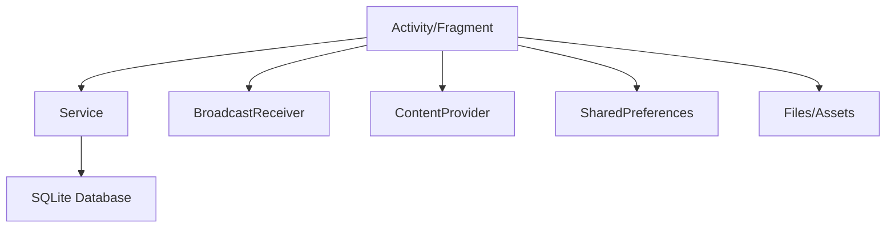
```mermaid
graph TB
    A[Activity/Fragment] --> B[Service]
    A --> C[BroadcastReceiver]
    A --> D[ContentProvider]
    B --> E[SQLite Database]
    A --> F[SharedPreferences]
    A --> G[Files/Assets]
```

#### 现代Android架构 (MVVM)

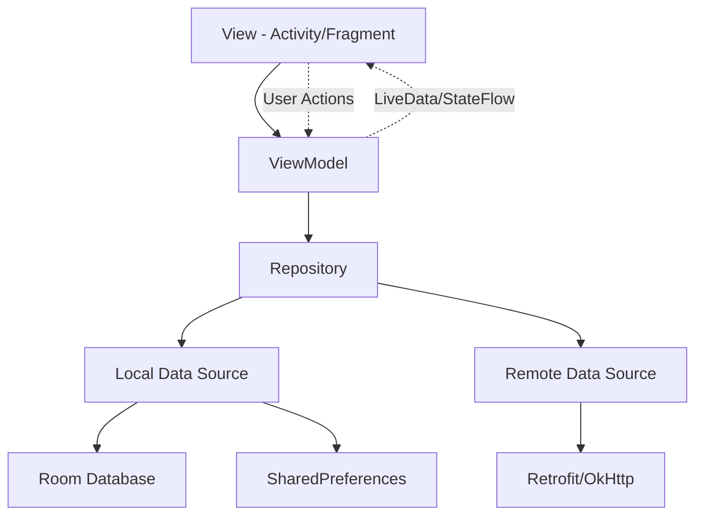
```mermaid
graph TB
    A[View - Activity/Fragment] --> B[ViewModel]
    B --> C[Repository]
    C --> D[Local Data Source]
    C --> E[Remote Data Source]
    D --> F[Room Database]
    D --> G[SharedPreferences]
    E --> H[Retrofit/OkHttp]
    
    B -.->|LiveData/StateFlow| A
    A -.->|User Actions| B
```

#### Flutter混合架构

对于OneApp这样的Flutter应用，架构更为复杂：

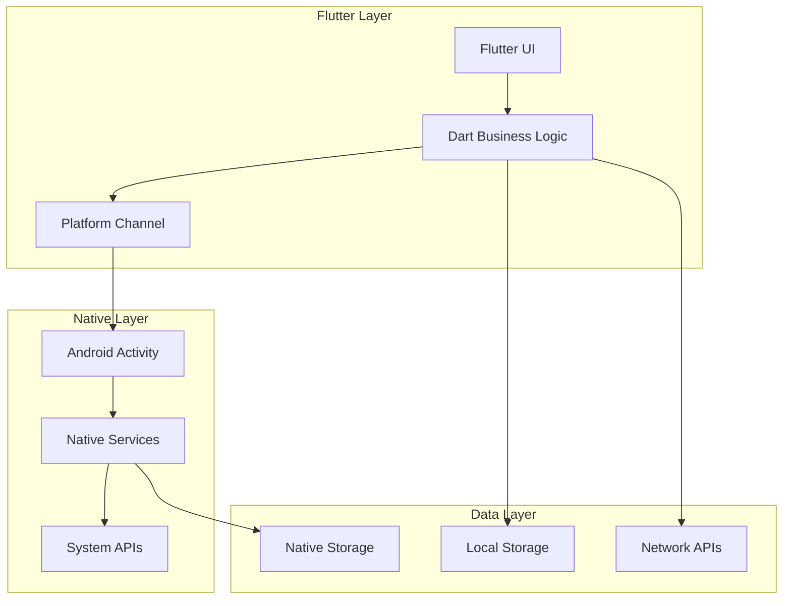
```mermaid
graph TB
    subgraph "Flutter Layer"
        A[Flutter UI] --> B[Dart Business Logic]
        B --> C[Platform Channel]
    end
    
    subgraph "Native Layer"
        C --> D[Android Activity]
        D --> E[Native Services]
        E --> F[System APIs]
    end
    
    subgraph "Data Layer"
        B --> G[Local Storage]
        B --> H[Network APIs]
        E --> I[Native Storage]
    end
```

**架构层次说明**

1. **展示层 (Presentation Layer)**
   - Flutter Widget树
   - 用户界面渲染
   - 用户交互处理

2. **业务逻辑层 (Business Logic Layer)**
   - Dart业务代码
   - 状态管理 (Provider/Bloc)
   - 路由管理

3. **平台适配层 (Platform Layer)**
   - Platform Channel通信
   - 原生功能调用
   - 平台特性适配

4. **数据服务层 (Data Service Layer)**
   - 网络请求
   - 本地存储
   - 缓存管理

5. **原生系统层 (Native System Layer)**
   - Android系统API
   - 硬件设备访问
   - 系统服务调用

### Android 插件的合并与加载机制

1. 插件与 Flutter 应用的集成
   
    当我们把一个插件集成到 Flutter 项目时，首先需要了解两个主要部分：

    Flutter 插件的 Android 部分：通常包含 `src/main/java` 或 `src/main/kotlin` 目录下的原生代码。

    Flutter 项目的 Android 部分：即你创建的 Flutter 项目的 `android/` 目录。

2. 插件的打包

    Flutter 插件包含了原生代码（Android 部分通常是 Java 或 Kotlin），这些原生代码被打包成 .aar 文件。AAR 是 Android 的类库包，包含了插件的 Java 或 Kotlin 代码、资源文件和配置等。

    在 Flutter 项目中，插件的 .aar 文件通过 Flutter 的依赖管理系统（通常是 pubspec.yaml 文件）进行声明，类似于其他 Dart 包。Flutter 会在编译时把这些原生代码一起编译进最终的 Android APK 或 AAB 文件中。它们的编译产出（.class 文件）合并到主工程的 DEX 文件中。

    将它们的 AndroidManifest.xml 内容合并到主工程的 AndroidManifest.xml 中。这就是为什么插件声明的权限和组件会在最终 App 中生效。


3. 插件的集成

    依赖声明：在 `pubspec.yaml` 文件中声明插件的依赖：
    ```yaml
    dependencies:
    flutter:
        sdk: flutter
    flutter_plugin: ^1.0.0
    ```

    Gradle 构建过程：当你编译 Flutter 项目时，Gradle 会自动下载 Flutter 插件，并把 .aar 文件（插件的原生部分）合并到应用的 build.gradle 配置中：

    在 android/app/build.gradle 中，Flutter 插件的原生代码被集成到 dependencies 块中：
    ```gradle
    dependencies {
        implementation project(":flutter_plugin")
    }

    <!--新版本可以通过plugin的方法来加载插件 -->
    plugins {
        id "dev.flutter.flutter-gradle-plugin"
    }

    ```
    在`setting.gradle`里面也可以批量的去依赖Flutter项目的全部依赖
    ```gradle
    pluginManagement {
        def flutterSdkPath = {
            def properties = new Properties()
            file("local.properties").withInputStream { properties.load(it) }
            def flutterSdkPath = properties.getProperty("flutter.sdk")
            assert flutterSdkPath != null, "flutter.sdk not set in local.properties"
            return flutterSdkPath
        }()

        includeBuild("$flutterSdkPath/packages/flutter_tools/gradle")

        repositories {
            google()
            mavenCentral()
            gradlePluginPortal()
        }
    }

    plugins {
        id "dev.flutter.flutter-plugin-loader" version "1.0.0" // apply true
        id "com.android.application" version "{agpVersion}" apply false
        id "org.jetbrains.kotlin.android" version "{kotlinVersion}" apply false
    }

    include ":app"
    ```
    Flutter Gradle 插件的命令式应用已弃用
    
    [Deprecated imperative apply of Flutter's Gradle plugins](https://docs.flutter.cn/release/breaking-changes/flutter-gradle-plugin-apply)

4. 插件加载与启动过程

    在 应用启动时，Flutter 会通过 `FlutterEngine` 启动，并将原生代码的插件加载到引擎中。
    当应用启动时，Flutter 插件会在启动过程中被动态加载。
    在构建过程中，所有插件的 .aar 文件都会被合并到最终的 APK 中。当应用启动时，Flutter 引擎会加载这些 .aar 文件并通过 MethodChannel 进行通信。

    ```java
    @Override
    protected void onCreate(Bundle savedInstanceState) {
        super.onCreate(savedInstanceState);
        FlutterEngine flutterEngine = new FlutterEngine(this);
        GeneratedPluginRegistrant.registerWith(flutterEngine);
        setContentView(
            FlutterActivity.createDefaultIntent(this)
        );
    }
    ```
    现在的项目都是继承于`FlutterActivity`，自动完成了插件的注册

5. 方法调用与通信机制

    Flutter 应用和 Android 插件之间的通信是通过 `MethodChannel` 或 `EventChannel` 完成的。

    `MethodChannel`：用于异步方法调用。
    插件原生代码通过 MethodChannel 向 Dart 层发送数据。
    Dart 层通过 MethodChannel 发起原生方法调用。

    `EventChannel`：用于数据流式传输，通常用于原生代码向 Flutter 层推送事件。

## Flutter知识

### 1. Flutter 架构概览

Flutter 是 Google 开发的跨平台 UI 工具包，采用自绘制引擎，实现了"一套代码，多端运行"的目标。它被设计为一个可扩展的分层系统，各个独立的组件系列合集，上层组件各自依赖下层组件。

> 参考：[Flutter架构概览官方文档](https://docs.flutter.cn/resources/architectural-overview)

#### Flutter 架构

Flutter 采用分层架构设计，从上到下分为 Framework 层、Engine 层和 Platform 层：

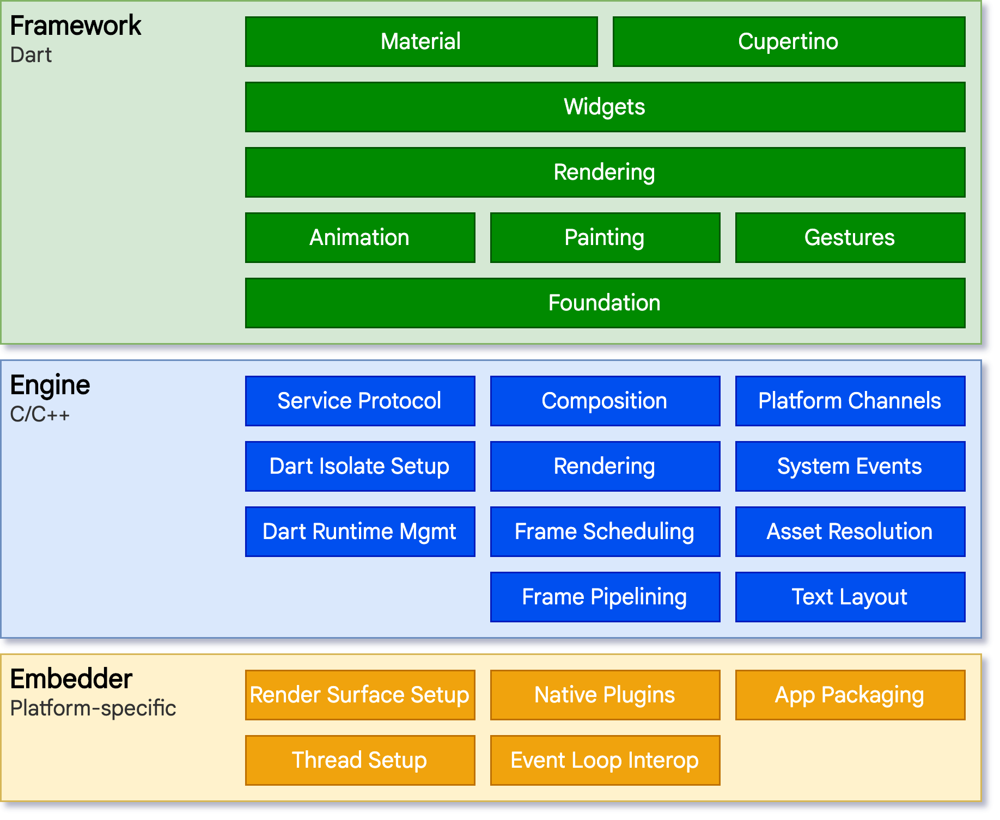

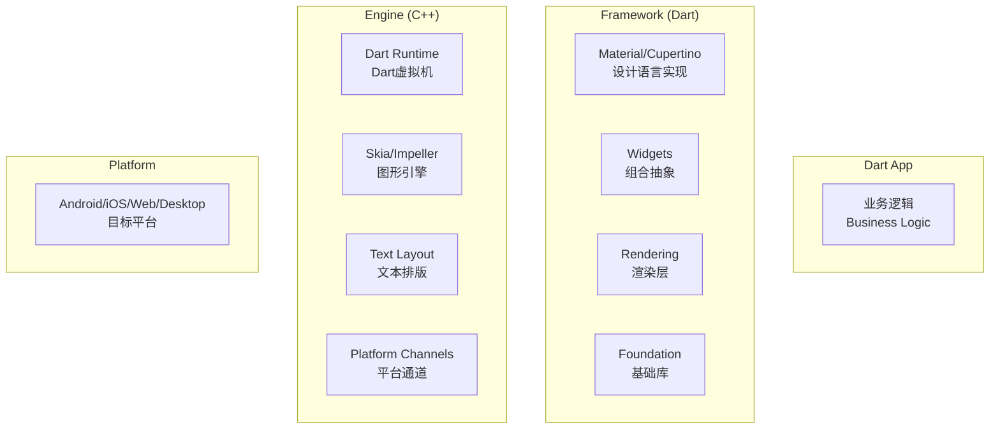
```mermaid
graph TB
    subgraph "Dart App"
        A[业务逻辑<br/>Business Logic]
    end
    
    subgraph "Framework (Dart)"
        B[Material/Cupertino<br/>设计语言实现]
        C[Widgets<br/>组合抽象]
        D[Rendering<br/>渲染层]
        E[Foundation<br/>基础库]
    end
    
    subgraph "Engine (C++)"
        F[Dart Runtime<br/>Dart虚拟机]
        G[Skia/Impeller<br/>图形引擎]
        H[Text Layout<br/>文本排版]
        I[Platform Channels<br/>平台通道]
    end
    
    subgraph "Platform"
        J[Android/iOS/Web/Desktop<br/>目标平台]
    end
```

**架构层次详解**

| 架构层 | 主要职责 | 核心组件 | 关键特点 |
|--------|----------|----------|----------|
| **Framework层** | 提供上层API封装 | Material、Widgets、Rendering、Foundation | Dart语言实现，响应式编程 |
| **Engine层** | 底层渲染和运行时支持 | Dart Runtime、图形引擎、文本布局 | C++实现，高性能渲染 |
| **Platform层** | 与底层操作系统交互 | 嵌入层、系统API | 平台特定实现 |

#### Flutter 应用架构

基于官方推荐的 MVVM 架构模式，Flutter 应用采用关注点分离原则，分为 UI 层和数据层。

> 参考：[Flutter应用架构指南](https://docs.flutter.cn/app-architecture/guide)


**分层架构设计**

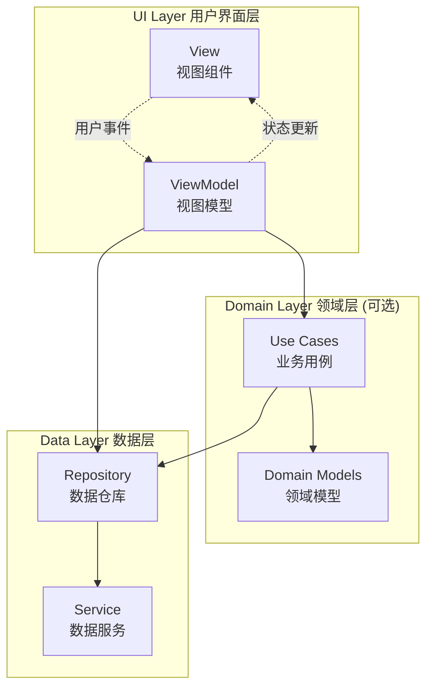
```mermaid
graph TB
    subgraph "UI Layer 用户界面层"
        A[View<br/>视图组件]
        B[ViewModel<br/>视图模型]
    end
    
    subgraph "Domain Layer 领域层 (可选)"
        E[Use Cases<br/>业务用例]
        F[Domain Models<br/>领域模型]
    end
    
    subgraph "Data Layer 数据层"
        C[Repository<br/>数据仓库]
        D[Service<br/>数据服务]
    end
    
    A -.->|用户事件| B
    B -.->|状态更新| A
    B --> C
    B --> E
    E --> F
    E --> C
    C --> D
```

**完整的功能模块架构**

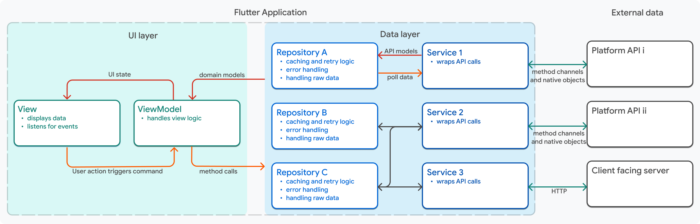

**架构组件职责**

| 组件层 | 主要职责 | 核心特点 | 示例 |
|--------|----------|----------|------|
| **View** | UI渲染和用户交互 | 无业务逻辑，接收ViewModel数据 | StatelessWidget页面 |
| **ViewModel** | 业务逻辑和状态管理 | 数据转换，状态维护，命令处理 | Bloc、Provider |
| **Repository** | 数据源管理 | 缓存策略，错误处理，数据转换 | UserRepository |
| **Service** | 外部数据源封装 | API调用，本地存储，平台服务 | ApiService |
| **Use Cases** | 复杂业务逻辑封装 | 跨Repository逻辑，可复用业务 | LoginUseCase |

#### 推荐项目结构

基于官方最佳实践的项目文件组织方式：

```
lib/
├── ui/                          # UI层 - 用户界面
│   ├── core/                    # 核心UI组件
│   │   ├── widgets/             # 通用Widget组件
│   │   ├── themes/              # 主题配置
│   │   └── extensions/          # UI扩展方法
│   └── features/                # 功能模块
│       ├── home/                # 首页功能
│       │   ├── view_models/     # 视图模型
│       │   │   └── home_view_model.dart
│       │   ├── views/           # 视图组件
│       │   │   ├── home_screen.dart
│       │   │   └── widgets/
│       │   └── models/          # UI状态模型
│       ├── car_control/         # 车控功能
│       └── profile/             # 个人中心
├── domain/                      # 领域层 - 业务逻辑
│   ├── models/                  # 领域模型
│   │   ├── car.dart
│   │   └── user.dart
│   ├── use_cases/               # 业务用例
│   │   ├── login_use_case.dart
│   │   └── car_control_use_case.dart
│   └── repositories/            # 仓库接口
│       └── i_car_repository.dart
├── data/                        # 数据层 - 数据访问
│   ├── repositories/            # 仓库实现
│   │   ├── car_repository_impl.dart
│   │   └── user_repository_impl.dart
│   ├── services/                # 数据服务
│   │   ├── api/                 # API服务
│   │   │   ├── car_api_service.dart
│   │   │   └── auth_api_service.dart
│   │   ├── local/               # 本地存储
│   │   │   └── cache_service.dart
│   │   └── platform/            # 平台服务
│   │       └── bluetooth_service.dart
│   └── models/                  # 数据传输对象
│       ├── api/                 # API模型
│       └── local/               # 本地模型
├── core/                        # 核心基础设施
│   ├── di/                      # 依赖注入
│   ├── network/                 # 网络配置
│   ├── storage/                 # 存储配置
│   ├── constants/               # 常量定义
│   └── utils/                   # 工具类
├── config/                      # 配置文件
│   ├── app_config.dart
│   └── environment.dart
└── main.dart                    # 应用入口
```

### 2. Flutter 工作原理

Flutter 的核心设计理念是"**一切皆Widget**"，通过积极的组合模式构建用户界面。为了支撑大量Widget的高效运行，Flutter采用了多层次的架构设计和优化算法。

#### 2.1 Flutter 三棵树架构

Flutter 使用三棵树来管理UI状态和渲染：

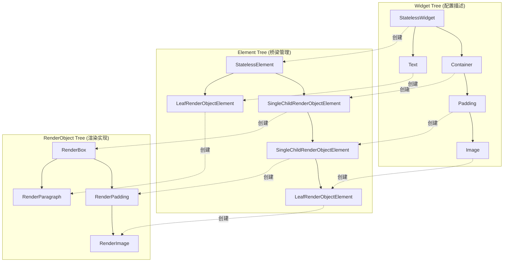
```mermaid
graph TD
    subgraph "Widget Tree (配置描述)"
        W1[StatelessWidget] --> W2[Container]
        W1 --> W3[Text]
        W2 --> W4[Padding]
        W4 --> W5[Image]
    end
    
    subgraph "Element Tree (桥梁管理)"
        E1[StatelessElement] --> E2[SingleChildRenderObjectElement]
        E1 --> E3[LeafRenderObjectElement]
        E2 --> E4[SingleChildRenderObjectElement]
        E4 --> E5[LeafRenderObjectElement]
    end
    
    subgraph "RenderObject Tree (渲染实现)"
        R1[RenderBox] --> R2[RenderPadding]
        R1 --> R3[RenderParagraph]
        R2 --> R4[RenderImage]
    end
    
    W1 -.->|创建| E1
    W2 -.->|创建| E2
    W3 -.->|创建| E3
    W4 -.->|创建| E4
    W5 -.->|创建| E5
    
    E2 -.->|创建| R1
    E3 -.->|创建| R3
    E4 -.->|创建| R2
    E5 -.->|创建| R4
```

**三棵树的职责分工**

| 树类型            | 主要职责                           | 生命周期     | 特点           |
| ----------------- | ---------------------------------- | ------------ | -------------- |
| **Widget Tree**   | UI配置描述，定义界面应该是什么样子 | 每帧重建     | 不可变、轻量级 |
| **Element Tree**  | Widget和RenderObject的桥梁        | 相对稳定     | 维护状态和关系 |
| **RenderObject**  | 实际的布局、绘制和命中测试         | 长期存在     | 可变、性能关键 |

#### 2.2 Widget 构建与更新流程

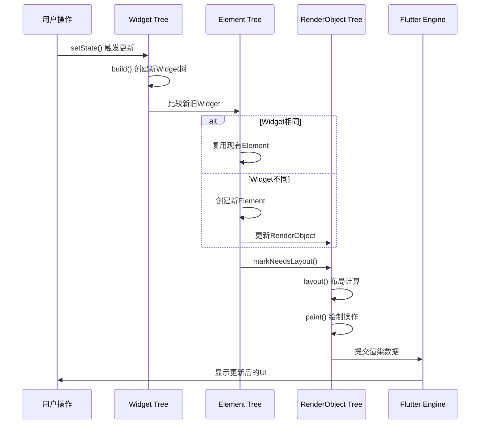
```mermaid
sequenceDiagram
    participant User as 用户操作
    participant Widget as Widget Tree
    participant Element as Element Tree
    participant Render as RenderObject Tree
    participant Engine as Flutter Engine
    
    User->>Widget: setState() 触发更新
    Widget->>Widget: build() 创建新Widget树
    Widget->>Element: 比较新旧Widget
    
    alt Widget相同
        Element->>Element: 复用现有Element
    else Widget不同
        Element->>Element: 创建新Element
        Element->>Render: 更新RenderObject
    end
    
    Element->>Render: markNeedsLayout()
    Render->>Render: layout() 布局计算
    Render->>Render: paint() 绘制操作
    Render->>Engine: 提交渲染数据
    Engine->>User: 显示更新后的UI
```

#### 2.3 布局系统 (Layout System)

Flutter 采用**单遍布局算法**，确保每个RenderObject在布局过程中最多被访问两次。

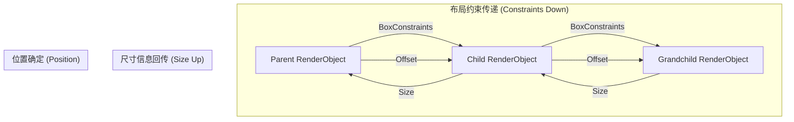
```mermaid
graph TB
    subgraph "布局约束传递 (Constraints Down)"
        A[Parent RenderObject] -->|BoxConstraints| B[Child RenderObject]
        B -->|BoxConstraints| C[Grandchild RenderObject]
    end
    
    subgraph "尺寸信息回传 (Size Up)"
        C -->|Size| B
        B -->|Size| A
    end
    
    subgraph "位置确定 (Position)"
        A -->|Offset| B
        B -->|Offset| C
    end
```

#### 2.4 绘制系统 (Painting System)

绘制系统负责将布局完成的RenderObject转换为实际的像素。

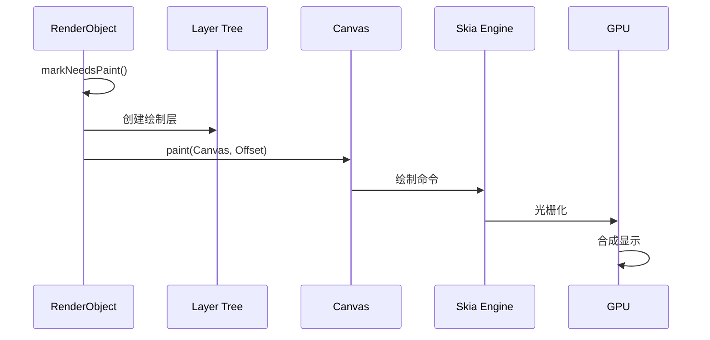
```mermaid
sequenceDiagram
    participant RO as RenderObject
    participant Layer as Layer Tree
    participant Canvas as Canvas
    participant Skia as Skia Engine
    participant GPU as GPU
    
    RO->>RO: markNeedsPaint()
    RO->>Layer: 创建绘制层
    RO->>Canvas: paint(Canvas, Offset)
    Canvas->>Skia: 绘制命令
    Skia->>GPU: 光栅化
    GPU->>GPU: 合成显示
```

#### 2.5 渲染管线 (Render Pipeline)

Flutter的完整渲染管线包含四个主要阶段：

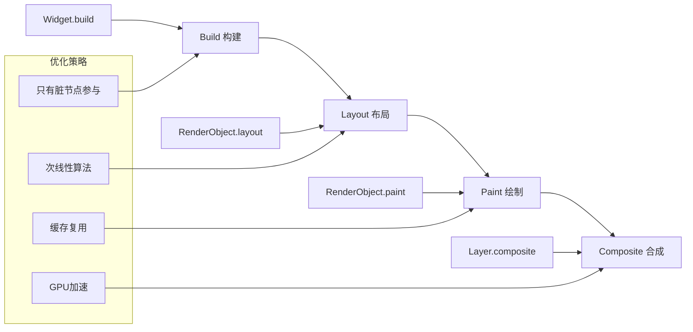
```mermaid
graph LR
    A[Build 构建] --> B[Layout 布局]
    B --> C[Paint 绘制]
    C --> D[Composite 合成]
    
    A1[Widget.build] --> A
    B1[RenderObject.layout] --> B
    C1[RenderObject.paint] --> C
    D1[Layer.composite] --> D
    
    subgraph "优化策略"
        E[只有脏节点参与]
        F[次线性算法]
        G[缓存复用]
        H[GPU加速]
    end
    
    E --> A
    F --> B
    G --> C
    H --> D
```

**渲染管线优化**

1. **构建阶段优化**
   - 只重建标记为dirty的Widget
   - Element复用机制
   - 构建缓存策略

2. **布局阶段优化**
   - 单遍布局算法
   - 约束传播优化
   - 边界检测跳过

3. **绘制阶段优化**
   - Layer层缓存
   - 重绘区域最小化
   - GPU合成加速

## Flutter 模块化

### 1. Flutter模块化基础理论

#### 模块化的必要性

随着Flutter应用规模的增长，单一代码库会面临以下挑战：

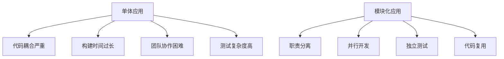
```mermaid
graph TD
    A[单体应用] --> B[代码耦合严重]
    A --> C[构建时间过长]
    A --> D[团队协作困难]
    A --> E[测试复杂度高]
    
    F[模块化应用] --> G[职责分离]
    F --> H[并行开发]
    F --> I[独立测试]
    F --> J[代码复用]
```

#### 模块化设计原则

1. **单一职责原则**: 每个模块只负责一个业务领域
2. **开闭原则**: 对扩展开放，对修改封闭
3. **依赖倒置**: 高层模块不依赖低层模块，都依赖抽象
4. **接口隔离**: 客户端不依赖不需要的接口

#### Flutter模块化方案对比

| 方案           | 优点                   | 缺点                   | 适用场景       |
| -------------- | ---------------------- | ---------------------- | -------------- |
| Package方式    | 简单易用，依赖管理清晰 | 模块间通信复杂         | 工具库、UI组件 |
| Flutter Module | 支持混合开发           | 配置复杂，版本管理困难 | 原生应用集成   |
| Modular框架    | 完整的模块化解决方案   | 学习成本较高           | 大型应用       |

### 2. Flutter Modular 框架介绍

Flutter Modular 是一个完整的模块化解决方案，提供了依赖注入、路由管理和模块解耦能力。

#### 核心概念

```dart
// 1. 模块定义
class HomeModule extends Module {
  @override
  List<Bind> get binds => [
    Bind.singleton((i) => HomeRepository()),
    Bind.factory((i) => HomeBloc(i())),
  ];

  @override
  List<ModularRoute> get routes => [
    ChildRoute('/', child: (context, args) => HomePage()),
    ChildRoute('/detail', child: (context, args) => DetailPage()),
  ];
}

// 2. 应用入口
class AppModule extends Module {
  @override
  List<Module> get imports => [
    CoreModule(),
    HomeModule(),
  ];
}

// 3. 应用启动
void main() {
  runApp(ModularApp(module: AppModule(), child: AppWidget()));
}
```

#### 依赖注入机制

```mermaid
graph TB
    A[ModularApp] --> B[Module Registration]
    B --> C[Dependency Container]
    C --> D[Singleton Binds]
    C --> E[Factory Binds]
    C --> F[Lazy Binds]
    
    G[Widget] --> H[Modular.get<T>()]
    H --> C
```

```dart
// 依赖注入使用示例
class HomePage extends StatelessWidget {
  @override
  Widget build(BuildContext context) {
    // 获取依赖注入的实例
    final bloc = Modular.get<HomeBloc>();
    final repository = Modular.get<HomeRepository>();
    
    return Scaffold(
      appBar: AppBar(title: Text('首页')),
      body: BlocBuilder<HomeBloc, HomeState>(
        bloc: bloc,
        builder: (context, state) {
          return ListView.builder(
            itemBuilder: (context, index) => ListTile(
              title: Text(state.items[index].title),
              onTap: () => Modular.to.pushNamed('/detail'),
            ),
          );
        },
      ),
    );
  }
}
```

依赖注入也可以通过`Service`来完成某一些功能的实现

```dart
abstract class EmailService {
  void sendEmail(String email, String title, String body);
}

class XPTOEmailService implements EmailService {

  final XPTOEmail xpto;
  XPTOEmailService(this.xpto);

  void sendEmail(String email, String title, String body) {
    xpto.sendEmail(email, title, body);
  }
}

class Client {

  final EmailService service;
  Client(this.service);

  void sendEmail(String email, String title, String body){
    service.sendEmail(email, title, body);
  }
}
```

```dart
class AppModule extends Module {
  // v5 写法
  @override
  List<Bind> get binds => [
    Bind.factory((i) => XPTOEmail())
    Bind.factory<EmailService>((i) => XPTOEmailService(i()))
    Bind.singleton((i) => Client(i()))
  ];
  // v6 写法
  @override
  void binds(i) {
    i.add(XPTOEmail.new);
    i.add<EmailService>(XPTOEmailService.new);
    i.addSingleton(Client.new);

    // Register with Key
    i.addSingleton(Client.new, key: 'OtherClient');
  }
}
```

在模块中就可以获取到注入的service依赖
```dart
final client = Modular.get<Client>();
// or set a default value
final client = Modular.get<Client>(defaultValue: Client());

// or use tryGet
Client? client = Modular.tryGet<Client>();

// or get with key
Client client = Modular.get(key: 'OtherCLient');

client.sendEmail('email@xxx.com', 'title', 'email body')
```

#### 路由管理

```dart
// 路由定义
class AppModule extends Module {
  @override
  List<ModularRoute> get routes => [
    ModuleRoute('/home', module: HomeModule()),
    ModuleRoute('/user', module: UserModule()),
    ModuleRoute('/car', module: CarModule()),
  ];
}

// 路由导航
class NavigationService {
  static void toHome() => Modular.to.navigate('/home/');
  static void toProfile() => Modular.to.pushNamed('/user/profile');
  static void toCharging() => Modular.to.pushNamed('/car/charging');
}
```

-----

#### Flutter Modular 6.x.x

Flutter Modular v5 和 v6 有一个变化，不过核心的概念不变

```dart
class AppModule extends Module  {

  @override
  List<Module> get imports => [];

  @override
  void routes(RouteManager r) {
    r.child('/', child: (context) => HomePage(title: 'Home Page'));
  }

  @override
  void binds(Injector i) {
  }

  @override
  void exportedBinds(Injector i) {
    
  }
}
```

### 3. Bloc 状态管理

`Flutter`的很多灵感来自于`React`，它的设计思想是数据与视图分离，由数据映射渲染视图。所以在Flutter中，它的Widget是`immutable`的，而它的动态部分全部放到了状态(`State`)中。

在项目越来越复杂之后，就需要一个状态管理库，实现高效地管理状态、处理依赖注入以及实现路由导航。

`BLoC（Business Logic Component`）是一种由 `Google` 推出的状态管理模式，最初为 `Angular` 框架设计，后被广泛应用于 `Flutter` 开发中。其核心思想是将业务逻辑与 UI 界面分离，通过流（Stream）实现单向数据流，使得状态变化可预测且易于测试。


- `Bloc`模式：该模式划分四层结构
  
  - bloc：逻辑层
  - state：数据层
  - event：所有的交互事件
  - view：页面
  
- `Cubit`模式：该模式划分了三层结构
  
  - cubit：逻辑层
  - state：数据层
  - view：页面

#### Bloc架构模式


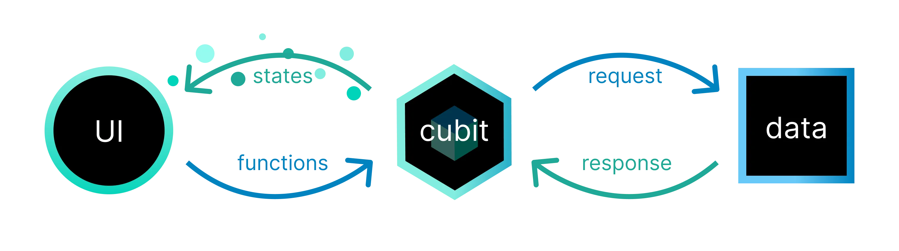

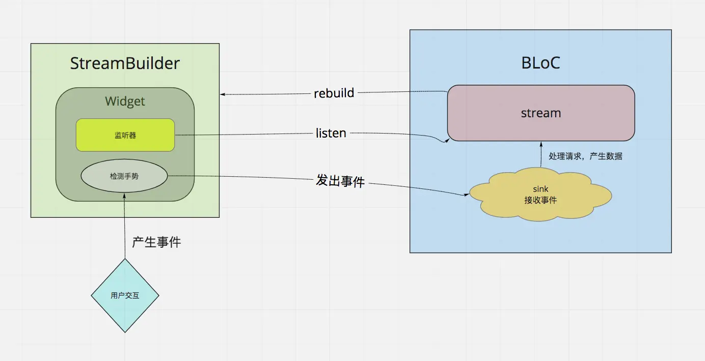

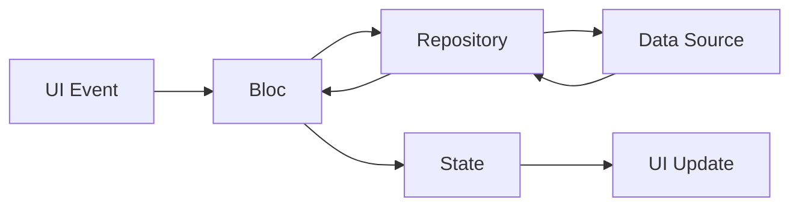
```mermaid
graph LR
    A[UI Event] --> B[Bloc]
    B --> C[Repository]
    C --> D[Data Source]
    D --> C
    C --> B
    B --> E[State]
    E --> F[UI Update]
```

#### 在OneApp中的实现

基于OneApp项目中的实际代码，以远程空调控制为例展示Bloc模式的三层架构：

##### 1. Event层 (所有的交互事件)

Event定义了用户可以触发的所有事件类型，使用`freezed`注解生成不可变对象：

```dart
/// 远程空调控制事件定义
@freezed
class RemoteClimatisationControlEvent with _$RemoteClimatisationControlEvent {
  /// 温度设置事件
  /// [temperature] 空调温度
  const factory RemoteClimatisationControlEvent.updateTemperatureSettingEvent({
    required double temperature,
  }) = UpdateTemperatureSettingEvent;

  /// 解锁启动开关事件
  /// [climatizationAtUnlock] 解锁启动开关状态
  const factory RemoteClimatisationControlEvent.updateClimatizationAtUnlockEvent({
    required bool climatizationAtUnlock,
  }) = UpdateClimatizationAtUnlockEvent;

  /// 执行空调动作事件
  /// [action] 执行ClimatizationAction动作的action
  const factory RemoteClimatisationControlEvent.updateActionExecuteEvent({
    required ClimatizationAction action,
  }) = UpdateActionExecuteEvent;

  /// 滑块值更新事件
  /// [sliderValue] 主要用来更新滑块的值
  const factory RemoteClimatisationControlEvent.updateSliderExecuteEvent({
    required double sliderValue,
  }) = UpdateSliderExecuteEvent;

  /// 页面数据刷新事件
  /// 当前页面暂停了再次回来就执行这个方法,刷新一下页面
  const factory RemoteClimatisationControlEvent.updatePageDataEvent() = UpdatePageDataEventEvent;
}
```

##### 2. State层 (数据层)

State包含了页面所需的所有状态数据，同样使用`freezed`确保不可变性：

```dart
/// 远程空调控制状态定义
@freezed
class RemoteClimatisationState with _$RemoteClimatisationState {
  /// [climatization] 空调服务类
  /// [climatizationAtUnlock] 解锁启动开关
  /// [temperature] 空调温度
  /// [status] 空调状态
  /// [parameter] 空调模块参数
  /// [actionStart] 打开空调操作是否正在执行
  /// [actionStop] 关闭操作是否正在执行
  /// [actionSetting] 保存设置操作是否正在执行
  /// [updatePage] 更新页面,bool值取反
  /// [sliderValue] 空调滑动条的值
  const factory RemoteClimatisationState({
    required ClimatizationService climatization,  // 空调服务实例
    required bool climatizationAtUnlock,          // 解锁时自动启动开关
    required double temperature,                  // 当前设置温度
    ClimatisationStatus? status,                  // 空调运行状态
    ClimatizationParameter? parameter,            // 空调参数配置
    bool? actionStart,                           // 启动操作进行中标志
    bool? actionStop,                            // 停止操作进行中标志
    bool? actionSetting,                         // 设置操作进行中标志
    bool? updatePage,                            // 页面更新标志
    double? sliderValue,                         // 温度滑块当前值
  }) = _RemoteClimatisationState;
}
```

##### 3. Bloc层 (逻辑层)

Bloc负责处理事件并更新状态，包含业务逻辑和与外部服务的交互：

```dart
/// 远程空调控制业务逻辑层
class RemoteClimatisationControlBloc extends Bloc<RemoteClimatisationControlEvent, RemoteClimatisationState> {
  
  RemoteClimatisationControlBloc(
    ClimatizationService climatization,
    double temperature,
    bool climatizationAtUnlock,
    String? noticeVin,
    BuildContext? context,
  ) : super(
          RemoteClimatisationState(
            climatization: climatization,
            temperature: temperature,
            climatizationAtUnlock: climatizationAtUnlock,
          ),
        ) {
    // 注册事件处理器
    on<UpdateTemperatureSettingEvent>(_onUpdateTemperatureSetting);
    on<UpdateClimatizationAtUnlockEvent>(_onUpdateClimatizationAtUnlockEvent);
    on<UpdateActionExecuteEvent>(_onUpdateActionExecuteEvent);
    on<UpdateSliderExecuteEvent>(_onUpdateSliderExecuteEvent);
    on<UpdatePageDataEventEvent>(_onUpdatePageDataEventEvent);

    // 初始化状态
    _initializeState(climatization);
    
    // 订阅空调服务变化
    _subscribeToClimatizationService(climatization);
  }

  /// 处理温度设置事件
  FutureOr<void> _onUpdateTemperatureSetting(
    UpdateTemperatureSettingEvent event,
    Emitter<RemoteClimatisationState> emit,
  ) {
    CarAppLog.i('更新温度设置: ${event.temperature}');

    if (state.climatization.isParameterReady) {
      // 更新空调设置参数
      final ClimatizationSetting setting = state.parameter!.setting.copyWith(
        targetTemperatureC: event.temperature,
        unitInCar: 'celsius',
      );
      
      // 更新RPC参数
      final ClimatizationRpcParameter rpc = ClimatizationRpcParameter();
      rpc.targetTemperature = event.temperature;
      rpc.targetTemperatureUnit = 'celsius';

      final ClimatizationParameter parameter = ClimatizationParameter();
      parameter.setting = setting;
      parameter.rpc = rpc;
      parameter.timer = state.parameter!.timer;

      // 更新服务参数
      state.climatization.parameter = parameter;

      emit(state.copyWith(
        parameter: parameter,
        temperature: event.temperature,
      ));
    } else {
      emit(state.copyWith(temperature: event.temperature));
    }
  }

  /// 处理解锁启动开关事件
  FutureOr<void> _onUpdateClimatizationAtUnlockEvent(
    UpdateClimatizationAtUnlockEvent event,
    Emitter<RemoteClimatisationState> emit,
  ) {
    CarAppLog.i('更新解锁启动开关: ${event.climatizationAtUnlock}');

    if (state.climatization.isParameterReady) {
      final ClimatizationSetting setting = state.parameter!.setting
          .copyWith(climatizationAtUnlock: event.climatizationAtUnlock);

      final ClimatizationParameter parameter = 
          state.climatization.parameter as ClimatizationParameter;
      parameter.setting = setting;
      state.climatization.parameter = parameter;

      emit(state.copyWith(
        parameter: parameter,
        climatizationAtUnlock: event.climatizationAtUnlock,
      ));
    } else {
      emit(state.copyWith(climatizationAtUnlock: event.climatizationAtUnlock));
    }
  }

  /// 处理空调动作执行事件
  FutureOr<void> _onUpdateActionExecuteEvent(
    UpdateActionExecuteEvent event,
    Emitter<RemoteClimatisationState> emit,
  ) {
    CarAppLog.i('执行空调动作: ${event.action}');

    // 根据不同动作更新对应的执行状态
    if (ClimatizationAction.stop == event.action) {
      emit(state.copyWith(actionStop: true));
    } else if (ClimatizationAction.start == event.action) {
      emit(state.copyWith(actionStart: true));
    } else if (ClimatizationAction.setting == event.action) {
      emit(state.copyWith(actionSetting: true));
    }
  }

  /// 订阅空调服务状态变化
  void _subscribeToClimatizationService(ClimatizationService climatization) {
    client = Vehicle.addServiceObserver(
      ServiceType.remoteChimatization,
      (UpdateEvent event, ConnectorAction action, dynamic value) {
        CarAppLog.i('空调服务状态变化: $event');
        
        if (event == UpdateEvent.onStatusChange) {
          // 空调状态变化
          emit(state.copyWith(status: value as ClimatisationStatus));
        } else if (event == UpdateEvent.onSettingChange) {
          // 空调设置变化
          if (climatization.parameter.setting != null) {
            final ClimatizationSetting setting =
                climatization.parameter.setting as ClimatizationSetting;
            emit(state.copyWith(
              parameter: value as ClimatizationParameter,
              temperature: setting.targetTemperatureC ?? 0,
              climatizationAtUnlock: setting.climatizationAtUnlock ?? false,
            ));
          }
        } else if (event == UpdateEvent.onActionStatusChange) {
          // 动作执行状态变化
          final ServiceAction serviceAction = value as ServiceAction;
          _handleActionStatusChange(serviceAction, action);
        }
      },
    );
  }
}
```

##### 4. UI中使用Bloc

```dart
class ClimatizationControlPage extends StatelessWidget {
  @override
  Widget build(BuildContext context) {
    return BlocBuilder<RemoteClimatisationControlBloc, RemoteClimatisationState>(
      builder: (context, state) {
        return Scaffold(
          appBar: AppBar(title: Text('远程空调控制')),
          body: Column(
            children: [
              // 温度显示和控制
              Text('当前温度: ${state.temperature.toInt()}°C'),
              
              // 温度滑块
              Slider(
                value: state.sliderValue ?? state.temperature,
                min: 16.0,
                max: 32.0,
                onChanged: (value) {
                  context.read<RemoteClimatisationControlBloc>().add(
                    RemoteClimatisationControlEvent.updateSliderExecuteEvent(
                      sliderValue: value,
                    ),
                  );
                },
              ),
              
              // 解锁启动开关
              SwitchListTile(
                title: Text('解锁时自动启动'),
                value: state.climatizationAtUnlock,
                onChanged: (value) {
                  context.read<RemoteClimatisationControlBloc>().add(
                    RemoteClimatisationControlEvent.updateClimatizationAtUnlockEvent(
                      climatizationAtUnlock: value,
                    ),
                  );
                },
              ),
              
              // 控制按钮
              Row(
                mainAxisAlignment: MainAxisAlignment.spaceEvenly,
                children: [
                  ElevatedButton(
                    onPressed: state.actionStart == true ? null : () {
                      context.read<RemoteClimatisationControlBloc>().add(
                        RemoteClimatisationControlEvent.updateActionExecuteEvent(
                          action: ClimatizationAction.start,
                        ),
                      );
                    },
                    child: state.actionStart == true 
                        ? CircularProgressIndicator() 
                        : Text('启动空调'),
                  ),
                  ElevatedButton(
                    onPressed: state.actionStop == true ? null : () {
                      context.read<RemoteClimatisationControlBloc>().add(
                        RemoteClimatisationControlEvent.updateActionExecuteEvent(
                          action: ClimatizationAction.stop,
                        ),
                      );
                    },
                    child: state.actionStop == true 
                        ? CircularProgressIndicator() 
                        : Text('关闭空调'),
                  ),
                ],
              ),
            ],
          ),
        );
      },
    );
  }
}
```

**Bloc模式三层架构优势**：

1. **Event层**: 定义所有可能的用户交互，类型安全，易于测试
2. **State层**: 集中管理页面状态，不可变设计保证状态一致性  
3. **Bloc层**: 封装业务逻辑，处理异步操作，与UI完全分离

### 4. OneApp中的模块化实践

#### 模块分层架构

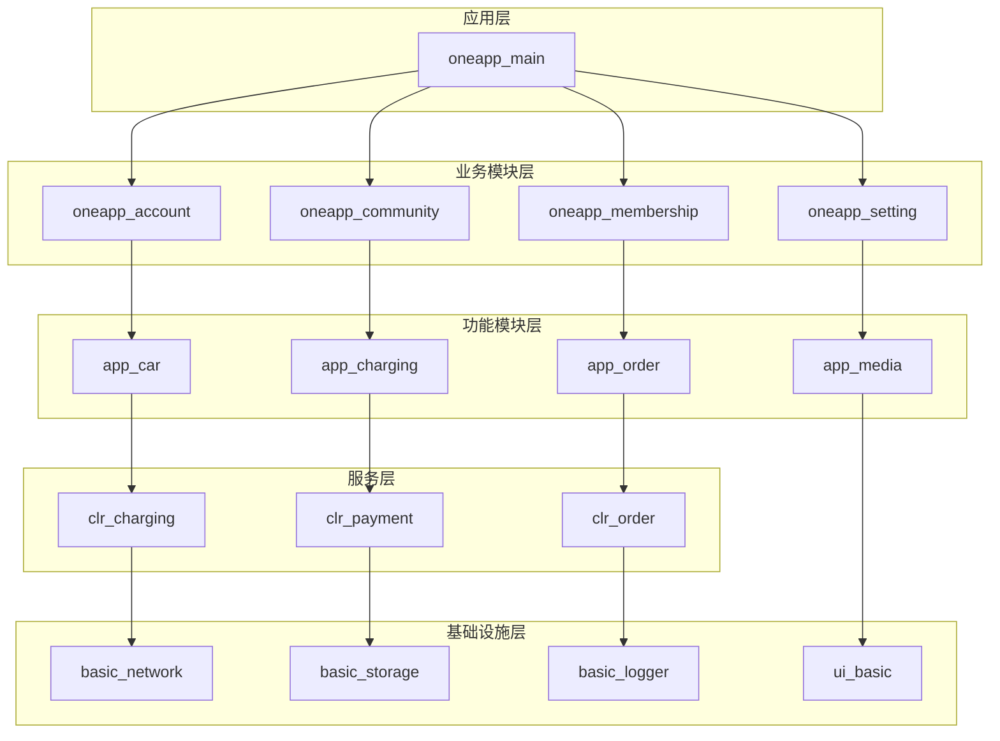
```mermaid
graph TB
    subgraph "应用层"
        A[oneapp_main]
    end
    
    subgraph "业务模块层"
        B[oneapp_account]
        C[oneapp_community]
        D[oneapp_membership]
        E[oneapp_setting]
    end
    
    subgraph "功能模块层"
        F[app_car]
        G[app_charging]
        H[app_order]
        I[app_media]
    end
    
    subgraph "服务层"
        J[clr_charging]
        K[clr_payment]
        L[clr_order]
    end
    
    subgraph "基础设施层"
        M[basic_network]
        N[basic_storage]
        O[basic_logger]
        P[ui_basic]
    end
    
    A --> B
    A --> C
    A --> D
    A --> E
    
    B --> F
    C --> G
    D --> H
    E --> I
    
    F --> J
    G --> K
    H --> L
    
    J --> M
    K --> N
    L --> O
    I --> P
```

#### 依赖管理策略

```yaml
# pubspec.yaml 中的依赖管理
dependencies:
  flutter:
    sdk: flutter
  
  # 基础框架依赖
  basic_network:
    path: ../oneapp_basic_utils/basic_network
  basic_storage:
    path: ../oneapp_basic_utils/basic_storage
  basic_modular:
    path: ../oneapp_basic_utils/basic_modular
  
  # 业务模块依赖
  app_car:
    path: ../oneapp_app_car/app_car
  app_charging:
    path: ../oneapp_app_car/app_charging
  
  # UI组件依赖
  ui_basic:
    path: ../oneapp_basic_uis/ui_basic
  ui_business:
    path: ../oneapp_basic_uis/ui_business

dependency_overrides:
  # 解决版本冲突的依赖覆盖
  meta: ^1.9.1
  collection: ^1.17.1
```

#### 模块间通信机制

OneApp采用多种方式实现模块间通信，主要包括事件总线通信和依赖注入通信两种机制。

##### 1. 事件总线通信 (OneAppEventBus)

基于发布-订阅模式的事件总线，支持匿名订阅和标识订阅两种方式：

```dart
/// OneApp事件总线实现
class OneAppEventBus extends Object {
  static final _eventBus = EventBus();
  static final OneAppEventBus _instance = OneAppEventBus._internal();
  
  // 控制器管理
  final Map<String, StreamController<dynamic>> _eventControllers = {};
  final Map<String, List<StreamSubscription<dynamic>>> _anonymousSubscriptions = {};
  final Map<String, Map<String, StreamSubscription<dynamic>>> _identifiedSubscriptions = {};

  OneAppEventBus._internal();

  /// 基础事件发布
  static void fireEvent(event) {
    _eventBus.fire(event);
  }

  /// 基础事件监听
  static StreamSubscription<T> addListen<T>(
    void Function(T event)? onData, {
    Function? onError,
    void Function()? onDone,
    bool? cancelOnError,
  }) {
    return _eventBus.on<T>().listen(onData,
        onError: onError, onDone: onDone, cancelOnError: cancelOnError);
  }

  /// 高级事件订阅 - 支持匿名和标识订阅
  /// [eventType] 事件类型
  /// [onEvent] 事件处理回调
  /// [id] 可选的订阅标识，用于管理订阅生命周期
  static void on(String eventType, Function(dynamic event) onEvent, {String? id}) {
    var controller = _instance._eventControllers.putIfAbsent(
      eventType,
      () => StreamController<dynamic>.broadcast(),
    );

    var subscription = controller.stream.listen(onEvent);
    
    if (id == null) {
      // 匿名订阅
      _instance._anonymousSubscriptions
          .putIfAbsent(eventType, () => [])
          .add(subscription);
    } else {
      // 标识订阅 - 自动取消同ID的旧订阅
      var subscriptions = _instance._identifiedSubscriptions.putIfAbsent(eventType, () => {});
      subscriptions[id]?.cancel();
      subscriptions[id] = subscription;
    }
  }

  /// 事件发布
  /// [eventType] 事件类型
  /// [event] 事件数据
  static void fire(String eventType, dynamic event) {
    _instance._eventControllers[eventType]?.add(event);
  }

  /// 取消订阅
  /// [eventType] 事件类型
  /// [id] 可选的订阅标识
  static void cancel(String eventType, {String? id}) {
    if (id == null) {
      // 取消所有匿名订阅
      _instance._anonymousSubscriptions[eventType]?.forEach((sub) => sub.cancel());
      _instance._anonymousSubscriptions.remove(eventType);
      
      // 取消所有标识订阅
      _instance._identifiedSubscriptions[eventType]?.values.forEach((sub) => sub.cancel());
      _instance._identifiedSubscriptions.remove(eventType);
    } else {
      // 取消特定标识订阅
      _instance._identifiedSubscriptions[eventType]?[id]?.cancel();
      _instance._identifiedSubscriptions[eventType]?.remove(id);
    }

    // 清理空控制器
    if ((_instance._anonymousSubscriptions[eventType]?.isEmpty ?? true) &&
        (_instance._identifiedSubscriptions[eventType]?.isEmpty ?? true)) {
      _instance._eventControllers[eventType]?.close();
      _instance._eventControllers.remove(eventType);
    }
  }

  /// 取消所有订阅
  static void cancelAll() {
    _instance._anonymousSubscriptions.forEach((eventType, subscriptions) {
      for (var subscription in subscriptions) {
        subscription.cancel();
      }
    });
    _instance._anonymousSubscriptions.clear();

    _instance._identifiedSubscriptions.forEach((eventType, subscriptions) {
      for (var subscription in subscriptions.values) {
        subscription.cancel();
      }
    });
    _instance._identifiedSubscriptions.clear();

    for (var controller in _instance._eventControllers.values) {
      controller.close();
    }
    _instance._eventControllers.clear();
  }
}
```

**事件总线使用示例**：

```dart
// 1. 定义事件类型
class VehicleStatusChangedEvent {
  final String vin;
  final VehicleStatus status;
  VehicleStatusChangedEvent(this.vin, this.status);
}

// 2. 发布事件
class CarService {
  void updateVehicleStatus(String vin, VehicleStatus status) {
    // 更新车辆状态后发布事件
    OneAppEventBus.fire('vehicle_status_changed', 
        VehicleStatusChangedEvent(vin, status));
  }
}

// 3. 订阅事件
class HomePageBloc {
  late StreamSubscription _statusSubscription;
  
  void init() {
    // 匿名订阅方式
    _statusSubscription = OneAppEventBus.addListen<VehicleStatusChangedEvent>(
      (event) {
        // 处理车辆状态变化
        emit(state.copyWith(vehicleStatus: event.status));
      },
    );
    
    // 标识订阅方式
    OneAppEventBus.on('vehicle_status_changed', (event) {
      if (event is VehicleStatusChangedEvent) {
        emit(state.copyWith(vehicleStatus: event.status));
      }
    }, id: 'home_page_bloc');
  }
  
  @override
  Future<void> close() {
    _statusSubscription.cancel();
    OneAppEventBus.cancel('vehicle_status_changed', id: 'home_page_bloc');
    return super.close();
  }
}
```

##### 2. 依赖注入通信 (Modular)

通过Modular的依赖注入系统实现模块间服务共享和Bloc对象通信：

```dart
/// 应用主模块 - 模块注册和依赖管理
class AppModule extends Module {
  @override
  List<Module> get imports => [
    AccountModule(),        // 账户模块
    CarControlModule(),     // 车控模块
    SettingModule(),        // 设置模块
    AppChargingModule(),    // 充电模块
    AppOrderModule(),       // 订单模块
    MembershipModule(),     // 会员模块
    CommunityModule(),      // 社区模块
    // ... 更多业务模块
  ];

  @override
  List<Bind<Object>> get binds => [
    $AppBloc,  // 应用级别的Bloc
  ];

  @override
  List<ModularRoute> get routes {
    // 路由配置，支持路由守卫
    final List<RouteGuard> carList = [const _StatisticsGuard(), LogInGuard._routeGuard];
    
    return [
      ModuleRoute('/account', module: AccountModule(), guards: [const _StatisticsGuard()]),
      ModuleRoute('/car', module: CarControlModule(), guards: carList),
      ModuleRoute('/charging', module: AppChargingModule(), guards: carList),
      // ... 更多路由配置
    ];
  }
}
```

**业务模块依赖注入实现**：

```dart
/// 账户模块 - 展示完整的依赖注入配置
class AccountModule extends Module with RouteObjProvider, AppLifeCycleListener {
  @override
  List<Module> get imports => [AccountConModule()]; // 导入底层账户连接模块

  @override
  List<Bind<Object>> get binds => [
    // 业务逻辑Bloc注册
    $PhoneSignInBloc,                    // 手机号登录控制器
    $VerificationCodeInputBloc,          // 验证码输入控制器
    $AgreementBloc,                      // 协议页控制器
    $GarageBloc,                         // 车库页控制器
    $VehicleInfoBloc,                    // 车辆信息页控制器
    
    // 对外暴露的单例服务
    Bind<PersonalCenterBloc>(
      (i) => PersonalCenterBloc(
        i<IAuthFacade>(),          // 注入认证服务接口
        i<IProfileFacade>(),       // 注入用户资料服务接口  
        i<IGarageFacade>(),        // 注入车库服务接口
      ),
      export: true,                // 导出给其他模块使用
      isSingleton: false,          // 非单例模式
    ),
    
    // 更多业务Bloc...
    $VehicleAuthBloc,
    $AuthNewUserBloc,
    $QrHuConfirmBloc,
    $PlateNoEditBloc,
    $UpdatePhoneBloc,
    $CancelAccountBloc,
  ];
}
```

**跨模块Bloc通信示例**：

```dart
/// 首页Bloc - 需要使用账户模块的服务
class HomePageBloc extends Bloc<HomeEvent, HomeState> {
  final PersonalCenterBloc _personalCenterBloc;
  late StreamSubscription _personalCenterSubscription;

  HomePageBloc() : super(HomeInitial()) {
    // 通过依赖注入获取其他模块的Bloc
    _personalCenterBloc = Modular.get<PersonalCenterBloc>();
    
    // 订阅其他模块Bloc的状态变化
    _personalCenterSubscription = _personalCenterBloc.stream.listen((state) {
      if (state is PersonalCenterLoaded) {
        // 响应个人中心状态变化，更新首页状态
        add(UpdateUserInfo(state.userProfile));
      }
    });
    
    on<UpdateUserInfo>(_onUpdateUserInfo);
  }

  Future<void> _onUpdateUserInfo(UpdateUserInfo event, Emitter<HomeState> emit) async {
    emit(state.copyWith(userProfile: event.userProfile));
  }

  @override
  Future<void> close() {
    _personalCenterSubscription.cancel();
    return super.close();
  }
}

/// 充电模块调用账户模块服务
class ChargingBloc extends Bloc<ChargingEvent, ChargingState> {
  ChargingBloc() : super(ChargingInitial()) {
    on<StartCharging>(_onStartCharging);
  }

  Future<void> _onStartCharging(StartCharging event, Emitter<ChargingState> emit) async {
    // 通过依赖注入获取账户认证服务
    final authFacade = Modular.get<IAuthFacade>();
    
    if (!authFacade.isLogin) {
      emit(ChargingError('请先登录'));
      return;
    }

    // 获取用户信息进行充电
    final profileFacade = Modular.get<IProfileFacade>();
    final userProfile = profileFacade.getUserProfileLocal();
    
    // 执行充电逻辑...
    emit(ChargingInProgress(event.stationId));
  }
}
```

**路由守卫实现模块间权限控制**：

```dart
/// 登录守卫 - 保护需要登录的路由
class LogInGuard extends RouteGuard {
  factory LogInGuard() => _routeGuard;
  LogInGuard._() : super();

  static final LogInGuard _routeGuard = LogInGuard._();

  @override
  FutureOr<bool> canActivate(String path, ParallelRoute<dynamic> route) {
    // 通过依赖注入获取认证服务
    final authFacade = Modular.get<IAuthFacade>();
    return authFacade.isLogin;
  }

  @override
  FutureOr<ParallelRoute<dynamic>?> pos(ModularRoute route, dynamic data) async {
    final authFacade = Modular.get<IAuthFacade>();
    
    if (authFacade.isLogin) {
      return route as ParallelRoute;
    } else {
      // 未登录时跳转到登录页
      await Modular.to.pushNamed('/account/sign_in');
      return null;
    }
  }
}
```

**通信机制对比**：

| 通信方式 | 适用场景 | 优点 | 缺点 |
|---------|----------|------|------|
| **OneAppEventBus** | 松耦合的事件通知、状态广播 | 解耦性强、支持一对多通信 | 类型安全性较弱、调试困难 |
| **依赖注入** | 服务共享、Bloc间直接通信 | 类型安全、IDE支持好 | 模块间耦合度较高 |

这两种机制在OneApp中协同工作，事件总线用于广播式通知，依赖注入用于服务共享和直接通信，共同构建了灵活而高效的模块间通信体系。

## OneApp架构

### 1. OneApp架构概览

OneApp 是基于 Flutter 的车主服务应用，采用分层模块化架构，支持多业务场景和跨平台部署。

> 详细信息参考：[OneApp架构介绍](./main_app.md)

#### 整体架构图

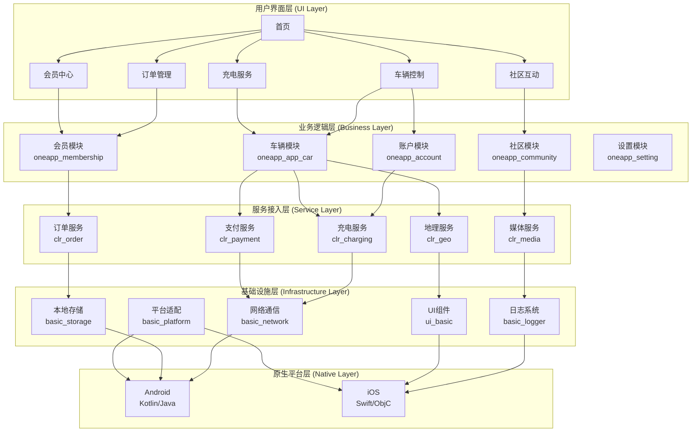
```mermaid
graph TB
    subgraph "用户界面层 (UI Layer)"
        A[首页] --> A1[车辆控制]
        A --> A2[充电服务]
        A --> A3[订单管理]
        A --> A4[社区互动]
        A --> A5[会员中心]
    end
    
    subgraph "业务逻辑层 (Business Layer)"
        B1[账户模块<br/>oneapp_account]
        B2[车辆模块<br/>oneapp_app_car]
        B3[社区模块<br/>oneapp_community]
        B4[会员模块<br/>oneapp_membership]
        B5[设置模块<br/>oneapp_setting]
    end
    
    subgraph "服务接入层 (Service Layer)"
        C1[充电服务<br/>clr_charging]
        C2[支付服务<br/>clr_payment]
        C3[订单服务<br/>clr_order]
        C4[媒体服务<br/>clr_media]
        C5[地理服务<br/>clr_geo]
    end
    
    subgraph "基础设施层 (Infrastructure Layer)"
        D1[网络通信<br/>basic_network]
        D2[本地存储<br/>basic_storage]
        D3[日志系统<br/>basic_logger]
        D4[UI组件<br/>ui_basic]
        D5[平台适配<br/>basic_platform]
    end
    
    subgraph "原生平台层 (Native Layer)"
        E1[Android<br/>Kotlin/Java]
        E2[iOS<br/>Swift/ObjC]
    end
    
    A1 --> B1
    A1 --> B2
    A2 --> B2
    A3 --> B4
    A4 --> B3
    A5 --> B4
    
    B1 --> C1
    B2 --> C1
    B2 --> C2
    B4 --> C3
    B3 --> C4
    B2 --> C5
    
    C1 --> D1
    C2 --> D1
    C3 --> D2
    C4 --> D3
    C5 --> D4
    
    D1 --> E1
    D2 --> E1
    D3 --> E2
    D4 --> E2
    D5 --> E1
    D5 --> E2
```

### 2. 详细架构分析

#### 2.1 分层架构设计

基于OneApp项目的代码结构，展示各层的具体实现和职责划分：

##### 用户界面层 (UI Layer)

**主页面实现** - 基于 `HomePage` 的代码：

```dart
/// OneApp 主页面 - 底部Tab导航架构
class HomePage extends StatefulWidget with RouteObjProvider {
  /// 构造器
  /// [initialBottomTabKey] 底部tab key, value = [HomeBottomTabKey]
  /// [initialTopTabKey] 顶部tab key, value = [DiscoveryTabKey]
  /// [argsData] 传入的参数数据
  HomePage({
    String? initialBottomTabKey,
    String? initialTopTabKey,
    Map<String, dynamic>? argsData,
    Key? key,
  })  : initialBottomTabIndex = HomeBottomTabKeyEx.createFrom(initialBottomTabKey).index,
        initialTopTabKey = initialTopTabKey ?? '',
        argsMap = argsData,
        super(key: key);

  final int initialBottomTabIndex;
  final String initialTopTabKey;
  final Map<String, dynamic>? argsMap;

  @override
  State<StatefulWidget> createState() => _HomePageState();
}

class _HomePageState extends State<HomePage> with RouteAware {
  final Map<HomeBottomTabKey, Widget> _pages = {};
  HomeBloc? _bloc;
  late StreamSubscription? _createEvent;
  late StreamSubscription? _mainPageIndexChangeEvent;
  
  @override
  void initState() {
    super.initState();
    Logger.i('HomePage initState...bottom index = ${widget.initialBottomTabIndex}');
    
    // 初始化HomeBloc，注入依赖服务
    _bloc = HomeBloc(
      widget.initialBottomTabIndex,
      Modular.get<IGarageFacade>(),    // 车库服务
      Modular.get<IAuthFacade>(),      // 认证服务
    )..add(const HomeEvent.checkIfHasDefaultCar());

    // 订阅社区模块事件
    _createEvent = OneAppEventBus.addListen<UserCreationEditEvent>((event) {
      if (event.editType == UserCreationType.add) {
        _bloc?.add(const HomeEvent.viewPagerChanged(index: 1));
      }
      if (event.editType == UserCreationType.buyCar) {
        _bloc?.add(const HomeEvent.viewPagerChanged(index: 2));
      }
      // 更多事件处理...
    });

    // 订阅主页索引变化事件
    _mainPageIndexChangeEvent = OneAppEventBus.addListen<MainPageIndexChangeEvent>((event) {
      _bloc?.add(HomeEvent.viewPagerChanged(index: event.oneIndex));
    });
  }

  @override
  Widget build(BuildContext context) => BlocProvider.value(
    value: _bloc!,
    child: LocaleConsumer(
      builder: (BuildContext context) => BlocConsumer<HomeBloc, HomeState>(
        listener: (context, state) {
          // 状态变化监听，控制页面跳转
          final bloc = BlocProvider.of<HomeBloc>(context);
          final index = state.bottomTabIndex;
          bloc.pageController.jumpToPage(index);
        },
        builder: (context, state) {
          return Scaffold(
            body: PageView.builder(
              controller: state.pageController,
              itemCount: 5, // 底部Tab数量
              itemBuilder: (context, index) => _getPageWidget(context, index),
            ),
            bottomNavigationBar: _buildBottomNavigationBar(state),
          );
        },
      ),
    ),
  );

  /// 获取对应Tab的页面Widget
  Widget _getPageWidget(BuildContext context, int index) {
    final map = {'initialTabKey': widget.initialTopTabKey};
    final bottomTabValue = HomeBottomTabKey.values[index];
    
    // 根据Tab类型返回对应页面
    var childWidget = bottomTabValue.getWidget(map, widget.argsMap, context);
    return KeepAliveWrapper(child: childWidget);
  }
}

/// 底部Tab枚举及页面映射
enum HomeBottomTabKey {
  discovery,        // 发现页 0
  community,        // 社区页 1
  car,             // 车辆控制页 2
  shop,            // 商城页 3
  personalCenter,   // 个人中心 4
}

extension HomeBottomTabKeyEx on HomeBottomTabKey {
  /// 根据Tab返回对应的页面Widget
  Widget getWidget(Map<String, dynamic> params, Map<String, dynamic>? argsMap, BuildContext context) {
    switch (this) {
      case HomeBottomTabKey.discovery:
        return ComponentDiscoveryRecommendPage();  // 发现页推荐内容
        
      case HomeBottomTabKey.car:
        // 车辆控制页 - 支持通知栏参数传入
        String? noticeVin = argsMap?['vin'] as String?;
        String? target = argsMap?['target'] as String?;
        bool needExecuteCarLock = (argsMap?['needExecuteCarLock'] as String?) == 'true';
        
        Logger.i('noticeVin: $noticeVin, target: $target, needExecuteCarLock: $needExecuteCarLock');
        return CarPageWrapper(target, noticeVin, needExecuteCarLock: needExecuteCarLock);
        
      case HomeBottomTabKey.community:
        return CommunityTabPage();  // 社区功能页面
        
      case HomeBottomTabKey.shop:
        return BaseWebViewPage(url: AppUtils.getMallIndexUrl(), isShowAppBar: false);
        
      case HomeBottomTabKey.personalCenter:
        return const PersonalCenterPage();  // 个人中心页面
    }
  }
}
```

##### 业务逻辑层 (Business Layer)

**主应用模块** - 基于 `AppModule` 的代码：

```dart
/// OneApp 应用最顶层模块 - 统一管理所有业务模块
class AppModule extends Module {
  @override
  List<Module> get imports => [
    // === 账户体系模块 ===
    AccountModule(),              // 用户账户管理
    AccountConModule(),           // 账户连接层服务
    
    // === 车辆相关模块 ===
    CarControlModule(),           // 车辆控制核心模块
    AppChargingModule(),          // 充电服务模块
    ClrChargingModule(),          // 充电连接层
    AppAvatarModule(),            // 3D虚拟形象
    AppCarwatcherModule(),        // 车辆监控
    ClrCarWatcherModule(),        // 车辆监控连接层
    
    // === 生活服务模块 ===
    AppOrderModule(),             // 订单管理
    ClrOrderModule(),             // 订单连接层
    AppTouchgoModule(),           // Touch&Go服务
    ClrTouchgoModule(),           // Touch&Go连接层
    AppWallboxModule(),           // 家充桩管理
    ClrWallboxModule(),           // 家充桩连接层
    
    // === 内容社区模块 ===
    CommunityModule(),            // 社区功能
    MembershipModule(),           // 会员体系
    AfterSalesModule(),           // 售后服务
    CarSalesModule(),             // 汽车销售
    
    // === 基础设施模块 ===
    SettingModule(),              // 应用设置
    SettingConModule(),           // 设置连接层
    GeoModule(),                  // 地理位置服务
    AppMessageModule(),           // 消息服务
    ClrMessageModule(),           // 消息连接层
    
    // === 扩展功能模块 ===
    AppTtsModule(),               // 语音播报
    AppNavigationModule(),        // 导航服务
    AppVurModule(),               // VUR功能
    AppRpaModule(),               // RPA自动化
    CompanionModule(),            // 伴侣应用
    TouchPointModule(),           // 触点管理
    OneAppPopupModule(),          // 弹窗管理
    
    // === 开发测试模块 ===
    TestModule(),                 // 测试模块
    BasicUIModule(),              // 基础UI组件
  ];

  @override
  List<Bind<Object>> get binds => [
    $AppBloc,  // 应用级别状态管理
  ];

  @override
  List<ModularRoute> get routes {
    // 路由元数据获取 - 通过RouteCenterAPI统一管理
    final home = RouteCenterAPI.routeMetaBy(HomeRouteExport.keyModule);
    final account = RouteCenterAPI.routeMetaBy(AccountRouteExport.keyModule);
    final car = RouteCenterAPI.routeMetaBy(CarControlRouteExport.keyModule);
    final charging = RouteCenterAPI.routeMetaBy(AppChargingRouteExport.keyModule);
    final community = RouteCenterAPI.routeMetaBy(CommuntiyRouteExport.keyModule);
    // ... 更多路由元数据

    // 路由守卫配置
    const basicGuards = [_StatisticsGuard()];                    // 基础统计守卫
    final loginRequiredGuards = [const _StatisticsGuard(), LogInGuard._routeGuard];  // 需要登录的路由守卫

    return [
      // 首页路由 - 无需登录
      ModuleRoute(home.path, module: HomeModule(), guards: basicGuards),
      
      // 账户相关路由 - 无需登录
      ModuleRoute(account.path, module: AccountModule(), guards: basicGuards),
      
      // 车辆控制路由 - 需要登录
      ModuleRoute(car.path, module: CarControlModule(), guards: loginRequiredGuards),
      
      // 充电服务路由 - 需要登录  
      ModuleRoute(charging.path, module: AppChargingModule(), guards: loginRequiredGuards),
      
      // 社区功能路由 - 无需登录
      ModuleRoute(community.path, module: CommunityModule(), guards: basicGuards),
      
      // ... 更多模块路由配置
    ];
  }
}
```

**子模块实现** - 基于 `AccountModule` 的业务模块：

```dart
/// 账户模块 - 展示完整的业务模块实现
class AccountModule extends Module with RouteObjProvider, AppLifeCycleListener {
  @override
  List<Module> get imports => [
    AccountConModule(),  // 导入底层连接服务模块
  ];

  @override
  void onNotify(String status) {
    switch (status) {
      case 'init':
        Logger.d('AccountModule 初始化完成');
        _onAppInitial();  // 执行模块初始化逻辑
        break;
      default:
        Logger.d('AccountModule 收到通知: $status');
    }
  }

  @override
  List<Bind<Object>> get binds => [
    // === 业务逻辑控制器 ===
    $PhoneSignInBloc,                     // 手机号登录控制器
    $VerificationCodeInputBloc,           // 验证码输入控制器
    $AgreementBloc,                       // 协议页控制器
    $GarageBloc,                          // 车库页控制器
    $VehicleInfoBloc,                     // 车辆信息控制器
    $VehicleAuthBloc,                     // 车辆授权控制器
    
    // === 对外暴露的核心服务 ===
    Bind<PersonalCenterBloc>(
      (i) => PersonalCenterBloc(
        i<IAuthFacade>(),        // 注入认证服务接口
        i<IProfileFacade>(),     // 注入用户资料服务接口
        i<IGarageFacade>(),      // 注入车库服务接口
      ),
      export: true,              // 导出给其他模块使用
      isSingleton: false,        // 非单例模式，每次获取创建新实例
    ),
    
    // === 更多业务控制器 ===
    $AuthNewUserBloc,                     // 新用户授权控制器
    $QrHuConfirmBloc,                     // 二维码确认控制器
    $PlateNoEditBloc,                     // 车牌号编辑控制器
    $UpdatePhoneBloc,                     // 更新手机号控制器
    $CancelAccountBloc,                   // 注销账号控制器
  ];

  @override
  List<ModularRoute> get routes {
    // 通过RouteCenterAPI获取路由元数据
    final login = RouteCenterAPI.routeMetaBy(AccountRouteExport.keySignIn);
    final verify = RouteCenterAPI.routeMetaBy(AccountRouteExport.keyVerifyCode);
    final personal = RouteCenterAPI.routeMetaBy(AccountRouteExport.keyPersonalCenter);
    final garage = RouteCenterAPI.routeMetaBy(AccountRouteExport.keyGarage);
    final vehicleInfo = RouteCenterAPI.routeMetaBy(AccountRouteExport.keyVehicleInfo);
    // ... 更多路由元数据

    return [
      // 登录页面
      ChildRoute<dynamic>(
        login.path,
        child: (_, args) => login.provider(args).as(),
        transition: TransitionType.fadeIn,
      ),
      
      // 验证码页面
      ChildRoute<dynamic>(
        verify.path,
        child: (_, args) => verify.provider(args).as(),
      ),
      
      // 个人中心页面
      ChildRoute<dynamic>(
        personal.path,
        child: (_, args) => personal.provider(args).as(),
      ),
      
      // 车库页面 - 需要登录守卫保护
      ChildRoute<dynamic>(
        garage.path,
        child: (_, args) => garage.provider(args).as(),
        guards: [AccountLoginGuard()],
      ),
      
      // 车辆信息页面
      ChildRoute<dynamic>(
        vehicleInfo.path,
        child: (_, args) => vehicleInfo.provider(args).as(),
        transition: TransitionType.noTransition,
      ),
      
      // ... 更多子路由配置
    ];
  }

  /// 模块初始化逻辑
  void _onAppInitial() {
    // 初始化二维码处理器
    QrCodeProcessor()
      ..addHandler(qrTypeLoginHU, (code, additionalInfo) async {
        // 处理车机登录二维码逻辑
        Logger.i('处理车机登录二维码: $code');
        // 具体处理逻辑...
      })
      ..addHandler(qrTypeBindVehicle, (code, additionalInfo) async {
        // 处理绑车二维码逻辑
        Logger.i('处理绑车二维码: $code');
        // 具体处理逻辑...
      });

    // 刷新车库信息
    final facade = Modular.get<IProfileFacade>();
    if (facade.getUserProfileLocal().toOption().toNullable() != null) {
      final garageFacade = Modular.get<IGarageFacade>();
      garageFacade.refreshGarage();
    }
  }
}
```

**轻量级模块实现** - 基于 `HomeModule` 的简单模块：

```dart
/// 首页模块 - 展示轻量级模块实现
class HomeModule extends Module with RouteObjProvider {
  @override
  List<Bind> get binds => [];  // 首页模块不需要额外的依赖绑定

  @override
  List<ModularRoute> get routes {
    // 获取首页路由元数据
    final homeRoute = RouteCenterAPI.routeMetaBy(HomeRouteExport.keyHome);

    return [
      ChildRoute<dynamic>(
        homeRoute.path,
        child: (_, args) => homeRoute.provider(args).as(),
        transition: TransitionType.noTransition,  // 首页无过渡动画
      ),
    ];
  }
}
```

##### 服务接入层 (Service Layer)

OneApp的服务层通过抽象接口和具体实现分离，支持灵活的服务替换和测试。

**路由系统架构** - 基于 `RouteCenterAPI` 的统一路由管理：

```dart
/// 车辆控制模块路由定义 - 基于 route_dp.dart 的代码
/// 通过RouteKey接口统一管理路由路径

/// 远程空调主页路由
class CarClimatisationHomepageKey implements RouteKey {
  const CarClimatisationHomepageKey();

  @override
  String get routeKey => CarControlRouteExport.keyCarClimatisationHomepage;

  /// 获取实际路由路径
  String get routePath {
    final List<RouteMeta> list = CarControlRouteExport().exportRoutes();
    return list[10].routePath;  // 从路由导出列表中获取实际路径
  }
}

/// 充电场景管理路由
class CarChargingProfilesKey implements RouteKey {
  const CarChargingProfilesKey();

  @override
  String get routeKey => CarControlRouteExport.keyCarChargingProfiles;

  String get routePath {
    final List<RouteMeta> list = CarControlRouteExport().exportRoutes();
    return list[14].routePath;
  }
}

/// 车辆监控主页路由
class CarWatcherHomePageRouteKey implements RouteKey {
  @override
  String get routeKey => 'app_carWatcher.carWatcher_home';
}

/// 充电地图首页路由
class ChargingMapHomeRouteKey implements RouteKey {
  @override
  String get routeKey => 'app_charging.charging_map_home';
}
```

**路由守卫系统** - 基于 `AppModule` 中的 `LogInGuard` 实现：

```dart
/// 登录守卫 - 保护需要登录才能访问的路由
class LogInGuard extends RouteGuard {
  factory LogInGuard() => _routeGuard;
  
  LogInGuard._() : super();

  static const String _tag = '[route LogInGuard]:';
  static final LogInGuard _routeGuard = LogInGuard._();
  
  /// 前置路由信息
  ParallelRoute<dynamic>? preRoute;

  @override
  FutureOr<bool> canActivate(String path, ParallelRoute<dynamic> route) {
    // 通过依赖注入获取认证服务
    final authFacade = Modular.get<IAuthFacade>();
    final isLogin = authFacade.isLogin;
    
    Logger.d('路由守卫检查登录状态: $path, isLogin: $isLogin', _tag);
    return isLogin;
  }

  @override
  FutureOr<ModularRoute?> pre(ModularRoute route) {
    // 保存导航历史
    if (NavigatorProxy().navigateHistory.isNotEmpty) {
      preRoute = NavigatorProxy().navigateHistory.last;
    }
    return super.pre(route);
  }

  @override
  FutureOr<ParallelRoute<dynamic>?> pos(ModularRoute route, dynamic data) async {
    final authFacade = Modular.get<IAuthFacade>();
    
    if (authFacade.isLogin) {
      return route as ParallelRoute;
    } else {
      Logger.d('用户未登录，跳转到登录页', _tag);
      
      // 跳转到登录页面，并传递回调参数
      await Modular.to.pushNamed(
        '/account/sign_in',
        arguments: {
          'callback': () {
            // 登录成功后的回调处理
            Logger.d('登录成功，返回原页面', _tag);
            if (preRoute != null) {
              Modular.to.navigate(preRoute!.name);
            }
          }
        },
      );
      return null;
    }
  }
}

/// 统计守卫 - 记录页面访问统计
class _StatisticsGuard implements RouteGuard {
  const _StatisticsGuard();

  static const String _tag = tagRoute;

  @override
  FutureOr<bool> canActivate(String path, ParallelRoute<dynamic> route) => true;

  @override
  FutureOr<ModularRoute?> pre(ModularRoute route) => route;

  @override
  FutureOr<ParallelRoute<dynamic>?> pos(ModularRoute route, ModularArguments data) async {
    // 记录页面访问日志
    Logger.d('页面导航统计: ${route.name}', _tag);
    Logger.d('导航参数: ${data.uri}', _tag);
    
    // 可以在这里添加埋点统计逻辑
    // AnalyticsService.trackPageView(route.name, data.data);
    
    return route as ParallelRoute?;
  }

  @override
  String? get redirectTo => null;
}
```

##### 基础设施层 (Infrastructure Layer)

**事件总线基础设施** - 基于 `OneAppEventBus` 的实现：

```dart
/// OneApp统一事件总线 - 支持模块间松耦合通信
class OneAppEventBus extends Object {
  static final _eventBus = EventBus();  // 基础事件总线
  static final OneAppEventBus _instance = OneAppEventBus._internal();

  // 高级事件管理
  final Map<String, StreamController<dynamic>> _eventControllers = {};
  final Map<String, List<StreamSubscription<dynamic>>> _anonymousSubscriptions = {};
  final Map<String, Map<String, StreamSubscription<dynamic>>> _identifiedSubscriptions = {};

  OneAppEventBus._internal();

  /// 基础事件发布 - 适用于简单事件
  static void fireEvent(event) {
    _eventBus.fire(event);
  }

  /// 基础事件监听 - 类型安全的事件订阅
  static StreamSubscription<T> addListen<T>(
    void Function(T event)? onData, {
    Function? onError,
    void Function()? onDone,
    bool? cancelOnError,
  }) {
    return _eventBus.on<T>().listen(
      onData,
      onError: onError,
      onDone: onDone,
      cancelOnError: cancelOnError,
    );
  }

  /// 高级事件订阅 - 支持生命周期管理
  static void on(String eventType, Function(dynamic event) onEvent, {String? id}) {
    var controller = _instance._eventControllers.putIfAbsent(
      eventType,
      () => StreamController<dynamic>.broadcast(),
    );

    var subscription = controller.stream.listen(onEvent);
    
    if (id == null) {
      // 匿名订阅 - 需要手动管理生命周期
      _instance._anonymousSubscriptions
          .putIfAbsent(eventType, () => [])
          .add(subscription);
    } else {
      // 标识订阅 - 自动管理重复订阅
      var subscriptions = _instance._identifiedSubscriptions.putIfAbsent(eventType, () => {});
      subscriptions[id]?.cancel();  // 取消旧订阅
      subscriptions[id] = subscription;
    }
  }

  /// 事件发布
  static void fire(String eventType, dynamic event) {
    _instance._eventControllers[eventType]?.add(event);
  }

  /// 订阅管理 - 支持精确取消和批量取消
  static void cancel(String eventType, {String? id}) {
    if (id == null) {
      // 取消该事件类型的所有订阅
      _instance._anonymousSubscriptions[eventType]?.forEach((sub) => sub.cancel());
      _instance._anonymousSubscriptions.remove(eventType);
      
      _instance._identifiedSubscriptions[eventType]?.values.forEach((sub) => sub.cancel());
      _instance._identifiedSubscriptions.remove(eventType);
    } else {
      // 取消特定标识的订阅
      _instance._identifiedSubscriptions[eventType]?[id]?.cancel();
      _instance._identifiedSubscriptions[eventType]?.remove(id);
    }

    // 清理空控制器
    if ((_instance._anonymousSubscriptions[eventType]?.isEmpty ?? true) &&
        (_instance._identifiedSubscriptions[eventType]?.isEmpty ?? true)) {
      _instance._eventControllers[eventType]?.close();
      _instance._eventControllers.remove(eventType);
    }
  }
}
```

**依赖注入基础设施** - 基于 `Modular` 的服务管理：

```dart
/// 依赖注入使用模式 - 展示OneApp中的实际使用方式

/// 1. 在HomePage中获取注入的服务
class _HomePageState extends State<HomePage> {
  @override
  void initState() {
    super.initState();
    
    // 通过Modular获取注入的服务实例
    _bloc = HomeBloc(
      widget.initialBottomTabIndex,
      Modular.get<IGarageFacade>(),      // 车库服务 - 来自clr_account模块
      Modular.get<IAuthFacade>(),        // 认证服务 - 来自clr_account模块
    );
  }
}

/// 2. 在业务逻辑中使用服务接口
class PersonalCenterBloc extends Bloc<PersonalCenterEvent, PersonalCenterState> {
  final IAuthFacade _authFacade;
  final IProfileFacade _profileFacade;
  final IGarageFacade _garageFacade;

  PersonalCenterBloc(
    this._authFacade,        // 构造函数注入
    this._profileFacade,
    this._garageFacade,
  ) : super(PersonalCenterInitial());

  /// 获取用户信息
  Future<void> loadUserProfile() async {
    if (!_authFacade.isLogin) {
      emit(PersonalCenterError('用户未登录'));
      return;
    }

    try {
      final profile = await _profileFacade.getUserProfile();
      final vehicles = await _garageFacade.getVehicleList();
      
      emit(PersonalCenterLoaded(
        userProfile: profile,
        vehicles: vehicles,
      ));
    } catch (e) {
      emit(PersonalCenterError(e.toString()));
    }
  }
}

/// 3. 跨模块服务调用
class HomeBloc extends Bloc<HomeEvent, HomeState> {
  final IGarageFacade _garageFacade;
  final IAuthFacade _authFacade;
  
  HomeBloc(int initialIndex, this._garageFacade, this._authFacade) 
      : super(HomeState.initial(initialIndex)) {
    
    on<CheckIfHasDefaultCar>((event, emit) async {
      // 检查是否有默认车辆
      final defaultVehicle = _garageFacade.getDefaultVehicleLocal();
      final hasVehicle = defaultVehicle != null && defaultVehicle.vin.isNotEmpty;
      
      if (hasVehicle) {
        emit(state.copyWith(hasDefaultVehicle: true));
      } else {
        emit(state.copyWith(hasDefaultVehicle: false));
      }
    });
  }
}
```

#### 2.2 模块依赖关系图

基于OneApp的模块结构，模块间的依赖关系如下：


```mermaid
graph TB
    subgraph "应用入口层"
        MAIN[oneapp_main<br/>AppModule]
    end
    
    subgraph "页面模块层"
        HOME[app_home<br/>HomeModule]
        DISC[app_discover<br/>DiscoveryModule]  
        TEST[app_test<br/>TestModule]
    end
    
    subgraph "业务功能模块层"
        ACC[oneapp_account<br/>AccountModule]
        COM[oneapp_community<br/>CommunityModule]
        MEM[oneapp_membership<br/>MembershipModule]
        SET[oneapp_setting<br/>SettingModule]
        CS[oneapp_car_sales<br/>CarSalesModule]
        AS[oneapp-after-sales<br/>AfterSalesModule]
        TP[oneapp-touch-point<br/>TouchPointModule]
        POPUP[OneAppPopupModule]
    end
    
    subgraph "车辆功能模块群"
        CAR[app_car<br/>CarControlModule]
        CHARGE[app_charging<br/>AppChargingModule]
        AVATAR[app_avatar<br/>AppAvatarModule]
        MAINT[app_maintenance<br/>MaintenanceControlModule]
        WATCH[app_carwatcher<br/>AppCarwatcherModule]
        TG[app_touchgo<br/>AppTouchgoModule]
        WB[app_wallbox<br/>AppWallboxModule]
        VUR[app_vur<br/>AppVurModule]
        RPA[app_rpa<br/>AppRpaModule]
        NAV[app_navigation<br/>AppNavigationModule]
    end
    
    subgraph "连接层服务模块群 (CLR)"
        ACC_C[clr_account<br/>AccountConModule]
        CHARGE_C[clr_charging<br/>ClrChargingModule]
        ORDER_C[clr_order<br/>ClrOrderModule]
        SET_C[clr_setting<br/>SettingConModule]
        GEO_C[clr_geo<br/>GeoModule]
        MSG_C[clr_message<br/>ClrMessageModule]
        TG_C[clr_touchgo<br/>ClrTouchgoModule]
        WB_C[clr_wallbox<br/>ClrWallboxModule]
        WATCH_C[clr_carwatcher<br/>ClrCarWatcherModule]
    end
    
    subgraph "UI基础设施层"
        UI_BASIC[ui_basic<br/>BasicUIModule]
        UI_PAY[ui_payment<br/>PayModule]
    end
    
    MAIN --> HOME
    MAIN --> DISC
    MAIN --> TEST
    MAIN --> ACC
    MAIN --> COM
    MAIN --> MEM
    MAIN --> CAR
    MAIN --> CHARGE
    MAIN --> AVATAR
    
    ACC --> ACC_C
    CAR --> ACC_C
    CHARGE --> CHARGE_C
    CHARGE --> ACC_C
    SET --> SET_C
    CAR --> GEO_C
    WATCH --> WATCH_C
    TG --> TG_C
    WB --> WB_C
    
    HOME --> ACC_C
    HOME --> GEO_C
    
    UI_PAY --> UI_BASIC
    COM --> UI_BASIC
    MEM --> UI_BASIC
```

#### 2.3 技术栈选择

**前端技术栈**

| 技术领域   | 选择方案                 | 版本          | 作用         |
| ---------- | ------------------------ | ------------- | ------------ |
| 开发框架   | Flutter                  | 3.0+          | 跨平台UI框架 |
| 编程语言   | Dart                     | 3.0+          | 应用开发语言 |
| 状态管理   | Provider + Bloc          | 6.0.5 + 8.1.2 | 状态管理方案 |
| 路由管理   | Flutter Modular          | 5.0.3         | 模块化路由   |
| 网络请求   | Dio                      | 5.3.2         | HTTP客户端   |
| 本地存储   | Hive + SharedPreferences | 2.2.3         | 数据持久化   |
| 响应式编程 | RxDart                   | 0.27.7        | 流式数据处理 |

**原生集成技术栈**

| 平台    | 主要技术    | 关键插件                                                            |
| ------- | ----------- | ------------------------------------------------------------------- |
| Android | Kotlin/Java | amap_flutter_location<br/>flutter_ingeek_carkey<br/>cariad_touch_go |
| iOS     | Swift/ObjC  | 高德地图SDK<br/>车钥匙SDK<br/>3D虚拟形象SDK                         |

**第三方服务集成**

| 服务类型 | 服务商      | SDK/插件                      |
| -------- | ----------- | ----------------------------- |
| 地图导航 | 高德地图    | amap_flutter_*                |
| 支付服务 | 微信/支付宝 | fluwx/kit_alipay              |
| 推送服务 | 极光推送    | flutter_plugin_mtpush_private |
| 媒体播放 | 腾讯云      | superplayer_widget            |
| 性能监控 | 腾讯Aegis   | aegis_flutter_sdk             |

### 3. 核心功能实现分析

#### 3.1 应用启动流程

基于OneApp的启动代码，应用启动分为两个阶段的初始化：不依赖隐私合规的基础初始化和依赖隐私合规的完整初始化。

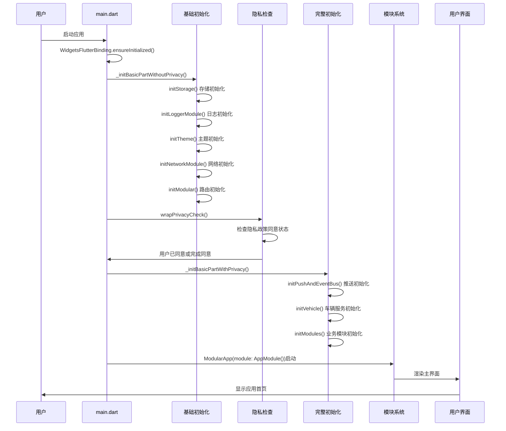
```mermaid
sequenceDiagram
    participant User as 用户
    participant Main as main.dart
    participant BasicInit as 基础初始化
    participant Privacy as 隐私检查
    participant FullInit as 完整初始化
    participant Module as 模块系统
    participant UI as 用户界面
    
    User->>Main: 启动应用
    Main->>Main: WidgetsFlutterBinding.ensureInitialized()
    Main->>BasicInit: _initBasicPartWithoutPrivacy()
    BasicInit->>BasicInit: initStorage() 存储初始化
    BasicInit->>BasicInit: initLoggerModule() 日志初始化
    BasicInit->>BasicInit: initTheme() 主题初始化
    BasicInit->>BasicInit: initNetworkModule() 网络初始化
    BasicInit->>BasicInit: initModular() 路由初始化
    Main->>Privacy: wrapPrivacyCheck()
    Privacy->>Privacy: 检查隐私政策同意状态
    Privacy->>Main: 用户已同意或完成同意
    Main->>FullInit: _initBasicPartWithPrivacy()
    FullInit->>FullInit: initPushAndEventBus() 推送初始化
    FullInit->>FullInit: initVehicle() 车辆服务初始化
    FullInit->>FullInit: initModules() 业务模块初始化
    Main->>Module: ModularApp(module: AppModule())启动
    Module->>UI: 渲染主界面
    UI->>User: 显示应用首页
```

**启动流程代码** - 基于 OneApp `main.dart`：

```dart
/// OneApp 应用入口 - main.dart实现
void main() {
  // 捕获flutter异常处理，实际项目中启动主函数
  _realMain();
}

/// 应用启动流程
Future<void> _realMain() async {
  // 1. Flutter框架绑定初始化
  WidgetsFlutterBinding.ensureInitialized();
  
  // 2. 不依赖隐私合规的基础部分初始化
  await _initBasicPartWithoutPrivacy();
  
  // 3. 隐私合规检查包装器，只有用户同意后才进行完整初始化
  await wrapPrivacyCheck(_initBasicPartWithPrivacy);
  
  // 4. 锁定屏幕方向为竖屏
  SystemChrome.setPreferredOrientations([DeviceOrientation.portraitUp]);
  
  // 5. 启动模块化应用，注入AppModule作为根模块
  runApp(ModularApp(module: AppModule(), child: const AppWidget()));
}

/// 第一阶段：不依赖隐私合规的基础初始化
Future<void> _initBasicPartWithoutPrivacy() async {
  // 全局模块状态管理初始化
  moduleStatusMgmt = newModuleStatusMgmt();
  
  // 本地存储服务初始化
  await initStorage();
  
  // 开发配置工具初始化（IP代理、后端环境配置）
  await DeveloperConfigBoxUtil.init();
  
  // 日志系统初始化
  await initLoggerModule(debuggable: debuggable);
  Logger.i('开发配置初始化完成: environment = $environment, debuggable: $debuggable');
  
  // 主题系统初始化
  await initTheme();
  
  // 字体配置初始化
  initFont();
  
  // 网络模块初始化
  await initNetworkModule(debuggable: !AppStoreVersion);
  
  // 资源下载模块初始化
  await initBasicResource();
  
  // 国际化模块初始化
  await initIntl();
  
  // 全局错误处理器初始化
  initErrorHandlers();
  
  // 模块化路由和依赖注入容器初始化
  initModular(debug: debuggable);
  
  // WebView初始化
  initWebView();
  
  // Deep Link处理器初始化
  await initUniLink();
  
  // 系统UI配置（异步执行）
  unawaited(_initSystemUI());
  
  // === 路由配置逻辑 ===
  final signed = localPrivacySigned();  // 检查本地隐私协议签署状态
  final showAd = await SplashAdDataManager().shouldShowSplashAd();  // 检查开屏广告
  
  if (signed) {
    if (showAd) {
      // 已签署协议且有广告：显示启动广告页
      Modular.setInitialRoute(RouteCenterAPI.getRoutePathBy(LaunchAdPageKey()));
    } else {
      // 已签署协议且无广告：直接进入首页
      Modular.setInitialRoute(RouteCenterAPI.getRoutePathBy(const HomeRouteKey()));
    }
  } else {
    // 未签署协议：显示隐私政策页
    Modular.setInitialRoute('/app/app_privacy');
  }
  
  // Debug工具初始化（仅Debug/Profile模式）
  initDebugTools();
  
  // 添加路由监控
  NavigatorProxy().addObserver(AppRouteObserver().routeObserver);
  
  // 输出版本信息
  final packageInfo = await PackageInfo.fromPlatform();
  Logger.i('''
    ################################
    VersionName: ${packageInfo.version}
    VersionCode: ${packageInfo.buildNumber}
    ConnectivityVersion: $versionConnectivity
    Integration: $integrationNum
    ################################
  ''');
}

/// 第二阶段：依赖隐私合规的完整初始化
Future<void> _initBasicPartWithPrivacy() async {
  // Token管理器必须就绪
  await tokenMgmt.hasInitialized();
  
  // 设置隐私检查完成标记
  await bs.globalBox.put('key_user_privacy_check', true);
  
  // 网络连接检查和推送初始化
  final connectivityResult = await Connectivity().checkConnectivity();
  if (connectivityResult != ConnectivityResult.none) {
    await initPushAndEventBus(debuggable: debuggable);
  }
  
  // 平台相关服务初始化
  await initPlatform(debug: debuggable);
  
  // 分享功能初始化
  await initBasicShare();
  
  // 车辆服务初始化
  initVehicle();
  
  // TTS和购物服务初始化
  initTtsShop();
  
  // 3D虚拟形象服务初始化
  initAvatar();
  
  // CLR伴侣服务初始化
  initClrCompanion(DeveloperConfigBoxUtil.getBaseUrlHost());
  
  // 各个业务模块初始化
  initModules();
  
  // 二维码处理器初始化
  initQrProcessor();
  
  // 项目配置初始化（异步）
  unawaited(initBasicConfig());
  
  // 订单服务初始化
  initOrder();
  
  // 环境配置初始化（需要在存储初始化后）
  await initEnvironmentConfig();
  
  // 腾讯Aegis监控SDK初始化
  await initAegisSDK();
  
  // 腾讯云对象存储SDK初始化
  initCosFileManagerSDK();
  
  // 用户行为埋点初始化
  UserBehaviorTrackManager().initDefaultInfo();
  
  // 车钥匙SDK初始化
  initInGeekCarKeySDK();
  
  // 超级播放器许可证设置
  SuperPlayerPlugin.setGlobalLicense(licenceURL, licenceKey);
  
  Logger.i('完整初始化流程完成');
}
```

#### 3.2 模块化依赖注入实现

基于OneApp的AppModule实现，展示30+业务模块的完整依赖注入和路由配置：

**AppModule实现** - OneApp主应用模块：

```dart
/// OneApp 应用最顶层模块 - 管理30+个业务和基础服务模块
class AppModule extends Module {
  @override
  List<Module> get imports => [
    // === 账户体系模块 ===
    AccountModule(),              // 用户账户管理模块
    AccountConModule(),           // 账户连接层服务模块
    
    // === 车辆控制模块群 ===
    CarControlModule(),           // 车辆控制核心模块
    AppChargingModule(),          // 充电服务模块
    ClrChargingModule(),          // 充电连接层服务
    AppAvatarModule(),            // 3D虚拟形象模块
    AppCarwatcherModule(),        // 车辆监控模块
    ClrCarWatcherModule(),        // 车辆监控连接层
    AppTouchgoModule(),           // TouchGo免密支付
    ClrTouchgoModule(),           // TouchGo连接层
    AppWallboxModule(),           // 家充桩管理
    ClrWallboxModule(),           // 家充桩连接层
    MaintenanceControlModule(),   // 保养维护模块
    AppVurModule(),               // 车辆升级记录
    CarVurModule(),               // 车辆升级连接层
    AppRpaModule(),               // RPA自动化
    CarRpaModule(),               // RPA连接层
    
    // === 基础功能模块 ===
    DiscoveryModule(),            // 发现页模块
    TestModule(),                 // 测试功能模块
    SettingModule(),              // 设置模块
    SettingConModule(),           // 设置连接层
    GeoModule(),                  // 地理位置服务
    PayModule(),                  // 支付模块
    AppOrderModule(),             // 订单管理模块
    ClrOrderModule(),             // 订单连接层服务
    AppNavigationModule(),        // 导航模块
    AppConsentModule(),           // 用户协议模块
    
    // === 媒体和通信模块 ===
    AppTtsModule(),               // 语音合成模块
    AppMessageModule(),           // 消息模块
    ClrMessageModule(),           // 消息连接层
    AppMnoModule(),               // 移动网络服务
    ClrMnoModule(),               // 移动网络连接层
    AppComposerModule(),          // 内容编辑器
    
    // === 业务应用模块 ===
    CommunityModule(),            // 社区模块
    MembershipModule(),           // 会员模块
    CarSalesModule(),             // 汽车销售模块
    AfterSalesModule(),           // 售后服务模块
    TouchPointModule(),           // 触点管理模块
    CompanionModule(),            // 伴侣服务模块
    AppConfigurationModule(),     // 应用配置模块
    OneAppPopupModule(),          // 弹窗管理模块
    
    // === UI基础设施模块 ===
    BasicUIModule(),              // 基础UI组件库
  ];

  @override
  List<Bind<Object>> get binds => [
    $AppBloc,  // 应用级别的Bloc状态管理器
  ];

  @override
  List<ModularRoute> get routes {
    // 通过RouteCenterAPI获取各模块的路由元数据
    final home = RouteCenterAPI.routeMetaBy(HomeRouteExport.keyModule);
    final discovery = RouteCenterAPI.routeMetaBy(DiscoveryRouteExport.keyModule);
    final car = RouteCenterAPI.routeMetaBy(CarControlRouteExport.keyModule);
    final tts = RouteCenterAPI.routeMetaBy(TtsRouteExport.keyModule);
    final account = RouteCenterAPI.routeMetaBy(AccountRouteExport.keyModule);
    final setting = RouteCenterAPI.routeMetaBy(SettingRouteExport.keyModule);
    final webview = RouteCenterAPI.routeMetaBy(WebViewRouteExport.keyModule);
    final maintenance = RouteCenterAPI.routeMetaBy(MaintenanceRouteExport.keyModule);
    final pay = RouteCenterAPI.routeMetaBy(PayRouteExport.keyModule);
    final order = RouteCenterAPI.routeMetaBy(AppOrderRouteExport.keyModule);
    final appCharging = RouteCenterAPI.routeMetaBy(AppChargingRouteExport.keyModule);
    final appNavigation = RouteCenterAPI.routeMetaBy(AppNavigationRouteExport.keyModule);
    final appAvatar = RouteCenterAPI.routeMetaBy(AvatarRouteExport.keyModule);
    final community = RouteCenterAPI.routeMetaBy(CommuntiyRouteExport.keyModule);
    final membership = RouteCenterAPI.routeMetaBy(MembershipRouteExport.keyModule);
    final wallbox = RouteCenterAPI.routeMetaBy(AppWallboxRouteExport.keyModule);
    final appMessage = RouteCenterAPI.routeMetaBy(AppMessageRouteExport.keyModule);
    final appTouchGo = RouteCenterAPI.routeMetaBy(AppTouchgoRouteExport.keyModule);
    // ... 更多路由元数据获取

    // 定义不同的路由守卫列表
    const list = [_StatisticsGuard()];  // 基础统计守卫
    final carList = [const _StatisticsGuard(), LogInGuard._routeGuard];  // 车辆功能守卫（需要登录）
    final composerList = [const _StatisticsGuard(), LogInGuard._routeGuard];  // 编辑功能守卫
    
    return [
      // === 核心页面路由 ===
      ModuleRoute(home.path, module: home.provider(emptyArgs()).as(), guards: list),
      
      // 隐私政策页面（特殊处理）
      ChildRoute('/app/app_privacy', 
        child: (BuildContext context, ModularArguments args) => LocalPrivacyPage()),
        
      ModuleRoute(discovery.path, module: discovery.provider(emptyArgs()).as(), guards: list),
      ModuleRoute(account.path, module: account.provider(emptyArgs()).as(), guards: list),
      ModuleRoute(setting.path, module: setting.provider(emptyArgs()).as(), guards: list),
      
      // === 车辆相关路由（需要登录守卫） ===
      ModuleRoute(car.path, module: car.provider(emptyArgs()).as(), guards: carList),
      ModuleRoute(maintenance.path, module: maintenance.provider(emptyArgs()).as(), guards: carList),
      ModuleRoute(appCharging.path, module: appCharging.provider(emptyArgs()).as(), guards: carList),
      ModuleRoute(appNavigation.path, module: appNavigation.provider(emptyArgs()).as(), guards: carList),
      ModuleRoute(wallbox.path, module: wallbox.provider(emptyArgs()).as(), guards: carList),
      ModuleRoute(appMessage.path, module: appMessage.provider(emptyArgs()).as(), guards: carList),
      
      // === 业务功能路由 ===
      ModuleRoute(community.path, module: community.provider(emptyArgs()).as(), guards: list),
      ModuleRoute(membership.path, module: membership.provider(emptyArgs()).as(), guards: list),
      ModuleRoute(pay.path, module: pay.provider(emptyArgs()).as(), guards: list),
      ModuleRoute(order.path, module: order.provider(emptyArgs()).as(), guards: carList),
      
      // === 特殊功能路由 ===
      ModuleRoute(appAvatar.path, module: appAvatar.provider(emptyArgs()).as(), guards: carList),
      ModuleRoute(tts.path, module: tts.provider(emptyArgs()).as(), guards: carList),
      ModuleRoute(appTouchGo.path, module: appTouchGo.provider(emptyArgs()).as(), guards: list),
      
      // 更多路由配置...
    ];
  }

  @override
  Map<ModularKey, ModularRoute> init() {
    // 通知应用生命周期监听器
    notifyAppLifeCycle(this, 'init');
    return super.init();
  }
}
```

**路由守卫实现** - 基于OneApp的LogInGuard：

```dart
/// 登录守卫 - 保护需要登录才能访问的车辆相关功能
class LogInGuard extends RouteGuard {
  factory LogInGuard() => _routeGuard;
  LogInGuard._() : super();

  static const String _tag = '[route LogInGuard]:';
  static final LogInGuard _routeGuard = LogInGuard._();
  
  ParallelRoute<dynamic>? preRoute;  // 前置路由信息

  @override
  FutureOr<bool> canActivate(String path, ParallelRoute<dynamic> route) {
    // 通过依赖注入获取认证服务
    final authFacade = Modular.get<IAuthFacade>();
    final isLogin = authFacade.isLogin;
    return isLogin;
  }

  @override
  FutureOr<ModularRoute?> pre(ModularRoute route) {
    // 保存当前导航历史
    if (NavigatorProxy().navigateHistory.isNotEmpty) {
      preRoute = NavigatorProxy().navigateHistory.last;
    }
    return super.pre(route);
  }

  @override
  FutureOr<ParallelRoute<dynamic>?> pos(ModularRoute route, dynamic data) async {
    final authFacade = Modular.get<IAuthFacade>();
    final isLogin = authFacade.isLogin;
    
    if (isLogin) {
      return route as ParallelRoute;
    } else {
      // 创建登录同步器
      final c = Completer<bool>();
      
      // 启动登录流程
      await startLoginForResult(
        mode: LaunchMode.navigator,
        onSuccess: () {
          Logger.i('登录成功', _tag);
          c.complete(true);
        },
        onError: () {
          Logger.i('登录失败', _tag);
          c.complete(false);
        },
        onCancel: () {
          Logger.i('用户取消登录', _tag);
          c.complete(false);
        },
      );

      final loginResult = await c.future;
      final isLoginAfter = authFacade.isLogin;

      Logger.d('登录结果: $loginResult, 当前登录状态: $isLoginAfter', _tag);
      
      return null;  // 阻止路由继续
    }
  }
}

/// 统计守卫 - 记录所有路由跳转的统计信息
class _StatisticsGuard implements RouteGuard {
  const _StatisticsGuard();
  static const String _tag = tagRoute;

  @override
  FutureOr<bool> canActivate(String path, ParallelRoute<dynamic> route) => true;

  @override
  FutureOr<ModularRoute?> pre(ModularRoute route) => route;

  @override
  FutureOr<ParallelRoute<dynamic>?> pos(ModularRoute route, ModularArguments data) async {
    // 记录路由跳转日志
    Logger.d('路由跳转到: ${route.name}', _tag);
    Logger.d('路由参数: ${data.uri}', _tag);
    
    // 这里可以添加埋点统计逻辑
    // AnalyticsService.trackPageView(route.name, data.data);
    
    return route as ParallelRoute?;
  }

  @override
  String? get redirectTo => null;
}
```

#### 3.3 跨模块通信机制

基于OneApp的事件总线系统，展示模块间松耦合通信的完整实现：

**OneAppEventBus实现** - 支持匿名和标识订阅的事件总线：

```dart
/// OneApp统一事件总线 - 支持模块间松耦合通信的实现
class OneAppEventBus extends Object {
  static final _eventBus = EventBus();  // 基础事件总线
  static final OneAppEventBus _instance = OneAppEventBus._internal();

  // 高级事件管理器
  final Map<String, StreamController<dynamic>> _eventControllers = {};
  final Map<String, List<StreamSubscription<dynamic>>> _anonymousSubscriptions = {};
  final Map<String, Map<String, StreamSubscription<dynamic>>> _identifiedSubscriptions = {};

  OneAppEventBus._internal();

  /// 基础事件发布 - 适用于简单事件通信
  static void fireEvent(event) {
    _eventBus.fire(event);
  }

  /// 基础事件监听 - 类型安全的事件订阅
  static StreamSubscription<T> addListen<T>(
    void Function(T event)? onData, {
    Function? onError,
    void Function()? onDone,
    bool? cancelOnError,
  }) {
    return _eventBus.on<T>().listen(
      onData,
      onError: onError,
      onDone: onDone,
      cancelOnError: cancelOnError,
    );
  }

  /// 高级事件订阅 - 支持生命周期管理和重复订阅控制
  static void on(String eventType, Function(dynamic event) onEvent, {String? id}) {
    var controller = _instance._eventControllers.putIfAbsent(
      eventType,
      () => StreamController<dynamic>.broadcast(),
    );

    var subscription = controller.stream.listen(onEvent);
    
    if (id == null) {
      // 匿名订阅 - 需要手动管理生命周期
      _instance._anonymousSubscriptions
          .putIfAbsent(eventType, () => [])
          .add(subscription);
    } else {
      // 标识订阅 - 自动管理重复订阅，新订阅会替换旧订阅
      var subscriptions = _instance._identifiedSubscriptions.putIfAbsent(eventType, () => {});
      subscriptions[id]?.cancel();  // 取消旧的同名订阅
      subscriptions[id] = subscription;
    }
  }

  /// 事件发布
  static void fire(String eventType, dynamic event) {
    _instance._eventControllers[eventType]?.add(event);
  }

  /// 订阅管理 - 支持精确取消和批量取消
  static void cancel(String eventType, {String? id}) {
    if (id == null) {
      // 取消该事件类型的所有订阅
      _instance._anonymousSubscriptions[eventType]?.forEach((sub) => sub.cancel());
      _instance._anonymousSubscriptions.remove(eventType);
      
      _instance._identifiedSubscriptions[eventType]?.values.forEach((sub) => sub.cancel());
      _instance._identifiedSubscriptions.remove(eventType);
    } else {
      // 取消特定标识的订阅
      _instance._identifiedSubscriptions[eventType]?[id]?.cancel();
      _instance._identifiedSubscriptions[eventType]?.remove(id);
    }

    // 清理空的事件控制器
    if ((_instance._anonymousSubscriptions[eventType]?.isEmpty ?? true) &&
        (_instance._identifiedSubscriptions[eventType]?.isEmpty ?? true)) {
      _instance._eventControllers[eventType]?.close();
      _instance._eventControllers.remove(eventType);
    }
  }
}
```

**跨模块通信使用案例** - 车辆控制事件通信：

```dart
/// 事件发布方 - 车辆控制服务模块
class CarControlService {
  /// 执行车辆锁定操作并发布事件
  Future<void> lockCar(String vin) async {
    try {
      // 1. 执行实际的车辆锁定API调用
      final result = await Vehicle.rlu().doAction(RluAction.lock);
      
      // 2. 发布车辆锁定成功事件，通知其他模块
      OneAppEventBus.fire('car_control_result', {
        'action': 'lock',
        'vin': vin,
        'success': true,
        'timestamp': DateTime.now().toIso8601String(),
        'result': result.toString(),
      });
      
      Logger.i('车辆锁定成功，事件已发布');
      
    } catch (error) {
      // 3. 发布车辆锁定失败事件
      OneAppEventBus.fire('car_control_result', {
        'action': 'lock',
        'vin': vin,
        'success': false,
        'error': error.toString(),
        'timestamp': DateTime.now().toIso8601String(),
      });
      
      Logger.e('车辆锁定失败: $error');
    }
  }
  
  /// 执行空调开启操作
  Future<void> startClimatization() async {
    try {
      final result = await Vehicle.climatization().doAction(ClimatizationAction.start);
      
      OneAppEventBus.fire('climatization_status_changed', {
        'action': 'start',
        'status': 'running',
        'timestamp': DateTime.now().toIso8601String(),
      });
      
    } catch (error) {
      OneAppEventBus.fire('climatization_status_changed', {
        'action': 'start',
        'status': 'error',
        'error': error.toString(),
      });
    }
  }
}

/// 事件订阅方1 - 通知服务模块
class NotificationService {
  void initialize() {
    // 订阅车辆控制结果事件
    OneAppEventBus.on('car_control_result', (event) {
      final data = event as Map<String, dynamic>;
      final action = data['action'] as String;
      final success = data['success'] as bool;
      
      if (success) {
        switch (action) {
          case 'lock':
            _showSuccessNotification('车辆已成功锁定');
            break;
          case 'unlock':
            _showSuccessNotification('车辆已成功解锁');
            break;
        }
      } else {
        _showErrorNotification('车辆操作失败: ${data['error']}');
      }
    }, id: 'notification_service');  // 使用标识ID，避免重复订阅
    
    // 订阅空调状态变化事件
    OneAppEventBus.on('climatization_status_changed', (event) {
      final data = event as Map<String, dynamic>;
      final status = data['status'] as String;
      
      switch (status) {
        case 'running':
          _showInfoNotification('空调已启动');
          break;
        case 'stopped':
          _showInfoNotification('空调已关闭');
          break;
        case 'error':
          _showErrorNotification('空调操作失败');
          break;
      }
    }, id: 'notification_climatization');
  }
  
  void _showSuccessNotification(String message) {
    // 显示成功通知的实现
    Logger.i('成功通知: $message');
  }
  
  void _showErrorNotification(String message) {
    // 显示错误通知的实现
    Logger.e('错误通知: $message');
  }
  
  void _showInfoNotification(String message) {
    // 显示信息通知的实现
    Logger.i('信息通知: $message');
  }
}

/// 事件订阅方2 - 统计服务模块
class AnalyticsService {
  void initialize() {
    // 匿名订阅，用于统计分析
    OneAppEventBus.on('car_control_result', (event) {
      final data = event as Map<String, dynamic>;
      
      // 记录车辆操作统计
      _recordCarControlEvent(
        action: data['action'],
        success: data['success'],
        vin: data['vin'],
        timestamp: data['timestamp'],
      );
    });  // 不提供id参数，创建匿名订阅
  }
  
  void _recordCarControlEvent({
    required String action,
    required bool success,
    required String vin,
    required String timestamp,
  }) {
    // 埋点统计实现
    Logger.i('统计记录: 车辆操作[$action] 结果[$success] VIN[$vin]');
  }
}

/// 事件订阅方3 - 首页Widget状态更新
class HomePageBloc extends Bloc<HomeEvent, HomeState> {
  StreamSubscription? _carControlSubscription;
  
  HomePageBloc() : super(HomeInitial()) {
    _initEventSubscriptions();
  }
  
  void _initEventSubscriptions() {
    // 订阅车辆控制事件，更新首页UI状态
    _carControlSubscription = OneAppEventBus.addListen<Map<String, dynamic>>((event) {
      if (event['action'] == 'lock' && event['success'] == true) {
        add(UpdateCarLockStatus(isLocked: true));
      } else if (event['action'] == 'unlock' && event['success'] == true) {
        add(UpdateCarLockStatus(isLocked: false));
      }
    });
  }
  
  @override
  Future<void> close() {
    _carControlSubscription?.cancel();
    return super.close();
  }
}
```

#### 3.4 数据流管理

基于OneApp的Bloc实现，展示完整的数据流从UI事件到状态更新的处理过程：

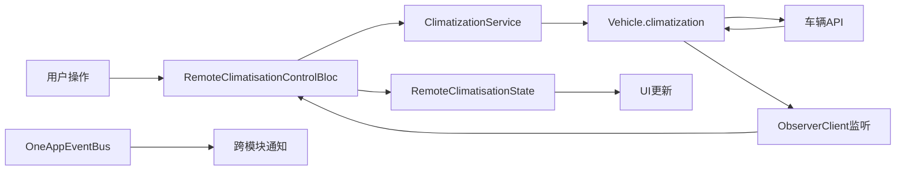
```mermaid
graph LR
    A[用户操作] --> B[RemoteClimatisationControlBloc]
    B --> C[ClimatizationService]
    C --> D[Vehicle.climatization]
    D --> E[车辆API]
    
    E --> D
    D --> F[ObserverClient监听]
    F --> B
    B --> G[RemoteClimatisationState]
    G --> H[UI更新]
    
    I[OneAppEventBus] --> J[跨模块通知]
```

**Bloc数据流实现** - 基于OneApp的远程空调控制：

```dart
/// 远程空调控制状态 - 使用Freezed确保不可变性
@freezed
class RemoteClimatisationState with _$RemoteClimatisationState {
  const factory RemoteClimatisationState({
    required ClimatizationService climatization,      // 空调服务实例
    required bool climatizationAtUnlock,              // 解锁启动开关
    required double temperature,                      // 空调温度
    ClimatisationStatus? status,                      // 空调状态
    ClimatizationParameter? parameter,                // 空调参数
    bool? actionStart,                                // 开启操作执行状态
    bool? actionStop,                                 // 关闭操作执行状态
    bool? actionSetting,                              // 设置保存操作状态
    bool? updatePage,                                 // 页面更新标记
    double? sliderValue,                              // 温度滑动条值
  }) = _RemoteClimatisationState;
}

/// 远程空调控制事件
@freezed
class RemoteClimatisationControlEvent with _$RemoteClimatisationControlEvent {
  /// 温度设置事件
  const factory RemoteClimatisationControlEvent.updateTemperatureSettingEvent({
    required double temperature,
  }) = UpdateTemperatureSettingEvent;

  /// 解锁启动开关事件
  const factory RemoteClimatisationControlEvent.updateClimatizationAtUnlockEvent({
    required bool climatizationAtUnlock,
  }) = UpdateClimatizationAtUnlockEvent;

  /// 执行空调操作事件
  const factory RemoteClimatisationControlEvent.updateActionExecuteEvent({
    required ClimatizationAction action,
  }) = UpdateActionExecuteEvent;

  /// 滑动条值更新事件
  const factory RemoteClimatisationControlEvent.updateSliderExecuteEvent({
    required double sliderValue,
  }) = UpdateSliderExecuteEvent;

  /// 页面数据刷新事件
  const factory RemoteClimatisationControlEvent.updatePageDataEvent() = UpdatePageDataEventEvent;
}

/// 远程空调控制Bloc
class RemoteClimatisationControlBloc
    extends Bloc<RemoteClimatisationControlEvent, RemoteClimatisationState> {
  
  /// 车辆服务观察者客户端
  late ObserverClient client;
  
  RemoteClimatisationControlBloc(
    ClimatizationService climatization,
    double temperature,
    bool climatizationAtUnlock,
    String? noticeVin,  // 通知栏传入的VIN码
    BuildContext? context,
  ) : super(RemoteClimatisationState(
        climatization: climatization,
        temperature: temperature,
        climatizationAtUnlock: climatizationAtUnlock,
      )) {
    
    // 注册事件处理器
    on<UpdateTemperatureSettingEvent>(_onUpdateTemperatureSetting);
    on<UpdateClimatizationAtUnlockEvent>(_onUpdateClimatizationAtUnlockEvent);
    on<UpdateActionExecuteEvent>(_onUpdateActionExecuteEvent);
    on<UpdateSliderExecuteEvent>(_onUpdateSliderExecuteEvent);
    on<UpdatePageDataEventEvent>(_onUpdatePageDataEventEvent);

    // 检查服务状态并初始化
    if (climatization.isStatusReady && climatization.isParameterReady) {
      // 状态和参数都准备就绪
      _updateCompleteState();
    } else if (climatization.isStatusReady) {
      // 仅状态准备就绪
      emit(state.copyWith(status: climatization.status as ClimatisationStatus));
    } else if (climatization.isParameterReady) {
      // 仅参数准备就绪
      _updateParameterState();
    }

    CarAppLog.i('RemoteClimatisationControlBloc 初始化完成');
    CarAppLog.i('actionStart: ${state.actionStart}');
    CarAppLog.i('actionStop: ${state.actionStop}');
    CarAppLog.i('actionSetting: ${state.actionSetting}');

    // 刷新空调数据
    climatization.doAction(ClimatizationAction.refresh);

    // 订阅空调服务变化
    _subscribeToClimatizationService(climatization);

    // 检查默认车辆（异步）
    checkDefaultVehicle(context, noticeVin);
  }

  /// 订阅空调服务变化
  void _subscribeToClimatizationService(ClimatizationService climatization) {
    client = Vehicle.addServiceObserver(
      serviceCategory: VehicleServiceCategory.climatisation,
      onChange: (serviceBase) {
        final service = serviceBase as ClimatizationService;
        CarAppLog.i('空调服务状态变化回调');
        
        // 检查各种操作状态
        final actionStartRunning = checkActionStartRun(service);
        final actionStopRunning = checkActionStopRun(service);
        final actionSettingRunning = checkActionSettingRun(service);
        
        // 更新状态
        emit(state.copyWith(
          climatization: service,
          status: service.status as ClimatisationStatus?,
          parameter: service.parameter,
          actionStart: actionStartRunning,
          actionStop: actionStopRunning,
          actionSetting: actionSettingRunning,
          updatePage: !(state.updatePage ?? false),  // 切换更新标记
        ));
        
        CarAppLog.i('空调状态已更新: start=$actionStartRunning, stop=$actionStopRunning');
      },
    );
  }

  /// 检查空调启动操作是否正在执行
  bool checkActionStartRun(ClimatizationService climatization) {
    final InProcessActions inProcessActions = climatization.inProcessActions;
    return inProcessActions.getServiceAction(ClimatizationAction.start) != null;
  }

  /// 检查空调停止操作是否正在执行
  bool checkActionStopRun(ClimatizationService climatization) {
    final InProcessActions inProcessActions = climatization.inProcessActions;
    return inProcessActions.getServiceAction(ClimatizationAction.stop) != null;
  }

  /// 检查空调设置操作是否正在执行
  bool checkActionSettingRun(ClimatizationService climatization) {
    final InProcessActions inProcessActions = climatization.inProcessActions;
    return inProcessActions.getServiceAction(ClimatizationAction.setting) != null;
  }

  /// 温度设置事件处理
  FutureOr<void> _onUpdateTemperatureSetting(
    UpdateTemperatureSettingEvent event,
    Emitter<RemoteClimatisationState> emit,
  ) {
    CarAppLog.i('处理温度设置事件: ${event.temperature}');

    if (state.climatization.isParameterReady) {
      // 参数准备就绪，更新温度设置
      final updatedParameter = state.parameter?.copyWith(
        targetTemperature: TargetTemperature.fromCelsius(event.temperature),
      );
      
      emit(state.copyWith(
        temperature: event.temperature,
        parameter: updatedParameter,
      ));
    } else {
      CarAppLog.w('空调参数未准备就绪，跳过温度设置');
    }
  }

  /// 解锁启动开关事件处理
  FutureOr<void> _onUpdateClimatizationAtUnlockEvent(
    UpdateClimatizationAtUnlockEvent event,
    Emitter<RemoteClimatisationState> emit,
  ) {
    CarAppLog.i('处理解锁启动开关事件: ${event.climatizationAtUnlock}');

    emit(state.copyWith(climatizationAtUnlock: event.climatizationAtUnlock));
    
    // 保存设置到本地存储或发送到服务器
    // 具体实现略...
  }

  /// 空调操作执行事件处理
  FutureOr<void> _onUpdateActionExecuteEvent(
    UpdateActionExecuteEvent event,
    Emitter<RemoteClimatisationState> emit,
  ) {
    CarAppLog.i('执行空调操作: ${event.action}');

    // 执行具体的空调操作
    state.climatization.doAction(event.action);
    
    // 更新对应的操作状态
    switch (event.action) {
      case ClimatizationAction.start:
        emit(state.copyWith(actionStart: true));
        break;
      case ClimatizationAction.stop:
        emit(state.copyWith(actionStop: true));
        break;
      case ClimatizationAction.setting:
        emit(state.copyWith(actionSetting: true));
        break;
      default:
        break;
    }
  }

  /// 滑动条值更新事件处理
  FutureOr<void> _onUpdateSliderExecuteEvent(
    UpdateSliderExecuteEvent event,
    Emitter<RemoteClimatisationState> emit,
  ) {
    emit(state.copyWith(sliderValue: event.sliderValue));
  }

  /// 页面数据刷新事件处理
  FutureOr<void> _onUpdatePageDataEventEvent(
    UpdatePageDataEventEvent event,
    Emitter<RemoteClimatisationState> emit,
  ) {
    CarAppLog.i('刷新页面数据');
    
    // 切换更新标记，触发UI重新构建
    emit(state.copyWith(updatePage: !(state.updatePage ?? false)));
    
    // 刷新空调服务数据
    state.climatization.doAction(ClimatizationAction.refresh);
  }

  /// 检查默认车辆
  Future<void> checkDefaultVehicle(BuildContext? context, String? noticeVin) async {
    await VehicleUtils.checkDefaultVehicle(context, noticeVin, (value) {
      // 车辆检查回调处理
      CarAppLog.i('默认车辆检查完成: $value');
    });
  }

  /// 更新完整状态
  void _updateCompleteState() {
    emit(state.copyWith(
      status: state.climatization.status as ClimatisationStatus,
      parameter: state.climatization.parameter,
      actionStart: checkActionStartRun(state.climatization),
      actionStop: checkActionStopRun(state.climatization),
      actionSetting: checkActionSettingRun(state.climatization),
    ));
  }

  /// 更新参数状态
  void _updateParameterState() {
    emit(state.copyWith(
      parameter: state.climatization.parameter,
      actionSetting: checkActionSettingRun(state.climatization),
    ));
  }

  @override
  Future<void> close() {
    CarAppLog.i('RemoteClimatisationControlBloc 资源清理');
    Vehicle.removeServiceObserver(client);  // 取消服务订阅
    return super.close();
  }
}
```

**使用Repository模式的数据流实现**：

```dart
/// 充电桩Repository - 数据源管理实现
class ChargingStationRepository {
  final ChargingStationApi _api = Modular.get<ChargingStationApi>();
  final ChargingStationCache _cache = Modular.get<ChargingStationCache>();

  /// 查找附近充电桩 - 实现缓存优先策略
  Future<List<ChargingStation>> findNearbyStations(
    LatLng location, {
    int radius = 5000,
  }) async {
    try {
      // 1. 优先从缓存获取数据
      final cached = await _cache.getNearbyStations(location, radius);
      if (cached.isNotEmpty && !_cache.isExpired(location)) {
        Logger.i('从缓存获取充电桩数据: ${cached.length}个');
        return cached;
      }

      // 2. 缓存过期或无数据，从API获取
      Logger.i('从API获取充电桩数据');
      final stations = await _api.findNearbyStations(location, radius);

      // 3. 更新缓存
      await _cache.cacheStations(location, stations);

      return stations;
    } catch (error) {
      Logger.e('获取充电桩数据失败: $error');
      
      // 4. 出错时返回缓存数据（如果有）
      final cached = await _cache.getNearbyStations(location, radius);
      if (cached.isNotEmpty) {
        Logger.w('返回过期缓存数据: ${cached.length}个');
        return cached;
      }
      
      rethrow;
    }
  }
}

/// 充电桩搜索Bloc - 完整的数据流管理
class ChargingStationBloc extends Bloc<ChargingStationEvent, ChargingStationState> {
  final ChargingStationRepository repository;

  ChargingStationBloc(this.repository) : super(ChargingStationInitial()) {
    on<LoadNearbyStations>(_onLoadNearbyStations);
    on<RefreshStations>(_onRefreshStations);
  }

  /// 加载附近充电桩
  Future<void> _onLoadNearbyStations(
    LoadNearbyStations event,
    Emitter<ChargingStationState> emit,
  ) async {
    emit(ChargingStationLoading());

    try {
      // 通过Repository获取数据
      final stations = await repository.findNearbyStations(
        event.location,
        radius: event.radius,
      );

      emit(ChargingStationLoaded(
        stations: stations,
        location: event.location,
        lastUpdateTime: DateTime.now(),
      ));

      // 发布事件通知其他模块
      OneAppEventBus.fire('charging_stations_loaded', {
        'count': stations.length,
        'location': event.location,
        'timestamp': DateTime.now().toIso8601String(),
      });
      
    } catch (error) {
      emit(ChargingStationError(error.toString()));
      
      // 发布错误事件
      OneAppEventBus.fire('charging_stations_error', {
        'error': error.toString(),
        'location': event.location,
      });
    }
  }

  /// 刷新充电桩数据
  Future<void> _onRefreshStations(
    RefreshStations event,
    Emitter<ChargingStationState> emit,
  ) async {
    if (state is ChargingStationLoaded) {
      final currentState = state as ChargingStationLoaded;
      emit(ChargingStationRefreshing(currentState.stations));

      try {
        final stations = await repository.findNearbyStations(
          currentState.location,
          radius: 5000,
        );

        emit(ChargingStationLoaded(
          stations: stations,
          location: currentState.location,
          lastUpdateTime: DateTime.now(),
        ));
      } catch (error) {
        emit(ChargingStationLoaded(
          stations: currentState.stations,
          location: currentState.location,
          lastUpdateTime: currentState.lastUpdateTime,
          error: error.toString(),
        ));
      }
    }
  }
}
```

## 总结

### 1. OneApp架构设计优势

#### 1.1 技术架构优势

**模块化设计**
- ✅ **独立开发**: 各业务模块可并行开发，提升团队协作效率
- ✅ **版本管理**: 模块独立版本控制，降低发版风险
- ✅ **代码复用**: 基础设施模块在多个业务模块间复用
- ✅ **测试隔离**: 模块级别的单元测试和集成测试

**分层架构**
- ✅ **职责清晰**: UI层、业务层、服务层、基础设施层职责明确
- ✅ **易于维护**: 分层设计使代码结构清晰，便于维护和扩展
- ✅ **技术栈统一**: Flutter + Dart 统一技术栈，降低学习成本
- ✅ **平台一致性**: 跨平台UI和业务逻辑一致性

**性能与稳定性**
- ✅ **AOT编译**: Release模式下AOT编译保证运行性能
- ✅ **资源优化**: 按需加载和缓存机制优化资源使用
- ✅ **错误隔离**: 模块间错误隔离，提升应用稳定性
- ✅ **监控完备**: 性能监控、错误上报、日志系统完备

#### 1.2 业务架构优势

**功能丰富度**
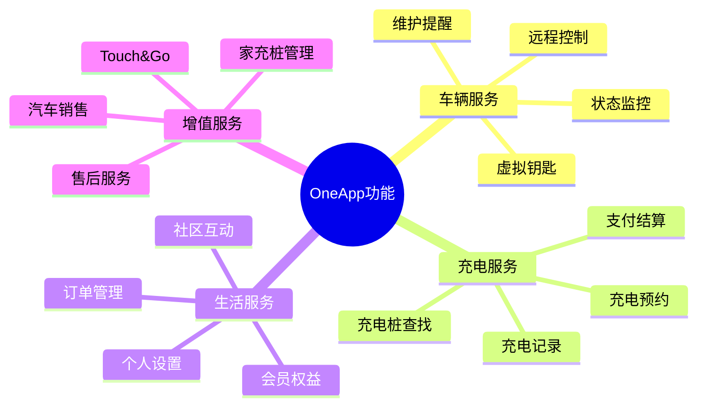
```mermaid
mindmap
  root((OneApp功能))
    车辆服务
      远程控制
      状态监控
      维护提醒
      虚拟钥匙
    充电服务
      充电桩查找
      充电预约
      支付结算
      充电记录
    生活服务
      订单管理
      社区互动
      会员权益
      个人设置
    增值服务
      Touch&Go
      家充桩管理
      汽车销售
      售后服务
```

**用户体验**
- 🎯 **一致性**: 跨平台UI和交互一致性
- 🎯 **流畅性**: 60fps渲染和流畅的动画效果
- 🎯 **响应性**: 快速的页面加载和数据响应
- 🎯 **可用性**: 离线功能和网络异常处理

### 2. 面临的挑战

#### 2.1 技术挑战

**依赖管理复杂性**
```yaml
# 大量的dependency_overrides表明依赖版本冲突问题
dependency_overrides:
  meta: ^1.9.1
  collection: ^1.17.1
  path: ^1.8.3
  # ... 更多版本覆盖
```
- ⚠️ **版本冲突**: 大量`dependency_overrides`导致版本管理困难
- ⚠️ **构建时间**: 众多本地依赖导致构建时间较长
- ⚠️ **依赖维护**: 本地路径依赖的版本同步问题
- ⚠️ **模块粒度**: 部分模块粒度过小，增加了管理复杂度
- ⚠️ **循环依赖**: 某些模块间存在潜在的循环依赖风险

### 3. 架构演进方向

#### 3.1 短期优化

**依赖治理**
```yaml
# 目标：减少dependency_overrides
dependencies:
  # 统一基础依赖版本
  provider: ^6.1.1
  rxdart: ^0.27.7
  dio: ^5.3.2
```

**具体措施**
- 🔧 **版本统一**: 统一各模块的基础依赖版本
- 🔧 **依赖精简**: 合并功能相似的小模块
