# OneApp 架构设计文档

## App 知识

### 1. APK 解压内容分析

APK (Android Package) 是 Android 应用的安装包格式，本质上是一个压缩文件。通过解压 APK 可以了解应用的构成和结构。

#### APK 文件结构

| 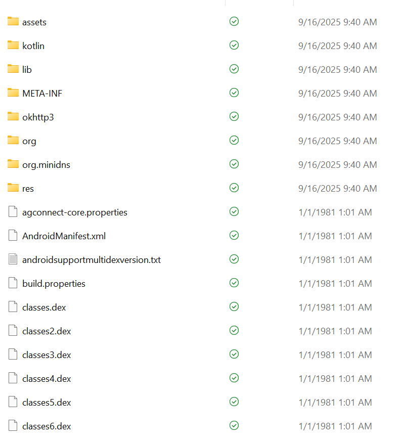 | 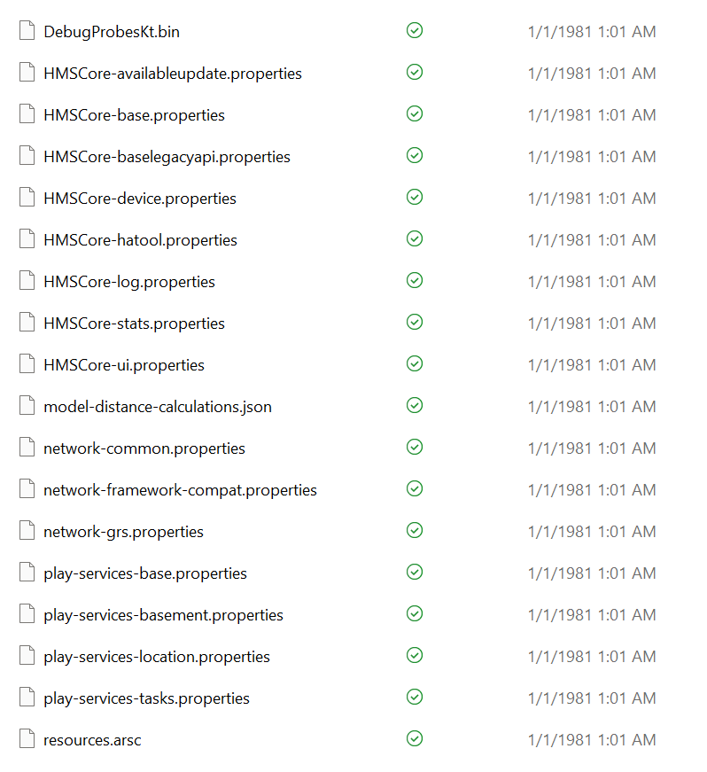 |
| :------------------------------: | :------------------------------: |
|            apk 文件1             |            apk 文件2             |

```
app-debug.apk (解压后)
├── AndroidManifest.xml          # 应用清单文件 (二进制格式)
├── classes.dex                  # Dalvik字节码文件
├── classes2.dex                 # 额外的dex文件 (多dex应用)
├── resources.arsc               # 编译后的资源文件
├── assets/                      # 静态资源目录
│   ├── flutter_assets/          # Flutter资源文件
│   │   ├── kernel_blob.bin      # Dart代码编译产物 (Debug模式)
│   │   ├── isolate_snapshot_*   # Dart代码快照 (Release模式)
│   │   ├── vm_snapshot_*        # Dart VM快照 (Release模式)
│   │   ├── AssetManifest.json   # 资源清单
│   │   └── packages/            # 第三方包资源
│   └── build.properties         # 构建属性文件
├── res/                         # Android资源目录
│   ├── drawable/                # 图片资源
│   ├── layout/                  # 布局文件 (二进制格式)
│   ├── values/                  # 字符串、颜色等资源
│   └── ...
├── lib/                         # 本地库文件
│   ├── arm64-v8a/              # 64位ARM架构库
│   │   └── libflutter.so       # Flutter引擎
│   ├── armeabi-v7a/            # 32位ARM架构库
│   └── x86_64/                 # x86_64架构库
├── META-INF/                    # 签名和清单信息
│   ├── MANIFEST.MF             # 清单文件
│   ├── CERT.SF                 # 签名文件
│   └── CERT.RSA                # 证书文件
└── kotlin/                      # Kotlin元数据
```

#### 关键文件说明

- **classes.dex 文件**

    classes.dex 文件是 Dalvik Executable (DEX) 格式的文件，它包含了应用的 Java 或 Kotlin 代码，经过编译后用于 Android 虚拟机（Dalvik 或 ART）执行。

    在 Android 应用中，所有的 Java 或 Kotlin 类都会被编译成 .dex 文件，这些文件在应用运行时被加载并执行。你看到的多个 classes.dex 文件（如 classes2.dex, classes3.dex）表示这应用程序被分成了多个 DEX 文件（通常是因为 APK 文件的大小超过了单个 DEX 文件的限制，使用多重 DEX 来进行分割）。

- **assets/ 文件夹**
  
    这个文件夹包含了 APK 内的 静态资源文件。这些资源不参与编译，可以直接在应用运行时被访问和加载。常见的文件包括图像、字体、JSON 文件等。

    例如，assets 中的资源可以在应用中通过 AssetManager 被访问。

- **lib/ 文件夹**

    这个文件夹包含了应用的 原生代码库，即用 C 或 C++ 等编写的本地代码（通常是 .so 文件）。这些库通常用于实现一些高性能的功能或者和硬件交互等。

    例如，lib/ 文件夹中可能会包含适用于不同平台（如 x86、ARM 等架构）的 .so 文件。

- **META-INF/ 文件夹**

    这个文件夹包含了 APK 的元数据，通常用于签名验证和应用的完整性验证。

    里面的 MANIFEST.MF、CERT.RSA、CERT.SF 等文件用于存储签名证书以及验证应用完整性所需的数据，确保 APK 文件没有被篡改。

- **res/ 文件夹**
    这个文件夹包含了应用的 资源文件，这些资源是应用 UI、布局、图像、字符串等的一部分。

    res/ 文件夹通常包含子文件夹，如 drawable/（图片资源）、layout/（布局文件）、values/（定义字符串、尺寸等的 XML 文件）等。

- **AndroidManifest.xml**

    这个文件是 Android 应用的 清单文件，用于声明应用的基本信息，如包名、权限、组件（如 Activity、Service、BroadcastReceiver）等。

    AndroidManifest.xml 还包括了其他配置信息，如应用的主题、启动模式等。

- **.properties 文件**

    .properties 文件通常用于存储应用的配置信息，如库的版本、路径配置等。

    例如，HMSCore-base.properties、play-services-location.properties 等文件是与特定 SDK 或服务（如 HMS 或 Google Play 服务）相关的配置文件，通常在编译时用来设置 SDK 的特性、版本号等。

- **resources.arsc**

    这个文件是 资源表文件，用于存储应用中所有的 静态资源（如字符串、颜色、尺寸等）。

    它是二进制格式，用于加速资源加载。Android 系统通过 resources.arsc 来索引和加载资源，而不需要直接读取 XML 文件。


**核心执行文件**
- `classes.dex`: 编译后的Java/Kotlin字节码，运行在Dalvik/ART虚拟机上
- `AndroidManifest.xml`: 应用配置清单，定义组件、权限、版本等信息
- `resources.arsc`: 编译后的XML资源和字符串资源

**Flutter相关文件**
- `flutter_assets/kernel_blob.bin`: Debug模式下的Dart代码内核表示
- `flutter_assets/isolate_snapshot_*`: Release模式下的AOT编译快照
- `lib/*/libflutter.so`: Flutter引擎的原生库

**资源文件**
- `assets/`: 原始资源文件，运行时可直接访问
- `res/`: Android标准资源，会被编译和优化

**安全验证**
- `META-INF/`: APK签名相关文件，确保应用完整性和来源可信

#### OneApp项目中的体现

在OneApp的构建产物中，我们可以发现：

```properties
# build.properties 示例
iid=6363
sid=3138351
bid=982334
version=12.10.0.10010731
time=2024-05-08 19:02:58
FEATURE_LOCATION=1
FEATURE_ROUTE_OVERLAY=1
FEATURE_MVT=1
FEATURE_3DTiles=1
FEATURE_GLTF=1
```

这个文件记录了构建信息和功能特性开关，体现了OneApp的多功能特性管理。

### 2. Android App 架构模式

#### 传统Android应用架构

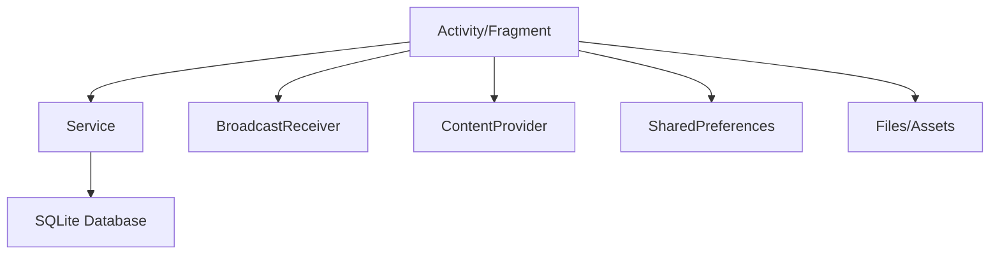

#### 现代Android架构 (MVVM)

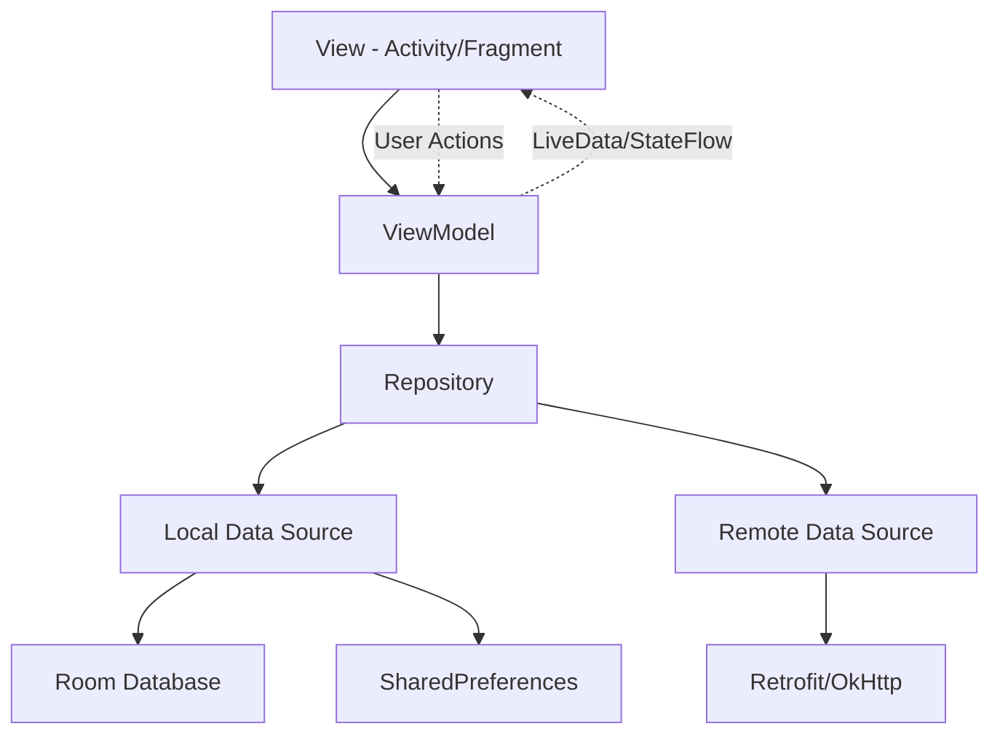

#### Flutter混合架构

对于OneApp这样的Flutter应用，架构更为复杂：

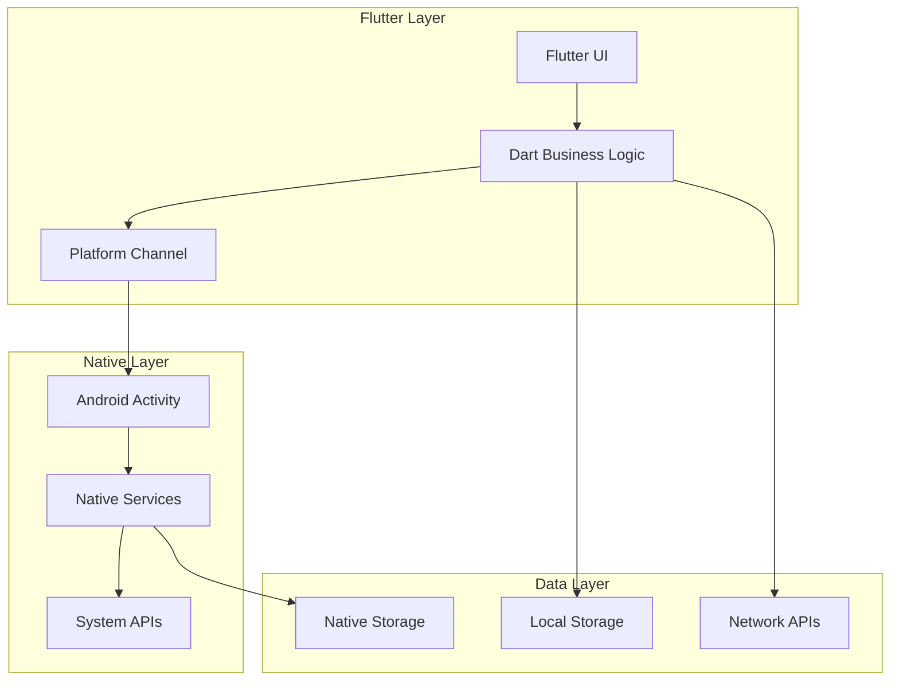

**架构层次说明**

1. **展示层 (Presentation Layer)**
   - Flutter Widget树
   - 用户界面渲染
   - 用户交互处理

2. **业务逻辑层 (Business Logic Layer)**
   - Dart业务代码
   - 状态管理 (Provider/Bloc)
   - 路由管理

3. **平台适配层 (Platform Layer)**
   - Platform Channel通信
   - 原生功能调用
   - 平台特性适配

4. **数据服务层 (Data Service Layer)**
   - 网络请求
   - 本地存储
   - 缓存管理

5. **原生系统层 (Native System Layer)**
   - Android系统API
   - 硬件设备访问
   - 系统服务调用

### Android 插件的合并与加载机制

1. 插件与 Flutter 应用的集成
   
    当我们把一个插件集成到 Flutter 项目时，首先需要了解两个主要部分：

    Flutter 插件的 Android 部分：通常包含 `src/main/java` 或 `src/main/kotlin` 目录下的原生代码。

    Flutter 项目的 Android 部分：即你创建的 Flutter 项目的 `android/` 目录。

2. 插件的打包

    Flutter 插件包含了原生代码（Android 部分通常是 Java 或 Kotlin），这些原生代码被打包成 .aar 文件。AAR 是 Android 的类库包，包含了插件的 Java 或 Kotlin 代码、资源文件和配置等。

    在 Flutter 项目中，插件的 .aar 文件通过 Flutter 的依赖管理系统（通常是 pubspec.yaml 文件）进行声明，类似于其他 Dart 包。Flutter 会在编译时把这些原生代码一起编译进最终的 Android APK 或 AAB 文件中。它们的编译产出（.class 文件）合并到主工程的 DEX 文件中。

    将它们的 AndroidManifest.xml 内容合并到主工程的 AndroidManifest.xml 中。这就是为什么插件声明的权限和组件会在最终 App 中生效。


3. 插件的集成

    依赖声明：在 `pubspec.yaml` 文件中声明插件的依赖：
    ```yaml
    dependencies:
    flutter:
        sdk: flutter
    flutter_plugin: ^1.0.0
    ```

    Gradle 构建过程：当你编译 Flutter 项目时，Gradle 会自动下载 Flutter 插件，并把 .aar 文件（插件的原生部分）合并到应用的 build.gradle 配置中：

    在 android/app/build.gradle 中，Flutter 插件的原生代码被集成到 dependencies 块中：
    ```gradle
    dependencies {
        implementation project(":flutter_plugin")
    }

    <!--新版本可以通过plugin的方法来加载插件 -->
    plugins {
        id "dev.flutter.flutter-gradle-plugin"
    }

    ```
    在`setting.gradle`里面也可以批量的去依赖Flutter项目的全部依赖
    ```gradle
    pluginManagement {
        def flutterSdkPath = {
            def properties = new Properties()
            file("local.properties").withInputStream { properties.load(it) }
            def flutterSdkPath = properties.getProperty("flutter.sdk")
            assert flutterSdkPath != null, "flutter.sdk not set in local.properties"
            return flutterSdkPath
        }()

        includeBuild("$flutterSdkPath/packages/flutter_tools/gradle")

        repositories {
            google()
            mavenCentral()
            gradlePluginPortal()
        }
    }

    plugins {
        id "dev.flutter.flutter-plugin-loader" version "1.0.0" // apply true
        id "com.android.application" version "{agpVersion}" apply false
        id "org.jetbrains.kotlin.android" version "{kotlinVersion}" apply false
    }

    include ":app"
    ```
    Flutter Gradle 插件的命令式应用已弃用
    
    [Deprecated imperative apply of Flutter's Gradle plugins](https://docs.flutter.cn/release/breaking-changes/flutter-gradle-plugin-apply)

4. 插件加载与启动过程

    在 应用启动时，Flutter 会通过 `FlutterEngine` 启动，并将原生代码的插件加载到引擎中。
    当应用启动时，Flutter 插件会在启动过程中被动态加载。
    在构建过程中，所有插件的 .aar 文件都会被合并到最终的 APK 中。当应用启动时，Flutter 引擎会加载这些 .aar 文件并通过 MethodChannel 进行通信。

    ```java
    @Override
    protected void onCreate(Bundle savedInstanceState) {
        super.onCreate(savedInstanceState);
        FlutterEngine flutterEngine = new FlutterEngine(this);
        GeneratedPluginRegistrant.registerWith(flutterEngine);
        setContentView(
            FlutterActivity.createDefaultIntent(this)
        );
    }
    ```
    现在的项目都是继承于`FlutterActivity`，自动完成了插件的注册

5. 方法调用与通信机制

    Flutter 应用和 Android 插件之间的通信是通过 `MethodChannel` 或 `EventChannel` 完成的。

    `MethodChannel`：用于异步方法调用。
    插件原生代码通过 MethodChannel 向 Dart 层发送数据。
    Dart 层通过 MethodChannel 发起原生方法调用。

    `EventChannel`：用于数据流式传输，通常用于原生代码向 Flutter 层推送事件。

## Flutter知识

### 1. Flutter 架构概览

Flutter 是 Google 开发的跨平台 UI 工具包，采用自绘制引擎，实现了"一套代码，多端运行"的目标。它被设计为一个可扩展的分层系统，各个独立的组件系列合集，上层组件各自依赖下层组件。

> 参考：[Flutter架构概览官方文档](https://docs.flutter.cn/resources/architectural-overview)

#### Flutter 架构

Flutter 采用分层架构设计，从上到下分为 Framework 层、Engine 层和 Platform 层：


```mermaid
graph TB
    subgraph "Dart App"
        A[业务逻辑<br/>Business Logic]
    end
    
    subgraph "Framework (Dart)"
        B[Material/Cupertino<br/>设计语言实现]
        C[Widgets<br/>组合抽象]
        D[Rendering<br/>渲染层]
        E[Foundation<br/>基础库]
    end
    
    subgraph "Engine (C++)"
        F[Dart Runtime<br/>Dart虚拟机]
        G[Skia/Impeller<br/>图形引擎]
        H[Text Layout<br/>文本排版]
        I[Platform Channels<br/>平台通道]
    end
    
    subgraph "Platform"
        J[Android/iOS/Web/Desktop<br/>目标平台]
    end
```

**架构层次详解**

| 架构层 | 主要职责 | 核心组件 | 关键特点 |
|--------|----------|----------|----------|
| **Framework层** | 提供上层API封装 | Material、Widgets、Rendering、Foundation | Dart语言实现，响应式编程 |
| **Engine层** | 底层渲染和运行时支持 | Dart Runtime、图形引擎、文本布局 | C++实现，高性能渲染 |
| **Platform层** | 与底层操作系统交互 | 嵌入层、系统API | 平台特定实现 |

#### Flutter 应用架构

基于官方推荐的 MVVM 架构模式，Flutter 应用采用关注点分离原则，分为 UI 层和数据层。

> 参考：[Flutter应用架构指南](https://docs.flutter.cn/app-architecture/guide)


**分层架构设计**

```mermaid
graph TB
    subgraph "UI Layer 用户界面层"
        A[View<br/>视图组件]
        B[ViewModel<br/>视图模型]
    end
    
    subgraph "Domain Layer 领域层 (可选)"
        E[Use Cases<br/>业务用例]
        F[Domain Models<br/>领域模型]
    end
    
    subgraph "Data Layer 数据层"
        C[Repository<br/>数据仓库]
        D[Service<br/>数据服务]
    end
    
    A -.->|用户事件| B
    B -.->|状态更新| A
    B --> C
    B --> E
    E --> F
    E --> C
    C --> D
```

**完整的功能模块架构**


**架构组件职责**

| 组件层 | 主要职责 | 核心特点 | 示例 |
|--------|----------|----------|------|
| **View** | UI渲染和用户交互 | 无业务逻辑，接收ViewModel数据 | StatelessWidget页面 |
| **ViewModel** | 业务逻辑和状态管理 | 数据转换，状态维护，命令处理 | Bloc、Provider |
| **Repository** | 数据源管理 | 缓存策略，错误处理，数据转换 | UserRepository |
| **Service** | 外部数据源封装 | API调用，本地存储，平台服务 | ApiService |
| **Use Cases** | 复杂业务逻辑封装 | 跨Repository逻辑，可复用业务 | LoginUseCase |

#### 推荐项目结构

基于官方最佳实践的项目文件组织方式：

```
lib/
├── ui/                          # UI层 - 用户界面
│   ├── core/                    # 核心UI组件
│   │   ├── widgets/             # 通用Widget组件
│   │   ├── themes/              # 主题配置
│   │   └── extensions/          # UI扩展方法
│   └── features/                # 功能模块
│       ├── home/                # 首页功能
│       │   ├── view_models/     # 视图模型
│       │   │   └── home_view_model.dart
│       │   ├── views/           # 视图组件
│       │   │   ├── home_screen.dart
│       │   │   └── widgets/
│       │   └── models/          # UI状态模型
│       ├── car_control/         # 车控功能
│       └── profile/             # 个人中心
├── domain/                      # 领域层 - 业务逻辑
│   ├── models/                  # 领域模型
│   │   ├── car.dart
│   │   └── user.dart
│   ├── use_cases/               # 业务用例
│   │   ├── login_use_case.dart
│   │   └── car_control_use_case.dart
│   └── repositories/            # 仓库接口
│       └── i_car_repository.dart
├── data/                        # 数据层 - 数据访问
│   ├── repositories/            # 仓库实现
│   │   ├── car_repository_impl.dart
│   │   └── user_repository_impl.dart
│   ├── services/                # 数据服务
│   │   ├── api/                 # API服务
│   │   │   ├── car_api_service.dart
│   │   │   └── auth_api_service.dart
│   │   ├── local/               # 本地存储
│   │   │   └── cache_service.dart
│   │   └── platform/            # 平台服务
│   │       └── bluetooth_service.dart
│   └── models/                  # 数据传输对象
│       ├── api/                 # API模型
│       └── local/               # 本地模型
├── core/                        # 核心基础设施
│   ├── di/                      # 依赖注入
│   ├── network/                 # 网络配置
│   ├── storage/                 # 存储配置
│   ├── constants/               # 常量定义
│   └── utils/                   # 工具类
├── config/                      # 配置文件
│   ├── app_config.dart
│   └── environment.dart
└── main.dart                    # 应用入口
```

### 2. Flutter 工作原理

Flutter 的核心设计理念是"**一切皆Widget**"，通过积极的组合模式构建用户界面。为了支撑大量Widget的高效运行，Flutter采用了多层次的架构设计和优化算法。

#### 2.1 Flutter 三棵树架构

Flutter 使用三棵树来管理UI状态和渲染：

```mermaid
graph TD
    subgraph "Widget Tree (配置描述)"
        W1[StatelessWidget] --> W2[Container]
        W1 --> W3[Text]
        W2 --> W4[Padding]
        W4 --> W5[Image]
    end
    
    subgraph "Element Tree (桥梁管理)"
        E1[StatelessElement] --> E2[SingleChildRenderObjectElement]
        E1 --> E3[LeafRenderObjectElement]
        E2 --> E4[SingleChildRenderObjectElement]
        E4 --> E5[LeafRenderObjectElement]
    end
    
    subgraph "RenderObject Tree (渲染实现)"
        R1[RenderBox] --> R2[RenderPadding]
        R1 --> R3[RenderParagraph]
        R2 --> R4[RenderImage]
    end
    
    W1 -.->|创建| E1
    W2 -.->|创建| E2
    W3 -.->|创建| E3
    W4 -.->|创建| E4
    W5 -.->|创建| E5
    
    E2 -.->|创建| R1
    E3 -.->|创建| R3
    E4 -.->|创建| R2
    E5 -.->|创建| R4
```

**三棵树的职责分工**

| 树类型            | 主要职责                           | 生命周期     | 特点           |
| ----------------- | ---------------------------------- | ------------ | -------------- |
| **Widget Tree**   | UI配置描述，定义界面应该是什么样子 | 每帧重建     | 不可变、轻量级 |
| **Element Tree**  | Widget和RenderObject的桥梁        | 相对稳定     | 维护状态和关系 |
| **RenderObject**  | 实际的布局、绘制和命中测试         | 长期存在     | 可变、性能关键 |

#### 2.2 Widget 构建与更新流程

```mermaid
sequenceDiagram
    participant User as 用户操作
    participant Widget as Widget Tree
    participant Element as Element Tree
    participant Render as RenderObject Tree
    participant Engine as Flutter Engine
    
    User->>Widget: setState() 触发更新
    Widget->>Widget: build() 创建新Widget树
    Widget->>Element: 比较新旧Widget
    
    alt Widget相同
        Element->>Element: 复用现有Element
    else Widget不同
        Element->>Element: 创建新Element
        Element->>Render: 更新RenderObject
    end
    
    Element->>Render: markNeedsLayout()
    Render->>Render: layout() 布局计算
    Render->>Render: paint() 绘制操作
    Render->>Engine: 提交渲染数据
    Engine->>User: 显示更新后的UI
```

#### 2.3 布局系统 (Layout System)

Flutter 采用**单遍布局算法**，确保每个RenderObject在布局过程中最多被访问两次。

```mermaid
graph TB
    subgraph "布局约束传递 (Constraints Down)"
        A[Parent RenderObject] -->|BoxConstraints| B[Child RenderObject]
        B -->|BoxConstraints| C[Grandchild RenderObject]
    end
    
    subgraph "尺寸信息回传 (Size Up)"
        C -->|Size| B
        B -->|Size| A
    end
    
    subgraph "位置确定 (Position)"
        A -->|Offset| B
        B -->|Offset| C
    end
```

#### 2.4 绘制系统 (Painting System)

绘制系统负责将布局完成的RenderObject转换为实际的像素。

```mermaid
sequenceDiagram
    participant RO as RenderObject
    participant Layer as Layer Tree
    participant Canvas as Canvas
    participant Skia as Skia Engine
    participant GPU as GPU
    
    RO->>RO: markNeedsPaint()
    RO->>Layer: 创建绘制层
    RO->>Canvas: paint(Canvas, Offset)
    Canvas->>Skia: 绘制命令
    Skia->>GPU: 光栅化
    GPU->>GPU: 合成显示
```

#### 2.5 渲染管线 (Render Pipeline)

Flutter的完整渲染管线包含四个主要阶段：

```mermaid
graph LR
    A[Build 构建] --> B[Layout 布局]
    B --> C[Paint 绘制]
    C --> D[Composite 合成]
    
    A1[Widget.build] --> A
    B1[RenderObject.layout] --> B
    C1[RenderObject.paint] --> C
    D1[Layer.composite] --> D
    
    subgraph "优化策略"
        E[只有脏节点参与]
        F[次线性算法]
        G[缓存复用]
        H[GPU加速]
    end
    
    E --> A
    F --> B
    G --> C
    H --> D
```

**渲染管线优化**

1. **构建阶段优化**
   - 只重建标记为dirty的Widget
   - Element复用机制
   - 构建缓存策略

2. **布局阶段优化**
   - 单遍布局算法
   - 约束传播优化
   - 边界检测跳过

3. **绘制阶段优化**
   - Layer层缓存
   - 重绘区域最小化
   - GPU合成加速

## Flutter 模块化

### 1. Flutter模块化基础理论

#### 模块化的必要性

随着Flutter应用规模的增长，单一代码库会面临以下挑战：

```mermaid
graph TD
    A[单体应用] --> B[代码耦合严重]
    A --> C[构建时间过长]
    A --> D[团队协作困难]
    A --> E[测试复杂度高]
    
    F[模块化应用] --> G[职责分离]
    F --> H[并行开发]
    F --> I[独立测试]
    F --> J[代码复用]
```

#### 模块化设计原则

1. **单一职责原则**: 每个模块只负责一个业务领域
2. **开闭原则**: 对扩展开放，对修改封闭
3. **依赖倒置**: 高层模块不依赖低层模块，都依赖抽象
4. **接口隔离**: 客户端不依赖不需要的接口

#### Flutter模块化方案对比

| 方案           | 优点                   | 缺点                   | 适用场景       |
| -------------- | ---------------------- | ---------------------- | -------------- |
| Package方式    | 简单易用，依赖管理清晰 | 模块间通信复杂         | 工具库、UI组件 |
| Flutter Module | 支持混合开发           | 配置复杂，版本管理困难 | 原生应用集成   |
| Modular框架    | 完整的模块化解决方案   | 学习成本较高           | 大型应用       |

### 2. Flutter Modular 框架介绍

Flutter Modular 是一个完整的模块化解决方案，提供了依赖注入、路由管理和模块解耦能力。

#### 核心概念

```dart
// 1. 模块定义
class HomeModule extends Module {
  @override
  List<Bind> get binds => [
    Bind.singleton((i) => HomeRepository()),
    Bind.factory((i) => HomeBloc(i())),
  ];

  @override
  List<ModularRoute> get routes => [
    ChildRoute('/', child: (context, args) => HomePage()),
    ChildRoute('/detail', child: (context, args) => DetailPage()),
  ];
}

// 2. 应用入口
class AppModule extends Module {
  @override
  List<Module> get imports => [
    CoreModule(),
    HomeModule(),
  ];
}

// 3. 应用启动
void main() {
  runApp(ModularApp(module: AppModule(), child: AppWidget()));
}
```

#### 依赖注入机制

```mermaid
graph TB
    A[ModularApp] --> B[Module Registration]
    B --> C[Dependency Container]
    C --> D[Singleton Binds]
    C --> E[Factory Binds]
    C --> F[Lazy Binds]
    
    G[Widget] --> H[Modular.get<T>()]
    H --> C
```

```dart
// 依赖注入使用示例
class HomePage extends StatelessWidget {
  @override
  Widget build(BuildContext context) {
    // 获取依赖注入的实例
    final bloc = Modular.get<HomeBloc>();
    final repository = Modular.get<HomeRepository>();
    
    return Scaffold(
      appBar: AppBar(title: Text('首页')),
      body: BlocBuilder<HomeBloc, HomeState>(
        bloc: bloc,
        builder: (context, state) {
          return ListView.builder(
            itemBuilder: (context, index) => ListTile(
              title: Text(state.items[index].title),
              onTap: () => Modular.to.pushNamed('/detail'),
            ),
          );
        },
      ),
    );
  }
}
```

依赖注入也可以通过`Service`来完成某一些功能的实现

```dart
abstract class EmailService {
  void sendEmail(String email, String title, String body);
}

class XPTOEmailService implements EmailService {

  final XPTOEmail xpto;
  XPTOEmailService(this.xpto);

  void sendEmail(String email, String title, String body) {
    xpto.sendEmail(email, title, body);
  }
}

class Client {

  final EmailService service;
  Client(this.service);

  void sendEmail(String email, String title, String body){
    service.sendEmail(email, title, body);
  }
}
```

```dart
class AppModule extends Module {
  // v5 写法
  @override
  List<Bind> get binds => [
    Bind.factory((i) => XPTOEmail())
    Bind.factory<EmailService>((i) => XPTOEmailService(i()))
    Bind.singleton((i) => Client(i()))
  ];
  // v6 写法
  @override
  void binds(i) {
    i.add(XPTOEmail.new);
    i.add<EmailService>(XPTOEmailService.new);
    i.addSingleton(Client.new);

    // Register with Key
    i.addSingleton(Client.new, key: 'OtherClient');
  }
}
```

在模块中就可以获取到注入的service依赖
```dart
final client = Modular.get<Client>();
// or set a default value
final client = Modular.get<Client>(defaultValue: Client());

// or use tryGet
Client? client = Modular.tryGet<Client>();

// or get with key
Client client = Modular.get(key: 'OtherCLient');

client.sendEmail('email@xxx.com', 'title', 'email body')
```

#### 路由管理

```dart
// 路由定义
class AppModule extends Module {
  @override
  List<ModularRoute> get routes => [
    ModuleRoute('/home', module: HomeModule()),
    ModuleRoute('/user', module: UserModule()),
    ModuleRoute('/car', module: CarModule()),
  ];
}

// 路由导航
class NavigationService {
  static void toHome() => Modular.to.navigate('/home/');
  static void toProfile() => Modular.to.pushNamed('/user/profile');
  static void toCharging() => Modular.to.pushNamed('/car/charging');
}
```

-----

#### Flutter Modular 6.x.x

Flutter Modular v5 和 v6 有一个变化，不过核心的概念不变

```dart
class AppModule extends Module  {

  @override
  List<Module> get imports => [];

  @override
  void routes(RouteManager r) {
    r.child('/', child: (context) => HomePage(title: 'Home Page'));
  }

  @override
  void binds(Injector i) {
  }

  @override
  void exportedBinds(Injector i) {
    
  }
}
```

### 3. Bloc 状态管理

`Flutter`的很多灵感来自于`React`，它的设计思想是数据与视图分离，由数据映射渲染视图。所以在Flutter中，它的Widget是`immutable`的，而它的动态部分全部放到了状态(`State`)中。

在项目越来越复杂之后，就需要一个状态管理库，实现高效地管理状态、处理依赖注入以及实现路由导航。

`BLoC（Business Logic Component`）是一种由 `Google` 推出的状态管理模式，最初为 `Angular` 框架设计，后被广泛应用于 `Flutter` 开发中。其核心思想是将业务逻辑与 UI 界面分离，通过流（Stream）实现单向数据流，使得状态变化可预测且易于测试。


- `Bloc`模式：该模式划分四层结构
  
  - bloc：逻辑层
  - state：数据层
  - event：所有的交互事件
  - view：页面
  
- `Cubit`模式：该模式划分了三层结构
  
  - cubit：逻辑层
  - state：数据层
  - view：页面

#### Bloc架构模式


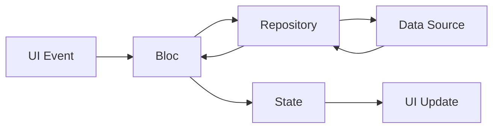

#### 在OneApp中的实现

```dart
// 1. 事件定义
abstract class ChargingEvent {}
class LoadChargingStations extends ChargingEvent {
  final LatLng location;
  LoadChargingStations(this.location);
}

// 2. 状态定义
abstract class ChargingState {}
class ChargingLoading extends ChargingState {}
class ChargingLoaded extends ChargingState {
  final List<ChargingStation> stations;
  ChargingLoaded(this.stations);
}
class ChargingError extends ChargingState {
  final String message;
  ChargingError(this.message);
}

// 3. Bloc实现
class ChargingBloc extends Bloc<ChargingEvent, ChargingState> {
  final ChargingRepository repository;
  
  ChargingBloc(this.repository) : super(ChargingLoading()) {
    on<LoadChargingStations>(_onLoadStations);
  }
  
  Future<void> _onLoadStations(
    LoadChargingStations event,
    Emitter<ChargingState> emit,
  ) async {
    try {
      emit(ChargingLoading());
      final stations = await repository.findNearbyStations(event.location);
      emit(ChargingLoaded(stations));
    } catch (e) {
      emit(ChargingError(e.toString()));
    }
  }
}

// 4. UI中使用
class ChargingMapPage extends StatelessWidget {
  @override
  Widget build(BuildContext context) {
    return BlocBuilder<ChargingBloc, ChargingState>(
      builder: (context, state) {
        if (state is ChargingLoading) {
          return Center(child: CircularProgressIndicator());
        } else if (state is ChargingLoaded) {
          return MapView(stations: state.stations);
        } else if (state is ChargingError) {
          return ErrorWidget(message: state.message);
        }
        return Container();
      },
    );
  }
}
```

### 4. OneApp中的模块化实践

#### 模块分层架构

```mermaid
graph TB
    subgraph "应用层"
        A[oneapp_main]
    end
    
    subgraph "业务模块层"
        B[oneapp_account]
        C[oneapp_community]
        D[oneapp_membership]
        E[oneapp_setting]
    end
    
    subgraph "功能模块层"
        F[app_car]
        G[app_charging]
        H[app_order]
        I[app_media]
    end
    
    subgraph "服务层"
        J[clr_charging]
        K[clr_payment]
        L[clr_order]
    end
    
    subgraph "基础设施层"
        M[basic_network]
        N[basic_storage]
        O[basic_logger]
        P[ui_basic]
    end
    
    A --> B
    A --> C
    A --> D
    A --> E
    
    B --> F
    C --> G
    D --> H
    E --> I
    
    F --> J
    G --> K
    H --> L
    
    J --> M
    K --> N
    L --> O
    I --> P
```

#### 依赖管理策略

```yaml
# pubspec.yaml 中的依赖管理
dependencies:
  flutter:
    sdk: flutter
  
  # 基础框架依赖
  basic_network:
    path: ../oneapp_basic_utils/basic_network
  basic_storage:
    path: ../oneapp_basic_utils/basic_storage
  basic_modular:
    path: ../oneapp_basic_utils/basic_modular
  
  # 业务模块依赖
  app_car:
    path: ../oneapp_app_car/app_car
  app_charging:
    path: ../oneapp_app_car/app_charging
  
  # UI组件依赖
  ui_basic:
    path: ../oneapp_basic_uis/ui_basic
  ui_business:
    path: ../oneapp_basic_uis/ui_business

dependency_overrides:
  # 解决版本冲突的依赖覆盖
  meta: ^1.9.1
  collection: ^1.17.1
```

#### 模块间通信机制

```dart
// 1. 事件总线通信
class EventBus {
  static final _instance = EventBus._internal();
  static EventBus get instance => _instance;
  
  final StreamController<dynamic> _controller = StreamController.broadcast();
  
  void publish<T>(T event) => _controller.add(event);
  
  Stream<T> subscribe<T>() => _controller.stream.where((event) => event is T).cast<T>();
}

// 2. 服务接口定义
abstract class IChargingService {
  Future<List<ChargingStation>> findNearbyStations(LatLng location);
  Future<void> startCharging(String stationId);
}

// 3. 模块注册
class CarModule extends Module {
  @override
  List<Bind> get binds => [
    Bind.singleton<IChargingService>((i) => ChargingService()),
  ];
}

// 4. 跨模块调用
class OrderService {
  void createChargingOrder() {
    final chargingService = Modular.get<IChargingService>();
    // 使用充电服务
  }
}
```

## OneApp架构

### 1. OneApp架构概览

OneApp 是基于 Flutter 的车主服务应用，采用分层模块化架构，支持多业务场景和跨平台部署。

> 详细信息参考：[OneApp架构介绍](./main_app.md)

#### 整体架构图

```mermaid
graph TB
    subgraph "用户界面层 (UI Layer)"
        A[首页] --> A1[车辆控制]
        A --> A2[充电服务]
        A --> A3[订单管理]
        A --> A4[社区互动]
        A --> A5[会员中心]
    end
    
    subgraph "业务逻辑层 (Business Layer)"
        B1[账户模块<br/>oneapp_account]
        B2[车辆模块<br/>oneapp_app_car]
        B3[社区模块<br/>oneapp_community]
        B4[会员模块<br/>oneapp_membership]
        B5[设置模块<br/>oneapp_setting]
    end
    
    subgraph "服务接入层 (Service Layer)"
        C1[充电服务<br/>clr_charging]
        C2[支付服务<br/>clr_payment]
        C3[订单服务<br/>clr_order]
        C4[媒体服务<br/>clr_media]
        C5[地理服务<br/>clr_geo]
    end
    
    subgraph "基础设施层 (Infrastructure Layer)"
        D1[网络通信<br/>basic_network]
        D2[本地存储<br/>basic_storage]
        D3[日志系统<br/>basic_logger]
        D4[UI组件<br/>ui_basic]
        D5[平台适配<br/>basic_platform]
    end
    
    subgraph "原生平台层 (Native Layer)"
        E1[Android<br/>Kotlin/Java]
        E2[iOS<br/>Swift/ObjC]
    end
    
    A1 --> B1
    A1 --> B2
    A2 --> B2
    A3 --> B4
    A4 --> B3
    A5 --> B4
    
    B1 --> C1
    B2 --> C1
    B2 --> C2
    B4 --> C3
    B3 --> C4
    B2 --> C5
    
    C1 --> D1
    C2 --> D1
    C3 --> D2
    C4 --> D3
    C5 --> D4
    
    D1 --> E1
    D2 --> E1
    D3 --> E2
    D4 --> E2
    D5 --> E1
    D5 --> E2
```

### 2. 详细架构分析

#### 2.1 分层架构设计

**用户界面层 (UI Layer)**
```dart
// 主要职责：用户交互和界面渲染
class HomePage extends StatelessWidget {
  @override
  Widget build(BuildContext context) {
    return Scaffold(
      body: Column(
        children: [
          CarControlCard(),      // 车辆控制卡片
          ChargingServiceCard(), // 充电服务卡片
          CommunityCard(),       // 社区功能卡片
          MembershipCard(),      // 会员中心卡片
        ],
      ),
    );
  }
}
```

**业务逻辑层 (Business Layer)**
```dart
// 业务模块示例：车辆控制模块
class CarModule extends Module {
  @override
  List<Bind> get binds => [
    // 业务服务
    Bind.singleton((i) => CarControlService(i())),
    Bind.singleton((i) => VehicleStatusService(i())),
    
    // 业务状态管理
    Bind.factory((i) => CarControlBloc(i())),
    Bind.factory((i) => VehicleStatusBloc(i())),
  ];
  
  @override
  List<ModularRoute> get routes => [
    ChildRoute('/control', child: (_, __) => CarControlPage()),
    ChildRoute('/status', child: (_, __) => VehicleStatusPage()),
  ];
}
```

**服务接入层 (Service Layer)**
```dart
// 服务抽象接口
abstract class IChargingService {
  Future<List<ChargingStation>> findNearbyStations(LatLng location);
  Future<ChargingSession> startCharging(String stationId);
  Future<void> stopCharging(String sessionId);
}

// 具体服务实现
class ChargingService implements IChargingService {
  final NetworkClient _client;
  final CacheManager _cache;
  
  @override
  Future<List<ChargingStation>> findNearbyStations(LatLng location) async {
    // 1. 检查缓存
    final cached = await _cache.get('stations_${location.hashCode}');
    if (cached != null) return cached;
    
    // 2. 网络请求
    final response = await _client.get('/charging/stations', {
      'lat': location.latitude,
      'lng': location.longitude,
      'radius': 5000,
    });
    
    // 3. 缓存结果
    final stations = response.data.map((e) => ChargingStation.fromJson(e)).toList();
    await _cache.set('stations_${location.hashCode}', stations);
    
    return stations;
  }
}
```

**基础设施层 (Infrastructure Layer)**
```dart
// 网络通信基础设施
class NetworkClient {
  final Dio _dio;
  final TokenManager _tokenManager;
  final Logger _logger;
  
  Future<Response<T>> get<T>(String path, [Map<String, dynamic>? params]) async {
    try {
      _logger.info('API Request: GET $path');
      
      final response = await _dio.get<T>(
        path,
        queryParameters: params,
        options: Options(
          headers: await _tokenManager.getAuthHeaders(),
        ),
      );
      
      _logger.info('API Response: ${response.statusCode}');
      return response;
    } catch (e) {
      _logger.error('API Error: $e');
      throw NetworkException(e.toString());
    }
  }
}
```

#### 2.3 技术栈选择

**前端技术栈**

| 技术领域   | 选择方案                 | 版本          | 作用         |
| ---------- | ------------------------ | ------------- | ------------ |
| 开发框架   | Flutter                  | 3.0+          | 跨平台UI框架 |
| 编程语言   | Dart                     | 3.0+          | 应用开发语言 |
| 状态管理   | Provider + Bloc          | 6.0.5 + 8.1.2 | 状态管理方案 |
| 路由管理   | Flutter Modular          | 5.0.3         | 模块化路由   |
| 网络请求   | Dio                      | 5.3.2         | HTTP客户端   |
| 本地存储   | Hive + SharedPreferences | 2.2.3         | 数据持久化   |
| 响应式编程 | RxDart                   | 0.27.7        | 流式数据处理 |

**原生集成技术栈**

| 平台    | 主要技术    | 关键插件                                                            |
| ------- | ----------- | ------------------------------------------------------------------- |
| Android | Kotlin/Java | amap_flutter_location<br/>flutter_ingeek_carkey<br/>cariad_touch_go |
| iOS     | Swift/ObjC  | 高德地图SDK<br/>车钥匙SDK<br/>3D虚拟形象SDK                         |

**第三方服务集成**

| 服务类型 | 服务商      | SDK/插件                      |
| -------- | ----------- | ----------------------------- |
| 地图导航 | 高德地图    | amap_flutter_*                |
| 支付服务 | 微信/支付宝 | fluwx/kit_alipay              |
| 推送服务 | 极光推送    | flutter_plugin_mtpush_private |
| 媒体播放 | 腾讯云      | superplayer_widget            |
| 性能监控 | 腾讯Aegis   | aegis_flutter_sdk             |

### 3. 核心功能实现分析

#### 3.1 应用启动流程

```mermaid
sequenceDiagram
    participant User as 用户
    participant Main as main.dart
    participant Init as 初始化模块
    participant Privacy as 隐私检查
    participant Module as 模块系统
    participant UI as 用户界面
    
    User->>Main: 启动应用
    Main->>Init: _initBasicPartWithoutPrivacy()
    Init->>Init: 基础服务初始化
    Main->>Privacy: wrapPrivacyCheck()
    Privacy->>Privacy: 隐私政策检查
    Privacy->>Main: 用户同意
    Main->>Init: _initBasicPartWithPrivacy()
    Init->>Init: 网络服务初始化
    Main->>Module: ModularApp启动
    Module->>UI: 渲染主界面
    UI->>User: 显示应用首页
```

```dart
// 启动流程核心代码
Future<void> _realMain() async {
  // 1. 确保Flutter绑定初始化
  WidgetsFlutterBinding.ensureInitialized();
  
  // 2. 无隐私依赖的基础初始化
  await _initBasicPartWithoutPrivacy();
  
  // 3. 隐私合规检查和有隐私依赖的初始化
  await wrapPrivacyCheck(_initBasicPartWithPrivacy);
  
  // 4. 设置屏幕方向
  SystemChrome.setPreferredOrientations([DeviceOrientation.portraitUp]);
  
  // 5. 启动模块化应用
  runApp(ModularApp(module: AppModule(), child: const AppWidget()));
}
```

#### 3.2 模块化依赖注入实现

```dart
// 应用主模块
class AppModule extends Module {
  @override
  List<Module> get imports => [
    // 基础模块导入
    CoreModule(),
    NetworkModule(),
    StorageModule(),
    
    // 业务模块导入
    AccountModule(),
    CarModule(),
    ChargingModule(),
    CommunityModule(),
  ];
  
  @override
  List<Bind> get binds => [
    // 全局单例服务
    Bind.singleton((i) => AppConfig()),
    Bind.singleton((i) => UserSession()),
    Bind.singleton((i) => EventBus()),
  ];
  
  @override
  List<ModularRoute> get routes => [
    ChildRoute('/', child: (_, __) => HomePage()),
    ModuleRoute('/account', module: AccountModule()),
    ModuleRoute('/car', module: CarModule()),
    ModuleRoute('/community', module: CommunityModule()),
  ];
}
```

#### 3.3 跨模块通信机制

```dart
// 事件驱动的模块间通信
class CarControlEvent {
  final String action;
  final Map<String, dynamic> data;
  
  CarControlEvent(this.action, this.data);
}

// 发布事件
class CarControlService {
  final EventBus _eventBus = Modular.get<EventBus>();
  
  Future<void> lockCar() async {
    // 执行车辆控制
    final result = await _carControlAPI.lock();
    
    // 发布事件通知其他模块
    _eventBus.publish(CarControlEvent('car_locked', {
      'timestamp': DateTime.now().toIso8601String(),
      'result': result,
    }));
  }
}

// 订阅事件
class NotificationService {
  final EventBus _eventBus = Modular.get<EventBus>();
  
  void initialize() {
    _eventBus.subscribe<CarControlEvent>().listen((event) {
      if (event.action == 'car_locked') {
        showNotification('车辆已锁定');
      }
    });
  }
}
```

#### 3.4 数据流管理

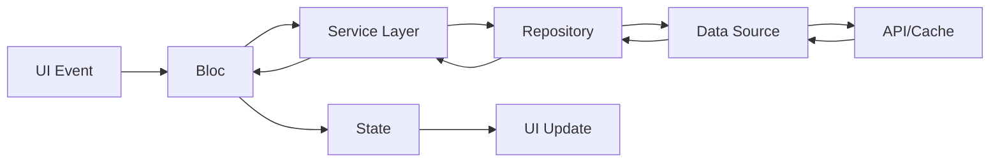

```dart
// 完整的数据流示例：充电桩查找
class ChargingStationBloc extends Bloc<ChargingStationEvent, ChargingStationState> {
  final ChargingStationRepository repository;
  
  ChargingStationBloc(this.repository) : super(ChargingStationInitial()) {
    on<LoadNearbyStations>(_onLoadNearbyStations);
  }
  
  Future<void> _onLoadNearbyStations(
    LoadNearbyStations event,
    Emitter<ChargingStationState> emit,
  ) async {
    emit(ChargingStationLoading());
    
    try {
      // 1. 通过Repository获取数据
      final stations = await repository.findNearbyStations(
        event.location,
        radius: event.radius,
      );
      
      // 2. 发射新状态
      emit(ChargingStationLoaded(stations));
    } catch (error) {
      emit(ChargingStationError(error.toString()));
    }
  }
}

// Repository层实现数据来源策略
class ChargingStationRepository {
  final ChargingStationApi _api;
  final ChargingStationCache _cache;
  
  Future<List<ChargingStation>> findNearbyStations(
    LatLng location, {
    int radius = 5000,
  }) async {
    // 1. 尝试从缓存获取
    final cached = await _cache.getNearbyStations(location, radius);
    if (cached.isNotEmpty && !_cache.isExpired(location)) {
      return cached;
    }
    
    // 2. 从API获取最新数据
    final stations = await _api.findNearbyStations(location, radius);
    
    // 3. 更新缓存
    await _cache.cacheStations(location, stations);
    
    return stations;
  }
}
```

## 总结

### 1. OneApp架构设计优势

#### 1.1 技术架构优势

**模块化设计**
- ✅ **独立开发**: 各业务模块可并行开发，提升团队协作效率
- ✅ **版本管理**: 模块独立版本控制，降低发版风险
- ✅ **代码复用**: 基础设施模块在多个业务模块间复用
- ✅ **测试隔离**: 模块级别的单元测试和集成测试

**分层架构**
- ✅ **职责清晰**: UI层、业务层、服务层、基础设施层职责明确
- ✅ **易于维护**: 分层设计使代码结构清晰，便于维护和扩展
- ✅ **技术栈统一**: Flutter + Dart 统一技术栈，降低学习成本
- ✅ **平台一致性**: 跨平台UI和业务逻辑一致性

**性能与稳定性**
- ✅ **AOT编译**: Release模式下AOT编译保证运行性能
- ✅ **资源优化**: 按需加载和缓存机制优化资源使用
- ✅ **错误隔离**: 模块间错误隔离，提升应用稳定性
- ✅ **监控完备**: 性能监控、错误上报、日志系统完备

#### 1.2 业务架构优势

**功能丰富度**
```mermaid
mindmap
  root((OneApp功能))
    车辆服务
      远程控制
      状态监控
      维护提醒
      虚拟钥匙
    充电服务
      充电桩查找
      充电预约
      支付结算
      充电记录
    生活服务
      订单管理
      社区互动
      会员权益
      个人设置
    增值服务
      Touch&Go
      家充桩管理
      汽车销售
      售后服务
```

**用户体验**
- 🎯 **一致性**: 跨平台UI和交互一致性
- 🎯 **流畅性**: 60fps渲染和流畅的动画效果
- 🎯 **响应性**: 快速的页面加载和数据响应
- 🎯 **可用性**: 离线功能和网络异常处理

### 2. 面临的挑战

#### 2.1 技术挑战

**依赖管理复杂性**
```yaml
# 大量的dependency_overrides表明依赖版本冲突问题
dependency_overrides:
  meta: ^1.9.1
  collection: ^1.17.1
  path: ^1.8.3
  # ... 更多版本覆盖
```
- ⚠️ **版本冲突**: 大量`dependency_overrides`导致版本管理困难
- ⚠️ **构建时间**: 众多本地依赖导致构建时间较长
- ⚠️ **依赖维护**: 本地路径依赖的版本同步问题
- ⚠️ **模块粒度**: 部分模块粒度过小，增加了管理复杂度
- ⚠️ **循环依赖**: 某些模块间存在潜在的循环依赖风险

### 3. 架构演进方向

#### 3.1 短期优化

**依赖治理**
```yaml
# 目标：减少dependency_overrides
dependencies:
  # 统一基础依赖版本
  provider: ^6.1.1
  rxdart: ^0.27.7
  dio: ^5.3.2
```

**具体措施**
- 🔧 **版本统一**: 统一各模块的基础依赖版本
- 🔧 **依赖精简**: 合并功能相似的小模块
