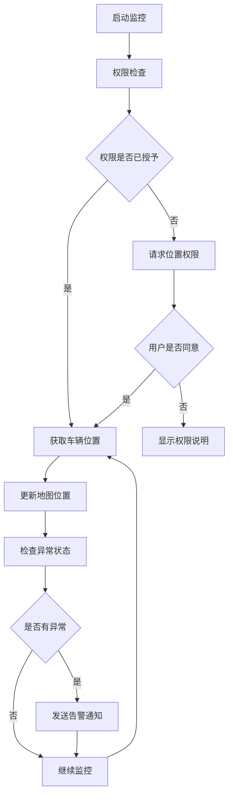
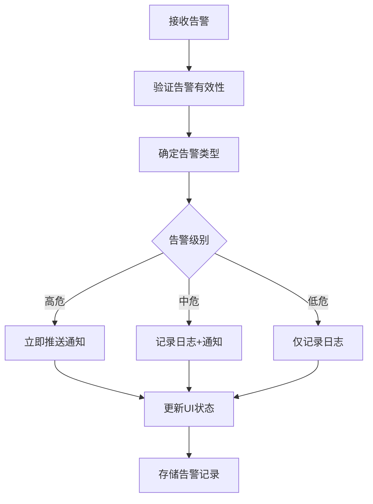

# App Carwatcher 车辆监控模块

## 模块概述

`app_carwatcher` 是 OneApp 车联网生态中的车辆监控模块，负责实时监控车辆状态、位置信息、安全警报等功能。该模块为用户提供全方位的车辆安全监控服务，确保车辆的安全性和用户的使用体验。

### 基本信息
- **模块名称**: app_carwatcher
- **版本**: 0.1.2
- **描述**: 车辆监控应用模块
- **Flutter 版本**: >=2.10.5
- **Dart 版本**: >=3.0.0 <4.0.0

## 功能特性

### 核心功能
1. **实时车辆监控**
   - 车辆位置实时追踪
   - 车辆状态监控（锁车状态、车窗状态等）
   - 车辆异常报警

2. **安全防护**
   - 防盗报警
   - 异常移动检测
   - 远程监控告警

3. **地图集成**
   - 车辆位置可视化
   - 历史轨迹查看
   - 地理围栏设置

4. **权限管理**
   - 位置权限管理
   - 用户授权验证
   - 隐私合规检查

## 技术架构

### 目录结构
```
lib/
├── app_carwatcher.dart           # 模块入口文件
├── src/                          # 源代码目录
│   ├── app_carwatcher_module.dart # 模块定义和依赖注入
│   ├── route_dp.dart             # 路由配置
│   ├── route_export.dart         # 路由导出
│   ├── blocs/                    # 状态管理
│   ├── constants/                # 常量定义
│   ├── pages/                    # 页面组件
│   └── utils/                    # 工具类
├── generated/                    # 代码生成文件
└── l10n/                        # 国际化文件
```

### 依赖关系

#### 核心依赖
- `basic_modular: ^0.2.3` - 模块化框架
- `basic_modular_route: ^0.2.1` - 路由管理
- `basic_intl: ^0.2.0` - 国际化支持
- `basic_consent: ^0.2.17` - 隐私合规

#### 业务依赖
- `app_consent: ^0.2.19` - 用户同意模块
- `ui_mapview: ^0.2.18` - 地图视图组件
- `clr_geo: ^0.2.16+1` - 地理位置服务
- `clr_carwatcher: ^0.1.0` - 车辆监控服务SDK

#### 第三方依赖
- `permission_handler: ^10.3.0` - 权限管理
- `json_annotation: ^4.8.1` - JSON序列化
- `dartz: ^0.10.1` - 函数式编程

## 核心模块分析

### 1. 模块入口 (`app_carwatcher.dart`)

**功能职责**:
- 模块对外接口统一导出
- 核心组件暴露

**导出内容**:
```dart
export 'src/app_carwatcher_module.dart';  // 模块定义
export 'src/route_dp.dart';              // 路由配置
export 'src/route_export.dart';          // 路由导出
```

### 2. 模块定义 (`src/app_carwatcher_module.dart`)

**功能职责**:
- 模块依赖注入配置
- 服务注册和生命周期管理
- 模块初始化逻辑

**主要功能**:
- 注册车辆监控相关服务
- 配置模块路由
- 初始化地图服务
- 设置权限管理

### 3. 路由配置 (`src/route_dp.dart` & `src/route_export.dart`)

**功能职责**:
- 定义模块内部路由
- 配置页面导航规则
- 对外路由接口暴露

**路由功能**:
- 车辆监控主页面
- 车辆位置详情页
- 历史轨迹查看页
- 安全设置页面

### 4. 状态管理 (`src/blocs/`)

**功能职责**:
- 车辆状态数据管理
- 位置信息状态维护
- 监控告警状态处理

**主要BLoC**:
- `CarwatcherBloc` - 车辆监控主状态
- `LocationBloc` - 位置信息状态
- `AlertBloc` - 告警信息状态
- `PermissionBloc` - 权限状态管理

### 5. 页面组件 (`src/pages/`)

**功能职责**:
- 用户界面展示
- 用户交互处理
- 数据展示和操作

**主要页面**:
- `CarwatcherHomePage` - 监控主页
- `VehicleLocationPage` - 车辆位置页
- `TrackHistoryPage` - 轨迹历史页
- `SecuritySettingsPage` - 安全设置页

### 6. 工具类 (`src/utils/`)

**功能职责**:
- 业务工具方法
- 数据处理辅助
- 通用功能封装

**主要工具**:
- 地理位置计算工具
- 时间格式化工具
- 数据转换工具
- 权限检查工具

### 7. 常量定义 (`src/constants/`)

**功能职责**:
- 模块常量定义
- 配置参数管理
- 错误码定义

**常量类型**:
- API接口常量
- 业务配置常量
- 错误消息常量
- UI配置常量

## 业务流程

### 车辆监控流程


### 告警处理流程


## 安全特性

### 隐私保护
- 位置数据加密传输
- 本地数据安全存储
- 用户隐私合规检查
- 数据访问权限控制

### 数据安全
- API接口安全认证
- 数据传输加密
- 敏感信息脱敏
- 防重放攻击机制

## 性能优化

### 位置服务优化
- 智能定位频率调节
- 低功耗定位策略
- 位置缓存机制
- 网络状态适配

### 内存管理
- 历史数据定期清理
- 地图资源释放
- 状态对象生命周期管理
- 内存泄漏防护

## 扩展性设计

### 插件化架构
- 监控功能模块化
- 告警策略可配置
- 第三方服务集成
- 自定义监控规则

### 配置化管理
- 监控参数可配置
- 告警阈值动态调整
- UI界面个性化
- 功能开关控制

## 测试策略

### 单元测试
- BLoC状态测试
- 工具类方法测试
- 数据模型测试
- 权限逻辑测试

### 集成测试
- 地图集成测试
- 位置服务测试
- 告警流程测试
- 权限流程测试

### UI测试
- 页面渲染测试
- 用户交互测试
- 导航流程测试
- 异常场景测试

## 部署和维护

### 构建配置
- 多环境构建支持
- 权限配置检查
- 资源文件优化
- 代码混淆配置

### 监控指标
- 定位成功率
- 告警响应时间
- 用户活跃度
- 异常错误率

## 总结

`app_carwatcher` 模块作为 OneApp 的重要安全组件，提供了全面的车辆监控解决方案。通过模块化的设计、完善的权限管理和智能的告警机制，为用户提供可靠的车辆安全保障。模块具有良好的扩展性和维护性，能够适应不断变化的业务需求。
