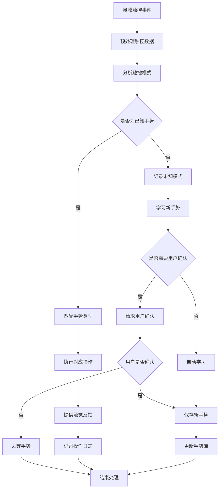
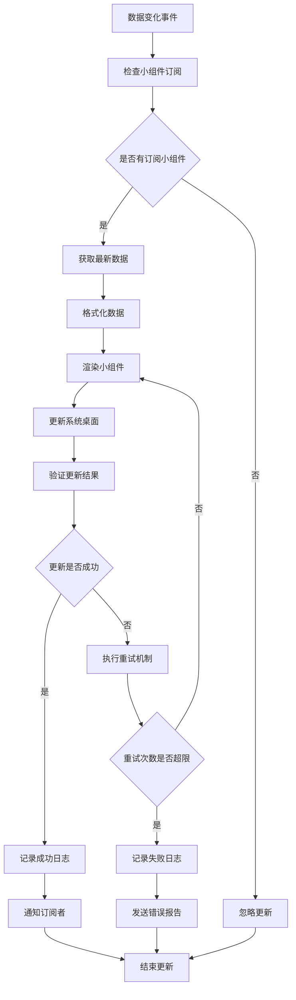

# App TouchGo 触控交互模块

## 模块概述

`app_touchgo` 是 OneApp 车联网生态中的触控交互模块，负责车辆的触控操作、手势识别、快捷操作等功能。该模块为用户提供直观便捷的车辆交互体验，通过手势和触控操作简化车辆控制流程。

### 基本信息
- **模块名称**: app_touchgo
- **版本**: 0.1.5
- **描述**: 触控交互应用模块
- **Flutter 版本**: >=2.5.0
- **Dart 版本**: >=2.16.2 <4.0.0

## 功能特性

### 核心功能
1. **触控交互**
   - 多点触控识别
   - 手势操作识别
   - 快捷操作设置
   - 触控反馈优化

2. **桌面小组件**
   - 车辆状态小组件
   - 快捷控制小组件
   - 信息展示小组件
   - 自定义小组件

3. **地理位置集成**
   - 基于位置的操作
   - 地理围栏触发
   - 位置相关提醒
   - 地图触控交互

4. **车辆服务集成**
   - 车辆控制接口
   - 状态信息获取
   - 服务调用优化
   - 实时数据同步

## 技术架构

### 目录结构
```
lib/
├── app_touchgo.dart             # 模块入口文件
├── src/                         # 源代码目录
│   ├── gestures/                # 手势识别
│   ├── widgets/                 # 桌面小组件
│   ├── controllers/             # 控制器
│   ├── services/                # 服务层
│   ├── pages/                   # 页面组件
│   ├── models/                  # 数据模型
│   └── utils/                   # 工具类
├── generated/                   # 代码生成文件
└── l10n/                       # 国际化文件
```

### 依赖关系

#### 核心依赖
- `basic_modular: ^0.2.3` - 模块化框架
- `basic_modular_route: ^0.2.1` - 路由管理
- `basic_intl_flutter: ^0.2.2+1` - 国际化Flutter支持
- `basic_intl: ^0.2.0` - 国际化基础
- `basic_logger: ^0.2.2` - 日志系统

#### 业务依赖
- `ui_basic: ^0.2.17` - 基础UI组件
- `car_services: ^0.6.1` - 车辆服务
- `car_vehicle: ^0.6.4+1` - 车辆控制
- `clr_geo: ^0.2.16+1` - 地理位置服务
- `clr_touchgo: ^0.1.3` - 触控服务SDK

#### 第三方依赖
- `json_annotation: ^4.8.1` - JSON序列化
- `dartz: ^0.10.1` - 函数式编程
- `home_widget: ^0.6.0` - 桌面小组件
- `amap_flutter_base: ^3.0.4` - 高德地图基础
- `amap_flutter_search: ^0.0.17` - 高德地图搜索

## 核心模块分析

### 1. 模块入口 (`app_touchgo.dart`)

**功能职责**:
- 模块对外接口统一导出
- 触控服务初始化
- 手势识别引擎启动

### 2. 手势识别 (`src/gestures/`)

**功能职责**:
- 多点触控处理
- 手势模式识别
- 自定义手势定义
- 手势事件分发

**主要组件**:
- `GestureDetector` - 手势检测器
- `TouchProcessor` - 触控处理器
- `GestureRecognizer` - 手势识别器
- `CustomGestureBuilder` - 自定义手势构建器

**支持的手势类型**:
- 单击/双击
- 长按操作
- 滑动手势
- 缩放手势
- 旋转手势
- 多指操作

### 3. 桌面小组件 (`src/widgets/`)

**功能职责**:
- 原生桌面小组件
- 车辆信息展示
- 快捷操作入口
- 实时数据更新

**主要小组件**:
- `VehicleStatusWidget` - 车辆状态小组件
- `QuickControlWidget` - 快捷控制小组件
- `LocationWidget` - 位置信息小组件
- `BatteryWidget` - 电池状态小组件

### 4. 控制器 (`src/controllers/`)

**功能职责**:
- 触控事件处理
- 车辆操作控制
- 状态管理协调
- 数据流控制

**主要控制器**:
- `TouchController` - 触控控制器
- `VehicleController` - 车辆控制器
- `WidgetController` - 小组件控制器
- `GestureController` - 手势控制器

### 5. 服务层 (`src/services/`)

**功能职责**:
- 车辆服务接口
- 地理位置服务
- 小组件数据服务
- 触控数据处理

**主要服务**:
- `VehicleService` - 车辆服务
- `LocationService` - 位置服务
- `WidgetDataService` - 小组件数据服务
- `TouchDataService` - 触控数据服务

### 6. 页面组件 (`src/pages/`)

**功能职责**:
- 用户界面展示
- 交互配置页面
- 手势设置页面
- 小组件管理页面

**主要页面**:
- `TouchGoHomePage` - 触控主页
- `GestureConfigPage` - 手势配置页
- `WidgetManagementPage` - 小组件管理页
- `TouchSettingsPage` - 触控设置页

### 7. 数据模型 (`src/models/`)

**功能职责**:
- 触控数据模型
- 手势配置模型
- 小组件数据模型
- 车辆状态模型

**主要模型**:
- `TouchEvent` - 触控事件模型
- `GestureConfig` - 手势配置模型
- `WidgetData` - 小组件数据模型
- `VehicleStatus` - 车辆状态模型

### 8. 工具类 (`src/utils/`)

**功能职责**:
- 触控工具方法
- 手势计算工具
- 数据转换工具
- 性能优化工具

**主要工具**:
- `TouchCalculator` - 触控计算器
- `GestureAnalyzer` - 手势分析器
- `WidgetRenderer` - 小组件渲染器
- `PerformanceOptimizer` - 性能优化器

## 业务流程

### 手势识别流程


### 小组件更新流程


## 触控交互设计

### 手势类型
1. **基础手势**
   - 单击：快速操作
   - 双击：确认操作
   - 长按：菜单操作
   - 滑动：切换操作

2. **复合手势**
   - 双指缩放：调整参数
   - 三指滑动：切换模式
   - 多指点击：组合操作
   - 自定义手势：个性化操作

3. **上下文手势**
   - 基于位置的手势
   - 基于时间的手势
   - 基于状态的手势
   - 基于场景的手势

### 反馈机制
- **触觉反馈**: 震动反馈
- **视觉反馈**: 动画效果
- **听觉反馈**: 提示音效
- **语音反馈**: 语音确认

## 小组件设计

### 小组件类型
1. **信息展示类**
   - 车辆状态展示
   - 电池电量显示
   - 位置信息显示
   - 天气信息显示

2. **快捷操作类**
   - 一键锁车/解锁
   - 空调控制
   - 充电控制
   - 导航启动

3. **监控类**
   - 安全状态监控
   - 异常告警显示
   - 维护提醒
   - 服务通知

### 更新策略
- **实时更新**: 关键状态信息
- **定时更新**: 定期刷新数据
- **事件更新**: 状态变化触发
- **手动更新**: 用户主动刷新

## 安全特性

### 权限控制
- 触控操作权限验证
- 敏感功能授权检查
- 用户身份认证
- 操作审计记录

### 数据保护
- 触控数据加密存储
- 手势模式隐私保护
- 敏感操作二次确认
- 数据传输安全

## 性能优化

### 触控优化
- 触控事件去抖动
- 手势识别算法优化
- 响应时间优化
- 内存使用优化

### 小组件优化
- 数据缓存机制
- 增量更新策略
- 渲染性能优化
- 电池续航优化

## 扩展性设计

### 插件化架构
- 自定义手势插件
- 第三方小组件集成
- 扩展触控功能
- 自定义反馈机制

### 配置化管理
- 手势灵敏度配置
- 反馈强度设置
- 小组件布局配置
- 个性化定制

## 测试策略

### 单元测试
- 手势识别算法测试
- 触控事件处理测试
- 数据模型测试
- 工具类方法测试

### 集成测试
- 车辆服务集成测试
- 小组件功能测试
- 地理位置集成测试
- 完整交互流程测试

### 用户体验测试
- 手势响应速度测试
- 操作准确性测试
- 用户满意度测试
- 易用性评估

## 部署和维护

### 配置管理
- 手势库配置
- 小组件模板配置
- 性能参数调优
- 权限策略配置

### 监控指标
- 手势识别准确率
- 触控响应时间
- 小组件更新成功率
- 用户操作频率

## 总结

`app_touchgo` 模块作为 OneApp 的触控交互中心，为用户提供了直观便捷的车辆操作体验。通过先进的手势识别技术、丰富的桌面小组件和智能的触控反馈，用户可以更自然地与车辆进行交互。模块具有良好的扩展性和个性化能力，能够适应不同用户的使用习惯和需求。
