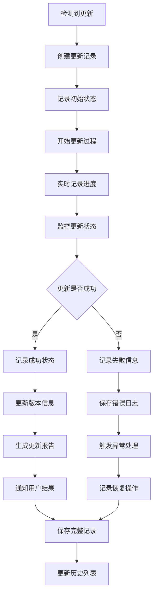
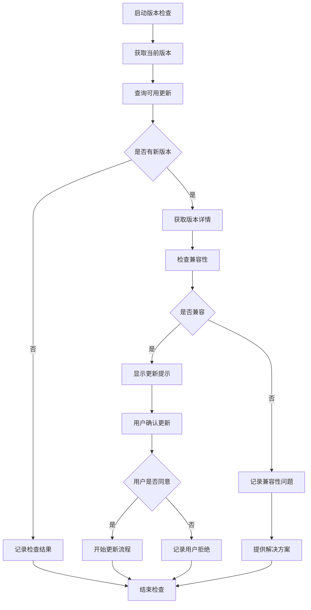

# App VUR 车辆更新记录模块

## 模块概述

`app_vur` 是 OneApp 车联网生态中的 VUR（Vehicle Update Record）车辆更新记录模块，负责车辆软件更新、固件升级、系统维护记录等功能。该模块为用户提供完整的车辆更新历史追踪和管理服务。

### 基本信息
- **模块名称**: app_vur
- **版本**: 0.1.25
- **描述**: 车辆更新记录应用模块
- **Flutter 版本**: >=2.5.0
- **Dart 版本**: >=2.16.2 <4.0.0

## 功能特性

### 核心功能
1. **更新记录管理**
   - 软件更新历史记录
   - 固件升级跟踪
   - 系统维护日志
   - 版本变更记录

2. **更新进度监控**
   - 实时更新进度显示
   - 更新状态跟踪
   - 错误信息收集
   - 回滚操作支持

3. **版本信息展示**
   - 当前系统版本信息
   - 可用更新检查
   - 版本差异对比
   - 更新说明展示

4. **分享和导出**
   - 更新记录分享
   - 日志文件导出
   - 报告生成功能
   - 技术支持数据

## 技术架构

### 目录结构
```
lib/
├── app_vur.dart                 # 模块入口文件
├── src/                         # 源代码目录
│   ├── records/                 # 记录管理
│   ├── updates/                 # 更新处理
│   ├── versions/                # 版本管理
│   ├── monitoring/              # 监控组件
│   ├── pages/                   # 页面组件
│   ├── models/                  # 数据模型
│   └── utils/                   # 工具类
├── generated/                   # 代码生成文件
└── l10n/                       # 国际化文件
```

### 依赖关系

#### 核心依赖
- `basic_modular: ^0.2.3` - 模块化框架
- `basic_modular_route: ^0.2.1` - 路由管理
- `basic_intl: ^0.2.0` - 国际化基础
- `basic_intl_flutter: ^0.2.2+1` - 国际化Flutter支持

#### 业务依赖
- `car_vur: ^0.1.12` - VUR服务SDK
- `basic_webview: ^0.2.4` - WebView组件
- `app_consent: ^0.2.19` - 用户同意模块
- `basic_consent: ^0.2.17` - 基础同意框架
- `basic_share: ^0.2.1` - 基础分享服务
- `ui_share: ^0.2.0` - 分享UI组件

#### 第三方依赖
- `json_annotation: ^4.8.1` - JSON序列化
- `dartz: ^0.10.1` - 函数式编程
- `super_tooltip: ^2.0.8` - 提示框组件
- `just_the_tooltip: ^0.0.12` - 轻量级提示框

## 核心模块分析

### 1. 模块入口 (`app_vur.dart`)

**功能职责**:
- 模块对外接口统一导出
- VUR服务初始化
- 更新监控启动

### 2. 记录管理 (`src/records/`)

**功能职责**:
- 更新记录存储和管理
- 历史数据查询
- 记录分类和筛选
- 数据备份和恢复

**主要组件**:
- `RecordManager` - 记录管理器
- `RecordStorage` - 记录存储
- `RecordQuery` - 记录查询
- `RecordBackup` - 记录备份

### 3. 更新处理 (`src/updates/`)

**功能职责**:
- 更新任务处理
- 更新进度跟踪
- 更新状态管理
- 异常处理和恢复

**主要组件**:
- `UpdateProcessor` - 更新处理器
- `ProgressTracker` - 进度跟踪器
- `StatusManager` - 状态管理器
- `ErrorHandler` - 错误处理器

### 4. 版本管理 (`src/versions/`)

**功能职责**:
- 版本信息管理
- 版本比较和分析
- 兼容性检查
- 依赖关系处理

**主要组件**:
- `VersionManager` - 版本管理器
- `VersionComparator` - 版本比较器
- `CompatibilityChecker` - 兼容性检查器
- `DependencyResolver` - 依赖解析器

### 5. 监控组件 (`src/monitoring/`)

**功能职责**:
- 更新过程监控
- 性能指标收集
- 异常检测和报告
- 系统健康状态监控

**主要监控器**:
- `UpdateMonitor` - 更新监控器
- `PerformanceCollector` - 性能收集器
- `HealthChecker` - 健康检查器
- `AlertManager` - 告警管理器

### 6. 页面组件 (`src/pages/`)

**功能职责**:
- 用户界面展示
- 更新记录展示
- 版本信息页面
- 设置配置页面

**主要页面**:
- `VURHomePage` - VUR主页
- `UpdateHistoryPage` - 更新历史页
- `VersionInfoPage` - 版本信息页
- `UpdateProgressPage` - 更新进度页
- `SettingsPage` - 设置页面

### 7. 数据模型 (`src/models/`)

**功能职责**:
- 更新记录数据模型
- 版本信息模型
- 进度状态模型
- 配置参数模型

**主要模型**:
- `UpdateRecord` - 更新记录模型
- `VersionInfo` - 版本信息模型
- `UpdateProgress` - 更新进度模型
- `VURConfig` - VUR配置模型

### 8. 工具类 (`src/utils/`)

**功能职责**:
- VUR工具方法
- 数据处理辅助
- 文件操作工具
- 格式化工具

**主要工具**:
- `RecordFormatter` - 记录格式化器
- `DataExporter` - 数据导出器
- `LogAnalyzer` - 日志分析器
- `ReportGenerator` - 报告生成器

## 业务流程

### 更新记录流程


### 版本检查流程


## VUR系统设计

### 记录类型
1. **软件更新记录**
   - 应用程序更新
   - 系统软件更新
   - 驱动程序更新
   - 配置文件更新

2. **固件升级记录**
   - ECU固件升级
   - 传感器固件更新
   - 通信模块更新
   - 安全模块升级

3. **维护记录**
   - 系统诊断记录
   - 性能优化记录
   - 清理维护记录
   - 配置修改记录

4. **回滚记录**
   - 更新回滚操作
   - 版本降级记录
   - 恢复操作日志
   - 紧急修复记录

### 状态管理
- **待更新**: 检测到可用更新
- **下载中**: 正在下载更新包
- **准备中**: 准备安装更新
- **安装中**: 正在安装更新
- **验证中**: 验证更新结果
- **完成**: 更新成功完成
- **失败**: 更新过程失败
- **回滚**: 执行回滚操作

## 安全特性

### 数据完整性
- 更新记录数字签名
- 数据校验和验证
- 记录篡改检测
- 备份数据验证

### 隐私保护
- 敏感信息加密存储
- 用户数据脱敏处理
- 访问权限控制
- 数据传输加密

## 性能优化

### 存储优化
- 记录数据压缩
- 过期数据清理
- 索引优化设计
- 查询性能优化

### 内存管理
- 大数据分页加载
- 缓存机制优化
- 内存使用监控
- 资源及时释放

## 扩展性设计

### 插件化架构
- 自定义记录类型
- 第三方更新源集成
- 扩展监控功能
- 自定义报告格式

### 配置化管理
- 记录保留策略配置
- 监控规则可配置
- 报告模板定制
- 告警阈值设置

## 测试策略

### 单元测试
- 记录管理逻辑测试
- 版本比较算法测试
- 数据模型测试
- 工具类方法测试

### 集成测试
- 更新流程端到端测试
- 服务集成测试
- 数据持久化测试
- 异常场景测试

### 性能测试
- 大量记录处理测试
- 查询性能测试
- 内存使用测试
- 并发访问测试

## 部署和维护

### 配置管理
- 记录存储配置
- 更新策略配置
- 监控参数设置
- 性能调优参数

### 监控指标
- 更新成功率
- 记录查询响应时间
- 存储空间使用率
- 异常错误统计

## 总结

`app_vur` 模块作为 OneApp 的车辆更新记录中心，为用户提供了完整的车辆软硬件更新历史追踪服务。通过详细的记录管理、实时的进度监控和完善的版本管理，用户可以全面了解车辆的更新状态和历史变更。模块具有良好的数据完整性保障和性能优化设计，能够可靠地记录和管理车辆的各类更新信息。
