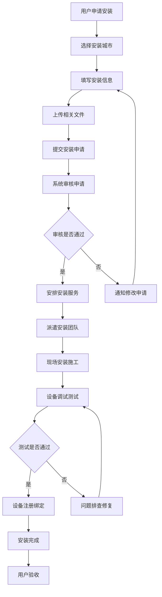
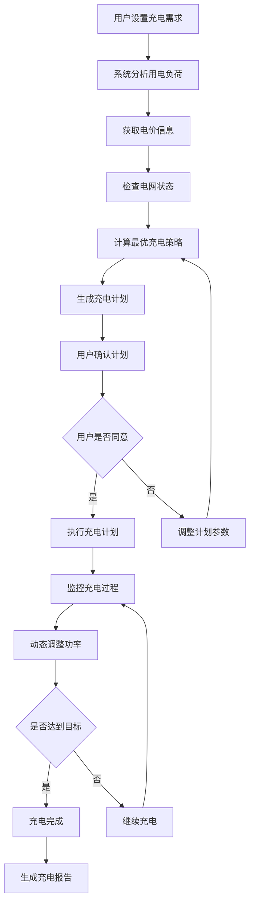

# App Wallbox 充电墙盒模块

## 模块概述

`app_wallbox` 是 OneApp 车联网生态中的充电墙盒管理模块，负责家用充电桩（墙盒）的管理、安装、配置和监控等功能。该模块为用户提供完整的家庭充电解决方案管理服务。

### 基本信息
- **模块名称**: app_wallbox
- **版本**: 0.2.29
- **描述**: 充电墙盒应用模块
- **Flutter 版本**: >=2.10.5
- **Dart 版本**: >=3.0.0 <4.0.0

## 功能特性

### 核心功能
1. **墙盒设备管理**
   - 设备注册和绑定
   - 设备状态监控
   - 设备配置管理
   - 设备固件升级

2. **安装服务**
   - 安装预约申请
   - 安装进度跟踪
   - 安装城市选择
   - 安装文件上传

3. **充电管理**
   - 远程充电控制
   - 充电计划设置
   - 充电记录查看
   - 电费统计分析

4. **智能功能**
   - 智能充电调度
   - 电网负荷优化
   - 太阳能集成
   - 能源管理优化

## 技术架构

### 目录结构
```
lib/
├── app_wallbox.dart             # 模块入口文件
├── src/                         # 源代码目录
│   ├── devices/                 # 设备管理
│   ├── installation/            # 安装服务
│   ├── charging/                # 充电控制
│   ├── monitoring/              # 监控组件
│   ├── smart/                   # 智能功能
│   ├── pages/                   # 页面组件
│   ├── models/                  # 数据模型
│   └── utils/                   # 工具类
├── generated/                   # 代码生成文件
└── l10n/                       # 国际化文件
```

### 依赖关系

#### 核心依赖
- `basic_modular: ^0.2.3` - 模块化框架
- `basic_modular_route: ^0.2.1` - 路由管理
- `basic_resource: ^0.2.10` - 资源管理
- `basic_intl: ^0.2.0` - 国际化支持
- `basic_storage: ^0.2.2` - 本地存储
- `basic_network: ^0.2.3+3` - 网络通信
- `basic_track: ^0.1.3` - 数据埋点

#### 业务依赖
- `ui_business: ^0.2.23` - 业务UI组件

#### 第三方依赖
- `json_annotation: ^4.6.0` - JSON序列化
- `dartz: ^0.10.1` - 函数式编程
- `extended_image: ^8.2.3` - 增强图片组件
- `url_launcher: ^6.1.4` - URL启动
- `collection: ^1.17.1` - 集合工具
- `path_provider: ^2.0.15` - 文件路径
- `path: ^1.8.3` - 路径操作

## 核心模块分析

### 1. 模块入口 (`app_wallbox.dart`)

**功能职责**:
- 模块对外接口统一导出
- 墙盒服务初始化
- 设备管理启动

### 2. 设备管理 (`src/devices/`)

**功能职责**:
- 墙盒设备注册和绑定
- 设备状态实时监控
- 设备配置参数管理
- 设备固件和软件升级

**主要组件**:
- `DeviceManager` - 设备管理器
- `DeviceRegistry` - 设备注册表
- `StatusMonitor` - 状态监控器
- `ConfigManager` - 配置管理器
- `FirmwareUpdater` - 固件升级器

### 3. 安装服务 (`src/installation/`)

**功能职责**:
- 安装服务预约和申请
- 安装进度实时跟踪
- 安装城市和地区选择
- 安装相关文件上传管理

**主要组件**:
- `InstallationService` - 安装服务
- `ProgressTracker` - 进度跟踪器
- `CityPicker` - 城市选择器
- `UploadManager` - 文件上传管理器
- `AppointmentManager` - 预约管理器

### 4. 充电控制 (`src/charging/`)

**功能职责**:
- 远程充电启停控制
- 充电计划和策略设置
- 充电过程监控
- 充电数据记录和分析

**主要组件**:
- `ChargingController` - 充电控制器
- `ScheduleManager` - 计划管理器
- `ProcessMonitor` - 过程监控器
- `DataRecorder` - 数据记录器

### 5. 监控组件 (`src/monitoring/`)

**功能职责**:
- 设备运行状态监控
- 充电过程实时监控
- 异常检测和告警
- 性能指标收集

**主要监控器**:
- `DeviceMonitor` - 设备监控器
- `ChargingMonitor` - 充电监控器
- `AlertManager` - 告警管理器
- `MetricsCollector` - 指标收集器

### 6. 智能功能 (`src/smart/`)

**功能职责**:
- 智能充电调度算法
- 电网负荷平衡优化
- 可再生能源集成
- 能源成本优化

**主要组件**:
- `SmartScheduler` - 智能调度器
- `LoadBalancer` - 负荷均衡器
- `EnergyOptimizer` - 能源优化器
- `GridInterface` - 电网接口

### 7. 页面组件 (`src/pages/`)

**功能职责**:
- 用户界面展示
- 设备管理界面
- 充电控制界面
- 安装服务界面

**主要页面**:
- `WallboxHomePage` - 墙盒主页
- `DeviceManagementPage` - 设备管理页
- `ChargingControlPage` - 充电控制页
- `InstallationPage` - 安装服务页
- `MonitoringDashboard` - 监控仪表板

### 8. 数据模型 (`src/models/`)

**功能职责**:
- 设备信息数据模型
- 充电数据模型
- 安装服务模型
- 配置参数模型

**主要模型**:
- `WallboxDevice` - 墙盒设备模型
- `ChargingSession` - 充电会话模型
- `InstallationOrder` - 安装订单模型
- `DeviceConfig` - 设备配置模型

### 9. 工具类 (`src/utils/`)

**功能职责**:
- 墙盒工具方法
- 数据处理辅助
- 文件操作工具
- 计算辅助工具

**主要工具**:
- `PowerCalculator` - 功率计算器
- `EnergyAnalyzer` - 能源分析器
- `FileUploader` - 文件上传器
- `DataFormatter` - 数据格式化器

## 业务流程

### 设备安装流程


### 智能充电流程


## 墙盒系统设计

### 设备类型
1. **家用标准墙盒**
   - 7kW交流充电
   - 单相/三相供电
   - WiFi/以太网连接
   - 基础智能功能

2. **商用快充墙盒**
   - 22kW交流快充
   - 三相供电
   - 有线网络连接
   - 高级智能功能

3. **智能墙盒**
   - 可变功率充电
   - 太阳能集成
   - 储能系统集成
   - AI优化算法

### 通信协议
- **OCPP**: 开放充电点协议
- **Modbus**: 工业通信协议
- **HTTP/HTTPS**: Web API通信
- **MQTT**: 物联网消息协议

## 安全特性

### 设备安全
- 设备身份认证
- 通信数据加密
- 固件签名验证
- 安全升级机制

### 用户安全
- 用户身份验证
- 操作权限控制
- 敏感数据保护
- 安全审计日志

## 性能优化

### 通信优化
- 数据压缩传输
- 断线重连机制
- 离线数据缓存
- 网络自适应

### 能效优化
- 智能功率调节
- 负荷均衡算法
- 能源损耗最小化
- 电网友好充电

## 扩展性设计

### 协议支持
- 多种通信协议适配
- 标准协议兼容
- 自定义协议扩展
- 协议版本升级

### 设备兼容
- 多厂商设备支持
- 不同型号适配
- 新设备快速接入
- 设备能力自动识别

## 测试策略

### 单元测试
- 充电控制逻辑测试
- 设备通信测试
- 数据模型测试
- 算法功能测试

### 集成测试
- 设备集成测试
- 系统端到端测试
- 协议兼容性测试
- 性能压力测试

### 现场测试
- 实际设备测试
- 网络环境测试
- 用户场景测试
- 长期稳定性测试

## 部署和维护

### 设备管理
- 设备远程配置
- 固件OTA升级
- 故障远程诊断
- 预防性维护

### 系统监控
- 设备在线率监控
- 充电成功率统计
- 系统性能监控
- 用户满意度跟踪

## 总结

`app_wallbox` 模块作为 OneApp 的家庭充电解决方案中心，为用户提供了完整的充电墙盒管理服务。通过智能的设备管理、便捷的安装服务和高效的充电控制，用户可以享受到安全、智能、经济的家庭充电体验。模块具有良好的设备兼容性和扩展能力，能够适应不断发展的充电技术和用户需求。
