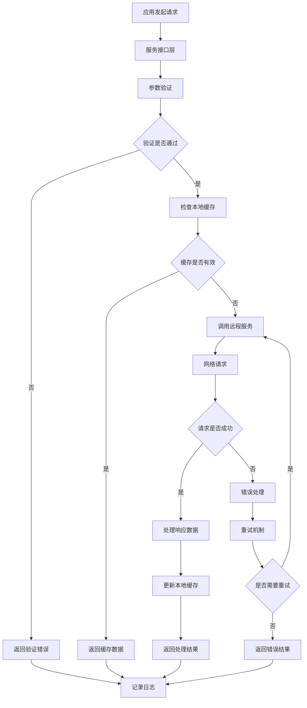
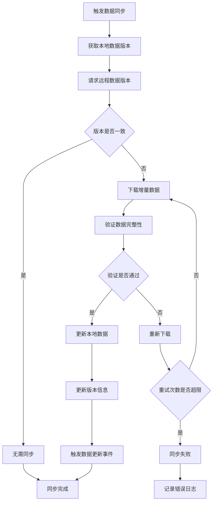

# Car Services 车辆服务模块

## 模块概述

`car_services` 是 OneApp 车联网生态中的车辆服务模块，负责车辆核心服务的统一接口封装、车辆数据处理、服务调用管理和业务逻辑抽象等功能。该模块为上层应用提供了统一的车辆服务接口。

### 基本信息
- **模块名称**: car_services
- **版本**: 0.6.25
- **描述**: 车辆服务统一接口模块
- **Flutter 版本**: >=2.10.5
- **Dart 版本**: >=3.0.0 <4.0.08

## 功能特性

### 核心功能
1. **服务接口统一**
   - 车辆控制接口封装
   - 数据查询接口标准化
   - 异步调用管理
   - 错误处理统一

2. **数据模型管理**
   - 车辆状态数据模型
   - 服务请求响应模型
   - 配置参数模型
   - 业务实体模型

3. **服务调用优化**
   - 请求缓存机制
   - 批量操作支持
   - 超时重试机制
   - 并发控制管理

4. **业务逻辑抽象**
   - 领域驱动设计
   - 服务层解耦
   - 依赖注入支持
   - 模块化架构

## 技术架构

### 目录结构
```
lib/
├── car_services.dart           # 模块入口文件
├── src/                        # 源代码目录
│   ├── services/               # 服务实现
│   ├── models/                 # 数据模型
│   ├── repositories/           # 数据仓库
│   ├── interfaces/             # 接口定义
│   ├── utils/                  # 工具类
│   └── constants/              # 常量定义
├── test/                       # 测试文件
└── generated/                  # 代码生成文件
```

### 依赖关系

#### 核心框架依赖
- `basic_modular: ^0.2.3` - 模块化框架
- `basic_modular_route: ^0.2.1` - 路由管理
- `basic_network: ^0.2.3+4` - 网络通信框架
- `basic_intl: ^0.2.0` - 国际化支持

#### 业务依赖
- `car_connector: ^0.4.11` - 车联网连接器

#### 工具依赖
- `dartz: ^0.10.1` - 函数式编程
- `freezed_annotation: ^2.2.0` - 数据类注解

#### 开发依赖
- `build_runner: ^2.4.9` - 代码生成引擎
- `freezed: ^2.4.7` - 不可变类生成
- `json_serializable: ^6.7.0` - JSON序列化
- `mockito: ^5.4.1` - 测试模拟框架

## 核心模块分析

### 1. 模块入口 (`car_services.dart`)

**功能职责**:
- 服务模块对外接口导出
- 依赖注入配置
- 模块初始化管理

### 2. 服务实现 (`src/services/`)

**功能职责**:
- 车辆控制服务实现
- 数据查询服务实现
- 状态监控服务实现
- 配置管理服务实现

**主要服务**:
- `VehicleControlService` - 车辆控制服务
- `VehicleDataService` - 车辆数据服务
- `VehicleStatusService` - 车辆状态服务
- `VehicleConfigService` - 车辆配置服务
- `DiagnosticService` - 诊断服务

### 3. 数据模型 (`src/models/`)

**功能职责**:
- 业务数据模型定义
- 请求响应模型
- 状态信息模型
- 配置参数模型

**主要模型**:
- `VehicleInfo` - 车辆信息模型
- `VehicleStatus` - 车辆状态模型
- `ControlCommand` - 控制命令模型
- `ServiceRequest` - 服务请求模型
- `ServiceResponse` - 服务响应模型

### 4. 数据仓库 (`src/repositories/`)

**功能职责**:
- 数据访问层抽象
- 本地缓存管理
- 远程数据获取
- 数据同步控制

**主要仓库**:
- `VehicleRepository` - 车辆数据仓库
- `ConfigRepository` - 配置数据仓库
- `StatusRepository` - 状态数据仓库
- `HistoryRepository` - 历史数据仓库

### 5. 接口定义 (`src/interfaces/`)

**功能职责**:
- 服务接口抽象定义
- 依赖倒置实现
- 接口规范约束
- 扩展性支持

**主要接口**:
- `IVehicleService` - 车辆服务接口
- `IDataRepository` - 数据仓库接口
- `IStatusProvider` - 状态提供者接口
- `IConfigManager` - 配置管理接口

### 6. 工具类 (`src/utils/`)

**功能职责**:
- 数据转换工具
- 验证工具方法
- 缓存工具
- 网络工具

**主要工具**:
- `DataConverter` - 数据转换器
- `Validator` - 数据验证器
- `CacheHelper` - 缓存助手
- `NetworkHelper` - 网络助手

### 7. 常量定义 (`src/constants/`)

**功能职责**:
- 服务常量定义
- 错误码管理
- 配置常量
- API端点定义

**主要常量**:
- `ServiceConstants` - 服务常量
- `ErrorCodes` - 错误码定义
- `ApiEndpoints` - API端点
- `ConfigKeys` - 配置键值

## 业务流程

### 服务调用流程


### 数据同步流程


## 服务设计模式

### 领域驱动设计(DDD)
1. **实体层(Entity)**
   - 车辆实体
   - 用户实体
   - 订单实体
   - 配置实体

2. **值对象层(Value Object)**
   - 车辆状态
   - 位置信息
   - 时间范围
   - 配置项

3. **服务层(Service)**
   - 领域服务
   - 应用服务
   - 基础设施服务

4. **仓库层(Repository)**
   - 数据访问抽象
   - 缓存策略
   - 数据同步

### 依赖注入模式
- **接口抽象**: 定义服务契约
- **实现分离**: 具体实现与接口分离
- **生命周期管理**: 单例、瞬态、作用域
- **配置驱动**: 通过配置控制依赖关系

## 缓存策略

### 多级缓存架构
1. **内存缓存**
   - 热点数据缓存
   - LRU淘汰策略
   - 容量限制管理
   - 过期时间控制

2. **本地存储缓存**
   - 持久化数据存储
   - 离线数据支持
   - 增量更新机制
   - 数据压缩存储

3. **远程缓存**
   - CDN内容分发
   - 边缘节点缓存
   - 区域化数据
   - 负载均衡

### 缓存一致性
- **写通策略**: 同时更新缓存和数据源
- **写回策略**: 延迟写入数据源
- **失效策略**: 主动失效过期数据
- **版本控制**: 数据版本管理

## 错误处理机制

### 错误分类
1. **网络错误**
   - 连接超时
   - 网络不可达
   - 服务不可用
   - 限流熔断

2. **业务错误**
   - 参数验证失败
   - 业务规则违反
   - 权限不足
   - 数据不存在

3. **系统错误**
   - 内存不足
   - 存储空间不够
   - 系统异常
   - 未知错误

### 处理策略
- **重试机制**: 指数退避重试
- **熔断保护**: 快速失败机制
- **降级处理**: 服务降级策略
- **监控告警**: 异常监控报警

## 性能优化

### 请求优化
- **批量请求**: 减少网络往返
- **数据压缩**: 减少传输量
- **连接复用**: HTTP连接池
- **并发控制**: 限制并发数量

### 缓存优化
- **预加载**: 预测性数据加载
- **懒加载**: 按需数据加载
- **缓存预热**: 系统启动预热
- **缓存穿透保护**: 空值缓存

## 扩展性设计

### 插件化架构
- **服务插件**: 自定义服务实现
- **数据源插件**: 多数据源支持
- **缓存插件**: 自定义缓存策略
- **网络插件**: 网络适配器

### 配置化管理
- **服务配置**: 服务参数可配置
- **缓存配置**: 缓存策略可调整
- **网络配置**: 网络参数可设置
- **业务配置**: 业务规则可定制

## 测试策略

### 单元测试
- **服务逻辑测试**: 业务逻辑正确性
- **数据模型测试**: 序列化反序列化
- **工具类测试**: 工具方法功能
- **接口测试**: 接口契约验证

### 集成测试
- **服务集成测试**: 端到端流程
- **数据库集成测试**: 数据访问层
- **网络集成测试**: 网络通信
- **缓存集成测试**: 缓存机制

### 性能测试
- **压力测试**: 高并发场景
- **负载测试**: 正常负载下性能
- **容量测试**: 系统容量极限
- **稳定性测试**: 长时间运行

## 部署和维护

### 配置管理
- **环境配置**: 开发、测试、生产
- **服务配置**: API地址、超时设置
- **缓存配置**: 缓存策略参数
- **业务配置**: 业务规则参数

### 监控指标
- **性能指标**: 响应时间、吞吐量
- **错误指标**: 错误率、失败次数
- **资源指标**: CPU、内存使用率
- **业务指标**: 调用次数、成功率

## 总结

`car_services` 模块作为 OneApp 的车辆服务统一接口层，通过领域驱动设计和模块化架构，为上层应用提供了稳定、高效、可扩展的车辆服务能力。模块具有完善的缓存机制、错误处理和性能优化策略，能够满足大规模车联网应用的服务需求。
