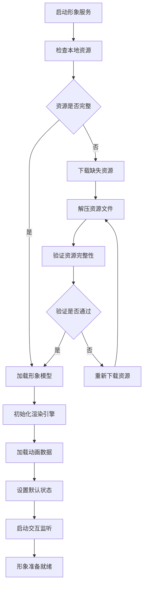
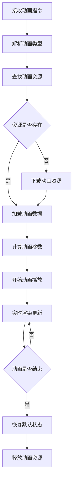

# CLR AvatarCore 虚拟形象核心服务

## 模块概述

`clr_avatarcore` 是 OneApp 车联网生态中的虚拟形象核心服务模块，负责虚拟形象的渲染、动画处理、资源管理和交互控制等核心功能。该模块为车载虚拟助手提供底层的形象生成和控制能力。

### 基本信息
- **模块名称**: clr_avatarcore
- **版本**: 0.4.0+2
- **描述**: 虚拟形象核心服务SDK
- **Flutter 版本**: >=1.17.0
- **Dart 版本**: >=2.16.2 <4.0.0

## 功能特性

### 核心功能
1. **形象渲染引擎**
   - 3D虚拟形象渲染
   - 实时动画播放
   - 光照和材质处理
   - 表情和动作同步

2. **资源管理系统**
   - 形象资源下载和缓存
   - 动画资源压缩和解压
   - 资源版本管理
   - 本地存储优化

3. **动画控制系统**
   - 表情动画控制
   - 语音同步动画
   - 手势和动作驱动
   - 情绪表达映射

4. **交互处理**
   - 语音输入响应
   - 触控交互处理
   - 环境感知适配
   - 智能行为生成

## 技术架构

### 目录结构
```
lib/
├── clr_avatarcore.dart          # 模块入口文件
├── src/                         # 源代码目录
│   ├── rendering/               # 渲染引擎
│   ├── animation/               # 动画系统
│   ├── resources/               # 资源管理
│   ├── interaction/             # 交互处理
│   ├── models/                  # 数据模型
│   └── utils/                   # 工具类
├── assets/                      # 资源文件
└── native/                      # 原生代码接口
```

### 依赖关系

#### 核心依赖
- `car_connector: ^0.4.11` - 车联网连接器
- `basic_intl: ^0.2.0` - 国际化支持
- `basic_logger: ^0.2.0` - 日志系统

#### 网络和存储
- `dio: ^5.2.0` - HTTP客户端
- `path_provider: ^2.0.11` - 文件路径
- `shared_preferences: ^2.1.1` - 本地存储
- `flutter_archive: ^5.0.0` - 文件压缩解压

#### 工具依赖
- `crypto: ^3.0.3` - 加密功能
- `fluttertoast: ^8.2.5` - 提示组件
- `flutter_screenutil: ^5.9.0` - 屏幕适配

## 核心模块分析

### 1. 模块入口 (`clr_avatarcore.dart`)

**功能职责**:
- 虚拟形象服务初始化
- 渲染引擎启动
- 资源管理系统配置

### 2. 渲染引擎 (`src/rendering/`)

**功能职责**:
- 3D形象渲染管道
- 实时画面生成
- 性能优化控制
- 渲染质量管理

**主要组件**:
- `RenderEngine` - 渲染引擎核心
- `SceneManager` - 场景管理器
- `MaterialProcessor` - 材质处理器
- `LightingSystem` - 光照系统
- `CameraController` - 摄像机控制器

### 3. 动画系统 (`src/animation/`)

**功能职责**:
- 角色动画播放
- 表情动画控制
- 动作序列管理
- 动画混合和过渡

**主要组件**:
- `AnimationController` - 动画控制器
- `ExpressionManager` - 表情管理器
- `MotionBlender` - 动作混合器
- `Timeline` - 时间轴管理
- `BehaviorTree` - 行为树系统

### 4. 资源管理 (`src/resources/`)

**功能职责**:
- 形象资源下载
- 文件缓存管理
- 资源版本控制
- 内存使用优化

**主要组件**:
- `ResourceManager` - 资源管理器
- `DownloadManager` - 下载管理器
- `CacheManager` - 缓存管理器
- `AssetLoader` - 资源加载器
- `VersionController` - 版本控制器

### 5. 交互处理 (`src/interaction/`)

**功能职责**:
- 用户交互响应
- 语音输入处理
- 手势识别处理
- 环境适应控制

**主要组件**:
- `InteractionHandler` - 交互处理器
- `VoiceProcessor` - 语音处理器
- `GestureRecognizer` - 手势识别器
- `EmotionMapper` - 情绪映射器
- `BehaviorGenerator` - 行为生成器

### 6. 数据模型 (`src/models/`)

**功能职责**:
- 形象数据模型
- 动画数据结构
- 配置参数模型
- 状态信息模型

**主要模型**:
- `AvatarModel` - 虚拟形象模型
- `AnimationData` - 动画数据模型
- `SceneConfig` - 场景配置模型
- `InteractionState` - 交互状态模型

### 7. 工具类 (`src/utils/`)

**功能职责**:
- 数学计算工具
- 文件处理工具
- 性能监控工具
- 调试辅助工具

**主要工具**:
- `MathUtils` - 数学计算工具
- `FileUtils` - 文件操作工具
- `PerformanceMonitor` - 性能监控器
- `DebugUtils` - 调试工具

## 业务流程

### 虚拟形象初始化流程


### 动画播放流程


## 渲染系统设计

### 渲染管道
1. **几何处理阶段**
   - 顶点变换
   - 骨骼动画
   - 形变处理
   - 裁剪优化

2. **光栅化阶段**
   - 像素着色
   - 纹理映射
   - 光照计算
   - 阴影处理

3. **后处理阶段**
   - 抗锯齿
   - 色彩校正
   - 特效合成
   - 输出优化

### 性能优化策略
- **LOD系统**: 距离层次细节
- **遮挡剔除**: 视锥体剔除
- **批量渲染**: 减少绘制调用
- **纹理压缩**: 内存使用优化

## 动画系统设计

### 动画类型
1. **骨骼动画**
   - 关节旋转控制
   - 骨骼层次结构
   - 动作混合
   - 逆向运动学

2. **表情动画**
   - 面部肌肉控制
   - 表情混合
   - 实时表情捕捉
   - 情绪表达映射

3. **程序动画**
   - 物理模拟
   - 粒子系统
   - 布料模拟
   - 头发动画

### 动画状态机
- **状态定义**: 待机、说话、思考、响应
- **状态转换**: 平滑过渡控制
- **条件触发**: 基于输入的状态切换
- **优先级管理**: 动画播放优先级

## 资源管理系统

### 资源类型
1. **模型资源**
   - 3D几何模型
   - 纹理贴图
   - 材质定义
   - 骨骼数据

2. **动画资源**
   - 关键帧数据
   - 动作序列
   - 表情数据
   - 音频同步

3. **配置资源**
   - 场景配置
   - 行为定义
   - 参数设置
   - 皮肤主题

### 缓存策略
- **多级缓存**: 内存+磁盘缓存
- **LRU算法**: 最近最少使用淘汰
- **压缩存储**: 减少存储空间
- **增量更新**: 仅更新变化部分

## 安全特性

### 数据安全
- 资源文件加密存储
- 传输数据加密
- 数字签名验证
- 防篡改检测

### 隐私保护
- 本地数据保护
- 用户行为数据脱敏
- 敏感信息加密
- 访问权限控制

## 性能优化

### 渲染优化
- GPU资源管理
- 绘制批次优化
- 着色器缓存
- 内存池管理

### 动画优化
- 动画数据压缩
- 关键帧插值优化
- 动画LOD系统
- 预计算优化

## 扩展性设计

### 插件化架构
- 自定义渲染器
- 扩展动画系统
- 第三方资源集成
- 自定义交互模式

### 配置化管理
- 渲染质量可配置
- 动画参数可调节
- 资源策略可定制
- 性能阈值可设置

## 测试策略

### 单元测试
- 渲染算法测试
- 动画逻辑测试
- 资源管理测试
- 数据模型测试

### 性能测试
- 渲染性能测试
- 内存使用测试
- 电池续航测试
- 热量控制测试

### 兼容性测试
- 不同设备测试
- 不同分辨率测试
- 不同GPU测试
- 系统版本兼容测试

## 部署和维护

### 资源部署
- CDN资源分发
- 区域化部署
- 版本管理
- 灰度发布

### 监控指标
- 渲染帧率
- 资源加载时间
- 内存使用率
- 崩溃率统计

## 总结

`clr_avatarcore` 模块作为 OneApp 的虚拟形象核心引擎，提供了完整的3D虚拟形象渲染和交互能力。通过高效的渲染管道、智能的动画系统和完善的资源管理，为用户提供了生动逼真的虚拟助手体验。模块具有良好的性能优化和扩展能力，能够适应不同硬件环境和业务需求。
