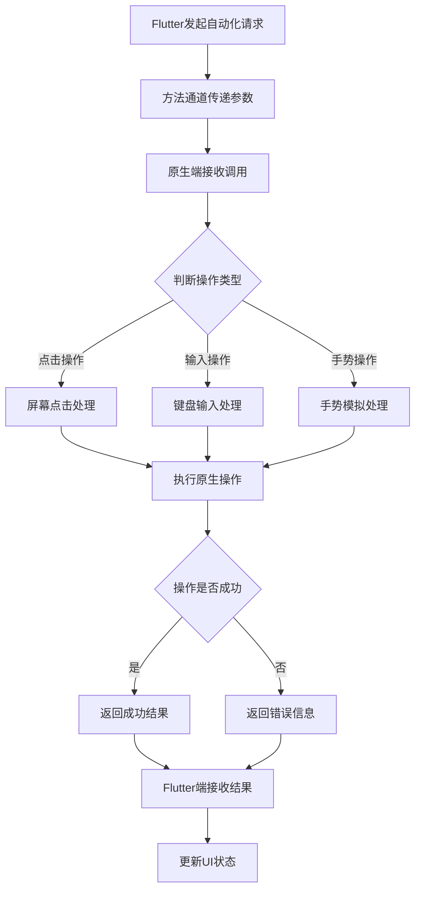
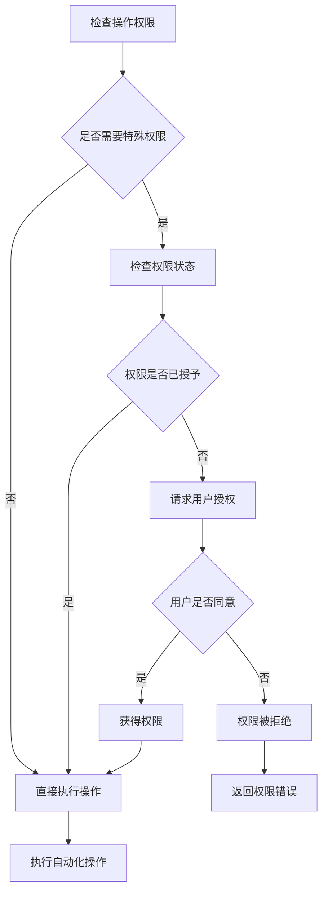

# Kit RPA Plugin RPA自动化插件

## 模块概述

`kit_rpa_plugin` 是 OneApp 车联网生态中的 RPA（Robotic Process Automation）原生插件，负责为 Flutter 应用提供原生平台的自动化操作能力。该插件通过平台通道实现 Flutter 与 Android/iOS 原生代码的交互，为 RPA 自动化任务提供底层支持。

### 基本信息
- **模块名称**: kit_rpa_plugin
- **版本**: 0.1.8+1
- **类型**: Flutter Plugin（原生插件）
- **Flutter 版本**: >=2.10.5
- **Dart 版本**: >=3.0.0 <4.0.0

## 功能特性

### 核心功能
1. **原生自动化操作**
   - 屏幕点击模拟
   - 键盘输入模拟
   - 手势操作模拟
   - 应用启动控制

2. **系统信息获取**
   - 设备信息查询
   - 应用状态监控
   - 系统资源获取
   - 权限状态检查

3. **文件系统操作**
   - 文件读写操作
   - 目录遍历
   - 权限管理
   - 路径解析

4. **网络状态监控**
   - 网络连接状态
   - 网络类型检测
   - 流量使用统计
   - 连接质量评估

## 技术架构

### 目录结构
```
kit_rpa_plugin/
├── lib/                        # Dart代码
│   ├── kit_rpa_plugin.dart    # 插件入口
│   ├── src/                    # 源代码
│   │   ├── platform_interface.dart  # 平台接口定义
│   │   ├── method_channel.dart      # 方法通道实现
│   │   └── models/                   # 数据模型
│   └── kit_rpa_plugin_platform_interface.dart
├── android/                    # Android原生代码
│   ├── src/main/kotlin/
│   │   └── com/oneapp/kit_rpa_plugin/
│   │       ├── KitRpaPlugin.kt      # 主插件类
│   │       ├── AutomationHandler.kt # 自动化处理器
│   │       ├── SystemInfoProvider.kt # 系统信息提供者
│   │       └── FileOperationHandler.kt # 文件操作处理器
│   └── build.gradle
├── ios/                        # iOS原生代码
│   ├── Classes/
│   │   ├── KitRpaPlugin.swift       # 主插件类
│   │   ├── AutomationHandler.swift  # 自动化处理器
│   │   ├── SystemInfoProvider.swift # 系统信息提供者
│   │   └── FileOperationHandler.swift # 文件操作处理器
│   └── kit_rpa_plugin.podspec
├── example/                    # 示例应用
└── test/                       # 测试文件
```

### 依赖关系

#### 核心依赖
- `plugin_platform_interface: ^2.0.2` - 插件平台接口
- `device_info_plus: ^9.1.1` - 设备信息获取

## 核心模块分析

### 1. Flutter端实现

#### 插件入口 (`lib/kit_rpa_plugin.dart`)
**功能职责**:
- 插件对外API导出
- 平台通道初始化
- 方法调用封装

#### 平台接口 (`lib/src/platform_interface.dart`)
**功能职责**:
- 定义插件抽象接口
- 规范方法签名
- 支持多平台实现

#### 方法通道 (`lib/src/method_channel.dart`)
**功能职责**:
- 实现平台通道通信
- 处理异步方法调用
- 管理回调和异常

### 2. Android端实现

#### 主插件类 (`KitRpaPlugin.kt`)
```kotlin
class KitRpaPlugin: FlutterPlugin, MethodCallHandler {
    private lateinit var channel: MethodChannel
    private lateinit var context: Context
    private lateinit var automationHandler: AutomationHandler
    private lateinit var systemInfoProvider: SystemInfoProvider
    private lateinit var fileOperationHandler: FileOperationHandler

    override fun onAttachedToEngine(binding: FlutterPlugin.FlutterPluginBinding) {
        channel = MethodChannel(binding.binaryMessenger, "kit_rpa_plugin")
        context = binding.applicationContext
        initializeHandlers()
        channel.setMethodCallHandler(this)
    }

    override fun onMethodCall(call: MethodCall, result: Result) {
        when (call.method) {
            "simulateClick" -> automationHandler.simulateClick(call, result)
            "getSystemInfo" -> systemInfoProvider.getSystemInfo(call, result)
            "performFileOperation" -> fileOperationHandler.performOperation(call, result)
            else -> result.notImplemented()
        }
    }
}
```

#### 自动化处理器 (`AutomationHandler.kt`)
**功能职责**:
- 屏幕点击模拟
- 键盘输入模拟
- 手势操作模拟
- 无障碍服务集成

**主要方法**:
- `simulateClick(x: Float, y: Float)` - 模拟屏幕点击
- `simulateKeyInput(text: String)` - 模拟键盘输入
- `simulateSwipe(startX: Float, startY: Float, endX: Float, endY: Float)` - 模拟滑动
- `simulateLongPress(x: Float, y: Float, duration: Long)` - 模拟长按

#### 系统信息提供者 (`SystemInfoProvider.kt`)
**功能职责**:
- 设备硬件信息获取
- 系统版本信息
- 应用状态监控
- 权限状态检查

**主要方法**:
- `getDeviceInfo()` - 获取设备信息
- `getSystemVersion()` - 获取系统版本
- `getInstalledApps()` - 获取已安装应用
- `checkPermissions()` - 检查权限状态

#### 文件操作处理器 (`FileOperationHandler.kt`)
**功能职责**:
- 文件系统访问
- 文件读写操作
- 目录管理
- 存储权限处理

**主要方法**:
- `readFile(path: String)` - 读取文件
- `writeFile(path: String, content: String)` - 写入文件
- `listDirectory(path: String)` - 列出目录内容
- `createDirectory(path: String)` - 创建目录

### 3. iOS端实现

#### 主插件类 (`KitRpaPlugin.swift`)
```swift
public class KitRpaPlugin: NSObject, FlutterPlugin {
    private var automationHandler: AutomationHandler!
    private var systemInfoProvider: SystemInfoProvider!
    private var fileOperationHandler: FileOperationHandler!
    
    public static func register(with registrar: FlutterPluginRegistrar) {
        let channel = FlutterMethodChannel(name: "kit_rpa_plugin", 
                                         binaryMessenger: registrar.messenger())
        let instance = KitRpaPlugin()
        instance.initializeHandlers()
        registrar.addMethodCallDelegate(instance, channel: channel)
    }
    
    public func handle(_ call: FlutterMethodCall, result: @escaping FlutterResult) {
        switch call.method {
        case "simulateClick":
            automationHandler.simulateClick(call: call, result: result)
        case "getSystemInfo":
            systemInfoProvider.getSystemInfo(call: call, result: result)
        case "performFileOperation":
            fileOperationHandler.performOperation(call: call, result: result)
        default:
            result(FlutterMethodNotImplemented)
        }
    }
}
```

#### 自动化处理器 (`AutomationHandler.swift`)
**功能职责**:
- 利用 UIKit 进行界面操作
- 集成 Accessibility 框架
- 手势识别和模拟
- 应用控制操作

#### 系统信息提供者 (`SystemInfoProvider.swift`)
**功能职责**:
- 利用 UIDevice 获取设备信息
- 系统版本和硬件信息
- 应用状态监控
- 权限状态查询

#### 文件操作处理器 (`FileOperationHandler.swift`)
**功能职责**:
- 文件系统访问
- 沙盒目录操作
- 文档目录管理
- 安全文件操作

## 业务流程

### 自动化操作流程


### 权限检查流程


## 平台特性实现

### Android特性
1. **无障碍服务(Accessibility Service)**
   - 应用界面元素访问
   - 自动化操作执行
   - 界面变化监听
   - 全局手势模拟

2. **系统权限管理**
   - 动态权限申请
   - 特殊权限处理
   - 权限状态监控
   - 权限组管理

3. **文件系统访问**
   - 外部存储访问
   - 应用私有目录
   - 分区存储适配
   - 文件提供者集成

### iOS特性
1. **Accessibility框架**
   - UI元素识别
   - 辅助功能集成
   - 自动化测试支持
   - 界面操作模拟

2. **沙盒安全机制**
   - 应用沙盒限制
   - 文件访问权限
   - 数据保护机制
   - 隐私权限管理

3. **系统集成**
   - UIKit框架集成
   - Core Foundation使用
   - 系统服务调用
   - 设备信息获取

## 安全考虑

### 权限控制
- **最小权限原则**: 仅申请必要权限
- **动态权限**: 运行时权限申请
- **权限说明**: 清晰的权限使用说明
- **权限回收**: 不需要时释放权限

### 数据安全
- **敏感数据保护**: 避免记录敏感信息
- **数据传输安全**: 加密敏感数据传输
- **本地存储安全**: 安全的本地数据存储
- **隐私合规**: 遵守隐私保护法规

## 性能优化

### 操作效率
- **批量操作**: 减少方法通道调用次数
- **异步处理**: 避免阻塞主线程
- **操作缓存**: 缓存重复操作结果
- **资源复用**: 复用系统资源

### 内存管理
- **及时释放**: 及时释放不需要的资源
- **内存监控**: 监控内存使用情况
- **垃圾回收**: 配合系统垃圾回收
- **循环引用避免**: 避免内存泄漏

## 错误处理

### 异常类型
1. **权限异常**
   - 权限未授予
   - 权限被撤销
   - 系统权限限制
   - 特殊权限要求

2. **操作异常**
   - 目标元素不存在
   - 操作被系统阻止
   - 界面状态异常
   - 硬件功能不支持

3. **系统异常**
   - 系统版本不兼容
   - 硬件功能缺失
   - 资源不足
   - 系统服务异常

### 处理策略
- **优雅降级**: 功能不可用时的替代方案
- **错误重试**: 临时错误的重试机制
- **用户提示**: 清晰的错误信息提示
- **日志记录**: 详细的错误日志记录

## 测试策略

### 单元测试
- **方法通道测试**: 通信接口测试
- **数据模型测试**: 序列化反序列化
- **工具类测试**: 辅助功能测试
- **异常处理测试**: 错误场景测试

### 集成测试
- **平台集成测试**: 原生功能集成
- **权限流程测试**: 权限申请流程
- **文件操作测试**: 文件系统操作
- **自动化功能测试**: 自动化操作验证

### 兼容性测试
- **设备兼容性**: 不同设备型号
- **系统版本**: 不同操作系统版本
- **权限策略**: 不同权限策略
- **性能表现**: 不同性能水平设备

## 部署和维护

### 版本管理
- **API版本控制**: 兼容不同版本
- **功能开关**: 新功能渐进式发布
- **回滚机制**: 问题版本快速回滚
- **升级策略**: 平滑升级路径

### 监控指标
- **调用成功率**: 方法调用成功率
- **响应时间**: 操作响应延迟
- **错误率**: 异常发生频率
- **权限授予率**: 用户权限授予情况

## 总结

`kit_rpa_plugin` 作为 OneApp 的RPA自动化原生插件，为Flutter应用提供了强大的原生平台自动化操作能力。通过平台通道机制，实现了Flutter与Android/iOS原生代码的无缝集成，为RPA自动化任务提供了可靠的底层支持。插件设计考虑了安全性、性能和兼容性，能够在保证用户隐私和系统安全的前提下，提供高效的自动化操作能力。
