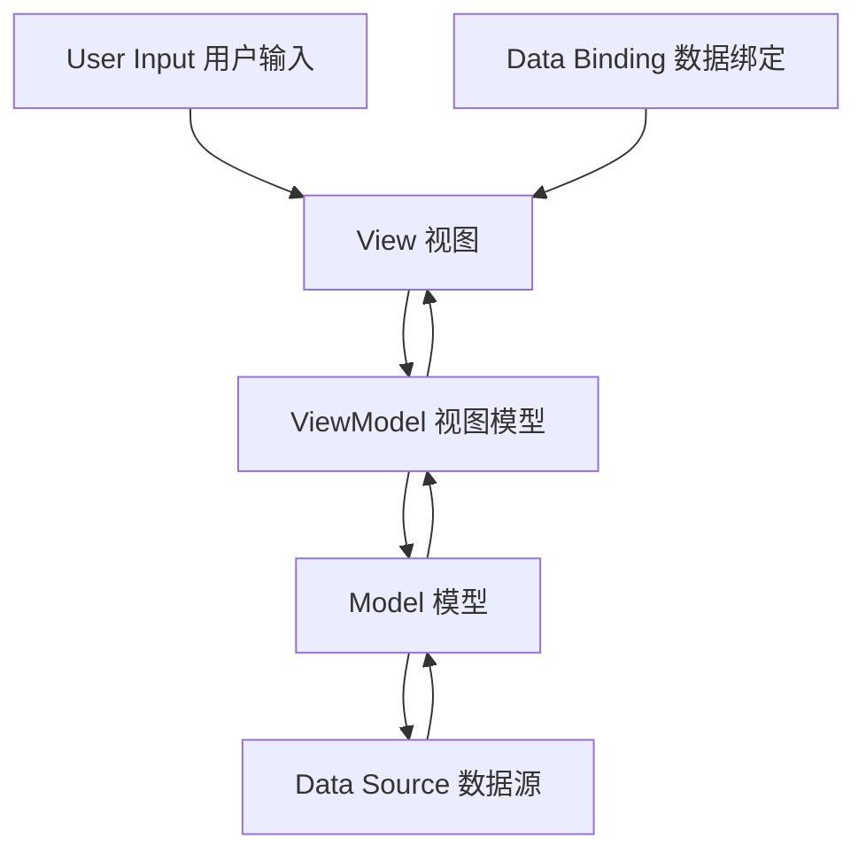

# Base MVVM MVVM架构模块

## 模块概述

`base_mvvm` 是 OneApp 基础工具模块群中的 MVVM（Model-View-ViewModel）架构模块，提供了完整的MVVM架构实现和相关基础组件。该模块为Flutter应用开发提供了规范化的架构模式，包含了状态管理、数据绑定、视图抽象等核心功能。

### 基本信息
- **模块名称**: base_mvvm
- **版本**: 0.0.1
- **描述**: MVVM架构基础模块
- **Flutter 版本**: >=1.17.0
- **Dart 版本**: >=3.0.0 <4.0.0

## 功能特性

### 核心功能
1. **MVVM架构实现**
   - Model-View-ViewModel分离
   - 数据双向绑定
   - 视图状态管理
   - 命令模式支持

2. **状态管理系统**
   - 响应式状态管理
   - 异步状态处理
   - 状态变化通知
   - 状态持久化

3. **基础组件库**
   - 可刷新列表组件
   - 网络图片缓存
   - 加载状态组件
   - 错误处理组件

4. **数据流管理**
   - 单向数据流
   - 事件驱动更新
   - 数据流监听
   - 副作用处理

## 技术架构

### 目录结构
```
lib/
├── base_mvvm.dart              # 模块入口文件
├── src/                        # 源代码目录
│   ├── mvvm/                   # MVVM核心
│   ├── base_components/        # 基础组件
│   ├── state_management/       # 状态管理
│   ├── data_binding/           # 数据绑定
│   ├── commands/               # 命令模式
│   └── utils/                  # 工具类
├── widgets/                    # 通用Widget
└── test/                       # 测试文件
```

### 依赖关系

#### 状态管理依赖
- `provider: ^6.0.5` - 状态管理框架
- `rxdart: ^0.27.7` - 响应式编程

#### UI组件依赖
- `easy_refresh: ^3.3.2+1` - 下拉刷新组件
- `cached_network_image: ^3.3.0` - 网络图片缓存
- `flutter_cache_manager: ^3.3.1` - 缓存管理

#### 工具依赖
- `path_provider: ^2.1.3` - 文件路径
- `logger: 1.4.0` - 日志框架

#### 内部依赖
- `basic_utils` - 基础工具（本地路径）
- `basic_uis` - 基础UI组件（本地路径）

## 核心模块分析

### 1. 模块入口 (`base_mvvm.dart`)

**功能职责**:
- MVVM架构组件统一导出
- 架构配置初始化
- 依赖注入设置

### 2. MVVM核心 (`src/mvvm/`)

**功能职责**:
- MVVM架构模式实现
- 基础类定义
- 生命周期管理
- 数据流控制

**主要组件**:
- `BaseModel` - 数据模型基类
- `BaseView` - 视图基类
- `BaseViewModel` - 视图模型基类
- `MVVMController` - MVVM控制器

#### BaseViewModel 实现
```dart
abstract class BaseViewModel extends ChangeNotifier {
  bool _isLoading = false;
  String? _errorMessage;
  bool _isDisposed = false;

  bool get isLoading => _isLoading;
  String? get errorMessage => _errorMessage;
  bool get hasError => _errorMessage != null;

  void setLoading(bool loading) {
    if (_isDisposed) return;
    _isLoading = loading;
    notifyListeners();
  }

  void setError(String? error) {
    if (_isDisposed) return;
    _errorMessage = error;
    notifyListeners();
  }

  void clearError() {
    setError(null);
  }

  Future<T?> executeAsync<T>(Future<T> Function() action) async {
    try {
      setLoading(true);
      clearError();
      final result = await action();
      return result;
    } catch (e) {
      setError(e.toString());
      return null;
    } finally {
      setLoading(false);
    }
  }

  @override
  void dispose() {
    _isDisposed = true;
    super.dispose();
  }
}
```

#### BaseView 实现
```dart
abstract class BaseView<T extends BaseViewModel> extends StatefulWidget {
  const BaseView({Key? key}) : super(key: key);

  T createViewModel();

  Widget buildView(BuildContext context, T viewModel);

  @override
  State<BaseView<T>> createState() => _BaseViewState<T>();
}

class _BaseViewState<T extends BaseViewModel> extends State<BaseView<T>> {
  late T _viewModel;

  @override
  void initState() {
    super.initState();
    _viewModel = widget.createViewModel();
  }

  @override
  Widget build(BuildContext context) {
    return ChangeNotifierProvider<T>(
      create: (_) => _viewModel,
      child: Consumer<T>(
        builder: (context, viewModel, child) {
          return Scaffold(
            body: Stack(
              children: [
                widget.buildView(context, viewModel),
                if (viewModel.isLoading)
                  const Center(
                    child: CircularProgressIndicator(),
                  ),
                if (viewModel.hasError)
                  _buildErrorWidget(viewModel.errorMessage!),
              ],
            ),
          );
        },
      ),
    );
  }

  Widget _buildErrorWidget(String error) {
    return Container(
      color: Colors.black54,
      child: Center(
        child: Card(
          margin: const EdgeInsets.all(16),
          child: Padding(
            padding: const EdgeInsets.all(16),
            child: Column(
              mainAxisSize: MainAxisSize.min,
              children: [
                const Icon(Icons.error, color: Colors.red, size: 48),
                const SizedBox(height: 16),
                Text(error, textAlign: TextAlign.center),
                const SizedBox(height: 16),
                ElevatedButton(
                  onPressed: () => _viewModel.clearError(),
                  child: const Text('确定'),
                ),
              ],
            ),
          ),
        ),
      ),
    );
  }

  @override
  void dispose() {
    _viewModel.dispose();
    super.dispose();
  }
}
```

### 3. 状态管理 (`src/state_management/`)

**功能职责**:
- 应用状态统一管理
- 状态变化监听
- 状态持久化
- 状态恢复机制

**主要组件**:
- `StateManager` - 状态管理器
- `StateObserver` - 状态观察者
- `StatePersistence` - 状态持久化
- `StateRestore` - 状态恢复

### 4. 数据绑定 (`src/data_binding/`)

**功能职责**:
- 视图与数据双向绑定
- 属性变化监听
- 数据验证机制
- 绑定表达式解析

**主要组件**:
- `DataBinder` - 数据绑定器
- `PropertyObserver` - 属性观察者
- `ValidationRule` - 验证规则
- `BindingExpression` - 绑定表达式

### 5. 命令模式 (`src/commands/`)

**功能职责**:
- 用户操作命令封装
- 命令执行管理
- 撤销重做支持
- 命令队列处理

**主要组件**:
- `Command` - 命令基类
- `AsyncCommand` - 异步命令
- `CommandManager` - 命令管理器
- `UndoRedoStack` - 撤销重做栈

#### Command 实现
```dart
abstract class Command {
  bool get canExecute;
  Future<void> execute();
  
  final StreamController<bool> _canExecuteController = 
      StreamController<bool>.broadcast();
  
  Stream<bool> get canExecuteChanged => _canExecuteController.stream;
  
  void notifyCanExecuteChanged() {
    _canExecuteController.add(canExecute);
  }
  
  void dispose() {
    _canExecuteController.close();
  }
}

class AsyncCommand extends Command {
  final Future<void> Function() _action;
  final bool Function()? _canExecuteFunc;
  bool _isExecuting = false;
  
  AsyncCommand(this._action, [this._canExecuteFunc]);
  
  @override
  bool get canExecute => !_isExecuting && (_canExecuteFunc?.call() ?? true);
  
  @override
  Future<void> execute() async {
    if (!canExecute) return;
    
    _isExecuting = true;
    notifyCanExecuteChanged();
    
    try {
      await _action();
    } finally {
      _isExecuting = false;
      notifyCanExecuteChanged();
    }
  }
}
```

### 6. 基础组件 (`src/base_components/`)

**功能职责**:
- 通用UI组件封装
- 业务无关组件
- 可复用组件库
- 组件样式统一

**主要组件**:
- `RefreshableListView` - 可刷新列表
- `NetworkImageWidget` - 网络图片组件
- `LoadingWidget` - 加载组件
- `ErrorWidget` - 错误组件

#### RefreshableListView 实现
```dart
class RefreshableListView<T> extends StatefulWidget {
  final Future<List<T>> Function() onRefresh;
  final Future<List<T>> Function()? onLoadMore;
  final Widget Function(BuildContext, T, int) itemBuilder;
  final Widget? emptyWidget;
  final Widget? errorWidget;
  
  const RefreshableListView({
    Key? key,
    required this.onRefresh,
    this.onLoadMore,
    required this.itemBuilder,
    this.emptyWidget,
    this.errorWidget,
  }) : super(key: key);

  @override
  State<RefreshableListView<T>> createState() => _RefreshableListViewState<T>();
}

class _RefreshableListViewState<T> extends State<RefreshableListView<T>> {
  final List<T> _items = [];
  bool _isLoading = false;
  bool _hasError = false;
  String? _errorMessage;

  @override
  void initState() {
    super.initState();
    _refresh();
  }

  Future<void> _refresh() async {
    setState(() {
      _isLoading = true;
      _hasError = false;
    });

    try {
      final items = await widget.onRefresh();
      setState(() {
        _items.clear();
        _items.addAll(items);
        _isLoading = false;
      });
    } catch (e) {
      setState(() {
        _isLoading = false;
        _hasError = true;
        _errorMessage = e.toString();
      });
    }
  }

  Future<void> _loadMore() async {
    if (widget.onLoadMore == null || _isLoading) return;

    try {
      final items = await widget.onLoadMore!();
      setState(() {
        _items.addAll(items);
      });
    } catch (e) {
      // Handle load more error
    }
  }

  @override
  Widget build(BuildContext context) {
    if (_isLoading && _items.isEmpty) {
      return const Center(child: CircularProgressIndicator());
    }

    if (_hasError && _items.isEmpty) {
      return widget.errorWidget ?? 
          Center(child: Text('Error: $_errorMessage'));
    }

    if (_items.isEmpty) {
      return widget.emptyWidget ?? 
          const Center(child: Text('No data'));
    }

    return EasyRefresh(
      onRefresh: _refresh,
      onLoad: widget.onLoadMore != null ? _loadMore : null,
      child: ListView.builder(
        itemCount: _items.length,
        itemBuilder: (context, index) {
          return widget.itemBuilder(context, _items[index], index);
        },
      ),
    );
  }
}
```

## MVVM架构模式

### 架构层次
```
View Layer (视图层)
    ↓ (用户交互)
ViewModel Layer (视图模型层)
    ↓ (业务逻辑)
Model Layer (模型层)
    ↓ (数据操作)
Data Layer (数据层)
```

### 数据流向


### 职责分离
1. **View（视图）**
   - 负责UI展示
   - 处理用户交互
   - 绑定ViewModel数据
   - 不包含业务逻辑

2. **ViewModel（视图模型）**
   - 处理业务逻辑
   - 管理视图状态
   - 调用Model方法
   - 提供数据绑定

3. **Model（模型）**
   - 定义数据结构
   - 封装业务规则
   - 提供数据操作接口
   - 独立于视图层

## 状态管理策略

### 响应式状态
```dart
class ResponsiveState<T> {
  final BehaviorSubject<T> _subject;
  
  ResponsiveState(T initialValue) : _subject = BehaviorSubject<T>.seeded(initialValue);
  
  T get value => _subject.value;
  Stream<T> get stream => _subject.stream;
  
  void update(T newValue) {
    _subject.add(newValue);
  }
  
  void dispose() {
    _subject.close();
  }
}

class StateViewModel extends BaseViewModel {
  final ResponsiveState<String> _title = ResponsiveState<String>('');
  final ResponsiveState<List<String>> _items = ResponsiveState<List<String>>([]);
  
  Stream<String> get titleStream => _title.stream;
  Stream<List<String>> get itemsStream => _items.stream;
  
  void updateTitle(String title) {
    _title.update(title);
  }
  
  void updateItems(List<String> items) {
    _items.update(items);
  }
  
  @override
  void dispose() {
    _title.dispose();
    _items.dispose();
    super.dispose();
  }
}
```

### 状态持久化
```dart
class StatePersistence {
  static const String _keyPrefix = 'mvvm_state_';
  
  static Future<void> saveState<T>(String key, T state) async {
    final prefs = await SharedPreferences.getInstance();
    final json = jsonEncode(state);
    await prefs.setString('$_keyPrefix$key', json);
  }
  
  static Future<T?> loadState<T>(String key, T Function(Map<String, dynamic>) fromJson) async {
    final prefs = await SharedPreferences.getInstance();
    final json = prefs.getString('$_keyPrefix$key');
    if (json != null) {
      final map = jsonDecode(json) as Map<String, dynamic>;
      return fromJson(map);
    }
    return null;
  }
  
  static Future<void> clearState(String key) async {
    final prefs = await SharedPreferences.getInstance();
    await prefs.remove('$_keyPrefix$key');
  }
}
```

## 数据绑定机制

### 双向数据绑定
```dart
class TwoWayBinding<T> {
  final ValueNotifier<T> _notifier;
  final void Function(T)? _onChanged;
  
  TwoWayBinding(T initialValue, [this._onChanged]) 
      : _notifier = ValueNotifier<T>(initialValue);
  
  T get value => _notifier.value;
  set value(T newValue) {
    _notifier.value = newValue;
    _onChanged?.call(newValue);
  }
  
  ValueListenable<T> get listenable => _notifier;
  
  void dispose() {
    _notifier.dispose();
  }
}

class BindableTextField extends StatefulWidget {
  final TwoWayBinding<String> binding;
  final String? hintText;
  final TextInputType? keyboardType;
  
  const BindableTextField({
    Key? key,
    required this.binding,
    this.hintText,
    this.keyboardType,
  }) : super(key: key);

  @override
  State<BindableTextField> createState() => _BindableTextFieldState();
}

class _BindableTextFieldState extends State<BindableTextField> {
  late TextEditingController _controller;
  
  @override
  void initState() {
    super.initState();
    _controller = TextEditingController(text: widget.binding.value);
    _controller.addListener(_onTextChanged);
    widget.binding.listenable.addListener(_onBindingChanged);
  }
  
  void _onTextChanged() {
    widget.binding.value = _controller.text;
  }
  
  void _onBindingChanged() {
    if (_controller.text != widget.binding.value) {
      _controller.text = widget.binding.value;
    }
  }
  
  @override
  Widget build(BuildContext context) {
    return TextField(
      controller: _controller,
      decoration: InputDecoration(
        hintText: widget.hintText,
      ),
      keyboardType: widget.keyboardType,
    );
  }
  
  @override
  void dispose() {
    _controller.dispose();
    super.dispose();
  }
}
```

## 性能优化

### 视图更新优化
- **局部更新**: 使用Consumer精确控制更新范围
- **状态分离**: 分离不同类型的状态避免不必要更新
- **延迟计算**: 使用计算属性延迟复杂计算
- **缓存机制**: 缓存计算结果避免重复计算

### 内存管理
- **生命周期管理**: 正确管理ViewModel生命周期
- **资源释放**: 及时释放Stream和订阅
- **弱引用**: 使用弱引用避免循环引用
- **内存监控**: 监控内存使用情况

## 测试策略

### 单元测试
- **ViewModel测试**: 业务逻辑单元测试
- **Model测试**: 数据模型测试
- **Command测试**: 命令执行测试
- **状态管理测试**: 状态变化测试

### Widget测试
- **View测试**: UI组件渲染测试
- **交互测试**: 用户交互响应测试
- **数据绑定测试**: 数据绑定正确性测试
- **状态更新测试**: 状态更新后UI变化测试

### 集成测试
- **端到端测试**: 完整用户流程测试
- **架构测试**: MVVM架构正确性测试
- **性能测试**: 架构性能表现测试
- **兼容性测试**: 不同场景兼容性测试

## 最佳实践

### 架构设计
1. **单一职责**: 每个层次职责单一明确
2. **依赖倒置**: 依赖抽象而非具体实现
3. **开闭原则**: 对扩展开放对修改关闭
4. **接口隔离**: 使用小而专的接口

### 开发建议
1. **状态管理**: 合理划分状态粒度
2. **数据绑定**: 避免复杂的绑定表达式
3. **异步处理**: 正确处理异步操作
4. **错误处理**: 完善的错误处理机制

### 代码组织
1. **文件结构**: 按功能和层次组织文件
2. **命名规范**: 统一的命名约定
3. **注释文档**: 清晰的代码注释
4. **代码复用**: 提取公共组件和逻辑

## 总结

`base_mvvm` 模块作为 OneApp 的MVVM架构基础模块，提供了完整的架构模式实现和配套工具。通过清晰的层次分离、响应式状态管理和双向数据绑定，为Flutter应用开发提供了规范化的架构指导。模块具有良好的可测试性和可维护性，能够支撑大型应用的开发需求。
