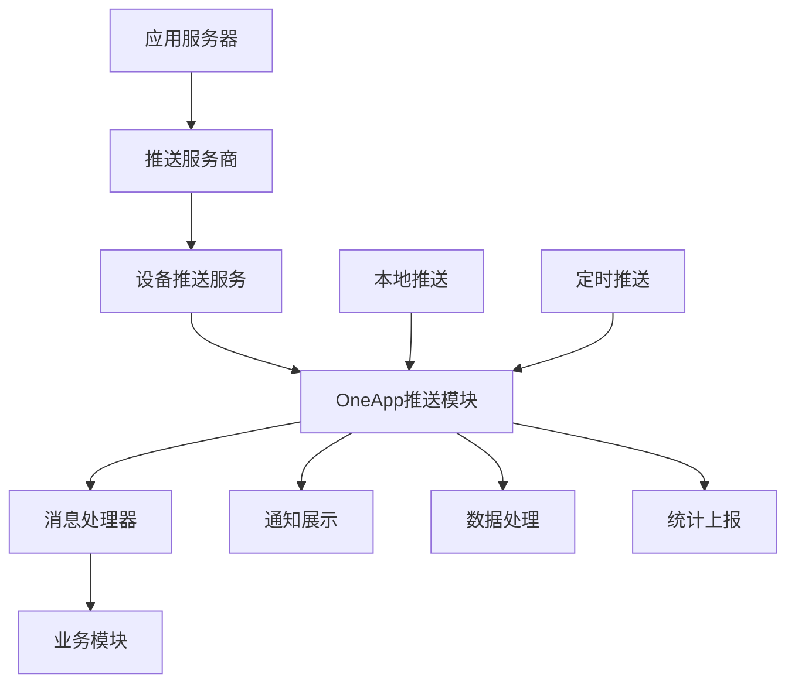
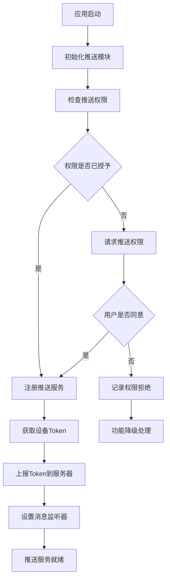
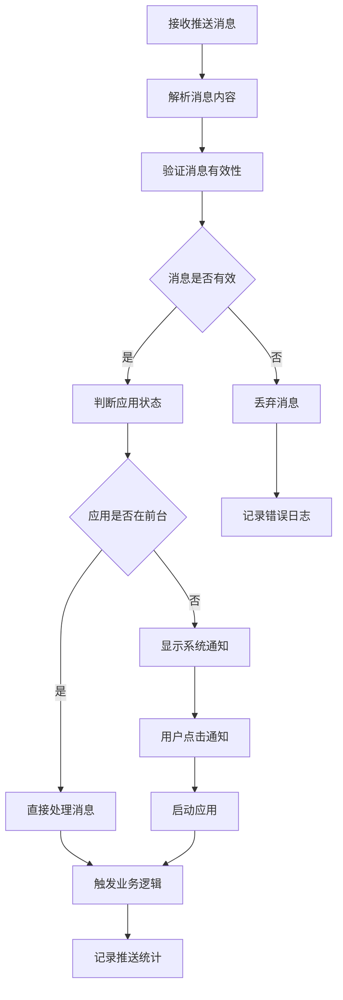

# Basic Push 推送服务模块

## 模块概述

`basic_push` 是 OneApp 基础工具模块群中的推送服务模块，负责统一管理应用的消息推送功能。该模块集成了多种推送服务提供商，提供统一的推送接口和消息处理能力，支持本地通知、远程推送、定时推送等功能。

### 基本信息
- **模块名称**: basic_push
- **版本**: 0.2.5+8
- **描述**: 移动应用推送服务框架
- **Flutter 版本**: >=1.17.0
- **Dart 版本**: >=2.17.0 <4.0.0

## 功能特性

### 核心功能
1. **多渠道推送支持**
   - 美团云推送集成
   - FCM (Firebase Cloud Messaging)
   - APNs (Apple Push Notification)
   - 华为推送服务

2. **消息类型管理**
   - 文本消息推送
   - 富媒体消息
   - 自定义数据推送
   - 静默推送

3. **推送策略控制**
   - 定时推送
   - 地理位置推送
   - 用户分组推送
   - A/B测试推送

4. **本地通知系统**
   - 即时本地通知
   - 定时本地通知
   - 重复通知设置
   - 通知分类管理

## 技术架构

### 目录结构
```
lib/
├── basic_push.dart             # 模块入口文件
├── src/                        # 源代码目录
│   ├── push_manager/           # 推送管理器
│   ├── providers/              # 推送服务提供商
│   ├── notifications/          # 通知管理
│   ├── models/                 # 数据模型
│   ├── handlers/               # 消息处理器
│   └── utils/                  # 工具类
├── android/                    # Android特定实现
├── ios/                        # iOS特定实现
└── test/                       # 测试文件
```

### 依赖关系

#### 基础框架依赖
- `basic_network: ^0.2.1` - 网络通信框架
- `basic_logger: ^0.2.0` - 日志系统
- `basic_storage: ^0.2.0` - 本地存储
- `basic_modular: ^0.2.0` - 模块化框架
- `basic_platform: ^0.2.2` - 平台适配

#### 推送服务依赖
- `flutter_plugin_mtpush_private` - 美团云推送插件（本地依赖）

#### 工具依赖
- `rxdart: ^0.27.7` - 响应式编程
- `dartz: ^0.10.1` - 函数式编程
- `dartx: ^1.1.0` - Dart扩展
- `kt_dart: ^1.1.0` - Kotlin风格扩展
- `freezed_annotation: ^2.2.0` - 数据类注解
- `json_annotation: ^4.8.1` - JSON序列化

## 核心模块分析

### 1. 模块入口 (`basic_push.dart`)

**功能职责**:
- 推送服务统一初始化
- 对外接口导出
- 服务生命周期管理

### 2. 推送管理器 (`src/push_manager/`)

**功能职责**:
- 推送服务统一管理
- 多渠道推送协调
- 消息路由分发
- 推送状态监控

**主要组件**:
- `PushManager` - 推送管理器主类
- `ChannelManager` - 推送渠道管理
- `MessageRouter` - 消息路由器
- `StatusMonitor` - 状态监控器

### 3. 推送服务提供商 (`src/providers/`)

**功能职责**:
- 不同推送服务的具体实现
- 推送渠道适配
- 服务配置管理
- 错误处理和重试

**主要提供商**:
- `MTPushProvider` - 美团云推送服务
- `FCMProvider` - Firebase云消息服务
- `APNsProvider` - Apple推送通知服务
- `HuaweiPushProvider` - 华为推送服务

### 4. 通知管理 (`src/notifications/`)

**功能职责**:
- 本地通知创建和管理
- 通知样式定制
- 通知行为处理
- 通知权限管理

**主要组件**:
- `LocalNotificationManager` - 本地通知管理器
- `NotificationBuilder` - 通知构建器
- `NotificationScheduler` - 通知调度器
- `NotificationPermissionHandler` - 权限处理器

### 5. 数据模型 (`src/models/`)

**功能职责**:
- 推送消息数据模型
- 通知配置模型
- 推送统计模型
- 错误信息模型

**主要模型**:
- `PushMessage` - 推送消息模型
- `NotificationConfig` - 通知配置模型
- `PushStats` - 推送统计模型
- `PushError` - 推送错误模型

### 6. 消息处理器 (`src/handlers/`)

**功能职责**:
- 消息接收处理
- 消息点击响应
- 自定义动作处理
- 消息生命周期管理

**主要处理器**:
- `MessageReceiveHandler` - 消息接收处理器
- `MessageClickHandler` - 消息点击处理器
- `CustomActionHandler` - 自定义动作处理器
- `LifecycleHandler` - 生命周期处理器

### 7. 工具类 (`src/utils/`)

**功能职责**:
- 推送工具方法
- 消息格式化工具
- 时间处理工具
- 加密解密工具

**主要工具**:
- `PushUtils` - 推送工具类
- `MessageFormatter` - 消息格式化器
- `TimeUtils` - 时间工具类
- `CryptoUtils` - 加密工具类

## 推送服务架构

### 推送流程设计


### 多渠道推送策略
```dart
class PushChannelStrategy {
  static Future<void> sendMessage(PushMessage message) async {
    if (Platform.isAndroid) {
      // Android优先使用厂商推送
      if (await _isHuaweiDevice()) {
        await HuaweiPushProvider.send(message);
      } else if (await _isXiaomiDevice()) {
        await MiPushProvider.send(message);
      } else {
        // fallback to FCM or 美团云推送
        await _sendWithFallback(message);
      }
    } else if (Platform.isIOS) {
      // iOS使用APNs
      await APNsProvider.send(message);
    }
  }
  
  static Future<void> _sendWithFallback(PushMessage message) async {
    try {
      await FCMProvider.send(message);
    } catch (e) {
      await MTPushProvider.send(message);
    }
  }
}
```

## 业务流程

### 推送初始化流程


### 消息处理流程


## 推送消息模型

### 消息结构定义
```dart
@freezed
class PushMessage with _$PushMessage {
  const factory PushMessage({
    required String messageId,
    required String title,
    required String body,
    String? imageUrl,
    Map<String, dynamic>? customData,
    @Default(MessageType.notification) MessageType type,
    @Default(MessagePriority.normal) MessagePriority priority,
    DateTime? scheduleTime,
    @Default([]) List<String> tags,
    PushChannel? channel,
  }) = _PushMessage;

  factory PushMessage.fromJson(Map<String, dynamic> json) =>
      _$PushMessageFromJson(json);
}

enum MessageType {
  notification,  // 通知消息
  data,         // 数据消息
  silent,       // 静默消息
}

enum MessagePriority {
  low,
  normal,
  high,
  urgent,
}
```

### 通知配置模型
```dart
@freezed
class NotificationConfig with _$NotificationConfig {
  const factory NotificationConfig({
    required String channelId,
    required String channelName,
    String? channelDescription,
    @Default(NotificationImportance.normal) NotificationImportance importance,
    @Default(true) bool enableSound,
    @Default(true) bool enableVibration,
    @Default(true) bool enableLights,
    String? soundPath,
    Color? lightColor,
    List<int>? vibrationPattern,
  }) = _NotificationConfig;

  factory NotificationConfig.fromJson(Map<String, dynamic> json) =>
      _$NotificationConfigFromJson(json);
}
```

## 推送服务提供商实现

### 美团云推送集成
```dart
class MTPushProvider extends PushProvider {
  @override
  Future<void> initialize() async {
    await MTFlutterPush.initialize(
      appKey: _appKey,
      appSecret: _appSecret,
    );
    
    // 设置消息监听器
    MTFlutterPush.addReceiveNotificationListener(_onReceiveNotification);
    MTFlutterPush.addReceiveMessageListener(_onReceiveMessage);
  }
  
  @override
  Future<String?> getDeviceToken() async {
    return await MTFlutterPush.getRegistrationId();
  }
  
  @override
  Future<void> sendMessage(PushMessage message) async {
    final notification = MTNotification(
      title: message.title,
      content: message.body,
      extras: message.customData,
    );
    
    await MTFlutterPush.sendLocalNotification(notification);
  }
  
  void _onReceiveNotification(Map<String, dynamic> notification) {
    final message = PushMessage.fromJson(notification);
    messageController.add(message);
  }
}
```

### FCM集成
```dart
class FCMProvider extends PushProvider {
  late FirebaseMessaging _messaging;
  
  @override
  Future<void> initialize() async {
    _messaging = FirebaseMessaging.instance;
    
    // 请求权限
    await _messaging.requestPermission();
    
    // 设置消息监听器
    FirebaseMessaging.onMessage.listen(_onForegroundMessage);
    FirebaseMessaging.onBackgroundMessage(_onBackgroundMessage);
    FirebaseMessaging.onMessageOpenedApp.listen(_onMessageOpenedApp);
  }
  
  @override
  Future<String?> getDeviceToken() async {
    return await _messaging.getToken();
  }
  
  void _onForegroundMessage(RemoteMessage message) {
    final pushMessage = _convertMessage(message);
    messageController.add(pushMessage);
  }
}
```

## 本地通知系统

### 本地通知管理器
```dart
class LocalNotificationManager {
  static const String _channelId = 'oneapp_notifications';
  static const String _channelName = 'OneApp Notifications';
  
  late FlutterLocalNotificationsPlugin _plugin;
  
  Future<void> initialize() async {
    _plugin = FlutterLocalNotificationsPlugin();
    
    const androidSettings = AndroidInitializationSettings('@mipmap/ic_launcher');
    const iosSettings = DarwinInitializationSettings();
    
    const initSettings = InitializationSettings(
      android: androidSettings,
      iOS: iosSettings,
    );
    
    await _plugin.initialize(
      initSettings,
      onDidReceiveNotificationResponse: _onNotificationTapped,
    );
    
    await _createNotificationChannel();
  }
  
  Future<void> showNotification(LocalNotification notification) async {
    final androidDetails = AndroidNotificationDetails(
      _channelId,
      _channelName,
      channelDescription: 'OneApp local notifications',
      importance: Importance.max,
      priority: Priority.high,
    );
    
    const iosDetails = DarwinNotificationDetails();
    
    const details = NotificationDetails(
      android: androidDetails,
      iOS: iosDetails,
    );
    
    await _plugin.show(
      notification.id,
      notification.title,
      notification.body,
      details,
      payload: notification.payload,
    );
  }
  
  Future<void> scheduleNotification(ScheduledNotification notification) async {
    await _plugin.zonedSchedule(
      notification.id,
      notification.title,
      notification.body,
      notification.scheduledDate,
      const NotificationDetails(
        android: AndroidNotificationDetails(
          _channelId,
          _channelName,
        ),
      ),
      androidAllowWhileIdle: true,
      uiLocalNotificationDateInterpretation: 
          UILocalNotificationDateInterpretation.absoluteTime,
    );
  }
}
```

## 推送统计和分析

### 统计数据收集
```dart
class PushAnalytics {
  static Future<void> trackMessageReceived(PushMessage message) async {
    final event = PushEvent(
      type: PushEventType.received,
      messageId: message.messageId,
      timestamp: DateTime.now(),
      platform: Platform.operatingSystem,
    );
    
    await _uploadEvent(event);
  }
  
  static Future<void> trackMessageClicked(PushMessage message) async {
    final event = PushEvent(
      type: PushEventType.clicked,
      messageId: message.messageId,
      timestamp: DateTime.now(),
      platform: Platform.operatingSystem,
    );
    
    await _uploadEvent(event);
  }
  
  static Future<PushStats> getStats() async {
    return await _fetchStatsFromServer();
  }
}
```

## 安全和隐私

### 数据保护
- **消息加密**: 敏感推送内容加密传输
- **Token安全**: 设备Token安全存储和传输
- **权限控制**: 严格的推送权限管理
- **数据脱敏**: 统计数据脱敏处理

### 隐私合规
- **用户同意**: 明确的推送权限申请
- **数据最小化**: 仅收集必要的推送数据
- **透明度**: 清晰的隐私政策说明
- **用户控制**: 用户可控制推送设置

## 性能优化

### 推送性能
- **批量处理**: 批量处理推送消息
- **缓存机制**: 推送Token和配置缓存
- **重试策略**: 智能重试失败的推送
- **负载均衡**: 推送服务负载均衡

### 资源管理
- **内存优化**: 及时释放推送相关资源
- **电池优化**: 减少后台推送服务耗电
- **网络优化**: 优化推送网络请求
- **存储优化**: 合理管理推送数据存储

## 测试策略

### 单元测试
- **推送管理器测试**: 核心推送逻辑
- **消息处理测试**: 消息解析和处理
- **本地通知测试**: 本地通知功能
- **工具类测试**: 推送工具方法

### 集成测试
- **推送服务集成**: 各推送服务集成
- **平台兼容性**: 不同平台推送功能
- **权限流程测试**: 推送权限申请流程
- **消息端到端测试**: 完整推送流程

### 性能测试
- **大量消息处理**: 高频推送消息处理
- **内存泄漏测试**: 长时间运行内存检测
- **电池消耗测试**: 推送服务电池影响
- **网络性能测试**: 推送网络性能

## 配置和部署

### 推送配置
```dart
class PushConfig {
  static const Map<String, dynamic> mtpushConfig = {
    'appKey': 'your_mtpush_app_key',
    'appSecret': 'your_mtpush_app_secret',
    'channel': 'default',
  };
  
  static const Map<String, dynamic> fcmConfig = {
    'senderId': 'your_fcm_sender_id',
    'projectId': 'your_firebase_project_id',
  };
}
```

### 环境管理
- **开发环境**: 使用测试推送服务
- **测试环境**: 模拟生产推送场景
- **生产环境**: 正式推送服务配置
- **灰度发布**: 逐步推送新功能

## 最佳实践

### 开发建议
1. **合理频率**: 控制推送消息频率
2. **内容优化**: 推送内容简洁明了
3. **时机选择**: 选择合适的推送时机
4. **个性化**: 基于用户行为个性化推送

### 用户体验
1. **权限引导**: 友好的权限申请引导
2. **设置透明**: 清晰的推送设置选项
3. **内容相关**: 推送内容与用户相关
4. **反馈机制**: 提供推送反馈渠道

## 总结

`basic_push` 模块作为 OneApp 的推送服务基础模块，提供了完整的跨平台推送解决方案。通过多渠道推送支持、统一的消息处理和完善的本地通知系统，为应用提供了可靠的消息推送能力。模块具有良好的扩展性和兼容性，能够适应不同的推送场景和业务需求。
