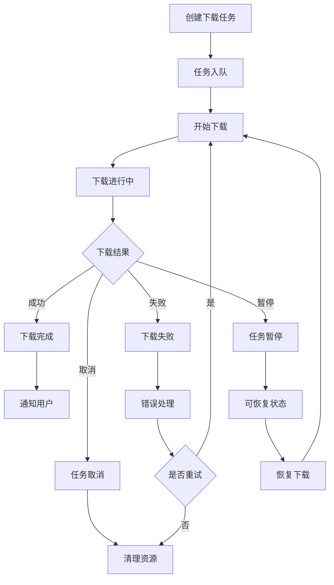
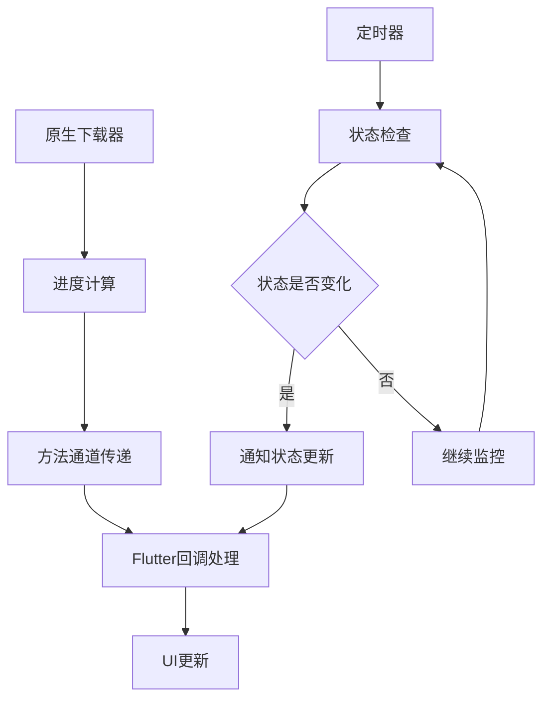

# Flutter Downloader 文件下载器模块

## 模块概述

`flutter_downloader` 是 OneApp 基础工具模块群中的文件下载器模块，基于 Flutter Community 的开源项目进行定制化。该模块提供了强大的文件下载能力，支持多平台（Android、iOS、鸿蒙）的原生下载功能，包括后台下载、断点续传、下载管理等特性。

### 基本信息
- **模块名称**: flutter_downloader
- **版本**: 1.11.8
- **描述**: 强大的文件下载插件
- **Flutter 版本**: >=3.19.0
- **Dart 版本**: >=3.3.0 <4.0.0
- **原始项目**: https://github.com/fluttercommunity/flutter_downloader

## 功能特性

### 核心功能
1. **多平台下载支持**
   - Android 原生下载管理器集成
   - iOS 后台下载任务支持
   - 鸿蒙（HarmonyOS）平台支持
   - 跨平台统一接口

2. **高级下载特性**
   - 后台下载支持
   - 断点续传功能
   - 下载进度监控
   - 并发下载控制

3. **下载管理系统**
   - 下载任务队列
   - 下载状态跟踪
   - 下载历史记录
   - 失败重试机制

4. **文件系统集成**
   - 灵活的保存路径配置
   - 文件完整性验证
   - 存储空间检查
   - 文件权限管理

## 技术架构

### 目录结构
```
flutter_downloader/
├── lib/                        # Dart代码
│   ├── flutter_downloader.dart # 主入口文件
│   └── src/                    # 源代码
│       ├── downloader.dart     # 下载器核心
│       ├── models.dart         # 数据模型
│       ├── callback_dispatcher.dart # 回调分发器
│       └── utils.dart          # 工具类
├── android/                    # Android原生实现
│   └── src/main/java/
│       └── vn/hunghd/flutterdownloader/
│           ├── FlutterDownloaderPlugin.java
│           ├── DownloadWorker.java
│           ├── TaskDbHelper.java
│           └── TaskDao.java
├── ios/                        # iOS原生实现
│   ├── Classes/
│   │   ├── FlutterDownloaderPlugin.h
│   │   ├── FlutterDownloaderPlugin.m
│   │   ├── DBManager.h
│   │   └── DBManager.m
│   └── flutter_downloader.podspec
├── ohos/                       # 鸿蒙原生实现
└── example/                    # 示例应用
```

### 平台支持
- **Android**: 使用 DownloadManager 和 WorkManager
- **iOS**: 使用 URLSessionDownloadTask
- **鸿蒙**: 使用 HarmonyOS 下载接口

## 核心模块分析

### 1. Flutter端实现

#### 主入口 (`lib/flutter_downloader.dart`)
```dart
class FlutterDownloader {
  static const MethodChannel _channel = MethodChannel('vn.hunghd/downloader');
  static const MethodChannel _backgroundChannel = 
      MethodChannel('vn.hunghd/downloader_send_port');

  /// 初始化下载器
  static Future<void> initialize({
    bool debug = false,
    bool ignoreSsl = false,
  }) async {
    await _channel.invokeMethod('initialize', {
      'debug': debug,
      'ignoreSsl': ignoreSsl,
    });
  }

  /// 创建下载任务
  static Future<String?> enqueue({
    required String url,
    required String savedDir,
    String? fileName,
    Map<String, String>? headers,
    bool showNotification = true,
    bool openFileFromNotification = true,
    bool requiresStorageNotLow = false,
    bool saveInPublicStorage = false,
  }) async {
    try {
      final result = await _channel.invokeMethod('enqueue', {
        'url': url,
        'saved_dir': savedDir,
        'file_name': fileName,
        'headers': headers,
        'show_notification': showNotification,
        'open_file_from_notification': openFileFromNotification,
        'requires_storage_not_low': requiresStorageNotLow,
        'save_in_public_storage': saveInPublicStorage,
      });
      return result;
    } catch (e) {
      print('Error creating download task: $e');
      return null;
    }
  }

  /// 获取所有下载任务
  static Future<List<DownloadTask>?> loadTasks() async {
    try {
      final result = await _channel.invokeMethod('loadTasks');
      return (result as List<dynamic>?)
          ?.map((item) => DownloadTask.fromMap(item))
          .toList();
    } catch (e) {
      print('Error loading tasks: $e');
      return null;
    }
  }

  /// 取消下载任务
  static Future<void> cancel({required String taskId}) async {
    await _channel.invokeMethod('cancel', {'task_id': taskId});
  }

  /// 暂停下载任务
  static Future<void> pause({required String taskId}) async {
    await _channel.invokeMethod('pause', {'task_id': taskId});
  }

  /// 恢复下载任务
  static Future<void> resume({required String taskId}) async {
    await _channel.invokeMethod('resume', {'task_id': taskId});
  }

  /// 重试下载任务
  static Future<String?> retry({required String taskId}) async {
    return await _channel.invokeMethod('retry', {'task_id': taskId});
  }

  /// 移除下载任务
  static Future<void> remove({
    required String taskId,
    bool shouldDeleteContent = false,
  }) async {
    await _channel.invokeMethod('remove', {
      'task_id': taskId,
      'should_delete_content': shouldDeleteContent,
    });
  }

  /// 打开下载的文件
  static Future<bool> open({required String taskId}) async {
    return await _channel.invokeMethod('open', {'task_id': taskId});
  }

  /// 注册下载回调
  static void registerCallback(DownloadCallback callback) {
    _callback = callback;
    _channel.setMethodCallHandler(_handleMethodCall);
  }

  static DownloadCallback? _callback;

  static Future<dynamic> _handleMethodCall(MethodCall call) async {
    if (call.method == 'updateProgress') {
      final id = call.arguments['id'] as String;
      final status = DownloadTaskStatus.values[call.arguments['status'] as int];
      final progress = call.arguments['progress'] as int;
      _callback?.call(id, status, progress);
    }
  }
}

typedef DownloadCallback = void Function(
  String id,
  DownloadTaskStatus status,
  int progress,
);
```

#### 数据模型 (`src/models.dart`)
```dart
enum DownloadTaskStatus {
  undefined,
  enqueued,
  running,
  complete,
  failed,
  canceled,
  paused,
}

class DownloadTask {
  final String taskId;
  final String url;
  final String filename;
  final String savedDir;
  final DownloadTaskStatus status;
  final int progress;
  final int timeCreated;
  final bool allowCellular;
  
  const DownloadTask({
    required this.taskId,
    required this.url,
    required this.filename,
    required this.savedDir,
    required this.status,
    required this.progress,
    required this.timeCreated,
    required this.allowCellular,
  });

  factory DownloadTask.fromMap(Map<String, dynamic> map) {
    return DownloadTask(
      taskId: map['task_id'] as String,
      url: map['url'] as String,
      filename: map['file_name'] as String,
      savedDir: map['saved_dir'] as String,
      status: DownloadTaskStatus.values[map['status'] as int],
      progress: map['progress'] as int,
      timeCreated: map['time_created'] as int,
      allowCellular: map['allow_cellular'] as bool? ?? true,
    );
  }

  Map<String, dynamic> toMap() {
    return {
      'task_id': taskId,
      'url': url,
      'file_name': filename,
      'saved_dir': savedDir,
      'status': status.index,
      'progress': progress,
      'time_created': timeCreated,
      'allow_cellular': allowCellular,
    };
  }
}
```

### 2. Android端实现

#### 主插件类 (`FlutterDownloaderPlugin.java`)
```java
public class FlutterDownloaderPlugin implements FlutterPlugin, MethodCallHandler {
    private static final String CHANNEL = "vn.hunghd/downloader";
    private static final String BACKGROUND_CHANNEL = "vn.hunghd/downloader_send_port";
    
    private Context context;
    private MethodChannel channel;
    private MethodChannel backgroundChannel;
    private TaskDbHelper dbHelper;
    
    @Override
    public void onAttachedToEngine(@NonNull FlutterPluginBinding binding) {
        context = binding.getApplicationContext();
        channel = new MethodChannel(binding.getBinaryMessenger(), CHANNEL);
        backgroundChannel = new MethodChannel(binding.getBinaryMessenger(), BACKGROUND_CHANNEL);
        channel.setMethodCallHandler(this);
        dbHelper = TaskDbHelper.getInstance(context);
    }
    
    @Override
    public void onMethodCall(@NonNull MethodCall call, @NonNull Result result) {
        switch (call.method) {
            case "initialize":
                initialize(call, result);
                break;
            case "enqueue":
                enqueue(call, result);
                break;
            case "loadTasks":
                loadTasks(result);
                break;
            case "cancel":
                cancel(call, result);
                break;
            case "pause":
                pause(call, result);
                break;
            case "resume":
                resume(call, result);
                break;
            case "retry":
                retry(call, result);
                break;
            case "remove":
                remove(call, result);
                break;
            case "open":
                open(call, result);
                break;
            default:
                result.notImplemented();
        }
    }
    
    private void enqueue(MethodCall call, Result result) {
        String url = call.argument("url");
        String savedDir = call.argument("saved_dir");
        String fileName = call.argument("file_name");
        Map<String, String> headers = call.argument("headers");
        boolean showNotification = call.argument("show_notification");
        
        // 创建下载请求
        DownloadManager.Request request = new DownloadManager.Request(Uri.parse(url));
        
        // 设置请求头
        if (headers != null) {
            for (Map.Entry<String, String> entry : headers.entrySet()) {
                request.addRequestHeader(entry.getKey(), entry.getValue());
            }
        }
        
        // 设置下载路径
        String finalFileName = fileName != null ? fileName : 
            URLUtil.guessFileName(url, null, null);
        request.setDestinationInExternalFilesDir(context, null, 
            savedDir + "/" + finalFileName);
        
        // 设置通知
        if (showNotification) {
            request.setNotificationVisibility(
                DownloadManager.Request.VISIBILITY_VISIBLE_NOTIFY_COMPLETED);
        }
        
        // 启动下载
        DownloadManager downloadManager = (DownloadManager) 
            context.getSystemService(Context.DOWNLOAD_SERVICE);
        long downloadId = downloadManager.enqueue(request);
        
        // 保存任务信息到数据库
        String taskId = UUID.randomUUID().toString();
        TaskDao taskDao = new TaskDao(taskId, url, finalFileName, savedDir, 
            DownloadTaskStatus.ENQUEUED.ordinal(), 0, System.currentTimeMillis());
        dbHelper.insertOrUpdateNewTask(taskDao);
        
        result.success(taskId);
    }
}
```

#### 下载工作器 (`DownloadWorker.java`)
```java
public class DownloadWorker extends Worker {
    public DownloadWorker(@NonNull Context context, @NonNull WorkerParameters params) {
        super(context, params);
    }
    
    @NonNull
    @Override
    public Result doWork() {
        String taskId = getInputData().getString("task_id");
        String url = getInputData().getString("url");
        
        try {
            // 执行下载逻辑
            downloadFile(taskId, url);
            return Result.success();
        } catch (Exception e) {
            return Result.failure();
        }
    }
    
    private void downloadFile(String taskId, String url) {
        // 下载实现逻辑
        // 包括进度更新、错误处理等
    }
}
```

### 3. iOS端实现

#### 主插件类 (`FlutterDownloaderPlugin.m`)
```objc
@implementation FlutterDownloaderPlugin

+ (void)registerWithRegistrar:(NSObject<FlutterPluginRegistrar>*)registrar {
    FlutterMethodChannel* channel = [FlutterMethodChannel
        methodChannelWithName:@"vn.hunghd/downloader"
              binaryMessenger:[registrar messenger]];
    FlutterDownloaderPlugin* instance = [[FlutterDownloaderPlugin alloc] init];
    [registrar addMethodCallDelegate:instance channel:channel];
}

- (void)handleMethodCall:(FlutterMethodCall*)call result:(FlutterResult)result {
    if ([@"initialize" isEqualToString:call.method]) {
        [self initialize:call result:result];
    } else if ([@"enqueue" isEqualToString:call.method]) {
        [self enqueue:call result:result];
    } else if ([@"loadTasks" isEqualToString:call.method]) {
        [self loadTasks:result];
    } else if ([@"cancel" isEqualToString:call.method]) {
        [self cancel:call result:result];
    } else if ([@"pause" isEqualToString:call.method]) {
        [self pause:call result:result];
    } else if ([@"resume" isEqualToString:call.method]) {
        [self resume:call result:result];
    } else {
        result(FlutterMethodNotImplemented);
    }
}

- (void)enqueue:(FlutterMethodCall*)call result:(FlutterResult)result {
    NSString* url = call.arguments[@"url"];
    NSString* savedDir = call.arguments[@"saved_dir"];
    NSString* fileName = call.arguments[@"file_name"];
    NSDictionary* headers = call.arguments[@"headers"];
    
    // 创建下载任务
    NSURLSessionConfiguration* config = [NSURLSessionConfiguration backgroundSessionConfigurationWithIdentifier:[[NSUUID UUID] UUIDString]];
    NSURLSession* session = [NSURLSession sessionWithConfiguration:config delegate:self delegateQueue:nil];
    
    NSMutableURLRequest* request = [NSMutableURLRequest requestWithURL:[NSURL URLWithString:url]];
    
    // 设置请求头
    if (headers) {
        for (NSString* key in headers) {
            [request setValue:headers[key] forHTTPHeaderField:key];
        }
    }
    
    NSURLSessionDownloadTask* downloadTask = [session downloadTaskWithRequest:request];
    [downloadTask resume];
    
    // 生成任务ID并保存
    NSString* taskId = [[NSUUID UUID] UUIDString];
    [[DBManager getInstance] insertTask:taskId url:url fileName:fileName savedDir:savedDir];
    
    result(taskId);
}

#pragma mark - NSURLSessionDownloadDelegate

- (void)URLSession:(NSURLSession *)session downloadTask:(NSURLSessionDownloadTask *)downloadTask didFinishDownloadingToURL:(NSURL *)location {
    // 处理下载完成
}

- (void)URLSession:(NSURLSession *)session downloadTask:(NSURLSessionDownloadTask *)downloadTask didWriteData:(int64_t)bytesWritten totalBytesWritten:(int64_t)totalBytesWritten totalBytesExpectedToWrite:(int64_t)totalBytesExpectedToWrite {
    // 更新下载进度
    double progress = (double)totalBytesWritten / (double)totalBytesExpectedToWrite;
    // 通知Flutter端进度更新
}

@end
```

## 业务流程

### 下载任务生命周期


### 进度更新流程


## 使用示例

### 基础下载示例
```dart
class DownloadExample extends StatefulWidget {
  @override
  _DownloadExampleState createState() => _DownloadExampleState();
}

class _DownloadExampleState extends State<DownloadExample> {
  List<DownloadTask> _tasks = [];
  
  @override
  void initState() {
    super.initState();
    _initializeDownloader();
  }
  
  Future<void> _initializeDownloader() async {
    await FlutterDownloader.initialize(debug: true);
    
    // 注册下载回调
    FlutterDownloader.registerCallback(_downloadCallback);
    
    // 加载已有任务
    _loadTasks();
  }
  
  void _downloadCallback(String id, DownloadTaskStatus status, int progress) {
    setState(() {
      final taskIndex = _tasks.indexWhere((task) => task.taskId == id);
      if (taskIndex != -1) {
        _tasks[taskIndex] = DownloadTask(
          taskId: id,
          url: _tasks[taskIndex].url,
          filename: _tasks[taskIndex].filename,
          savedDir: _tasks[taskIndex].savedDir,
          status: status,
          progress: progress,
          timeCreated: _tasks[taskIndex].timeCreated,
          allowCellular: _tasks[taskIndex].allowCellular,
        );
      }
    });
  }
  
  Future<void> _loadTasks() async {
    final tasks = await FlutterDownloader.loadTasks();
    setState(() {
      _tasks = tasks ?? [];
    });
  }
  
  Future<void> _startDownload(String url, String fileName) async {
    final savedDir = await _getSavedDir();
    
    final taskId = await FlutterDownloader.enqueue(
      url: url,
      savedDir: savedDir,
      fileName: fileName,
      showNotification: true,
      openFileFromNotification: true,
    );
    
    if (taskId != null) {
      _loadTasks();
    }
  }
  
  Future<String> _getSavedDir() async {
    final directory = await getExternalStorageDirectory();
    return '${directory!.path}/downloads';
  }
  
  @override
  Widget build(BuildContext context) {
    return Scaffold(
      appBar: AppBar(title: Text('Downloads')),
      body: ListView.builder(
        itemCount: _tasks.length,
        itemBuilder: (context, index) {
          final task = _tasks[index];
          return ListTile(
            title: Text(task.filename),
            subtitle: LinearProgressIndicator(
              value: task.progress / 100.0,
            ),
            trailing: _buildActionButton(task),
          );
        },
      ),
      floatingActionButton: FloatingActionButton(
        onPressed: () => _showDownloadDialog(),
        child: Icon(Icons.add),
      ),
    );
  }
  
  Widget _buildActionButton(DownloadTask task) {
    switch (task.status) {
      case DownloadTaskStatus.running:
        return IconButton(
          icon: Icon(Icons.pause),
          onPressed: () => FlutterDownloader.pause(taskId: task.taskId),
        );
      case DownloadTaskStatus.paused:
        return IconButton(
          icon: Icon(Icons.play_arrow),
          onPressed: () => FlutterDownloader.resume(taskId: task.taskId),
        );
      case DownloadTaskStatus.failed:
        return IconButton(
          icon: Icon(Icons.refresh),
          onPressed: () => FlutterDownloader.retry(taskId: task.taskId),
        );
      case DownloadTaskStatus.complete:
        return IconButton(
          icon: Icon(Icons.open_in_new),
          onPressed: () => FlutterDownloader.open(taskId: task.taskId),
        );
      default:
        return IconButton(
          icon: Icon(Icons.delete),
          onPressed: () => FlutterDownloader.remove(
            taskId: task.taskId,
            shouldDeleteContent: true,
          ),
        );
    }
  }
  
  void _showDownloadDialog() {
    // 显示下载URL输入对话框
    showDialog(
      context: context,
      builder: (context) => DownloadDialog(
        onDownload: (url, fileName) => _startDownload(url, fileName),
      ),
    );
  }
}
```

### 批量下载管理
```dart
class BatchDownloadManager {
  static final BatchDownloadManager _instance = BatchDownloadManager._internal();
  factory BatchDownloadManager() => _instance;
  BatchDownloadManager._internal();
  
  final Map<String, DownloadTask> _activeTasks = {};
  final StreamController<List<DownloadTask>> _tasksController = 
      StreamController<List<DownloadTask>>.broadcast();
  
  Stream<List<DownloadTask>> get tasksStream => _tasksController.stream;
  
  Future<void> initialize() async {
    await FlutterDownloader.initialize();
    FlutterDownloader.registerCallback(_onDownloadCallback);
    await _loadExistingTasks();
  }
  
  Future<void> _loadExistingTasks() async {
    final tasks = await FlutterDownloader.loadTasks();
    if (tasks != null) {
      _activeTasks.clear();
      for (final task in tasks) {
        _activeTasks[task.taskId] = task;
      }
      _notifyTasksUpdate();
    }
  }
  
  void _onDownloadCallback(String id, DownloadTaskStatus status, int progress) {
    final existingTask = _activeTasks[id];
    if (existingTask != null) {
      _activeTasks[id] = DownloadTask(
        taskId: id,
        url: existingTask.url,
        filename: existingTask.filename,
        savedDir: existingTask.savedDir,
        status: status,
        progress: progress,
        timeCreated: existingTask.timeCreated,
        allowCellular: existingTask.allowCellular,
      );
      _notifyTasksUpdate();
    }
  }
  
  Future<String?> addDownload({
    required String url,
    required String savedDir,
    String? fileName,
    Map<String, String>? headers,
  }) async {
    final taskId = await FlutterDownloader.enqueue(
      url: url,
      savedDir: savedDir,
      fileName: fileName,
      headers: headers,
      showNotification: true,
    );
    
    if (taskId != null) {
      await _loadExistingTasks();
    }
    
    return taskId;
  }
  
  Future<void> pauseDownload(String taskId) async {
    await FlutterDownloader.pause(taskId: taskId);
  }
  
  Future<void> resumeDownload(String taskId) async {
    await FlutterDownloader.resume(taskId: taskId);
  }
  
  Future<void> cancelDownload(String taskId) async {
    await FlutterDownloader.cancel(taskId: taskId);
    _activeTasks.remove(taskId);
    _notifyTasksUpdate();
  }
  
  Future<void> retryDownload(String taskId) async {
    final newTaskId = await FlutterDownloader.retry(taskId: taskId);
    if (newTaskId != null) {
      await _loadExistingTasks();
    }
  }
  
  List<DownloadTask> getTasksByStatus(DownloadTaskStatus status) {
    return _activeTasks.values
        .where((task) => task.status == status)
        .toList();
  }
  
  void _notifyTasksUpdate() {
    _tasksController.add(_activeTasks.values.toList());
  }
  
  void dispose() {
    _tasksController.close();
  }
}
```

## 配置和优化

### Android配置
```xml
<!-- android/app/src/main/AndroidManifest.xml -->
<uses-permission android:name="android.permission.INTERNET" />
<uses-permission android:name="android.permission.WRITE_EXTERNAL_STORAGE" />

<application>
    <provider
        android:name="vn.hunghd.flutterdownloader.DownloadedFileProvider"
        android:authorities="${applicationId}.flutter_downloader.provider"
        android:exported="false"
        android:grantUriPermissions="true">
        <meta-data
            android:name="android.support.FILE_PROVIDER_PATHS"
            android:resource="@xml/provider_paths"/>
    </provider>
</application>
```

### iOS配置
```xml
<!-- ios/Runner/Info.plist -->
<key>NSAppTransportSecurity</key>
<dict>
    <key>NSAllowsArbitraryLoads</key>
    <true/>
</dict>

<key>UIBackgroundModes</key>
<array>
    <string>background-fetch</string>
    <string>background-processing</string>
</array>
```

### 性能优化
```dart
class DownloadOptimizer {
  static const int MAX_CONCURRENT_DOWNLOADS = 3;
  static const int RETRY_ATTEMPTS = 3;
  static const Duration RETRY_DELAY = Duration(seconds: 5);
  
  static Future<void> configureDownloader() async {
    await FlutterDownloader.initialize(
      debug: kDebugMode,
      ignoreSsl: false,
    );
  }
  
  static Map<String, String> getOptimizedHeaders() {
    return {
      'User-Agent': 'OneApp/${getAppVersion()}',
      'Accept-Encoding': 'gzip, deflate',
      'Connection': 'keep-alive',
    };
  }
  
  static Future<String?> smartDownload({
    required String url,
    required String savedDir,
    String? fileName,
  }) async {
    // 检查网络状态
    final connectivity = await Connectivity().checkConnectivity();
    if (connectivity == ConnectivityResult.none) {
      throw Exception('No network connection');
    }
    
    // 检查存储空间
    final directory = Directory(savedDir);
    if (!await directory.exists()) {
      await directory.create(recursive: true);
    }
    
    final freeSpace = await _getAvailableSpace(savedDir);
    final fileSize = await _getFileSize(url);
    if (fileSize > freeSpace) {
      throw Exception('Insufficient storage space');
    }
    
    // 开始下载
    return await FlutterDownloader.enqueue(
      url: url,
      savedDir: savedDir,
      fileName: fileName,
      headers: getOptimizedHeaders(),
      showNotification: true,
      requiresStorageNotLow: true,
    );
  }
  
  static Future<int> _getAvailableSpace(String path) async {
    // 获取可用存储空间
    return 0; // 实现细节
  }
  
  static Future<int> _getFileSize(String url) async {
    // 获取文件大小
    return 0; // 实现细节
  }
}
```

## 安全特性

### 文件安全
- **路径验证**: 验证下载路径安全性
- **文件类型检查**: 检查允许的文件类型
- **病毒扫描**: 集成安全扫描机制
- **权限控制**: 严格的文件访问权限

### 网络安全
- **HTTPS验证**: 强制HTTPS下载
- **证书校验**: SSL证书有效性检查
- **请求头验证**: 防止恶意请求头
- **下载限制**: 文件大小和类型限制

## 测试策略

### 单元测试
- **下载逻辑测试**: 核心下载功能
- **状态管理测试**: 任务状态转换
- **错误处理测试**: 异常情况处理
- **数据模型测试**: 序列化反序列化

### 集成测试
- **平台兼容测试**: 不同平台下载功能
- **网络环境测试**: 不同网络条件
- **存储测试**: 不同存储路径和权限
- **并发测试**: 多任务并发下载

### 性能测试
- **大文件下载**: 大文件下载稳定性
- **长时间运行**: 长期后台下载
- **内存使用**: 内存泄漏检测
- **电池消耗**: 下载对电池的影响

## 总结

`flutter_downloader` 模块作为 OneApp 的文件下载器，提供了强大的跨平台下载能力。通过原生实现和Flutter接口的完美结合，实现了高效、稳定的文件下载功能。模块支持后台下载、断点续传、进度监控等高级特性，能够满足各种下载场景的需求。良好的错误处理和性能优化机制确保了下载任务的可靠性和用户体验。
