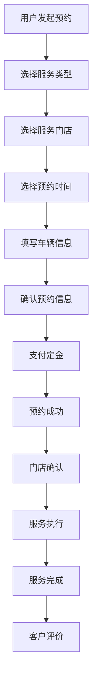
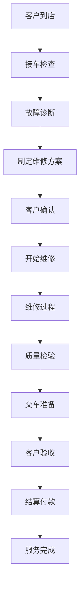

# After Sales 售后服务模块群

## 模块群概述

After Sales 模块群是 OneApp 的售后服务业务模块集合，提供了完整的汽车售后服务功能。该模块群包含了维修预约、服务记录、技师派工、客户满意度调查等核心售后业务功能。

## 子模块列表

### 核心模块
1. **[oneapp_after_sales](./oneapp_after_sales.md)** - 售后服务主模块
   - 维修预约和服务管理
   - 服务记录和历史查询
   - 客户端售后功能入口

2. **[clr_after_sales](./clr_after_sales.md)** - 售后服务SDK
   - 售后服务业务逻辑封装
   - API接口统一管理
   - 数据模型定义

## 功能特性

### 核心业务功能
1. **维修预约服务**
   - 在线预约维修时间
   - 服务门店选择
   - 预约状态跟踪
   - 预约变更和取消

2. **服务记录管理**
   - 维修历史记录
   - 服务项目详情
   - 费用明细查看
   - 服务评价反馈

3. **技师服务管理**
   - 技师信息展示
   - 服务进度跟踪
   - 实时沟通功能
   - 服务质量评估

4. **客户体验优化**
   - 服务满意度调查
   - 投诉建议处理
   - 会员权益服务
   - 增值服务推荐

## 技术架构

### 模块架构图
```
售后服务应用层 (oneapp_after_sales)
    ↓
售后服务SDK (clr_after_sales)  
    ↓
基础服务层 (basic_*)
    ↓
原生平台能力
```

### 主要依赖
- **地图服务**: ui_mapview, amap_flutter_location
- **支付服务**: kit_alipay, fluwx
- **图片处理**: photo_view, photo_gallery
- **电子签名**: signature
- **权限管理**: permission_handler
- **网络通信**: dio
- **WebView**: basic_webview

## 业务流程

### 维修预约流程


### 服务执行流程


## 详细模块文档

- [OneApp After Sales - 售后服务主模块](./oneapp_after_sales.md)
- [CLR After Sales - 售后服务SDK](./clr_after_sales.md)

## 开发指南

### 环境要求
- Flutter >=1.17.0
- Dart >=3.0.0 <4.0.0
- Android SDK >=21
- iOS >=11.0

### 快速开始
```dart
// 初始化售后服务模块
await AfterSalesService.initialize();

// 创建维修预约
final appointment = await AfterSalesService.createAppointment(
  serviceType: ServiceType.maintenance,
  storeId: 'store_123',
  appointmentTime: DateTime.now().add(Duration(days: 1)),
);
```

## 总结

After Sales 模块群为 OneApp 提供了完整的售后服务解决方案，通过标准化的业务流程和用户友好的界面设计，提升了售后服务的效率和客户满意度。模块群具有良好的扩展性，能够适应不同的售后服务场景和业务需求。
