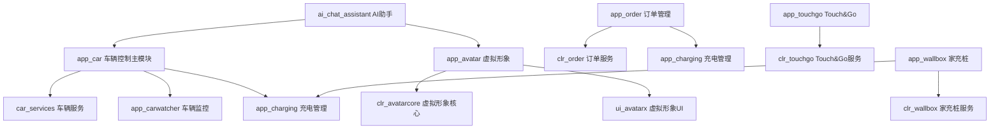

# OneApp App Car 车辆相关模块群文档

## 模块群概述

`oneapp_app_car` 是 OneApp 中最重要的模块群之一，包含了所有与车辆相关的功能模块。该模块群涵盖了车辆控制、充电管理、虚拟形象、维护保养、订单管理等核心业务功能。

## 模块结构总览

```
oneapp_app_car/
├── ai_chat_assistant/          # AI 聊天助手模块
├── amap_flutter_location/      # 高德地图定位插件
├── amap_flutter_search/        # 高德地图搜索插件
├── app_avatar/                 # 虚拟形象应用模块
├── app_car/                    # 车辆控制主模块
├── app_carwatcher/            # 车辆监控模块
├── app_charging/              # 充电管理模块
├── app_composer/              # 编辑器组件模块
├── app_maintenance/           # 维护保养模块
├── app_order/                 # 订单管理模块
├── app_rpa/                   # RPA 自动化模块
├── app_touchgo/               # Touch&Go 功能模块
├── app_vur/                   # 车辆更新记录模块
├── app_wallbox/               # 家充桩管理模块
├── car_services/              # 车辆服务模块
├── clr_avatarcore/           # 虚拟形象核心 SDK
├── clr_order/                # 订单服务 SDK
├── clr_touchgo/              # Touch&Go 服务 SDK
├── clr_wallbox/              # 家充桩服务 SDK
├── kit_rpa_plugin/           # RPA 插件工具包
├── one_app_cache_plugin/     # 缓存插件
└── ui_avatarx/               # 虚拟形象 UI 组件
```

## 模块分类

### 1. 核心车辆功能模块
- **app_car** - 车辆控制主模块，提供基础的车辆操作功能
- **app_carwatcher** - 车辆监控模块，实时监控车辆状态
- **car_services** - 车辆服务模块，提供各种车辆相关服务

### 2. 充电相关模块
- **app_charging** - 充电管理模块，管理车辆充电功能
- **app_wallbox** - 家充桩管理模块，管理家用充电桩
- **clr_wallbox** - 家充桩服务 SDK

### 3. 虚拟形象模块群
- **app_avatar** - 虚拟形象应用模块
- **clr_avatarcore** - 虚拟形象核心 SDK
- **ui_avatarx** - 虚拟形象 UI 组件

### 4. 订单和支付模块
- **app_order** - 订单管理模块
- **clr_order** - 订单服务 SDK

### 5. 智能功能模块
- **ai_chat_assistant** - AI 聊天助手模块
- **app_touchgo** - Touch&Go 功能模块
- **clr_touchgo** - Touch&Go 服务 SDK

### 6. 维护和管理模块
- **app_maintenance** - 维护保养模块
- **app_vur** - 车辆更新记录模块
- **app_composer** - 编辑器组件模块

### 7. 自动化和工具模块
- **app_rpa** - RPA 自动化模块
- **kit_rpa_plugin** - RPA 插件工具包
- **one_app_cache_plugin** - 缓存插件

### 8. 地图和定位模块
- **amap_flutter_location** - 高德地图定位插件
- **amap_flutter_search** - 高德地图搜索插件

## 模块间依赖关系



## 技术架构特点

### 1. 分层架构
- **应用层** (app_*): 业务逻辑和用户界面
- **服务层** (clr_*): 核心服务和 SDK
- **工具层** (kit_*, ui_*): 工具和 UI 组件
- **插件层** (plugin): 原生功能插件

### 2. 模块化设计
- 每个模块独立开发和测试
- 清晰的接口定义和依赖管理
- 支持热插拔和动态加载

### 3. 服务化架构
- 微服务设计理念
- RESTful API 接口
- 统一的错误处理和日志记录

## 详细模块文档

- [AI Chat Assistant - AI 聊天助手](./ai_chat_assistant.md)
- [App Car - 车辆控制主模块](./app_car.md)
- [App Avatar - 虚拟形象模块](./app_avatar.md)
- [App Charging - 充电管理模块](./app_charging.md)
- [App CarWatcher - 车辆监控模块](./app_carwatcher.md)
- [App Order - 订单管理模块](./app_order.md)
- [App TouchGo - Touch&Go 功能模块](./app_touchgo.md)
- [App Wallbox - 家充桩管理模块](./app_wallbox.md)
- [App Maintenance - 维护保养模块](./app_maintenance.md)
- [App VUR - 车辆更新记录模块](./app_vur.md)
- [Car Services - 车辆服务模块](./car_services.md)
- [CLR AvatarCore - 虚拟形象核心 SDK](./clr_avatarcore.md)
- [CLR Order - 订单服务 SDK](./clr_order.md)
- [CLR TouchGo - Touch&Go 服务 SDK](./clr_touchgo.md)
- [CLR Wallbox - 家充桩服务 SDK](./clr_wallbox.md)
- [Kit RPA Plugin - RPA 插件工具包](./kit_rpa_plugin.md)
- [AMap Flutter Location - 高德地图定位插件](./amap_flutter_location.md)
- [AMap Flutter Search - 高德地图搜索插件](./amap_flutter_search.md)
- [UI AvatarX - 虚拟形象 UI 组件](./ui_avatarx.md)
- [One App Cache Plugin - 缓存插件](./one_app_cache_plugin.md)

## 开发指南

### 环境要求
- Flutter >=3.0.0
- Dart >=3.0.0
- Android SDK >=21
- iOS >=11.0

### 构建说明
每个模块都可以独立构建和测试，同时支持集成构建。具体的构建方式请参考各模块的详细文档。

### 测试策略
- 单元测试：每个模块的核心功能
- 集成测试：模块间的交互
- 端到端测试：完整的用户场景

## 总结

`oneapp_app_car` 模块群是 OneApp 车主应用的核心，提供了完整的车辆相关功能生态。通过合理的模块化设计和清晰的架构分层，实现了高内聚、低耦合的设计目标，为用户提供了丰富而稳定的车辆服务体验。

# App Car 车辆功能模块群

## 模块群概述

App Car 模块群是 OneApp 车联网生态的核心功能集合，包含了车辆控制、充电管理、虚拟形象、维护保养等全方位的车辆相关功能模块。该模块群为用户提供了完整的智能车辆管理和控制体验。

## 子模块列表

### 应用功能模块
1. **[ai_chat_assistant](./ai_chat_assistant.md)** - AI聊天助手模块
2. **[app_avatar](./app_avatar.md)** - 虚拟形象应用模块  
3. **[app_car](./app_car.md)** - 车辆控制主模块
4. **[app_carwatcher](./app_carwatcher.md)** - 车辆监控模块
5. **[app_charging](./app_charging.md)** - 充电管理模块
6. **[app_composer](./app_composer.md)** - 车辆编排模块
7. **[app_maintenance](./app_maintenance.md)** - 维护保养模块
8. **[app_order](./app_order.md)** - 订单管理模块
9. **[app_rpa](./app_rpa.md)** - RPA自动化模块
10. **[app_touchgo](./app_touchgo.md)** - 触控交互模块
11. **[app_vur](./app_vur.md)** - 车辆更新记录模块
12. **[app_wallbox](./app_wallbox.md)** - 充电墙盒模块

### 服务SDK模块
13. **[car_services](./car_services.md)** - 车辆服务统一接口
14. **[clr_avatarcore](./clr_avatarcore.md)** - 虚拟形象核心服务
15. **[clr_order](./clr_order.md)** - 订单服务SDK
16. **[clr_touchgo](./clr_touchgo.md)** - 触控服务SDK
17. **[clr_wallbox](./clr_wallbox.md)** - 充电墙盒服务SDK

### 原生插件模块
18. **[kit_rpa_plugin](./kit_rpa_plugin.md)** - RPA自动化原生插件
19. **[one_app_cache_plugin](./one_app_cache_plugin.md)** - 缓存原生插件

### UI组件模块
20. **[ui_avatarx](./ui_avatarx.md)** - 虚拟形象UI组件库

### 第三方集成模块
21. **amap_flutter_location** - 高德地图定位服务
22. **amap_flutter_search** - 高德地图搜索服务
