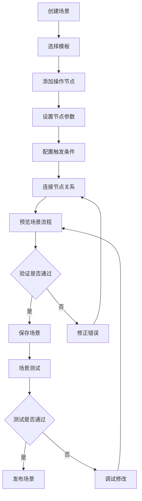
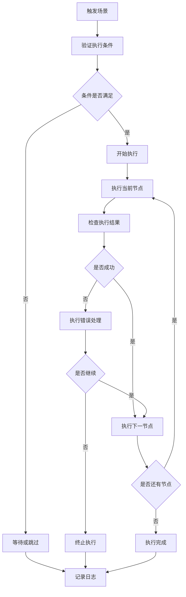

# App Composer 车辆编排模块

## 模块概述

`app_composer` 是 OneApp 车联网生态中的车辆编排模块，负责车辆功能的组合编排、自定义场景设置、智能控制流程等功能。该模块为用户提供个性化的车辆控制体验，通过可视化的方式让用户自定义车辆操作流程。

### 基本信息
- **模块名称**: app_composer
- **版本**: 0.2.9+21
- **描述**: 车辆功能编排应用模块
- **Flutter 版本**: >=2.5.0
- **Dart 版本**: >=2.17.0 <4.0.0

## 功能特性

### 核心功能
1. **场景编排**
   - 自定义车辆控制场景
   - 多步骤操作流程设计
   - 条件触发逻辑设置
   - 场景模板管理

2. **智能控制**
   - 基于时间的自动控制
   - 基于位置的触发控制
   - 基于状态的条件控制
   - 多设备联动控制

3. **可视化编辑**
   - 拖拽式流程设计
   - 可视化逻辑编排
   - 实时预览效果
   - 错误检查提示

4. **场景执行**
   - 场景一键执行
   - 执行状态监控
   - 执行结果反馈
   - 异常处理机制

## 技术架构

### 目录结构
```
lib/
├── app_composer.dart             # 模块入口文件
├── src/                          # 源代码目录
│   ├── config/                   # 配置管理
│   ├── constants/                # 常量定义
│   ├── global/                   # 全局状态管理
│   ├── pages/                    # 页面组件
│   ├── router/                   # 路由配置
│   ├── util/                     # 工具类
│   └── widgets/                  # 自定义组件
├── const/                        # 模块常量
├── generated/                    # 代码生成文件
└── l10n/                        # 国际化文件
```

### 依赖关系

#### 核心依赖
- `basic_modular: ^0.2.1` - 模块化框架
- `basic_modular_route: ^0.2.0` - 路由管理
- `basic_intl: ^0.2.0` - 国际化支持
- `basic_logger: ^0.2.0` - 日志系统

#### 业务依赖
- `ui_basic: ^0.2.43+5` - 基础UI组件
- `clr_composer: ^0.2.6+7` - 编排服务SDK
- `clr_account: ^0.2.8` - 账户服务SDK

#### 第三方依赖
- `json_annotation: ^4.6.0` - JSON序列化
- `dartz: ^0.10.1` - 函数式编程
- `uuid: ^3.0.7` - UUID生成
- `crypto: ^3.0.3` - 加密功能
- `path_provider: ^2.0.15` - 文件路径
- `bottom_sheet: ^4.0.0` - 底部弹窗

## 核心模块分析

### 1. 模块入口 (`app_composer.dart`)

**功能职责**:
- 模块对外接口统一导出
- 核心组件和服务暴露

### 2. 配置管理 (`src/config/`)

**功能职责**:
- 编排引擎配置
- 场景模板配置
- 执行策略配置
- 性能参数配置

**主要配置**:
- `ComposerConfig` - 编排引擎配置
- `SceneConfig` - 场景配置
- `ExecutionConfig` - 执行配置
- `TemplateConfig` - 模板配置

### 3. 常量定义 (`src/constants/`)

**功能职责**:
- 编排常量定义
- 操作类型枚举
- 状态码定义
- 错误消息常量

**主要常量**:
- 操作类型常量
- 触发条件常量
- 执行状态常量
- UI配置常量

### 4. 全局状态管理 (`src/global/`)

**功能职责**:
- 编排状态全局管理
- 场景数据缓存
- 执行状态监控
- 数据同步协调

**主要状态**:
- `ComposerState` - 编排器状态
- `SceneState` - 场景状态
- `ExecutionState` - 执行状态
- `TemplateState` - 模板状态

### 5. 页面组件 (`src/pages/`)

**功能职责**:
- 用户界面展示
- 用户交互处理
- 编排操作界面

**主要页面**:
- `ComposerHomePage` - 编排主页
- `SceneEditorPage` - 场景编辑页
- `SceneListPage` - 场景列表页
- `ExecutionMonitorPage` - 执行监控页
- `TemplateGalleryPage` - 模板库页面

### 6. 路由配置 (`src/router/`)

**功能职责**:
- 模块内部路由定义
- 页面导航管理
- 路由参数传递
- 导航守卫设置

### 7. 工具类 (`src/util/`)

**功能职责**:
- 编排逻辑工具
- 数据处理辅助
- 文件操作工具
- 加密解密工具

**主要工具**:
- `SceneBuilder` - 场景构建器
- `ExecutionEngine` - 执行引擎
- `DataConverter` - 数据转换器
- `FileManager` - 文件管理器

### 8. 自定义组件 (`src/widgets/`)

**功能职责**:
- 编排专用UI组件
- 可视化编辑组件
- 交互控制组件
- 状态展示组件

**主要组件**:
- `FlowChart` - 流程图组件
- `NodeEditor` - 节点编辑器
- `ConditionBuilder` - 条件构建器
- `ExecutionProgress` - 执行进度组件

## 业务流程

### 场景编排流程


### 场景执行流程


## 编排引擎设计

### 节点类型
1. **控制节点**
   - 车辆解锁/上锁
   - 车窗控制
   - 空调控制
   - 灯光控制

2. **条件节点**
   - 时间条件
   - 位置条件
   - 状态条件
   - 传感器条件

3. **逻辑节点**
   - 分支判断
   - 循环控制
   - 延时等待
   - 并行执行

4. **通知节点**
   - 推送通知
   - 短信通知
   - 邮件通知
   - 语音提醒

### 执行策略
- **串行执行**: 按顺序逐个执行
- **并行执行**: 同时执行多个操作
- **条件执行**: 基于条件判断执行
- **循环执行**: 重复执行指定次数

## 安全特性

### 权限控制
- 操作权限验证
- 用户身份认证
- 设备授权检查
- 场景访问控制

### 数据安全
- 场景数据加密
- 执行日志保护
- 敏感信息脱敏
- 数据传输安全

## 性能优化

### 执行优化
- 节点缓存机制
- 批量操作优化
- 异步执行策略
- 资源复用设计

### 内存管理
- 场景数据懒加载
- 执行上下文管理
- 内存泄漏防护
- 大场景分片处理

## 扩展性设计

### 插件化架构
- 自定义节点插件
- 第三方服务集成
- 扩展操作类型
- 自定义触发器

### 模板系统
- 预设场景模板
- 用户自定义模板
- 模板分享机制
- 模板版本管理

## 测试策略

### 单元测试
- 节点逻辑测试
- 执行引擎测试
- 数据模型测试
- 工具类测试

### 集成测试
- 场景执行测试
- 服务集成测试
- 数据流测试
- 权限流程测试

### 场景测试
- 复杂场景测试
- 异常场景测试
- 性能压力测试
- 用户体验测试

## 部署和维护

### 配置管理
- 环境配置分离
- 功能开关控制
- 性能参数调优
- 错误恢复策略

### 监控指标
- 场景执行成功率
- 执行响应时间
- 用户使用频率
- 异常错误统计

## 总结

`app_composer` 模块作为 OneApp 的智能编排中心，为用户提供了强大的车辆功能定制能力。通过可视化的编排界面、灵活的执行引擎和丰富的节点类型，用户可以创建个性化的车辆控制场景，提升用车体验的智能化水平。模块具有良好的扩展性和可维护性，能够适应不断变化的智能车联网需求。
