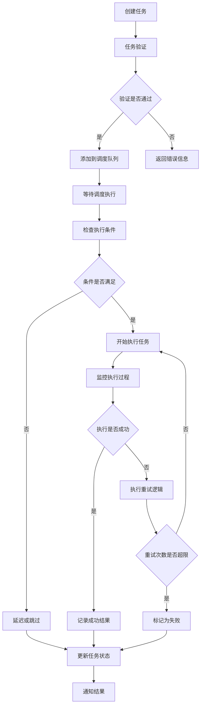
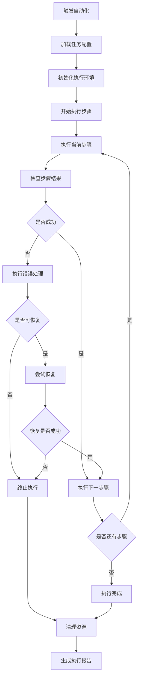

# App RPA 自动化模块

## 模块概述

`app_rpa` 是 OneApp 车联网生态中的 RPA（Robotic Process Automation）自动化模块，负责车辆操作的自动化流程、智能任务调度、批量操作处理等功能。该模块通过自动化技术提升用户的车辆管理效率，减少重复性操作。

### 基本信息
- **模块名称**: app_rpa
- **版本**: 0.1.7
- **描述**: RPA自动化应用模块
- **Flutter 版本**: >=2.10.5
- **Dart 版本**: >=3.0.0 <4.0.0

## 功能特性

### 核心功能
1. **自动化任务**
   - 定时任务调度
   - 批量操作执行
   - 条件触发自动化
   - 智能任务优化

2. **流程自动化**
   - 车辆状态自动检查
   - 维护提醒自动化
   - 数据同步自动化
   - 报告生成自动化

3. **智能调度**
   - 任务优先级管理
   - 资源冲突解决
   - 执行时间优化
   - 失败重试机制

4. **监控管理**
   - 任务执行监控
   - 性能指标统计
   - 异常告警处理
   - 日志记录分析

## 技术架构

### 目录结构
```
lib/
├── app_rpa.dart                 # 模块入口文件
├── src/                         # 源代码目录
│   ├── automation/              # 自动化引擎
│   ├── scheduler/               # 任务调度器
│   ├── tasks/                   # 任务定义
│   ├── monitors/                # 监控组件
│   ├── pages/                   # 页面组件
│   ├── models/                  # 数据模型
│   └── utils/                   # 工具类
├── generated/                   # 代码生成文件
└── l10n/                       # 国际化文件
```

### 依赖关系

#### 核心依赖
- `basic_modular: ^0.2.3` - 模块化框架
- `basic_modular_route: ^0.2.1` - 路由管理
- `basic_intl: ^0.2.0` - 国际化支持
- `basic_theme: ^0.2.5` - 主题系统
- `basic_track: ^0.1.3` - 数据埋点

#### 业务依赖
- `car_rpa: ^0.1.5` - RPA服务SDK
- `location_service_check: ^1.0.1` - 位置服务检查
- `amap_flutter_location: ^3.0.3` - 高德定位服务

#### 第三方依赖
- `json_annotation: ^4.8.1` - JSON序列化
- `dartz: ^0.10.1` - 函数式编程
- `shared_preferences: ^2.2.2` - 本地存储
- `flutter_constraintlayout: ^1.7.0-stable` - 约束布局
- `url_launcher: ^6.1.11` - URL启动

## 核心模块分析

### 1. 模块入口 (`app_rpa.dart`)

**功能职责**:
- 模块对外接口统一导出
- RPA服务初始化
- 自动化引擎启动

### 2. 自动化引擎 (`src/automation/`)

**功能职责**:
- 自动化任务执行引擎
- 流程控制逻辑
- 条件判断处理
- 异常恢复机制

**主要组件**:
- `AutomationEngine` - 自动化引擎核心
- `ProcessController` - 流程控制器
- `ConditionEvaluator` - 条件评估器
- `ErrorHandler` - 错误处理器

### 3. 任务调度器 (`src/scheduler/`)

**功能职责**:
- 任务时间调度
- 优先级队列管理
- 资源分配控制
- 并发执行协调

**主要组件**:
- `TaskScheduler` - 任务调度器
- `PriorityQueue` - 优先级队列
- `ResourceManager` - 资源管理器
- `ConcurrencyController` - 并发控制器

### 4. 任务定义 (`src/tasks/`)

**功能职责**:
- 预定义任务模板
- 自定义任务创建
- 任务参数配置
- 任务生命周期管理

**主要任务类型**:
- `VehicleCheckTask` - 车辆状态检查任务
- `MaintenanceReminderTask` - 维护提醒任务
- `DataSyncTask` - 数据同步任务
- `ReportGenerationTask` - 报告生成任务

### 5. 监控组件 (`src/monitors/`)

**功能职责**:
- 任务执行监控
- 性能指标收集
- 异常检测告警
- 统计数据分析

**主要监控器**:
- `ExecutionMonitor` - 执行监控器
- `PerformanceMonitor` - 性能监控器
- `ExceptionMonitor` - 异常监控器
- `StatisticsCollector` - 统计收集器

### 6. 页面组件 (`src/pages/`)

**功能职责**:
- 用户界面展示
- 任务管理界面
- 监控仪表板
- 配置设置页面

**主要页面**:
- `RPAHomePage` - RPA主页
- `TaskManagementPage` - 任务管理页
- `MonitorDashboardPage` - 监控仪表板
- `AutomationConfigPage` - 自动化配置页

### 7. 数据模型 (`src/models/`)

**功能职责**:
- 任务数据模型
- 执行结果模型
- 配置参数模型
- 统计数据模型

**主要模型**:
- `Task` - 任务模型
- `ExecutionResult` - 执行结果模型
- `AutomationConfig` - 自动化配置模型
- `MonitoringData` - 监控数据模型

### 8. 工具类 (`src/utils/`)

**功能职责**:
- RPA工具方法
- 数据处理辅助
- 时间计算工具
- 配置解析工具

**主要工具**:
- `TaskBuilder` - 任务构建器
- `CronParser` - 定时表达式解析器
- `DataProcessor` - 数据处理器
- `ConfigValidator` - 配置验证器

## 业务流程

### 任务调度流程


### 自动化执行流程


## RPA引擎设计

### 任务类型
1. **定时任务**
   - 周期性检查任务
   - 定时报告生成
   - 数据备份任务
   - 清理维护任务

2. **事件驱动任务**
   - 状态变化触发
   - 异常检测触发
   - 用户操作触发
   - 外部系统触发

3. **条件任务**
   - 基于位置的任务
   - 基于时间的任务
   - 基于状态的任务
   - 基于数据的任务

4. **流程任务**
   - 多步骤流程
   - 分支判断流程
   - 循环执行流程
   - 并行处理流程

### 执行策略
- **立即执行**: 任务创建后立即执行
- **延迟执行**: 指定时间后执行
- **周期执行**: 按周期重复执行
- **条件执行**: 满足条件时执行

## 安全特性

### 权限控制
- 任务执行权限验证
- 敏感操作授权检查
- 用户身份认证
- 操作审计日志

### 数据安全
- 任务配置加密存储
- 执行日志安全保护
- 敏感数据脱敏处理
- 传输数据加密

## 性能优化

### 执行优化
- 任务批量处理
- 并发执行控制
- 资源池管理
- 缓存机制优化

### 内存管理
- 任务数据懒加载
- 执行上下文清理
- 大数据分片处理
- 内存泄漏监控

## 扩展性设计

### 插件化架构
- 自定义任务插件
- 第三方服务集成
- 扩展触发器类型
- 自定义执行器

### 配置化管理
- 任务模板可配置
- 执行策略可调整
- 监控规则可定制
- 告警机制可配置

## 测试策略

### 单元测试
- 任务执行逻辑测试
- 调度器功能测试
- 数据模型测试
- 工具类方法测试

### 集成测试
- 端到端任务执行测试
- 服务集成测试
- 数据流测试
- 异常场景测试

### 性能测试
- 并发执行压力测试
- 长时间运行稳定性测试
- 内存使用测试
- 响应时间测试

## 部署和维护

### 配置管理
- 环境配置分离
- 任务参数配置
- 性能调优参数
- 监控阈值配置

### 监控指标
- 任务执行成功率
- 平均执行时间
- 系统资源使用率
- 异常错误统计

## 总结

`app_rpa` 模块作为 OneApp 的自动化中枢，为用户提供了强大的车辆管理自动化能力。通过智能的任务调度、可靠的执行引擎和完善的监控机制，用户可以实现车辆管理的自动化和智能化，显著提升管理效率。模块具有良好的扩展性和可维护性，能够适应不断变化的自动化需求。
