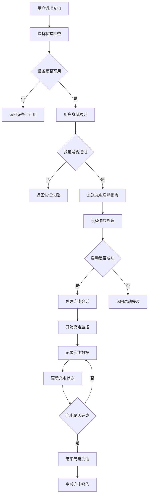
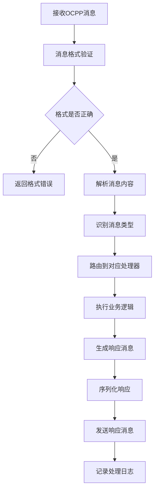

# CLR Wallbox 充电墙盒服务SDK

## 模块概述

`clr_wallbox` 是 OneApp 车联网生态中的充电墙盒服务SDK，负责充电墙盒设备的通信协议、数据处理、状态管理和业务逻辑封装等功能。该模块为充电墙盒应用提供底层的设备控制和数据服务能力。

### 基本信息
- **模块名称**: clr_wallbox
- **版本**: 0.2.14
- **描述**: 充电墙盒服务SDK
- **Flutter 版本**: >=2.10.5
- **Dart 版本**: >=3.0.0 <4.0.0

## 功能特性

### 核心功能
1. **设备通信协议**
   - OCPP协议支持
   - Modbus通信协议
   - WebSocket实时通信
   - HTTP RESTful API

2. **数据处理服务**
   - 充电数据解析
   - 设备状态处理
   - 配置参数管理
   - 历史数据存储

3. **业务逻辑封装**
   - 充电会话管理
   - 计费逻辑处理
   - 安全验证机制
   - 异常处理流程

4. **状态监控系统**
   - 实时状态监控
   - 健康状态检查
   - 异常告警处理
   - 性能指标统计

## 技术架构

### 目录结构
```
lib/
├── clr_wallbox.dart            # 模块入口文件
├── src/                        # 源代码目录
│   ├── protocols/              # 通信协议
│   ├── services/               # 业务服务
│   ├── models/                 # 数据模型
│   ├── repositories/           # 数据仓库
│   ├── processors/             # 数据处理器
│   └── utils/                  # 工具类
├── test/                       # 测试文件
└── generated/                  # 代码生成文件
```

### 依赖关系

#### 核心框架依赖
- `basic_modular: ^0.2.3` - 模块化框架
- `basic_network: ^0.2.3+4` - 网络通信框架
- `basic_storage: ^0.2.2` - 本地存储框架
- `basic_track: ^0.1.3` - 数据埋点

#### 工具依赖
- `json_annotation: ^4.6.0` - JSON序列化
- `dartz: ^0.10.1` - 函数式编程
- `freezed_annotation: ^2.0.3` - 数据类注解
- `path_provider: ^2.1.3` - 文件路径
- `charset_converter: ^2.1.1` - 字符编码转换

## 核心模块分析

### 1. 模块入口 (`clr_wallbox.dart`)

**功能职责**:
- SDK对外接口导出
- 服务初始化配置
- 依赖注入管理

### 2. 通信协议 (`src/protocols/`)

**功能职责**:
- 充电设备通信协议实现
- 消息编码解码处理
- 协议版本管理
- 连接状态维护

**主要协议**:
- `OCPPProtocol` - OCPP充电协议
- `ModbusProtocol` - Modbus工业协议
- `WebSocketProtocol` - WebSocket实时协议
- `HTTPProtocol` - HTTP REST协议

**协议特性**:
- **OCPP 1.6/2.0**: 开放充电点协议
- **Modbus RTU/TCP**: 工业标准协议
- **自定义协议**: 厂商特定协议
- **协议适配**: 多协议统一接口

### 3. 业务服务 (`src/services/`)

**功能职责**:
- 充电业务逻辑封装
- 设备管理服务
- 用户认证服务
- 计费结算服务

**主要服务**:
- `ChargingService` - 充电服务
- `DeviceService` - 设备服务
- `AuthService` - 认证服务
- `BillingService` - 计费服务
- `MonitoringService` - 监控服务

### 4. 数据模型 (`src/models/`)

**功能职责**:
- 充电设备数据模型
- 协议消息模型
- 业务实体模型
- 配置参数模型

**主要模型**:
- `WallboxDevice` - 墙盒设备模型
- `ChargingSession` - 充电会话模型
- `OCPPMessage` - OCPP消息模型
- `DeviceStatus` - 设备状态模型
- `ChargingConfig` - 充电配置模型

### 5. 数据仓库 (`src/repositories/`)

**功能职责**:
- 设备数据持久化
- 充电记录存储
- 配置信息管理
- 缓存数据处理

**主要仓库**:
- `DeviceRepository` - 设备数据仓库
- `SessionRepository` - 会话数据仓库
- `ConfigRepository` - 配置数据仓库
- `LogRepository` - 日志数据仓库

### 6. 数据处理器 (`src/processors/`)

**功能职责**:
- 协议数据解析
- 业务数据转换
- 状态数据处理
- 异常数据过滤

**主要处理器**:
- `MessageProcessor` - 消息处理器
- `StatusProcessor` - 状态处理器
- `DataConverter` - 数据转换器
- `ExceptionHandler` - 异常处理器

### 7. 工具类 (`src/utils/`)

**功能职责**:
- 协议工具方法
- 数据验证工具
- 加密解密工具
- 时间处理工具

**主要工具**:
- `ProtocolUtils` - 协议工具
- `CryptoUtils` - 加密工具
- `ValidationUtils` - 验证工具
- `TimeUtils` - 时间工具

## 业务流程

### 充电启动流程


### OCPP消息处理流程


## OCPP协议设计

### 消息类型
1. **核心消息**
   - `Authorize` - 授权验证
   - `StartTransaction` - 开始充电
   - `StopTransaction` - 停止充电
   - `Heartbeat` - 心跳消息

2. **状态消息**
   - `StatusNotification` - 状态通知
   - `MeterValues` - 电表数值
   - `BootNotification` - 启动通知
   - `DataTransfer` - 数据传输

3. **配置消息**
   - `ChangeConfiguration` - 修改配置
   - `GetConfiguration` - 获取配置
   - `Reset` - 重置设备
   - `UnlockConnector` - 解锁连接器

### 消息结构
```json
{
  "messageTypeId": 2,
  "uniqueId": "19223201",
  "action": "Heartbeat",
  "payload": {}
}
```

## 数据存储设计

### 本地存储
1. **设备配置**
   - 设备基本信息
   - 通信参数
   - 充电参数
   - 安全配置

2. **充电记录**
   - 充电会话数据
   - 电量消耗记录
   - 时间戳信息
   - 用户信息

3. **状态数据**
   - 设备当前状态
   - 错误信息
   - 性能指标
   - 诊断数据

### 数据同步
- **增量同步**: 仅同步变化数据
- **全量同步**: 定期全量同步
- **冲突解决**: 数据冲突处理策略
- **版本控制**: 数据版本管理

## 安全机制

### 通信安全
- **TLS加密**: 传输层安全
- **证书验证**: 设备身份验证
- **消息签名**: 消息完整性验证
- **防重放**: 防止重放攻击

### 数据安全
- **敏感数据加密**: 本地数据加密
- **访问控制**: 数据访问权限
- **审计日志**: 操作审计记录
- **安全擦除**: 数据安全删除

## 性能优化

### 通信优化
- **连接池**: 复用网络连接
- **消息批处理**: 批量处理消息
- **压缩传输**: 数据压缩传输
- **异步处理**: 非阻塞消息处理

### 存储优化
- **数据压缩**: 存储空间优化
- **索引优化**: 查询性能优化
- **缓存策略**: 热点数据缓存
- **清理机制**: 过期数据清理

## 错误处理

### 错误分类
1. **通信错误**
   - 网络连接失败
   - 协议解析错误
   - 超时错误
   - 服务不可用

2. **业务错误**
   - 认证失败
   - 参数无效
   - 状态冲突
   - 资源不足

3. **系统错误**
   - 内存不足
   - 存储空间不够
   - 系统异常
   - 硬件故障

### 处理策略
- **重试机制**: 自动重试失败操作
- **降级处理**: 服务降级策略
- **补偿机制**: 事务补偿处理
- **告警通知**: 异常情况告警

## 测试策略

### 单元测试
- **协议解析测试**: 消息编解码
- **业务逻辑测试**: 充电流程
- **数据模型测试**: 序列化反序列化
- **工具类测试**: 工具方法功能

### 集成测试
- **协议集成测试**: 设备通信
- **数据库集成测试**: 数据持久化
- **服务集成测试**: 端到端流程
- **第三方集成测试**: 外部系统

### 兼容性测试
- **设备兼容性**: 不同厂商设备
- **协议版本**: OCPP不同版本
- **网络环境**: 不同网络条件
- **并发测试**: 多设备并发

## 部署和维护

### 配置管理
- **环境配置**: 开发、测试、生产
- **协议配置**: 协议参数设置
- **安全配置**: 证书和密钥管理
- **性能配置**: 性能调优参数

### 监控指标
- **设备在线率**: 设备连接状态
- **消息处理量**: 消息吞吐量
- **错误率**: 错误发生频率
- **响应时间**: 消息处理延迟

## 总结

`clr_wallbox` 模块作为 OneApp 的充电墙盒服务SDK，提供了完整的充电设备通信和管理能力。通过标准化的协议支持、稳定的数据处理和完善的安全机制，为充电基础设施的数字化管理提供了可靠的技术支撑。模块具有良好的扩展性和兼容性，能够适应不同厂商的充电设备和多样化的部署环境。
