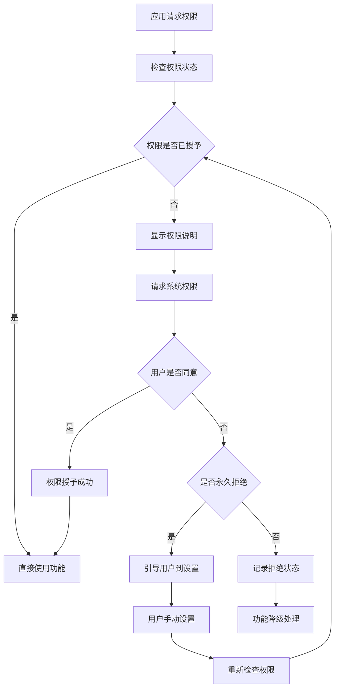
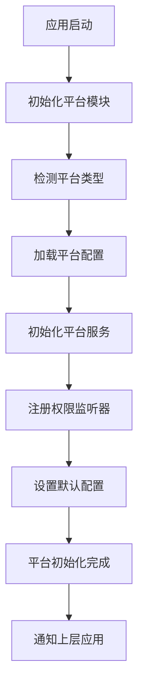

# Basic Platform 平台适配模块

## 模块概述

`basic_platform` 是 OneApp 基础工具模块群中的平台适配模块，负责统一处理 Android 和 iOS 平台的差异性，提供跨平台的统一接口。该模块封装了设备信息获取、权限管理、平台特性检测等功能。

### 基本信息
- **模块名称**: basic_platform
- **版本**: 0.2.14+1
- **描述**: 跨平台适配基础模块
- **Flutter 版本**: >=2.10.5
- **Dart 版本**: >=3.0.0 <4.0.0

## 功能特性

### 核心功能
1. **平台信息检测**
   - 操作系统类型和版本
   - 设备型号和硬件信息
   - 应用版本和构建信息
   - 网络环境检测

2. **权限管理统一**
   - 跨平台权限申请
   - 权限状态检查
   - 权限结果处理
   - 权限设置引导

3. **设备特性适配**
   - 屏幕方向控制
   - 设备唤醒管理
   - 平台特定功能检测
   - 硬件能力查询

4. **存储路径管理**
   - 应用目录获取
   - 缓存目录管理
   - 外部存储访问
   - 临时文件处理

## 技术架构

### 目录结构
```
lib/
├── basic_platform.dart         # 模块入口文件
├── src/                        # 源代码目录
│   ├── platform_info/          # 平台信息
│   ├── permissions/             # 权限管理
│   ├── device/                  # 设备功能
│   ├── storage/                 # 存储管理
│   ├── models/                  # 数据模型
│   └── utils/                   # 工具类
├── android/                     # Android特定代码
├── ios/                         # iOS特定代码
└── test/                        # 测试文件
```

### 依赖关系

#### 核心依赖
- `basic_storage: ^0.2.2` - 基础存储框架
- `permission_handler: ^10.4.5` - 权限处理插件
- `native_device_orientation: ^1.2.1` - 设备方向控制

## 核心模块分析

### 1. 模块入口 (`basic_platform.dart`)

**功能职责**:
- 平台适配服务统一导出
- 初始化配置管理
- 单例模式实现

### 2. 平台信息 (`src/platform_info/`)

**功能职责**:
- 操作系统信息获取
- 设备硬件信息查询
- 应用程序信息获取
- 环境配置检测

**主要组件**:
- `PlatformInfo` - 平台信息管理器
- `DeviceInfo` - 设备信息获取器
- `AppInfo` - 应用信息管理器
- `SystemInfo` - 系统信息收集器

### 3. 权限管理 (`src/permissions/`)

**功能职责**:
- 统一权限申请接口
- 权限状态查询
- 权限结果回调处理
- 权限设置页面跳转

**主要组件**:
- `PermissionManager` - 权限管理器
- `PermissionChecker` - 权限检查器
- `PermissionRequestor` - 权限申请器
- `PermissionGuide` - 权限引导器

### 4. 设备功能 (`src/device/`)

**功能职责**:
- 设备方向控制
- 屏幕亮度管理
- 震动反馈控制
- 设备唤醒管理

**主要组件**:
- `OrientationController` - 方向控制器
- `BrightnessController` - 亮度控制器
- `HapticController` - 震动控制器
- `WakeController` - 唤醒控制器

### 5. 存储管理 (`src/storage/`)

**功能职责**:
- 应用目录路径获取
- 外部存储访问
- 临时文件管理
- 缓存目录处理

**主要组件**:
- `StorageManager` - 存储管理器
- `PathProvider` - 路径提供器
- `DirectoryManager` - 目录管理器
- `TempFileManager` - 临时文件管理器

### 6. 数据模型 (`src/models/`)

**功能职责**:
- 平台信息数据模型
- 权限状态模型
- 设备特性模型
- 配置参数模型

**主要模型**:
- `PlatformData` - 平台数据模型
- `PermissionStatus` - 权限状态模型
- `DeviceCapability` - 设备能力模型
- `PlatformConfig` - 平台配置模型

### 7. 工具类 (`src/utils/`)

**功能职责**:
- 平台判断工具
- 版本比较工具
- 路径处理工具
- 异常处理工具

**主要工具**:
- `PlatformUtils` - 平台工具类
- `VersionUtils` - 版本工具类
- `PathUtils` - 路径工具类
- `ExceptionUtils` - 异常工具类

## 平台适配实现

### Android 平台适配

#### 权限处理
```dart
class AndroidPermissionHandler {
  static Future<bool> requestPermission(Permission permission) async {
    final status = await permission.request();
    
    switch (status) {
      case PermissionStatus.granted:
        return true;
      case PermissionStatus.denied:
        return false;
      case PermissionStatus.permanentlyDenied:
        await openAppSettings();
        return false;
      default:
        return false;
    }
  }
  
  static Future<Map<Permission, PermissionStatus>> requestMultiple(
    List<Permission> permissions,
  ) async {
    return await permissions.request();
  }
}
```

#### 设备信息获取
```dart
class AndroidDeviceInfo {
  static Future<AndroidDeviceData> getDeviceInfo() async {
    final deviceInfo = DeviceInfoPlugin();
    final androidInfo = await deviceInfo.androidInfo;
    
    return AndroidDeviceData(
      manufacturer: androidInfo.manufacturer,
      model: androidInfo.model,
      version: androidInfo.version.release,
      sdkInt: androidInfo.version.sdkInt,
      brand: androidInfo.brand,
      product: androidInfo.product,
    );
  }
}
```

### iOS 平台适配

#### 权限处理
```dart
class IOSPermissionHandler {
  static Future<bool> requestPermission(Permission permission) async {
    final status = await permission.request();
    
    if (status == PermissionStatus.denied || 
        status == PermissionStatus.permanentlyDenied) {
      return await _showPermissionDialog(permission);
    }
    
    return status == PermissionStatus.granted;
  }
  
  static Future<bool> _showPermissionDialog(Permission permission) async {
    // 显示权限说明对话框
    // 引导用户到设置页面
    return false;
  }
}
```

#### 设备信息获取
```dart
class IOSDeviceInfo {
  static Future<IOSDeviceData> getDeviceInfo() async {
    final deviceInfo = DeviceInfoPlugin();
    final iosInfo = await deviceInfo.iosInfo;
    
    return IOSDeviceData(
      name: iosInfo.name,
      model: iosInfo.model,
      systemName: iosInfo.systemName,
      systemVersion: iosInfo.systemVersion,
      identifierForVendor: iosInfo.identifierForVendor,
      isPhysicalDevice: iosInfo.isPhysicalDevice,
    );
  }
}
```

## 业务流程

### 权限申请流程


### 平台初始化流程


## 权限管理系统

### 支持的权限类型
1. **基础权限**
   - 网络访问权限
   - 存储读写权限
   - 设备信息访问
   - 应用安装权限

2. **隐私权限**
   - 位置信息权限
   - 相机访问权限
   - 麦克风权限
   - 通讯录权限

3. **系统权限**
   - 电话状态权限
   - 短信发送权限
   - 系统设置修改
   - 设备管理权限

### 权限管理策略
- **最小权限原则**: 仅申请必要权限
- **延迟申请**: 在需要时才申请权限
- **用户友好**: 提供清晰的权限说明
- **优雅降级**: 权限拒绝时的替代方案

## 设备适配策略

### 屏幕适配
```dart
class ScreenAdapter {
  static double getScaleFactor() {
    final window = WidgetsBinding.instance.window;
    return window.devicePixelRatio;
  }
  
  static Size getScreenSize() {
    final window = WidgetsBinding.instance.window;
    return window.physicalSize / window.devicePixelRatio;
  }
  
  static bool isTablet() {
    final size = getScreenSize();
    final diagonal = sqrt(pow(size.width, 2) + pow(size.height, 2));
    return diagonal > 1100; // 7 inch threshold
  }
}
```

### 性能优化
```dart
class PerformanceOptimizer {
  static bool isLowEndDevice() {
    if (Platform.isAndroid) {
      return _checkAndroidPerformance();
    } else if (Platform.isIOS) {
      return _checkIOSPerformance();
    }
    return false;
  }
  
  static bool _checkAndroidPerformance() {
    // 基于 Android 设备性能指标判断
    // RAM、CPU、GPU 等参数
    return false;
  }
  
  static bool _checkIOSPerformance() {
    // 基于 iOS 设备型号判断
    // 设备代数、处理器类型等
    return false;
  }
}
```

## 存储路径管理

### 路径类型
1. **应用目录**
   - 应用私有目录
   - 文档目录
   - 库目录
   - 支持文件目录

2. **缓存目录**
   - 临时缓存
   - 图片缓存
   - 数据缓存
   - 网络缓存

3. **外部存储**
   - 公共文档目录
   - 下载目录
   - 图片目录
   - 媒体目录

### 路径获取接口
```dart
class PlatformPaths {
  static Future<String> getApplicationDocumentsDirectory() async {
    final directory = await getApplicationDocumentsDirectory();
    return directory.path;
  }
  
  static Future<String> getTemporaryDirectory() async {
    final directory = await getTemporaryDirectory();
    return directory.path;
  }
  
  static Future<String?> getExternalStorageDirectory() async {
    if (Platform.isAndroid) {
      final directory = await getExternalStorageDirectory();
      return directory?.path;
    }
    return null;
  }
}
```

## 异常处理机制

### 异常类型
1. **权限异常**
   - 权限拒绝异常
   - 权限配置错误
   - 系统权限限制

2. **平台异常**
   - 不支持的平台功能
   - API版本不兼容
   - 硬件功能缺失

3. **系统异常**
   - 文件系统错误
   - 网络连接异常
   - 内存不足异常

### 异常处理策略
- **异常捕获**: 全面的异常捕获机制
- **错误恢复**: 自动错误恢复策略
- **用户提示**: 友好的错误提示信息
- **日志记录**: 详细的错误日志记录

## 测试策略

### 单元测试
- **平台检测测试**: 平台类型识别
- **权限管理测试**: 权限申请和状态
- **路径获取测试**: 各种路径获取
- **工具类测试**: 工具方法功能

### 集成测试
- **跨平台兼容测试**: 不同平台功能
- **权限流程测试**: 完整权限流程
- **设备适配测试**: 不同设备适配
- **性能测试**: 模块性能表现

### 兼容性测试
- **系统版本兼容**: 不同系统版本
- **设备型号兼容**: 不同设备型号
- **权限策略兼容**: 不同权限策略
- **API兼容性**: 不同API版本

## 配置管理

### 平台配置
```dart
class PlatformConfig {
  static const Map<String, dynamic> androidConfig = {
    'minSdkVersion': 21,
    'targetSdkVersion': 33,
    'requiredPermissions': [
      'android.permission.INTERNET',
      'android.permission.ACCESS_NETWORK_STATE',
    ],
  };
  
  static const Map<String, dynamic> iosConfig = {
    'minIOSVersion': '11.0',
    'requiredCapabilities': [
      'arm64',
    ],
    'privacyDescriptions': {
      'NSLocationWhenInUseUsageDescription': 'App needs location access',
      'NSCameraUsageDescription': 'App needs camera access',
    },
  };
}
```

## 最佳实践

### 开发建议
1. **统一接口**: 使用统一的平台接口
2. **异步处理**: 耗时操作异步执行
3. **异常处理**: 完善的异常处理机制
4. **性能考虑**: 避免频繁的平台调用

### 使用指南
1. **权限申请**: 在合适的时机申请权限
2. **平台检测**: 根据平台提供不同功能
3. **路径使用**: 正确使用各种存储路径
4. **错误处理**: 妥善处理平台相关错误

## 总结

`basic_platform` 模块作为 OneApp 的平台适配基础模块，为应用提供了统一的跨平台接口和能力。通过封装平台差异性、统一权限管理和完善的异常处理，显著简化了跨平台开发的复杂性。模块具有良好的扩展性和兼容性，能够适应不断变化的平台环境和需求。
