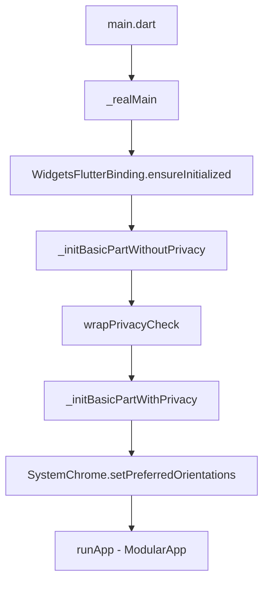

# OneApp Main 主应用项目文档

## 项目概述

`oneapp_main` 是 OneApp 车主应用的主入口项目，采用 Flutter 框架开发，基于模块化架构设计。该项目作为应用的核心容器，负责整合各个功能模块、管理应用生命周期、处理路由导航以及提供统一的用户界面入口。

### 基本信息
- **项目名称**: oneapp_main
- **版本**: 1.13.0+190915281
- **Flutter 版本**: >=3.0.0
- **Dart 版本**: >=3.0.0 <4.0.0

## 项目架构

### 应用启动流程



### 核心目录结构

```
lib/
├── main.dart                    # 应用启动入口
├── app/                         # 应用核心配置
│   ├── app_module.dart         # 主模块定义和依赖注入
│   ├── app_widget.dart         # 应用根组件
│   ├── app_launch_handler.dart # 启动处理器
│   └── app_privacy_widget.dart # 隐私政策组件
├── initialize/                 # 初始化配置模块
├── app_home/                   # 首页功能模块
├── app_discover/               # 发现页功能模块
├── app_test/                   # 测试功能模块
├── app_webview/                # WebView 功能模块
├── business_utils/             # 业务工具类
├── constant/                   # 常量定义
├── adapter/                    # 适配器模式实现
├── src/                        # 源代码目录
├── theme_resource/             # 主题资源
├── generated/                  # 代码生成文件
└── l10n/                       # 国际化文件
```

## 详细模块分析

### 1. 应用入口 (`main.dart`)

#### 功能职责
- 应用启动引导
- 基础服务初始化
- 隐私合规检查
- 系统 UI 配置
- 模块化框架启动

#### 关键代码分析

```dart
void main() {
  _realMain();
}

Future<void> _realMain() async {
  WidgetsFlutterBinding.ensureInitialized();
  await _initBasicPartWithoutPrivacy();
  await wrapPrivacyCheck(_initBasicPartWithPrivacy);
  SystemChrome.setPreferredOrientations([DeviceOrientation.portraitUp]);
  runApp(ModularApp(module: AppModule(), child: const AppWidget()));
}
```

#### 初始化阶段划分

1. **不依赖隐私合规的初始化** (`_initBasicPartWithoutPrivacy`)
   - 模块状态管理初始化
   - 本地存储初始化
   - 开发配置工具

2. **依赖隐私合规的初始化** (`_initBasicPartWithPrivacy`)
   - 网络服务初始化
   - 第三方 SDK 初始化
   - 推送服务初始化

### 2. 应用核心配置 (`app/`)

#### `app_module.dart` - 主模块
- **功能**: 应用级别的依赖注入和路由配置
- **职责**: 
  - 注册全局服务
  - 配置路由表
  - 管理模块生命周期

#### `app_widget.dart` - 应用根组件
- **功能**: 应用根级别的 Widget 配置
- **职责**:
  - 主题配置
  - 国际化配置
  - 全局导航配置

#### `app_launch_handler.dart` - 启动处理器
- **功能**: 处理应用启动相关逻辑
- **职责**:
  - 深度链接处理
  - 启动参数解析
  - 启动页逻辑

#### `app_privacy_widget.dart` - 隐私政策组件
- **功能**: 隐私政策和用户协议展示
- **职责**:
  - 隐私协议展示
  - 用户同意状态管理
  - 合规性检查

### 3. 初始化配置模块 (`initialize/`)

该目录包含各个基础服务的初始化配置文件：

#### 基础服务初始化
- `basic_logger.dart` - 日志系统初始化
- `basic_storage.dart` - 存储服务初始化
- `basic_network.dart` - 网络服务初始化
- `basic_theme.dart` - 主题系统初始化
- `basic_modular.dart` - 模块化框架初始化
- `basic_platform.dart` - 平台适配初始化
- `basic_intl.dart` - 国际化初始化
- `basic_error.dart` - 错误处理初始化
- `basic_webview.dart` - WebView 初始化
- `basic_share.dart` - 分享功能初始化
- `basic_font.dart` - 字体配置初始化
- `basic_resource.dart` - 资源管理初始化

#### 业务服务初始化
- `basic_avatar.dart` - 虚拟形象服务初始化
- `basic_vehicle.dart` - 车辆服务初始化
- `basic_order.dart` - 订单服务初始化
- `basic_push.dart` - 推送服务初始化
- `basic_ttsshop.dart` - TTS 和购物服务初始化

#### 第三方服务初始化
- `init_aegis_sdk.dart` - 腾讯 Aegis 监控 SDK
- `init_cos_file_sdk.dart` - 腾讯云对象存储 SDK
- `init_ingeek_carkey_sdk.dart` - 车钥匙 SDK
- `third_keys.dart` - 第三方服务密钥配置

#### 功能初始化
- `init_modules.dart` - 模块注册和加载
- `init_qr_processor.dart` - 二维码处理器初始化
- `init_uni_link.dart` - 统一链接处理初始化
- `kit_debugtools.dart` - 调试工具初始化
- `configs.dart` - 应用配置初始化
- `basic_environment.dart` - 环境配置初始化

### 4. 功能页面模块

#### `app_home/` - 首页模块
- **功能**: 应用主界面和导航入口
- **主要文件**:
  - `route_dp.dart` - 首页路由配置
  - 首页 UI 组件
  - 首页业务逻辑

#### `app_discover/` - 发现页模块
- **功能**: 发现页面和相关功能
- **职责**: 
  - 内容推荐
  - 功能导航
  - 活动展示

#### `app_test/` - 测试功能模块
- **功能**: 开发测试相关功能
- **用途**: 
  - 功能测试入口
  - 调试工具
  - 开发辅助功能

#### `app_webview/` - WebView 模块
- **功能**: WebView 相关功能封装
- **职责**:
  - WebView 容器
  - JavaScript 桥接
  - 网页交互处理

### 5. 工具和资源模块

#### `business_utils/` - 业务工具类
- **功能**: 业务相关的工具类和帮助方法
- **内容**:
  - `privacy_check.dart` - 隐私检查工具
  - 其他业务工具类

#### `constant/` - 常量定义
- **功能**: 应用级别的常量定义
- **内容**: 
  - API 常量
  - 配置常量
  - 业务常量

#### `adapter/` - 适配器模式实现
- **功能**: 不同服务间的适配器
- **用途**: 解耦不同模块间的依赖

#### `theme_resource/` - 主题资源
- **功能**: 主题相关的资源文件
- **内容**: 
  - 颜色定义
  - 样式配置
  - 主题切换逻辑

#### `generated/` - 代码生成文件
- **功能**: 自动生成的代码文件
- **内容**: 
  - 国际化文件
  - JSON 序列化文件
  - 路由生成文件

## 依赖管理

### 核心依赖分类

#### 1. Flutter 框架依赖
- `flutter` - Flutter SDK
- `flutter_localizations` - 国际化支持

#### 2. 基础框架依赖 (`basic_*`)
- `basic_network` - 网络请求框架
- `basic_storage` - 本地存储框架
- `basic_modular` - 模块化框架
- `basic_theme` - 主题管理框架
- `basic_intl` - 国际化框架

#### 3. 应用功能依赖 (`app_*`)
- `app_order` - 订单管理模块
- `app_media` - 媒体处理模块
- `app_navigation` - 导航功能模块
- `app_consent` - 用户同意模块

#### 4. UI 组件依赖 (`ui_*`)
- `ui_mapview` - 地图视图组件
- `ui_payment` - 支付界面组件
- `ui_share` - 分享组件

#### 5. 服务 SDK 依赖 (`clr_*`)
- `clr_charging` - 充电服务 SDK
- `clr_payment` - 支付服务 SDK
- `clr_media` - 媒体服务 SDK

#### 6. 车辆相关依赖 (`car_*`)
- `car_vehicle` - 车辆控制
- `car_connector` - 车联网连接
- `car_vur` - 车辆更新记录

#### 7. 第三方服务依赖
- `amap_flutter_location` - 高德地图定位
- `provider` - 状态管理
- `rxdart` - 响应式编程
- `connectivity_plus` - 网络状态检测

## 构建和部署

### 版本管理
- **版本格式**: `major.minor.patch+buildNumber`
- **构建号规则**: `yywwddhh` (年-周-日-时)

### 构建配置
- **启动屏配置**: `flutter_native_splash`
- **应用图标**: 支持 Android 12 适配
- **多环境支持**: 开发、测试、生产环境

### 平台特性
- **Android**: 支持 APK/AAB 格式
- **iOS**: 支持 TestFlight/App Store 发布
- **权限管理**: 位置、相机、存储等权限

## 开发调试

### 调试工具 (Debug 模式)
- `kit_debugtools` - 调试工具主入口
- `kit_tool_dio` - 网络请求监控
- `kit_tool_memory` - 内存使用监控
- `kit_tool_ui` - UI 调试工具

### 代码生成工具
- `build_runner` - 代码生成引擎
- `json_serializable` - JSON 序列化
- `freezed` - 不可变类生成

## 总结

`oneapp_main` 作为 OneApp 的主入口项目，采用了清晰的分层架构和模块化设计。通过统一的初始化流程、完善的依赖管理和灵活的配置系统，为整个应用提供了稳定的基础框架。项目结构清晰，职责分明，便于团队协作开发和长期维护。
