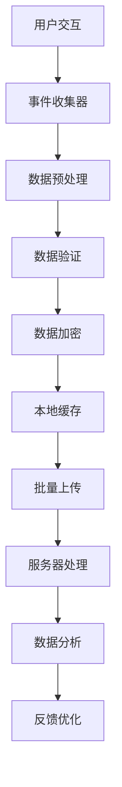
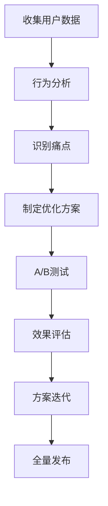

# Touch Point 触点服务模块群

## 模块群概述

Touch Point 模块群是 OneApp 的用户触点管理系统，负责管理用户与应用的各种交互触点。该模块群提供了统一的用户体验管理、触点数据收集、用户行为分析等功能，帮助优化用户旅程和提升用户体验。

## 子模块列表

### 核心模块
1. **[oneapp_touch_point](./oneapp_touch_point.md)** - 触点服务主模块
   - 用户触点数据收集和管理
   - 触点事件跟踪和分析
   - 用户行为路径记录

## 功能特性

### 核心业务功能
1. **触点数据收集**
   - 用户交互事件收集
   - 页面访问路径跟踪
   - 用户行为数据记录
   - 设备和环境信息采集

2. **用户体验分析**
   - 用户旅程分析
   - 转化漏斗分析
   - 用户留存分析
   - 行为热力图生成

3. **个性化推荐**
   - 基于行为的内容推荐
   - 个性化界面适配
   - 智能消息推送
   - 用户偏好学习

4. **体验优化**
   - A/B测试支持
   - 用户反馈收集
   - 性能监控和优化
   - 异常行为检测

## 技术架构

### 模块架构图
```
触点服务应用层 (oneapp_touch_point)
    ↓
数据收集层 (Event Collection)
    ↓
数据处理层 (Data Processing)
    ↓
分析引擎层 (Analytics Engine)
    ↓
存储层 (Data Storage)
```

### 主要依赖
- **基础框架**: basic_modular, basic_intl
- **网络通信**: dio
- **数据处理**: encrypt, common_utils
- **UI组件**: basic_webview, photo_view
- **文件处理**: path_provider, filesize
- **媒体处理**: video_thumbnail
- **权限管理**: permission_handler

## 数据流向

### 触点数据流


### 用户体验优化流程


## 详细模块文档

- [OneApp Touch Point - 触点服务主模块](./oneapp_touch_point.md)

## 开发指南

### 环境要求
- Flutter >=2.10.5
- Dart >=3.0.0 <4.0.0
- Android SDK >=21
- iOS >=11.0

### 快速开始
```dart
// 初始化触点服务
await TouchPointService.initialize();

// 记录用户行为事件
TouchPointService.trackEvent(
  eventName: 'page_view',
  properties: {
    'page_name': 'home',
    'timestamp': DateTime.now().millisecondsSinceEpoch,
  },
);

// 记录用户操作
TouchPointService.trackAction(
  actionType: 'button_click',
  actionTarget: 'login_button',
  context: {'page': 'login'},
);
```

## 隐私和合规

### 数据保护
- 用户数据加密存储和传输
- 敏感信息脱敏处理
- 用户同意管理
- 数据最小化原则

### 合规要求
- GDPR合规支持
- 用户数据删除权
- 数据导出功能
- 隐私政策透明化

## 总结

Touch Point 模块群为 OneApp 提供了全面的用户触点管理能力，通过科学的数据收集和分析方法，帮助产品团队深入了解用户行为，持续优化用户体验，提升产品价值。
