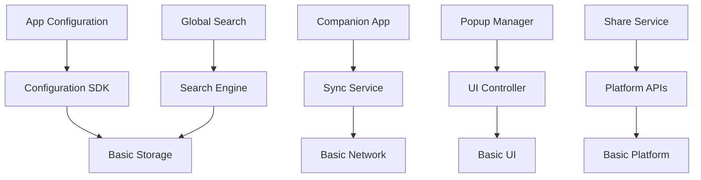

# Service Component 服务组件模块群

## 模块群概述

Service Component 模块群是 OneApp 的服务组件集合，提供了各种通用的业务服务组件和工具。该模块群包含了配置管理、全局搜索、伴侣应用、弹窗管理、分享功能等跨模块的通用服务组件。

## 子模块列表

### 核心服务组件
1. **[app_configuration](./app_configuration.md)** - 应用配置管理模块
   - 远程配置管理
   - 本地配置缓存
   - 配置热更新
   - 环境配置切换

2. **[clr_configuration](./clr_configuration.md)** - 配置服务SDK
   - 配置API封装
   - 配置数据模型
   - 配置同步机制
   - 配置变更通知

3. **[GlobalSearch](./GlobalSearch.md)** - 全局搜索模块
   - 跨模块内容搜索
   - 智能搜索建议
   - 搜索历史管理
   - 搜索结果优化

4. **[oneapp_companion](./oneapp_companion.md)** - 伴侣应用模块
   - 多设备协同
   - 数据同步
   - 远程控制
   - 设备管理

5. **[oneapp_popup](./oneapp_popup.md)** - 弹窗管理模块
   - 统一弹窗管理
   - 弹窗优先级控制
   - 弹窗样式定制
   - 弹窗生命周期

6. **[ShareToFriends](./ShareToFriends.md)** - 分享功能模块
   - 社交平台分享
   - 自定义分享内容
   - 分享统计分析
   - 分享权限控制

## 功能特性

### 核心功能
1. **配置管理服务**
   - 集中化配置管理
   - 动态配置下发
   - 配置版本控制
   - 配置回滚机制

2. **搜索服务**
   - 全文搜索引擎
   - 智能搜索推荐
   - 搜索结果排序
   - 搜索性能优化

3. **设备协同服务**
   - 多设备数据同步
   - 跨设备操作控制
   - 设备状态监控
   - 设备权限管理

4. **用户交互服务**
   - 弹窗统一管理
   - 分享功能集成
   - 用户反馈收集
   - 交互体验优化

## 技术架构

### 服务架构图
```
应用层 (App Layer)
    ↓
服务组件层 (Service Components)
    ↓
基础服务层 (Basic Services)
    ↓
平台能力层 (Platform Capabilities)
```

### 组件交互图


## 设计原则

### 1. 模块化设计
- **独立部署**: 每个组件可独立部署和更新
- **接口标准**: 统一的服务接口规范
- **依赖管理**: 清晰的依赖关系定义
- **版本兼容**: 向后兼容的版本策略

### 2. 服务化架构
- **微服务**: 服务组件微服务化
- **API网关**: 统一的API入口
- **服务发现**: 动态服务发现机制
- **负载均衡**: 服务负载均衡

### 3. 数据一致性
- **事务管理**: 跨服务事务协调
- **数据同步**: 多服务数据同步
- **冲突解决**: 数据冲突解决策略
- **最终一致性**: 最终一致性保证

## 通用能力

### 配置管理能力
```dart
// 获取配置
final config = await ConfigService.getConfig('feature_flags');

// 监听配置变化
ConfigService.onConfigChanged('feature_flags').listen((newConfig) {
  // 处理配置变化
});

// 本地配置缓存
await ConfigService.setCachedConfig('user_preferences', userConfig);
```

### 搜索能力
```dart
// 全局搜索
final results = await GlobalSearchService.search(
  query: '车辆',
  categories: ['vehicle', 'service', 'help'],
);

// 搜索建议
final suggestions = await GlobalSearchService.getSuggestions('车');

// 搜索历史
final history = await GlobalSearchService.getSearchHistory();
```

### 弹窗管理能力
```dart
// 显示弹窗
PopupManager.show(
  popup: CustomPopup(
    title: '提示',
    content: '是否确认操作？',
    priority: PopupPriority.high,
  ),
);

// 弹窗队列管理
PopupManager.enqueue(popupList);

// 弹窗生命周期
PopupManager.onPopupShown.listen((popup) {
  // 弹窗显示回调
});
```

## 详细模块文档

- [App Configuration - 应用配置管理](./app_configuration.md)
- [CLR Configuration - 配置服务SDK](./clr_configuration.md)
- [Global Search - 全局搜索](./GlobalSearch.md)
- [OneApp Companion - 伴侣应用](./oneapp_companion.md)
- [OneApp Popup - 弹窗管理](./oneapp_popup.md)
- [Share To Friends - 分享功能](./ShareToFriends.md)

## 开发指南

### 环境要求
- Flutter >=3.0.0
- Dart >=3.0.0 <4.0.0
- Android SDK >=21
- iOS >=11.0

### 依赖管理
```yaml
dependencies:
  # 服务组件
  app_configuration:
    path: ../oneapp_service_component/app_configuration
  oneapp_companion:
    path: ../oneapp_service_component/oneapp_companion
  oneapp_popup:
    path: ../oneapp_service_component/oneapp_popup
```

### 服务初始化
```dart
Future<void> initializeServiceComponents() async {
  // 初始化配置服务
  await ConfigurationService.initialize();
  
  // 初始化搜索服务
  await GlobalSearchService.initialize();
  
  // 初始化伴侣应用服务
  await CompanionService.initialize();
  
  // 初始化弹窗管理器
  PopupManager.initialize();
  
  // 初始化分享服务
  await ShareService.initialize();
}
```

## 性能优化

### 1. 缓存策略
- **配置缓存**: 本地配置缓存减少网络请求
- **搜索缓存**: 搜索结果智能缓存
- **数据预加载**: 关键数据预加载
- **懒加载**: 按需加载服务组件

### 2. 网络优化
- **请求合并**: 批量请求减少网络开销
- **数据压缩**: 传输数据压缩
- **CDN加速**: 静态资源CDN分发
- **离线支持**: 关键功能离线可用

### 3. 内存管理
- **资源释放**: 及时释放不需要的资源
- **内存监控**: 监控内存使用情况
- **对象池**: 复用频繁创建的对象
- **弱引用**: 避免内存泄漏

## 监控和诊断

### 服务监控
- **服务健康检查**: 定期检查服务状态
- **性能指标监控**: 监控关键性能指标
- **错误日志收集**: 收集和分析错误日志
- **用户行为分析**: 分析用户使用模式

### 故障诊断
- **链路追踪**: 跟踪服务调用链路
- **异常告警**: 异常情况实时告警
- **故障恢复**: 自动故障恢复机制
- **降级策略**: 服务降级保证可用性

## 安全考虑

### 数据安全
- **数据加密**: 敏感数据加密存储和传输
- **访问控制**: 基于角色的访问控制
- **审计日志**: 详细的操作审计日志
- **数据脱敏**: 敏感数据脱敏处理

### 隐私保护
- **用户同意**: 明确的用户数据使用同意
- **数据最小化**: 仅收集必要的用户数据
- **匿名化**: 用户数据匿名化处理
- **数据删除**: 用户数据删除权支持

## 总结

Service Component 模块群为 OneApp 提供了丰富的通用服务组件，通过模块化设计和服务化架构，实现了高内聚、低耦合的服务体系。这些组件不仅提升了开发效率，也保证了服务的一致性和可维护性，为整个应用生态提供了坚实的技术支撑。
